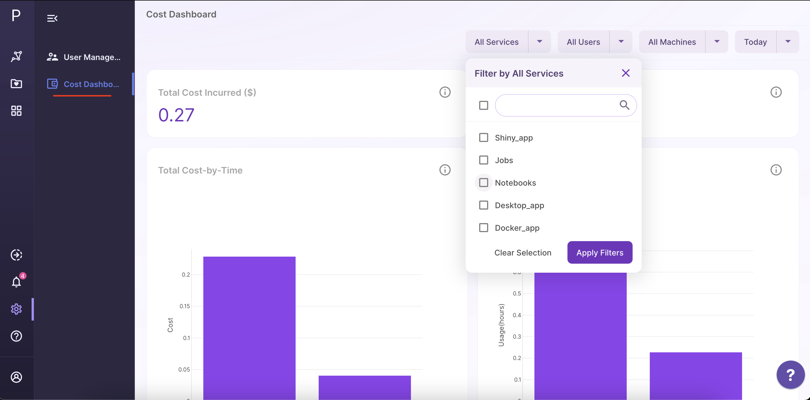

# Polly's cloud compute usage & billing - FAQ's

## How does Elucidata bill an organization's compute costs?

Pre-defined Polly compute cost limits are included in an organization's contract or proposal. If a company's usage exceeds these limits, they will be billed separately for this cost on a monthly basis. Elucidata will provide organizations with a monthly invoice that outlines their actual usage and charges.

## How does Elucidata calculate an organization's compute charges?

In the event that an organization exceeds the pre-defined compute limits, Elucidata will charge at an hourly rate based on the machine type used. A detailed breakdown of the estimate of $/hour for different machines is outlined in the table below:

| **Machine Type**** (Jobs/Apps/Notebook) **|** vCPU **|** RAM **|** GPUs **|** Cost per hour ($)** |
| --- | --- | --- | --- | --- |
| Small | 1 | 2 | NA | 0.09 |
| Medium | 2 | 4 | NA | 0.17 |
| Large | 2 | 8 | NA | 0.17 |
| gp / xLarge | 4 | 16 | NA | 0.35 |
| ci2xlarge | 16 | 32 | NA | 1.38 |
| ci3xlarge | 36 | 72 | NA | 3.11 |
| mi2xlarge | 4 | 32 | NA | 0.69 |
| mi3xlarge | 8 | 64 | NA | 1.38 |
| mi4xlarge | 16 | 122 | NA | 2.68 |
| mi5xlarge | 32 | 250 | NA | 4.39 |
| mi6xlarge | 64 | 500 | NA | 7.82 |
| mi7xlarge | 64 | 970 | NA | 12.30 |
| gpusmall | 4 | 16 | NA | 1.71 |
| gpumedium | 32 | 240 | NA | 20.77 |
| gpularge | 64 | 488 | NA | 41.53 |
| mix5xlarge | 16 | 512 | NA | 6.15 |
| mix6xlarge | 24 | 768 | NA | 8.99 |
| mix7xlarge | 64 | 1024 | NA | 12.06 |

## Will users be able to track their organization's compute usage on Polly?

All organization admins will have access to a cost dashboard on their Polly account, where they can track their organization's total cost incurred and hourly compute usage for a given time period. The dashboard also provides a breakdown of costs incurred based on a number of parameters, including Polly Services\* (Applications, Polly CLI, Notebooks), Machine Type and per user. The cost dashboard is only visible to a designated admin of an organization. Admins can access this dashboard by navigating to the Polly admin panel, as indicated in the figure below.

## Additional Information

### Polly services

Polly services can be used to consume data on the platform in a variety of ways. Web applications, R-based Shiny apps, command line jobs, and Jupyter notebooks are some examples, and can be run by selecting an appropriate machine configuration. An organization's cloud compute costs on Polly are primarily driven by the usage of these services

### Polly Notebooks

A scalable analytics platform which allows users to perform data analysis remotely in a Jupyter like environment. It provides the flexibility to select the compute capacity and docker environment depending on the computational requirements of their analyses.

### Polly CLI Jobs

Polly CLI is a command line interface that lets users interact with Polly services using commands in their command-line shell. It also allows users to upload data or run jobs on the Polly cloud infrastructure by scaling computation as per need.

### Web Applications

Polly can host GUI based web applications, shiny apps or desktop applications to process and visualize data on the platform. The applications scale automatically on Polly's cloud infrastructure for multiple users to use simultaneously.
