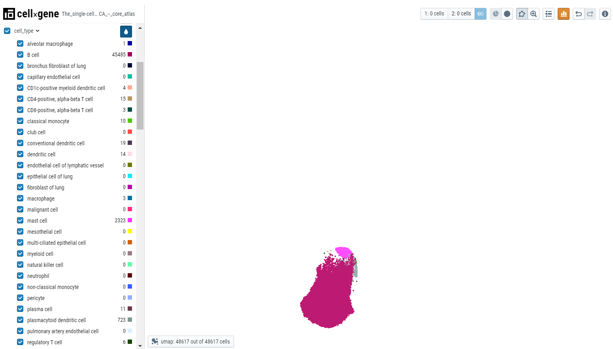

## What is Cellxgene?

Cellxgene was developed by the Chan Zuckerberg Initiative (CZI) in collaboration with the open-source community. The cellxgene project was started in 2018 as an open-source project under the auspices of CZI, and it is currently maintained and developed by CZI and the wider scientific community. Detailed documentation of the Cellxgene application can be found [here](https://cellxgene.cziscience.com/).

## When should Cellxgene be used?

1. **To examine categorical metadata:** Categorical metadata (such as tissue of origin or cell type) can be visualized and examined in a number of ways within cellxgene such as coloring embedding plots (i.e. color UMAP by cell type), looking at cell counts, making selections of cells or viewing the interaction between different categorical metadata fields.
2. **To find cells where a gene is expressed:** Numerical metadata about gene expression features or the number of genes can be examined on the embedding plot and be used to filter and select cells.
3. **To select and subset cells:** Cells in the embedding plot can be selected based on the gene expression cutoffs, and categorical metadata attributes.
4. **To compare the expression of multiple genes:** Cellxgene allows the user to compare the expression of multiple genes via bivariate plots.
5. **To use gene sets to learn about cell population functional characteristics:** cellxgene allows users to examine groups of genes via the gene sets feature.
6. **To find Marker Genes:** Cellxgene allows the user to find marker genes between selected cell populations.

## Cellxgene user journey through Polly OmixAtlas

Select single cell RNAseq OmixAtlas on the OmixAtlas homepage after logging into Polly.

Find relevant datasets

Users can find relevant datasets using the powerful search bar on the OmixAtlas homepage. Salient features of the search bar are -

- The search bar is driven by Elasticsearch which allows users to search with keywords and long queries.
- The keywords are present across source metadata (title, description, and study design) and curated metadata (cell type, cell line, tissue, drug, etc.).
- It allows fuzzy search, for example, if users search for 'transcriptomics', it will show results for 'transcript' and 'transcriptome' as well.
- There are operators such as 'exact', 'and', 'or', 'not', and 'group' for better search.

Users can filter the datasets using configurable filters beside the search bar. A detailed description of how to find datasets can be found [here] 
**Figure 1.** Single cell OmixAtlas

### Starting Cellxgene

#### **Step 1 - Selection of dataset of interest**

Select the dataset of interest, click on 'Options', and then click on 'Analyze'.

 
**Figure 2.** Selecting dataset

#### **Step 2 - Open the Cellxgene application**

After clicking 'Analyze', a side window opens up. Select 'Cellxgene' application and fill in the details about the name and workspace where the analysis is to be saved.

 
 
**Figure 3.** Starting the application

## Cellxgene interface

The cellxgene interface is divided into 3 sections -

- Left-hand sidebar contains categorical metadata and fields curated for each dataset ingested in OmixAtlas.
- Center panel contains an embedding plot where each dot represents a cell. Cellxgene also allows users to choose different embeddings based on their needs.
- Right-hand sidebar contains numerical metadata (QC metadata) and information about genes and gene sets. The gene plots on this sidebar automatically appear for each curated dataset opened through Polly OmixAtlas.

 
**Figure 4.** Cellxgene interface

 
**Figure 5.** Embedding plot options

## Examining categorical metadata

Categorical data can be examined in multiple ways -

1. Colour embedding plots - The plot can be colored by different metadata. The plot can be colored by clicking on the drop icon next to metadata of interest. Color code is displayed next to the cell count of the chosen metadata.
2. Cell counts - Each metadata category will have the cell counts along with the color code.

 
**Figure 6.** Example 1 - Embedding colored by cell type

 
**Figure 7.** Example 2 - Embedding colored by disease

3. Making the selection of cells - Upon hovering over the metadata on the left side, users can see the type of cells highlighted in the embedding plot.

 
**Figure 8.** Highlighting via metadata

Users can click on the 'display categories' icon to display the labels over the cluster centroid.

 
**Figure 9.** Display categories

Users can select/deselect the cells by choosing the checkbox next to the value in the categorical metadata field. The unselected cells will have a smaller point size on the embedding plot.

 
**Figure 10.** Select/deselect metadata

Users can use the checkmark on the parent metadata to deselect all the cells and then select the cells of interest, this makes it easier to highlight the cells that pertain to a specific tissue.

 
**Figure 11.** Select/deselect metadata

4. Viewing the relationship between different categorical fields - After users color by a particular metadata category, for example, 'Cell type', users can see the distribution of the cell type in any other category by expanding that categorical metadata field, for example, 'tissue'. In the plot below, cell types belonging to a particular tissue are clearly shown with the colors in the bar.

 
**Figure 12.** Relationship between different categorical fields

## Finding cells where gene is expressed

Numerical metadata on the embedding plot can be examined and used to filter and select cells. The numerical data is present on the right-hand sidebar and users can click on the droplet icon to color the plot by qc metrics (for example, n\_genes\_by\_counts - number of genes that have been detected in the cell).

 
**Figure 13.** Numerical metadata

To deal with outliers, users can clip the data by clicking on the 'clip' icon on top of the toolbar. For example, here we have set the values to 0 to 99 percentile and we can observe the change in the scale, graph, and embedding plot.

 
**Figure 14.** Clipping tool

To find the gene expression pattern for a particular gene, type the gene name in the search bar.

 
**Figure 15.** Search bar for gene expression pattern

For example, if we search for STAT3, a graph will appear on the top right side that contains

- Gene name
- A histogram depicting the gene expression
- Remove icon
- X-plot/Y-plot for bivariate plots
- Droplet icon to color the cells based on the gene expression

 
**Figure 16.** Colored embedding plot via gene expression

Users can use the clipping tool to remove the outliers to understand the gene expression better.

 
**Figure 17.** Using clippng tool to study gene expression

## Selecting and subsetting cells

Cellxgene allows a user to select, subset, and filter cells based on gene expression cutoffs and categorical metadata attributes. There are multiple ways to do this. Here we will subset a population of 'B- cells' in different ways described below -

1. Lasso selection - Select the lasso tool and draw a lasso around the B-cell cluster. Then click on the subset icon to create the subset based on lasso selection. All other cells will disappear from the embedding plot. To bring back all the cells, click on the full dataset icon next to the subset icon.

 

 
**Figure 18.** Lasso tool

2. Categorical selection - Select the cell type of interest from the categorical metadata on the left-hand side bar and click on the subset icon.

 
**Figure 19.** Categorical selection

## Comparing the expression of multiple genes

Cellxgene Explorer allows users to compare the expression of multiple genes via bivariate plots. Here, for example, we have chosen two genes - CD8A (specific to T cells) and CD14 (specific to monocytes/macrophages). First, search the genes and create a subset of associated cell types.

 
**Figure 20.** Subset of cells selected via gene marker

Then, using the clipping tool, remove the outliers. When users color the embedding plot, gene expression would be evident in the associated cell type.

 

 
**Figure 21.** Embedding plot highlighting the cell type via gene marker

Users can create a bivariate plot by plotting one gene on the x-axis and another on the y-axis.

 
**Figure 22.** Bivariate plot

## Finding marker genes

Cellxgene can be used to find marker genes for a cell type. Here we will compare the expression of genes in T cells versus B cells. Select T and B cells on the categorical metadata - cell type and create a subset of these populations.

 
**Figure 23.** Subset of selected cell types

Using the lasso tool, select the cells and set the population 1 on the toolbar. Similarly, define the second population.

Note: Cellxgene can only analyze 50000 cells so each population should not exceed this number.

 
**Figure 24.** Differential expression icon

Click on the differential expression icon in the toolbar and a list of genes differentially expressed will appear in the right-hand sidebar.

 
**Figure 25.** Differential expression between two different cell types

Click on the droplet icon to observe the gene expression in the two populations of cells.

 

 
**Figure 26.** Cell populaion highlighted by differentially expressed genes

