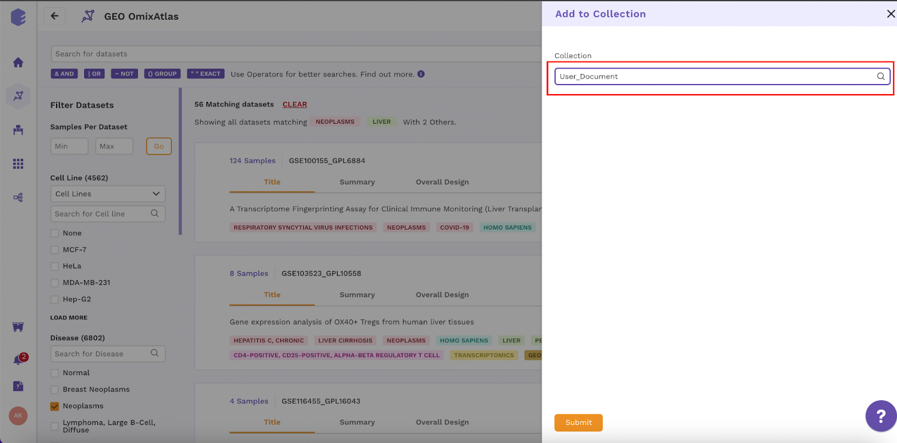

# **Curation App**

## Overview

Curation app is a data annotation tool for labeling multiple types of data for metadata fields. You can add dataset as well as sample level annotations to datasets. The app has an integrated active learning system that uses Machine Learning to provide annotation suggestions to increase the speed of curation and create ML models that can curate data by themselves.

The curation app is integrated with OmixAtlas and any dataset from OmixAtlas can be curated using it.

## Key Features of Curation App

1. Curate dataset and sample level metadata by bringing in your own curators or use our expert curators
2. Configure your own curation UI with a few clicks based on your curation needs
3. Monitor curation tasks and their statuses on a dashboard
4. Curate datasets quickly using ML powered Active Learning integration and create your own ML models for curating data at scale

## Getting Started

The user will have to use following steps to access the app :

1. Create Polly login ID
2. Login into the Polly
3. Get in touch with Customer Success Manager or Polly Support for access
4. Create Curation UI
5. Create Collection and add datasets
6. Assign Datasets to curators
7. Manual Curation
8. Expert Review
9. Approve/Reject complete batch
10. Export Datasets to your workspace for further use/Append Labels to respective OmixAtlas

**Note** - There is a toggle button to switch between curator and reviewer roles.

Select Curation Icon from Polly homepage as shown in Figure 1.

<b>Figure 1 - Curation App Icon</b>

## Reviewer Window

### **Curation UI**

In this window you will be able to define the curation field and curation columns. You will be able to define types, the field names and generate the dynamic interface for curation

Click on the Curation Configs icon. Create a new curation UI or edit an existing UI from the cards provided.

<b>Figure 2 - Curation UI</b>

Click on create Curation Config to create a new UI for custom curation fields.

 

<b>Figure 3 - Create new curation UI</b>

Add the required details, here you can add custom fields, the format of input and create a curation type on your own.

- Curation Config : Name of the curation Type
- Type : Tabular/Free Text
- Level : Dataset/Sample
- Description : Description for the Curation UI (Example - Name of the fields)
- Header Name : Desired Column Name (Example - Time Point)
- Key : Column name to be shown on Polly (Example - curated\_time\_point)
- Type : Text/Number/Dropdown
- Mandatory : Whether you want to keep the filling of field mandatory
- Editable : Whether you want the column to be editable or not

Note : You can add more than one fields in one curation configuration

After filling up the required details, click on the submit button and the new UI will be created.

<b>Figure 4 - Input Fields</b>

### **Edit existing curation UI**

Click on the existing UI

<b>Figure 5 - Edit Curation UI</b>

Click on the edit fields and edit the field names according to your requirements

<b>Figure 6 - Edit Curation UI</b>

Once the UI has been created you can go back to the homepage of the curation app and start creating collections and add datasets to the collection.

### **Create Collection**

A collection is made up of a group of datasets(added directly from OmixAtlas) to be curated for a unique curation UI. In one collection, datasets from multiple OmixAtlas can be added. Each collection contains multiple iterations.

In a collection you can fetch thousands of datasets and get it curated in multiple batches by the curators. Each batch is called an iteration.

Note : Each iteration can be fully approved/rejected on the basis of overall quality of datasets curated in one particular iteration.

**Create new collection**

Click on atlas icon, you will reach following page

<b>Figure 7 - Select Omixatlas</b>

- Select any OmixAtlas, for example - GEO

<b>Figure 8 - GEO OmixAtlas</b>

- Select datasets of your interest using filter buttons
  - Example - You need neoplasm samples for liver in humans, click on all the filters and click on add to collection button.

<b>Figure 9 - Select Desired Datasets</b>

- You can either select existing collection or create a new collection

<b>Figure 10 - Create New Collection</b>

While creating a new collection you need to add following details (If the required curation UI is not available you can create a new customized UI, the steps are explained above)

Collection : Name of the collection (Example - User\_Document)

Curation UI : Select the desired UI from dropdown list (Example - CUS Master)

Description : Any description related to collection (Example - Standard Fields, Sample level)

Click on the submit button to create the collection

<b>Figure 11 - Create New Collection</b>

After the collection is created, go back to the curation app and click on the desired collection card for datasets assignment.

<b>Figure 12 - Collection Card on Curation App</b>

**Add datasets to existing collection**

You can also select the desired datasets and add to the existing collection either directly from the OmixAtlas or using Polly python.

<b>Figure 13 - Add Datasets to Collection</b>

### **Assign Datasets**

Click on the collection created, you will reach the page shown in Figure 14.

<b>Figure 14 - View Iterations</b>

Click on View Iterations button, you will reach the page shown in Figure 15

<b>Figure 15 - Assign Datasets</b>

You can assign the datasets to a curator by filling out the details in prompted window as shown below

Iteration - Name of the iteration (Example - User\_Document\_10-10-2022)

Description - Description of the iteration (Example - Number of datasets to each curator)

Choose number of datasets to assign - Number of datasets to be assigned to each curator (Example - 30)

Curators - The email ids of the curators to whom the datasets will be assigned (Example - amritanjali.kiran@elucidata.io, ritu.tiwari@elucidata.io)

**Note** - The number of curators should be an even number, since the data curation methodology follows double blinded curation process (Each datasets are assigned to two different curators and are curated independently)

<b>Figure 16 - Assign Datasets</b>

After the datasets are assigned to the curators, one iteration is created.

### **Data Journey**

After the assignment the journey of datasets is as followed

1. TO DO - Assigned datasets not curated
2. SUBMITTED - Curated Datasets
3. DISCUSSION - Datasets having less than 100% mutual agreement (consensus)
4. FINAL SUBMISSION - Datasets with 100% mutual agreement (consensus)
5. APPROVED - Correct Datasets
6. REJECTED - Incorrect Datasets

**Note** - The consensus and status of the datasets are shown in the review window as shown in Figure 19.

<b>Figure 17 - Data Journey</b>

### **Statistics Overview**

This page comes under each collection where you can visualise status for curated datasets. Here you can select filters of your choice example filter one iteration or a curator and visualise the numbers of datasets sitting in discussion, final submission, approved etc. You can also use the updated date feature.

<b>Figure 18 - Statistics Overview</b>

### **Review Window**

In this window, you can analyze the status of datasets according to consensus (mutual) score utilizing the multiple filter options available. You can filter datasets for a specific curator or filter datasets of a particular status example - final submission datasets for curator 1 and 2.

<b>Figure 19 - Consensus Status</b>

Click on the dataset id to check the annotated labels by both the curators

Click on Approve button if the labels are correct

Click on Reject button if the labels are wrong

<b>Figure 20 - Reviewer Window</b>

### **Bulk Approve/Reject**

Bulk approve/Reject allows the user to approve/reject complete iteration in one click. After the expert review, if 30% or more datasets are approved, the complete iteration is considered as approved. Upon approving the iteration, datasets from final submission (with 100% consensus) move to approved which can be exported in a particular workspace for further use or can be appended back to the original OmixAtlas.

The rejected datasets are discarded and are sent for recuration.

<b>Figure 21 - Bulk Approve/Reject</b>

### **Export Datasets**

After approving the iteration, click on the export data button in Figure 21. The export data window will pop up as shown in Figure 22. Fill in the required details.

Iteration - Name of the iteration from which the data will be exported

Select Workspace - The specific workspace in which exported data will be stored

Export File Format - JSON or CSV format of the exported data

Append Labels to OmixAtlases - Select Yes if the labels are to be updated in the original OmixAtlas and select No if the labels are not to be updated in OmixAtlas

<b>Figure 22 - Export Data/ Append labels to OmixAtlases</b>

### **Active Learning**

Active learning is a method in supervised machine learning where a model is trained utilizing a small size of training data by prioritizing datasets of high quality. In the curation app we have integrated an active learning assisted machine learning method for free text curation.

While creating a new collection you can enable active learning as shown in Figure 23.

**Note** : The option to enable active learning will appear only when you select free text curation

<b>Figure 23 - Enable Active Learning</b>

If you have reviewer rights then you will be able to view consensus, model score and model consensus as shown in Figure 24.

<b>Figure 24 - Model Consensus</b>

You will also be able to view the performance of the model in the overall statistics page of the collection as shown in Figure 25.

<b>Figure 25 - Model Performance</b>

## Curator Screen

Click on the curation icon in the Polly home page and you will be redirected to the collections page. Click on the specific collection to be curated as shown in Figure 26.

<b>Figure 26 - Open Collection</b>

**Status Statistics**

As a curator you can view the status of the curated data for each iteration in a particular collection

<b>Figure 27 - Status Statistics</b>

**Iteration**

Click on the view iterations as shown in Figure 27 and click on show all button you will reach the list of datasets (Figure 28)where you can view the status of each dataset and click on the dataset id to reach the curation window.

<b>Figure 28 - Iteration</b>

**Curation Window**

Upon clicking on the dataset id, the page will be redirected to the curation window as shown in Figure 29. After curation click on Save Progress (To edit the labels later) or Mark As Complete (If no changes in labels are required and the dataset is finally curated).

<b>Figure 29 - Curation Window</b>

**Active Learning Curation Window**

In the curator window, a curator can view the model scores. On the basis of model scores the curator will be able to prioritize datasets of low scores to curate on highest priority. The model score keeps changing with each curation.

<b>Figure 30 - Model Score</b>

Click on the dataset link, a curation window as shown in Figure 31 will open. Click on model predictions to apply active learning

<b>Figure 31 - Active Learning Curation Window</b>

A new window with the labels predicted by model will appear, check all the labels and click on apply predictions. After labeling the datasets with correct labels click on mark as complete or save progress.

<b>Figure 32 - Model Predictions</b>

## Curator Performance Chart

As a reviewer you can also do the analysis of performance of each curator by comparing the number of attempted datasets, approved datasets and rejected datasets.

<b>Figure 33 - Curator Performance Chart</b>

**Terminologies**

| **Term** | **Description** |
| --- | --- |
| Configuration | The table which contains columns/labels to be curated |
| Collection | Group of datasets for one particular curation type |
| Iterations | Version of assigned datasets undergoing curation or curated |
| Assigned Datasets | The datasets which has been sent for curation |
| Unassigned Datasets | The datasets added in collection to be assigned |
| Consensus | Mutual agreement between the curators, value ranges from0 -100 |
| Tabular | Datasets to be curated in rows and columns format |
| Free Text | Datasets to be highlighted for labels in its textExample - Overall Design and Summary for GEO datasets |
| Model Predictions | Labels predicted by model |
| Model Consensus | Mutual agreement between model and manual curator, value ranges from0 -100 |
| Model Score | Confidence score of the model, value ranges between 0-1 |
| Attempted Datasets | Total number of datasets attended by a curator |

VIDEO

https://www.youtube.com/watch?v=AwmDp6WM\_RY&list=PLA\_38j1m5-Y7PcqysIC3eehBjTHT-O1dT&index=3
