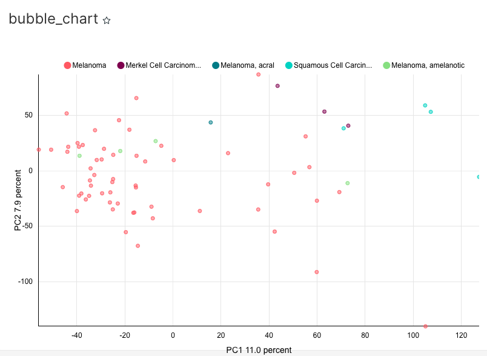
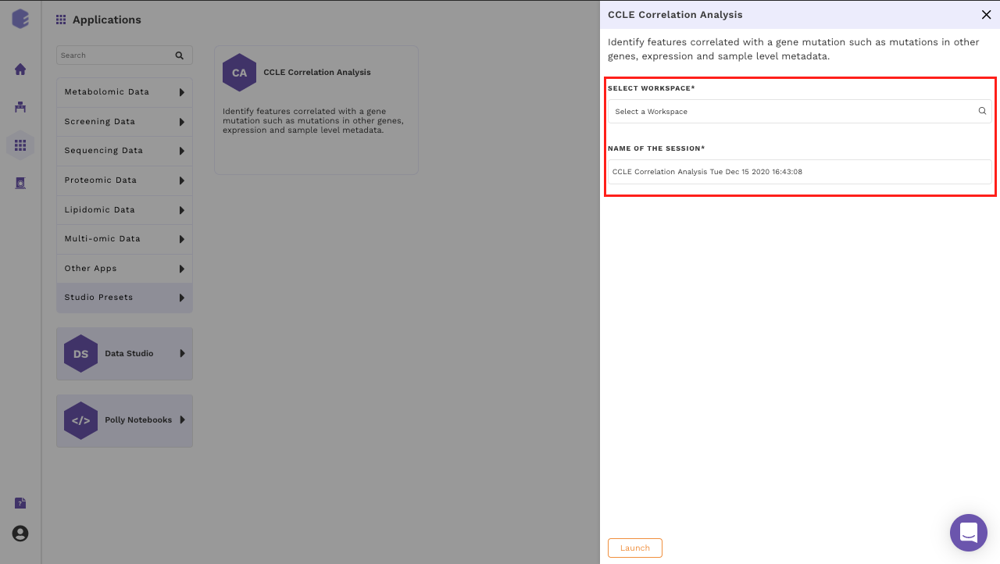

## Visualization customization Overview

On Data Studio, you have the flexibility to customize the visualizations on the go. This document outlines how this customization can be done for each visualization in the CCLE correlation analysis.

| Visualization Type | Component | Options within Data | Options within Customize | 
|----------------------------|--------------------------------------------------------------------|--------------------------------------------------------------------------------------------------------------------------------------------------------------------------------------------------------------------------------------------------------------------------------------------------------------------------------------------------------------------------------------------------------------------------------------------------------------------------------------------------------------------------------------------------------------------------------------------------------------------------------------------------------------------------------------------------------------------------------------------------------------------------------------------------------------------------------------------------------------------------------------------------------------------------------------------------------------------------------------------------------------------------------------------------------------------------------------------------------------------------------------------------------------------------------------------------------------------------------------------------------------------------------------------------------------------------------------------------------------------------------------------------------------------------------------------------------------------------------------------------------------------------------------------------------------------------------------------------------------------------------------------------------------------------------------------------------------------------------------------------------------------------------------------------------------------------------------------------------------------------------------------|--------------------------------------------------------------------------------------------------------------------------------------------------------------------------------------------------------------------------------------------------------------------------------------------------------------------------------------------------------------------------------------------------------------------------------------------------------------------------------------------------------------------------------------------------------------------------------------------------------------------------------------------------------------------------------------------------------------------------------------------------------------------------------------------------------------------------------------------------------------------------------------------------------------------------------------------------------------------------------------------------------------------------------------------------------------------------------------------------------------------------------------------------------------------------------------------------------------------------------------|
| Bubble Chart| PCA, Differential Expression | <ul> **Query**<li>*Series:* This parameter defines the distribution of the data being viewed in the bubble plot. The values in the series are represented as the different color bubbles in the bubble plot. e.g. each Subtype of the disease which has been defined as the series here is represented as a different colored bubble over the plot above.</li><li>*Entity:* This parameter defines what does each bubble on the bubble plot represents. i.e. each bubble in the above plot shows each gene (aka each row) in the processed data.</li><li>*X-Axis:* This parameter defines how each data point has to be represented over the x-axis. i.e. each gene in the above plot has been mapped according to the PC1 value over the x-axis.</li><li>*Y-Axis:* This parameter defines how each data point has to be represented over the y-axis. i.e. each gene in the above plot has been mapped according to the PC2 value over the y-axis</li><li>*Filters:* This parameter allows the user to filter for any value within the table.</li><li>Bubble Size</li><li>Max bubble size: This parameter allows us to increase or decrease the size of the bubble as per convenience.</li><ul> | **Chart Options** <ul><li>Legend selection: Allows the user to view or remove the legend over the bubble chart</li> **X-Axis**<li>*X-Axis label:* Defines the x-axis label of the bubble chart</li><li>*Left Margin:* Defines the distance of the y-axis of the bubble chart from the leftmost margin of the plot.</li> **Y-Axis**<li>*Y-Axis label:* Defines the y-axis label of the bubble chart</li><li>*Bottom Margin:* Defines the distance of the x-axis of the bubble chart from the bottom-most margin of the plot</li><ul>|   |
| All | All | **Datasource and Chart Types**  <ul><li>*Datasource:* This defines the data source being visualized at each step. We should not edit the data source here.</li><li>*Visualization Type:* This defines the type of chart being visualized at each step.</li><li>These parameters will be removed in the near future.</li>| NA |   |
| Box Plot | Gene Expression Box Plot | <ul> **Time**<li>The parameters in this section are not relevant to the end-user.</li><li>These parameters will be removed in the near future.</li> **Query** <ul><li>*Metrics:* This parameter defines the metric you want to see within the box plot from the processed data. i.e. here we are looking at the average expression of the gene within the box plot and hence the same is selected.</li><li>*Filters:* This parameter allows the user to filter for any value within the box plot.</li><li>*Group by:* This parameter defines the x-axis of the box plot. The metadata column across which you want to look at the distribution of the “Metric” is selected here. i.e here we are looking at the average expression of the data across Subtypes of the disease.</li><li>*Series Limit:* This parameter is not relevant to the end-user.</li> **Chart Options** <ul><li>*Color Scheme:* The color scheme for the box plot can be selected from here.</li><li>*Whisker/outlier options:* This option defines how outliers are available on the box plot.</li><li>*X Tick Layout:* This option defined how the x-axis labels are placed on the plot. They are available at 45o slant by default here.</li>| NA |   |
| Table | Upload Raw Data, Annotate Samples with Gene Mutation, Filtering, Correlation, Differential Expression | **Group By** <ul><li>*Group By:* These define the columns you want to be able to view in the data table. The columns appear in the order as selected within the Group By definition.</li><li>*Sort By:* Defines the column which is used for sorting the table</li><li>*Row Limit:* Defines the maximum limit of the number of rows in the table. This doesn’t define the number of rows visible to the user on a page. The Page Length parameter within the Customize option allows us to do that. **Query** </li><li>*Filters:* This parameter allows the user to filter for any value within the table.</li><ul> | **Options**<ul><li>*Page Length:* Defines the number of rows you can see for the table at once.</li><li>Search Box selection: This allows user to search anything within the table in natural language</li><ul> |   |

