# What is Data Studio?

Data Studio application lets you explore data, make multiple workflows, and variate endlessly on those workflows. It allows the ingestion of all kinds of data and their combinations so that you can perform any analysis easily. The studio is made of smaller components that are split into various categories for ingestion, cleaning, analyzing, and visualizing your data. You can select these components and arrange them according to your analysis needs to create your own custom workflow. You can also save a particular sequence of the components that can be reused again.

Furthermore, these components can be configured or custom components can be added by anyone to cater to their workflow requirements. Detailed documentation on the customization and creation of components can be found [here](https://drive.google.com/file/d/1PPNEapLtHzCVHKXii8NufajWuEmc3fuv/view?usp=sharing).

## Scope of the application

*    Explore any kind of data without being tied to a single workflow

*    Perform any kind of analysis on any data within the same umbrella using the Polly components

*    Lets you draw from a large library of components that allows you to clean, filter, analyze and visualize the data

*    Allows usage of scripts and jupyter notebooks

*    Allows you to add your own component to the workflow

*    Lets you add the components in any desired order

*    Provides workflow customization

*    Allows you to extract the selected component order and save it as a defined workflow

# Data Studio Overview

## What is a Component?

A component in Data Studio is a containerized script with specified input and output files along with its defined visualizations. Each component is a separate docker with only the essential library installations and a main script that can read inputs. The main script can be in R or Python. Apart from the output files, components are also responsible for writing the files required for data visualization, along with visualization parameters.

Data Studio is fully customizable as you can select the component of your choice from the predefined list, or write your own component and add it to the list. Component templates are available to help with component creation. The Python3 and R templates are available on GitHub. You can easily download the templates. Read on about the creation of the components in detail from [here](https://drive.google.com/file/d/1PPNEapLtHzCVHKXii8NufajWuEmc3fuv/view?usp=sharing).

## Data Studio Journeys

You can explore the Polly Data Studio in two ways:

**Studio Core**

Studio core allows you to build and use your own custom workflow in Data Studio. It enables you to explore and define a workflow and ultimately visualize your data on a fully customizable dashboard and report.

**Build:** It provides the flexibility to break down the goal of a workflow into the steps that should be executed by the workflow. Use any of the components from the component library for the chosen step of the analysis. Select and add different components to grow your workflow. You can then arrange the steps to complete your workflow. If you can’t find the one you are looking for, make your own custom component and host it within your workflow.

**Visualize:** Easily interact with the parameters of the selected components and customize your data visualizations through highly configurable charts like line, bar, and pie charts, area, and bubble graphs and tables, and more.

**Report:** Ultimately create a custom version of the visualization dashboard to represent the report from the workflow. Easily annotate your report, apply styles, and color themes to make your data story work.

**Studio Preset**

Once the goal and the steps of the workflow are defined in Data Studio. It can be exported as a Studio Preset that will include a predefined series of steps that are required to complete an end-to-end process.

Studio preset is present in the form of an application with the selected components that can be interacted with. It is made with the help of Studio Core for the ingestion of high throughputs of data which often requires performing the same analysis steps over and over again.

Now if you are worrying that once the workflow is exported into a preset and cannot be customized again. We got you covered there as well. In case you need to again add a library component or a custom component within the workflow, it is fairly easy to do so.

# Getting Started

The Studio Core has three main panels:

*    *Component Panel:* Displays a list of all the steps/components selected in this particular session

*    *Parameters Panel:* Allows you to select the component and input files

*    *Visualization Panel:* Displays the selected visualization plot along with visualization parameters

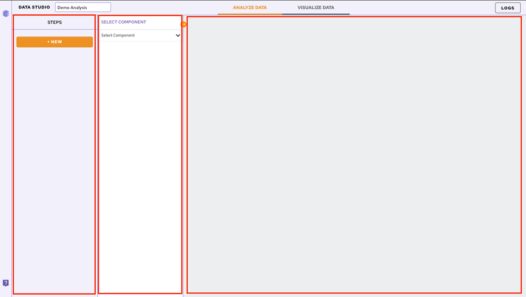

## Add and Configure Components

In order to add a component to your workflow, click on the *Select Component* option present in the parameter panel. You can select the desired component from the dropdown menu. You can search for the component as well from the search option.

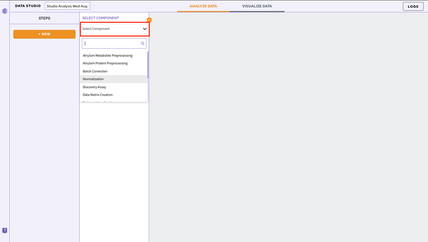

To add subsequent components, Click on the *NEW* option present in the component panel.

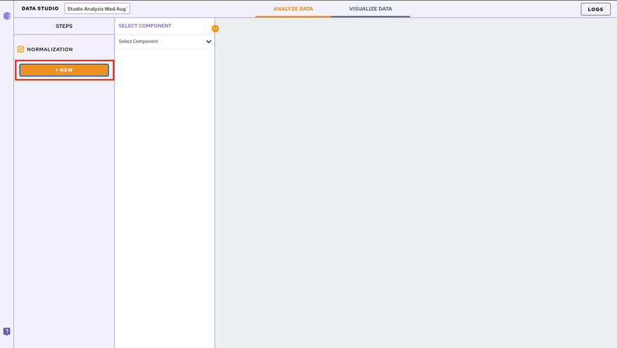

## Adding Input Files

Once a component is selected it is required to add the input files. In order to do that, click on the *Browse* option. A slide menu will appear displaying the data files present in the selected workspace. Select the file and click on *Import*. Your file will be added.

**Note:** 

*   Input files are not required to be added at each step. They automatically get mapped from the previous component.

## Executing the Components

Each component comes with its associated parameters that are displayed in the parameter panel. Fill in all the mandatory fields using the dropdown menu or using the checkboxes. Once the parameters are specified, click on the *Run Task* option to execute your component.

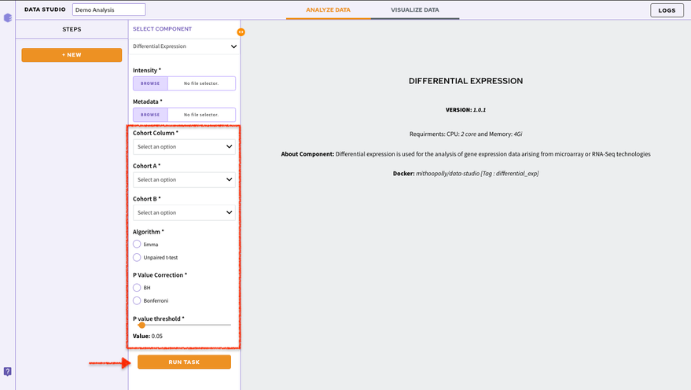

You can have a look at the state of your execution with the displayed status bar.

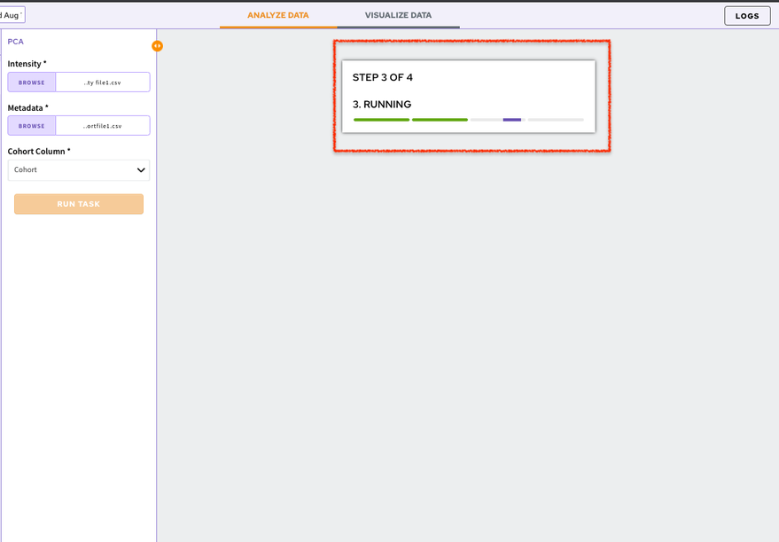

The default visualization of the component will be generated on the *Visualization Panel*.

## Chart Selection

If there are multiple visualizations for a particular component, you can use the *Select a Chart* option to choose the visualization you want displayed on your screen. At a time only a single visualization can be displayed on the *Visualization Panel*.

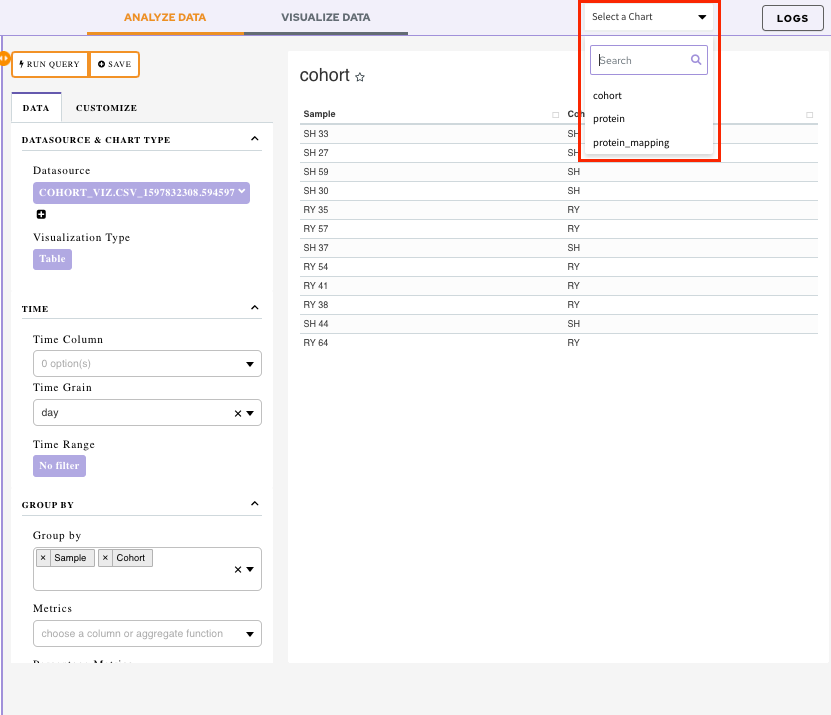

In order to look at all the visualization simultaneously, save your visualization to a dashboard.

## Dashboard

Data Studio lets you visualize your data with the number fo highly configurable charts and tables, which you can add to dashboards and then customize as needed. The Visualization Dashboard provides an at-a-glance view of the selected visualization charts. The dashboard is customizable and can be organized in the most effective way to help you understand complex relationships in your data and can be used to create engaging and easy-to-understand reports.

The generated reports are interactive and can be shared with the collaborators. You can easily communicate and act on the customized data where all the members of your team can compare, filter and organize the exact data they need on the fly, in one report.

## Saving a Chart

In order to add a visualization to your dashboard, you first need to save it under the desired dashboard name.

In order to do that, click on the *Save* option present beside *Run Query* option.

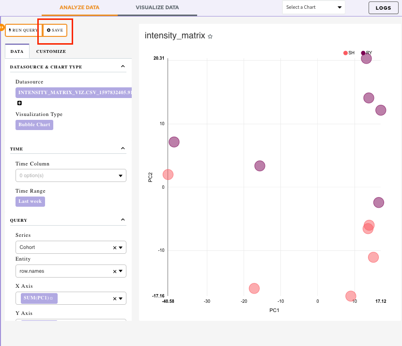

It will display a menu:

*    *Overwrite chart cohort:* Chart would get saved with the default name

*    *Save as:* Specify the name of your chart using this option

*    *Add the chart to an existing dashboard:* Use the drop-down menu to select an existing dashboard. The chart will get added to the selected dashboard

*    *Add to new dashboard:* Provide a new name of the dashboard and a new dashboard with the current chart will be created

Once all the selections are done, click on *Save*.

## Visualizing the Dashboard

Click on the *Visualize Data* tab.

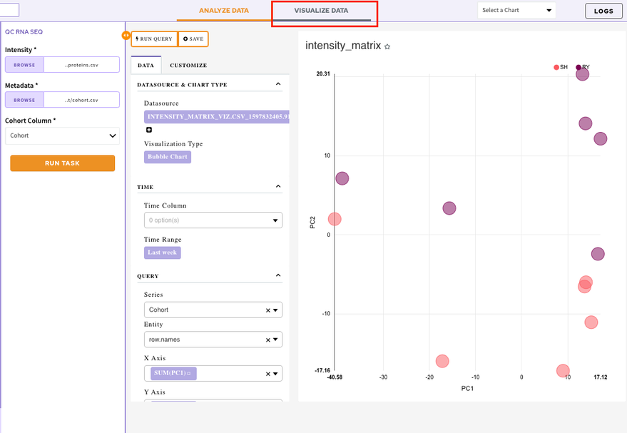

It will display the list of all your created dashboards. Select a dashboard to look at the added visualization charts.

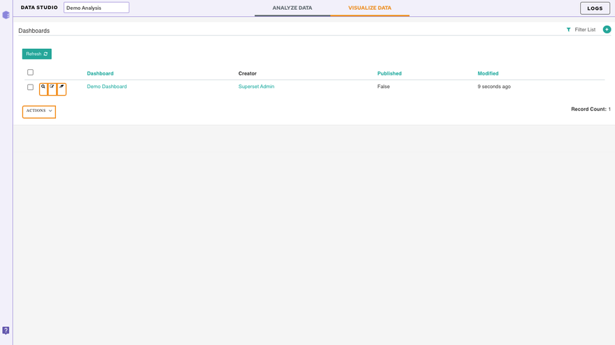

## Editing a dashboard

In order to edit your dashboard, click on the *Edit Dashboard* option present at the top right corner.

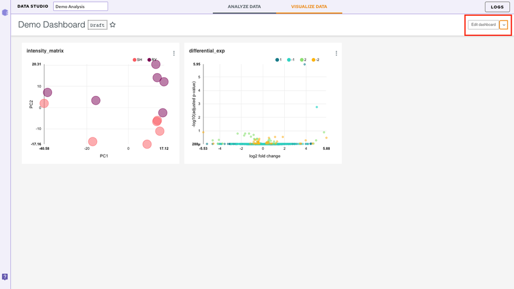

There are a few ways to edit the dashboard

*   Resizing the table/charts: By selecting the bottom right-hand corner of the table/chart (the cursor will change too), you can resize it by dragging and dropping.

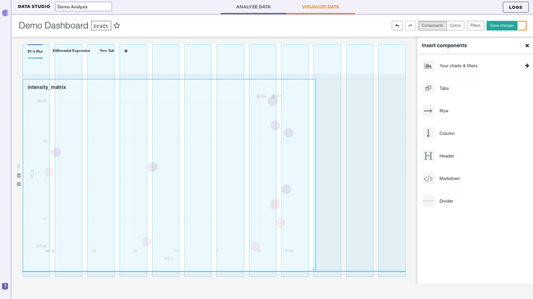

## Inserting a Component

*    *Your charts and filters:* You can use this tab to sort your charts

*   *Tabs:* This option lets you create different tabs within the same dashboard

Let's say you have two plots in your dashboard. After you insert the component, just drag and drop the two charts. Once the two charts have been separated, label the tabs with the corresponding dataset names (or any desired name) represented in the charts.

*    *Column:* Lets you add an additional column in the dashboard

*    *Row:* Lets you add an additional row in the dashboard

*    *Header:* Lets you add a header to the dashboard

*    *Markdown:* In this section, we will add some text to our dashboard. Within the *Insert* components pane, drag and drop a* Markdown*box on the dashboard. Now to edit the text, select the box. You can enter text in markdown format (see [this Markdown Cheatsheet](https://github.com/adam-p/markdown-here/wiki/Markdown-Cheatsheet "https://github.com/adam-p/markdown-here/wiki/Markdown-Cheatsheet") for more information about this format). You can toggle between *Edit* and *Preview* using the menu on the top of the box.

*    *Divider:* Use this to divide different sections of your dashboard

**Note:** 

*   Look for the blue lines which indicate the anchor where the box will go.

**Color**

The color tabs let you choose the color scheme from the 9 default schemes present in the dropdown.

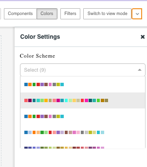

Finally, save your changes by selecting *Save changes* on the top right.

## Other Useful Features

**Restoring the analysis**

You can restore your analysis at any point in time. Data Studio contains the restore functionality that allows any analysis to be restored to the last step. Analyses can be restored by navigating to the desired workspace.

Click on the specific analysis which will enable the *Restore* option on the right panel. Clicking on *Restore* will take you back to the application with the same data used before.

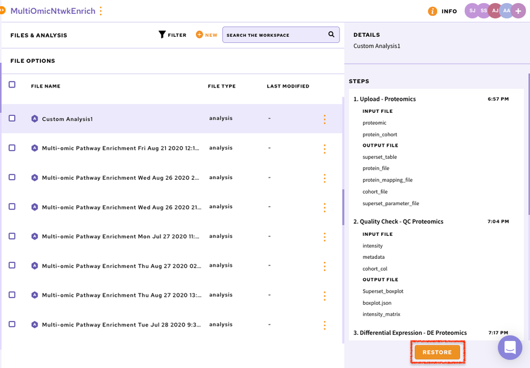

**Accessing the logs**

The log option present at top right corner of the screen allows you to look at the logs of the current session. You can look at the input files uploaded, the output files generated as well as the parameters used in this session.

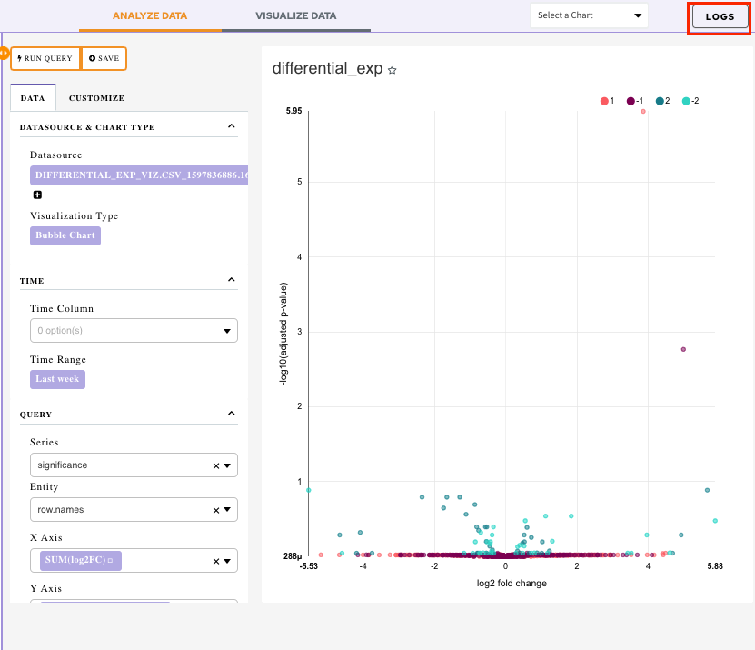

**View Docker Logs**: Enable *View Docker Logs* option to view the execution of the component on the code level.

Select a job for which you want the logs from the drop-down menu.

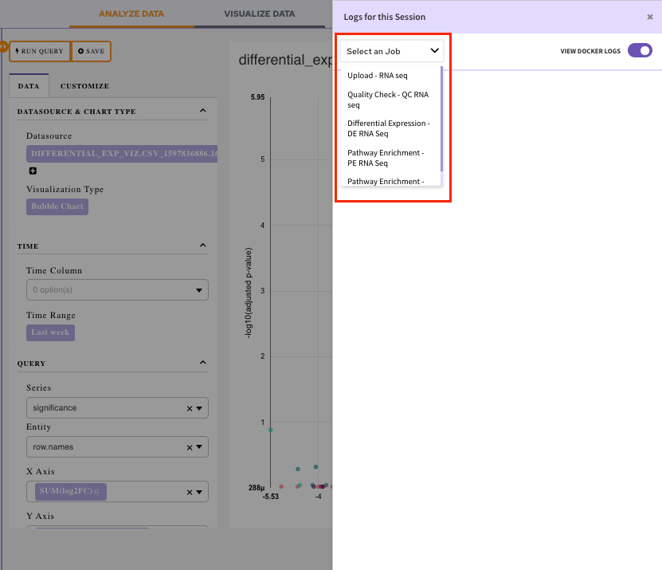

Once the job is selected, you will be able to visualize the docker logs. It will let you know what is happening, or what happened at every layer of the stack.

