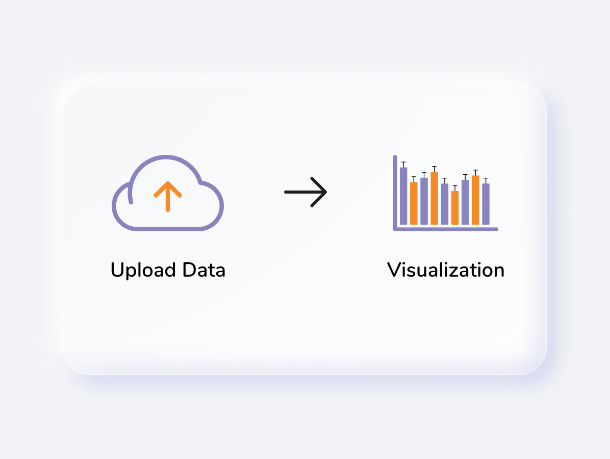
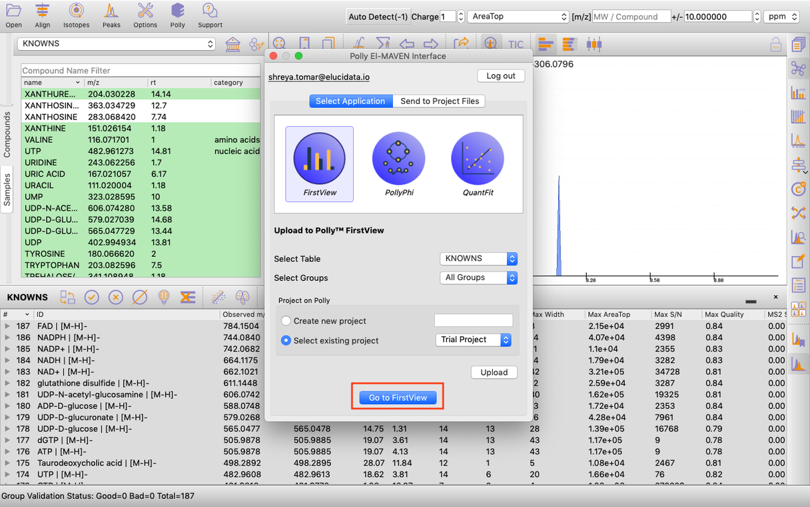
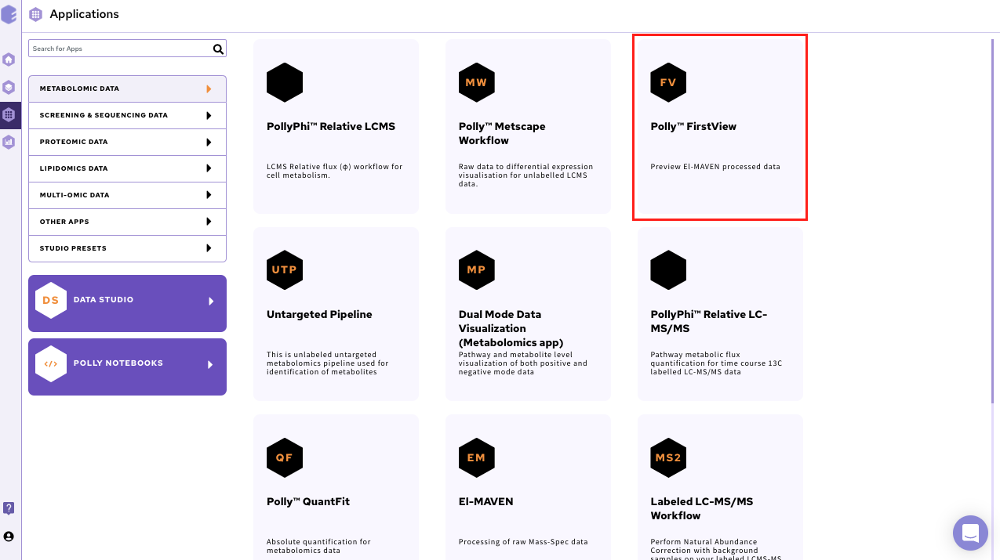
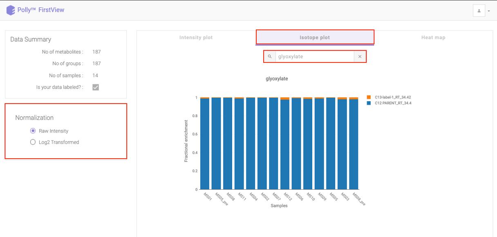
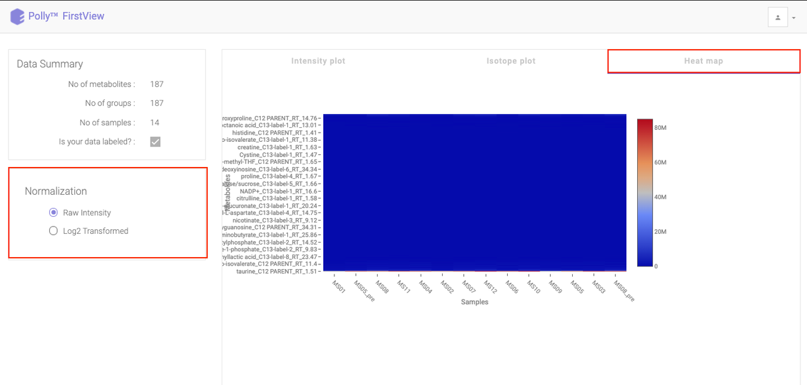

#Introduction

##Overview

[El-MAVEN](https://github.com/ElucidataInc/ElMaven/wiki), our open source LC-MS data processing engine is optimized for isotopomer labeling and untargeted metabolomic profiling experiments. You can view the mass spectra, align chromatograms, perform peak-feature detection and alignment for labeled and unlabeled MS data. FirstView enables you to have a first look at your data using basic visualizations to get preliminary insights.

##Scope of the App

*   Provides visualizations for both labeled and unlabeled data
*   Provides visualizations on both raw and log2 transformed intensities
*   View intensity plot for each metabolite
*   View Isotope plot for each metabolite in case of labeled data
*   View heat map for the entire dataset

 
**Figure 1.** FirstView

#Getting Started

##User Input

There are two ways to upload files to FirstView:

**El-MAVEN FirstView interface**

It allows you to directly push El-MAVEN output to FirstView as shown in Figure 2.

 
**Figure 2.** El-MAVEN FirstView Interface

**Application upload interface**

To use FirstView from Polly, you only require the El-MAVEN Output file:

 
**Figure 3.** El-MAVEN Output FIle

##Steps in data processing

*   Upload data to FirstView
*   Visualize the intensity plot for each metabolite
*   Visualize the isotope plot for each metabolite
*   Visualize the heat map for the entire dataset

##Caveats

*   The El-MAVEN output should be generated using a compound database
*   For labeled data, the intensities in the Isotope Plot are **NOT** corrected for natural abundance
*   Log2 Transformation does not change the Isotope Plot
*   For unlabeled data, the Isotope Plot section will be blank

#Tutorial

##Upload files

**El-MAVEN FirstView Interface**

Once you have derived a peak table containing the list of metabolites. You can click on the *Polly* Icon at the Menu Bar to export the data directly to PollyTM FirstView. Provide your Polly login credentials and a window will pop-up which allows you to select the peak table to be uploaded to FirstView. You can select the project from the list of your existing projects or choose to create a new one from this menu itself and then click on *Upload.* Once the files are uploaded, click on *Go to FirstView* and you would be redirected to FirstView.

 
**Figure 4.** El-MAVEN FirstView Interface

**Application upload interface**

Alternatively, select FirstView from the dashboard under the *Metabolomics Data* Tab.

 
**Figure 5.** Polly Dashboard

Create a *New Project* or choose the existing one from the drop down to be redirected to FirstView's upload page as shown in Figure 6.

![Project selection] (../img/FirstView/Projectselection.png) 
**Figure 6.** Project selection

 
**Figure 7.** Upload page of FirstView

Upload your intensity file by either clicking on *Browse* or using the drag and drop functionality.

##Visualization

The visualization interface provides the data summary (number of samples, groups and metabolites present in the uploaded data) and normalization on the left side whereas the rest of the interface provides the generated plots.

**Intensity Plot**

The Intensity Plot displays the intensity values either raw or log2 transformed, for a given metabolite across all samples. For labeled data, the intensity for all isotopologues are displayed in different colors in stacked bar plots as illustrated in Figure 8. below.

 
**Figure 8.** Intensity Plot with raw intensities

Click on the drop down to visualize the intensity for a different metabolite.

 
**Figure 9.** Drop down to Intensity Plot with raw intensities

To see a normalized Intensity Plot, select the *Log2 Transformed* option in *Normalization* section. The plot would get updated to accommodate the normalized intensities.

 
**Figure 10.** Intensity Plot with normalized intensities

**Isotope Plot**

Click on *Isotope Plot* option beside Intensity Plot to see a fractional enrichment vs sample plot. The values seen are calculated as:

intensity of parent or isotopologue / sum (intensity of metabolite for a sample)

 
**Figure 11.** Isotope Plot with raw intensities

**Heat map**

Click on Heat map option beside Isotope Plot to open the heat map. Heat map is a graphical representation of data where the individual values contained in a matrix are represented as different colors corresponding to the intensity. Here, the heat map represents intensity value of each metabolite corresponding to the number of samples in the data.

 
**Figure 12.** Heat map with raw intensities

You can view this plot with both raw intensities and normalized intensities by choosing the desired normalization option from the left section of the page. Hovering over the plot will display the specific values.

 
**Figure 13.** Heat map with normalized intensities
