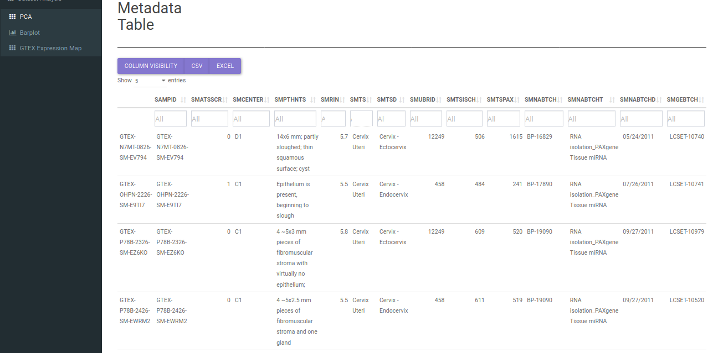
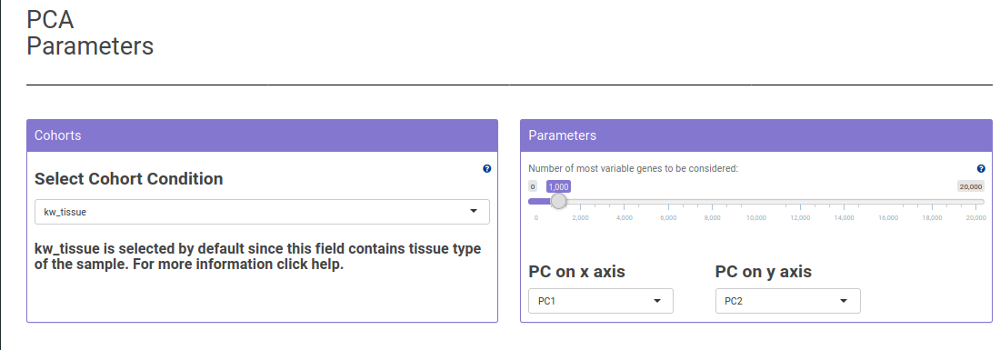
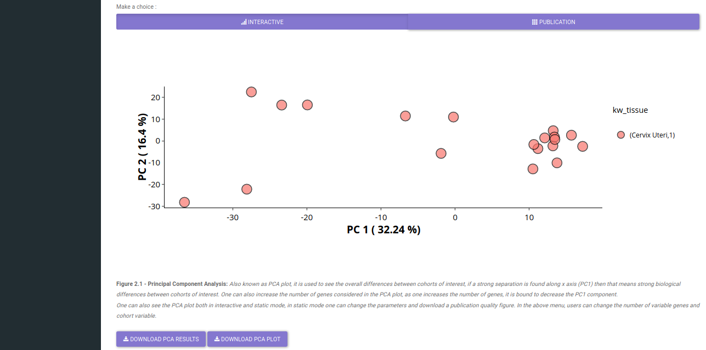
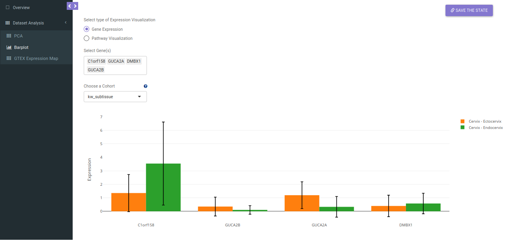
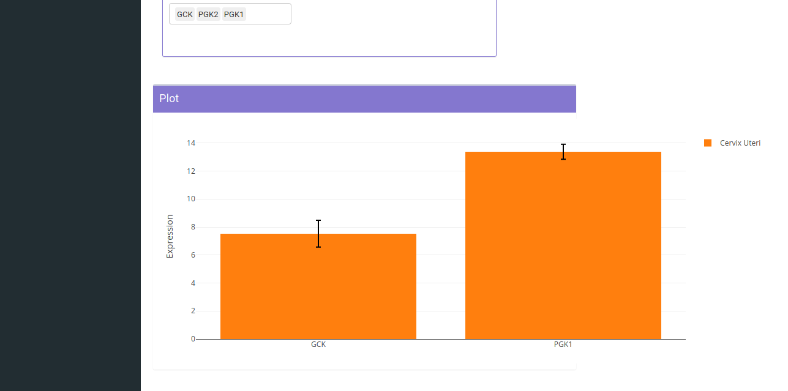
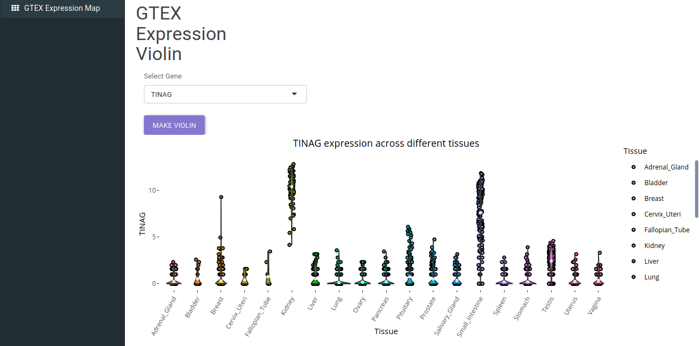
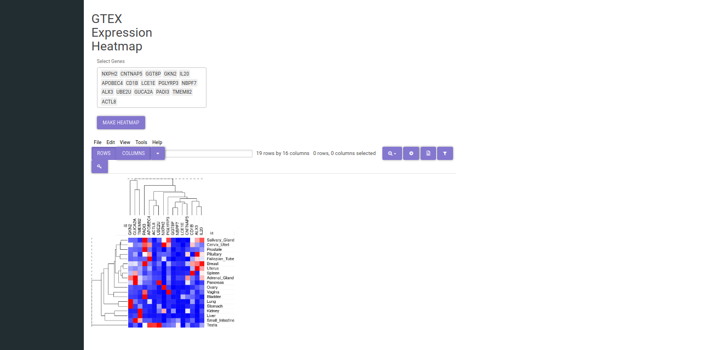

#GTEx 

**Opening the app**

GTEx respository can be accessed using the GTEx card on Discover. 

After selecting the repository, you’ll be able to see a dashboard with different tissues. Select a dataset and use GTEx application to explore the dataset. 

The app will open and you should see the overview page which contains a brief overview of the application, scope and caveats as shown below.

**Analyzing a dataset**

As the application starts, it will load the requested dataset. Once it is loaded, it can be explored. 

*   **Principal Component Analysis (PCA)**

Principal Component Analysis: Also known as PCA plot, it is used to see the overall differences between cohorts of interest, if a strong separation is found along X axis (PC1) then that means strong biological differences between cohorts of interest. It provides an aspect to check the quality control of different samples. 

The tab provides a metadata table to check different characterstics of samples. Furthermore various parameters of PCA can be adjusted. 

A publication quality and an interactive version of the PCA plot is available to explore. 

*   **Bar Plot**

*Barplot* provides exploration of different genes either standalone or as a part of different pathways. The distribution can be grouped by different metadata cohorts such as tissue type or tissue-subtype. 

Using the *Gene Expression* toggle, different genes can be queried for different samples. 

Upon selecting the *Pathway Visualization* option, pathway specific genes can be selected. At a given time more than one pathways can be selected  

    
*   **GTEx Expression Map**

*GTEx Expression Map* can be used to explore the distribution of selected genes in different GTEx tissues. After exploring the selected tissue and finding list of genes of interest, it presents visualization methods like *GTEx Expression Violin* and *GTEx Expression Heatmap* to study the distribution of genes across different tissues. 

A single gene can be selected to plot violin for it's expression across different tissues. 

Multipe genes can be used to make a heatmap for different tissues. 
    
