GTEx Correlation and Enrichment Analysis Preset

## Introduction

### Overview

Large scale genetic research studies such as genome-wide association studies (GWAS) have helped identify potential links between genetic variants and diseases in humans. However, the mechanisms by which these variants modify gene expression and lead to disease development and progression have been difficult to decipher since a majority of these lie in non-coding regions of the genome.

The Genotype-Tissue Expression (GTEx) project is an initiative started by the National Institutes of Health (NIH) in 2010 with the aim of enabling researchers to study how gene expression is regulated in humans and determine how it contributes to genetic variation. The database comprises of genotyped human tissues and RNA-seq samples from multiple donors to allow for further analysis.

The datasets present in GTEx can be analyzed using the GTEx Correlation and Enrichment App and can help identify correlations between individual genes and the rest of the transcriptome.

### Scope of the App

* Filter samples from the expression data and metadata based on selection.

* Determine the correlation between a selected gene of interest with the remaining genes in the dataset.

* Perform gene ontology analysis.

### Getting Started

### User Input

Data can be uploaded from the GTEx data lake on Polly. The user inputs required are mentioned below:

* *Dataset ID:* Dataset from the GTEx data lake to be used in the preset for correlation and other downstream processing

* *Gene I (For adding gene ratio Gene I/GeneII):* Gene I to be used in the numerator for adding a gene ratio Gene I/Gene II

* *Gene II (For adding gene ratio Gene I/GeneII):* Gene II to be used in the denominator for adding a gene ratio Gene I/Gene II

### Tutorial

Select the *GTEx Correlation and Enrichment Analysis App* from the dashboard under the *Studio Presets* tab.

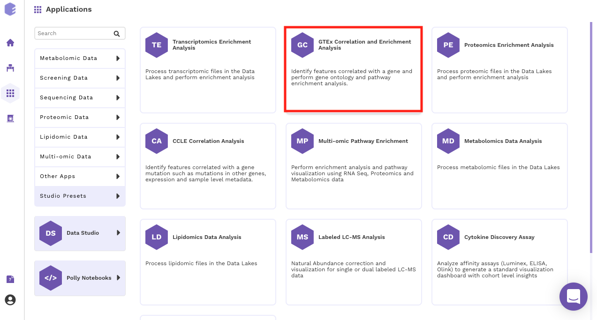 
 **Figure 1.** Select the GTEx Preset 

Select an existing Workspace from the drop-down and provide the *Name of the Session* to be redirected to  *GTEx Correlation and Enrichment Analysis Preset's* upload page.

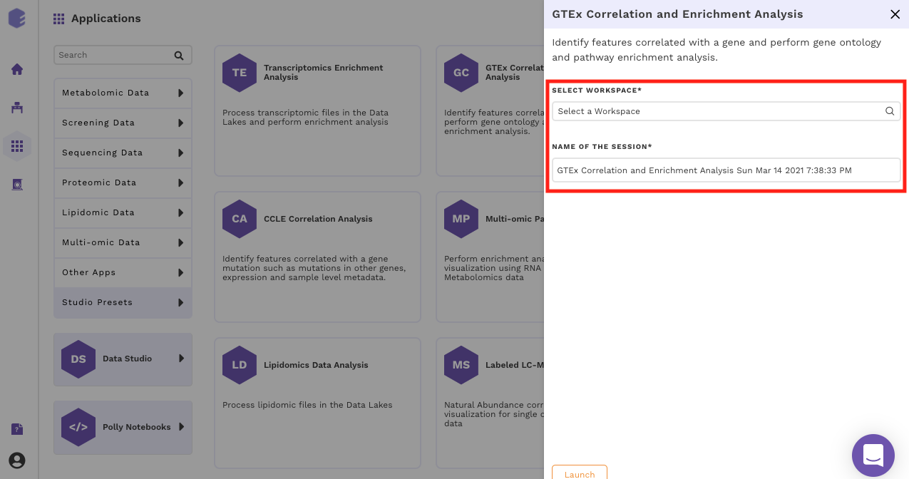 
 **Figure 2.** Select a Workspace 

### Data Curation

### Upload Files

The first component is the *Upload component*, which allows you to upload the gene expression data file from GTEx required for processing through the app.

To upload the input files, enter the Dataset ID of the dataset of interest from GTEx.

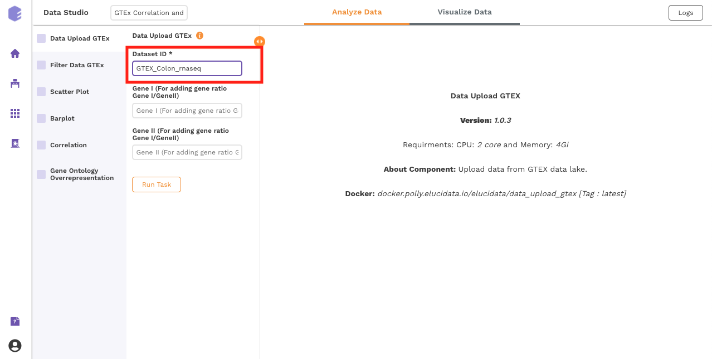 
 **Figure 3.** Upload a dataset for analysis 

Once all the files are imported, click on *Run Task* to execute the component.

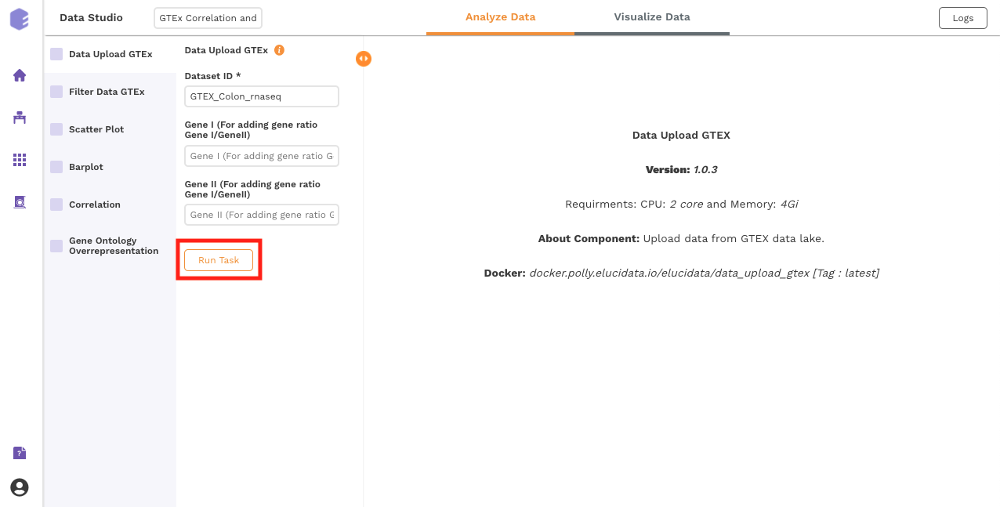 
 **Figure 4.** Execute component 

Two output files will be generated:

*  *Data file* : GTEx gene matrix containing TPM counts of the genes in rows and samples in columns.

*  *Column metadata* : GTEx sample metadata containing sample's characteristics of the selected dataset (cohort info and other supporting information).

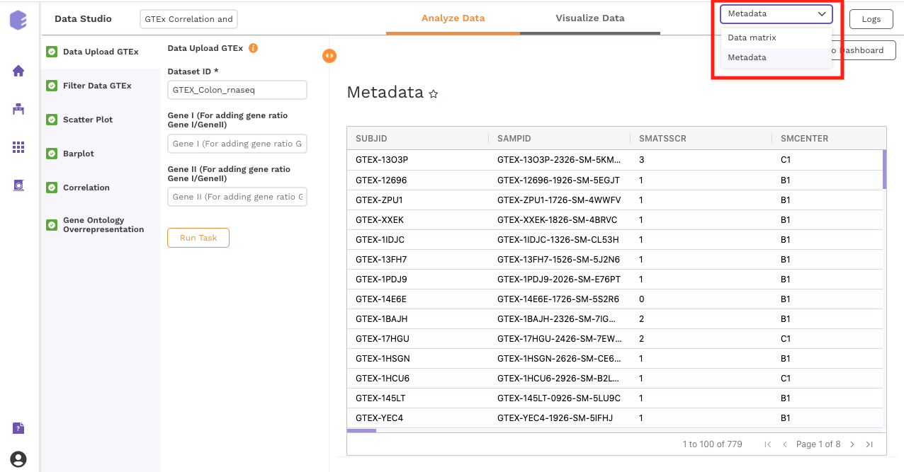 
 **Figure 5.** Generated output 

### Filtering

This component is used to filter samples from the expression data and metadata based on your selection. The component provides an option to choose a column and subsequent value from within that column to subset the data.

* *Filter samples:* It provides two options - *Yes* and *No*. If '*No*’ is selected, then no filtering is applied to the data and all the samples are available for usage in the downstream components. If '*Yes*' is selected, then you must select the options for filtering from the drop-downs.

* *Select Column:* Names of the columns from the metadata file are listed here for you to choose.

* *Column Value:* Once a column has been selected in the *Select Column* dropdown, all the unique values from the selected column are available for you to pick from.

* *Filter rows:* This option provides two options to the user - 'Yes' and 'No'. If user selects 'No', then no filtering is applied to the data and all the rows are passed to the downstream components. If 'Yes' is selected, then the user must fill up the options for filtering in the UI elements just beneath this radio button.

* *Threshold value:* Specify the threshold value below which you want to drop the values from the data. If a row has x percent of values below this threshold value and it exceeds the threshold percent, the row will be dropped.

* *Threshold Percent:* Specify the threshold percent above which you want to drop the values from the data. If a row has x percent of values below the threshold value and it exceeds this threshold percent, the row will be dropped.

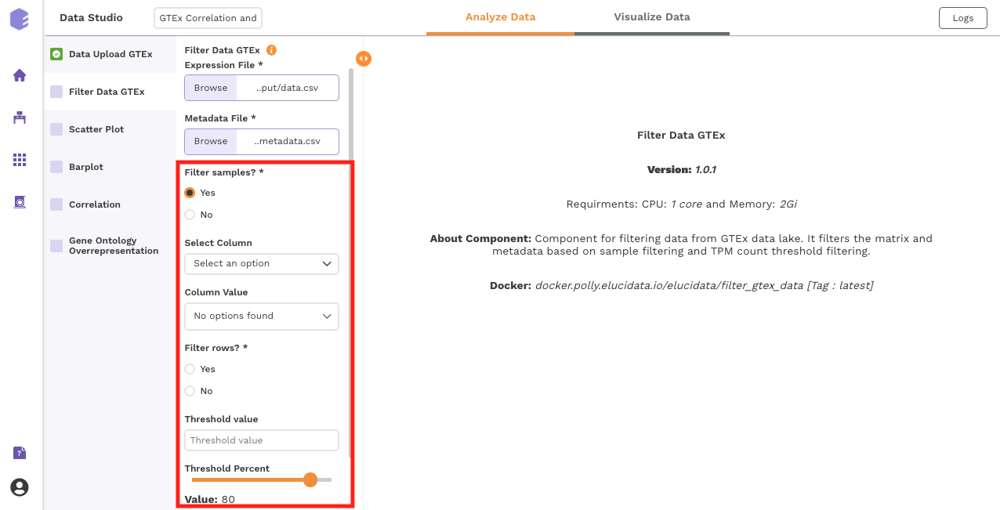 
 **Figure 6.** Filtering parameters 

Once all the fields are selected, click on *Run Task* to execute the component. Two output files will be generated:

* *Expression data:* Subsetted expression data with filtered samples.

* *Metadata:* Subsetted metadata with filtered samples.

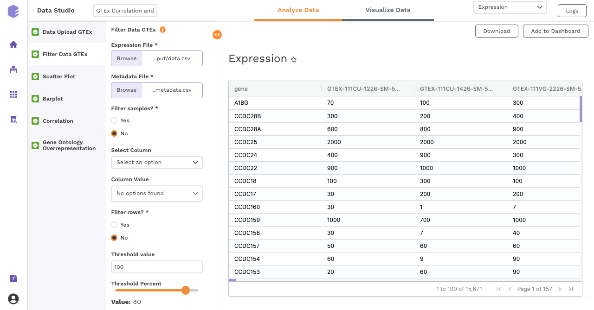 
 **Figure 7.** Filtered output 

### Data Exploration

### Scatter Plot

This component produces a scatter plot with R2 and p value on providing the gene expression data and two genes to plot on the x and y axes.

**Inputs:**

* *Expression matrix file:* GTEx gene matrix containing TPM counts of the genes in rows and samples in columns

* *Gene on x axis:* Select a gene to plot on x axis of scatter plot from the drop-down.

* *Gene on y axis:* Select a gene to plot on y axis of scatter plot from the drop-down.

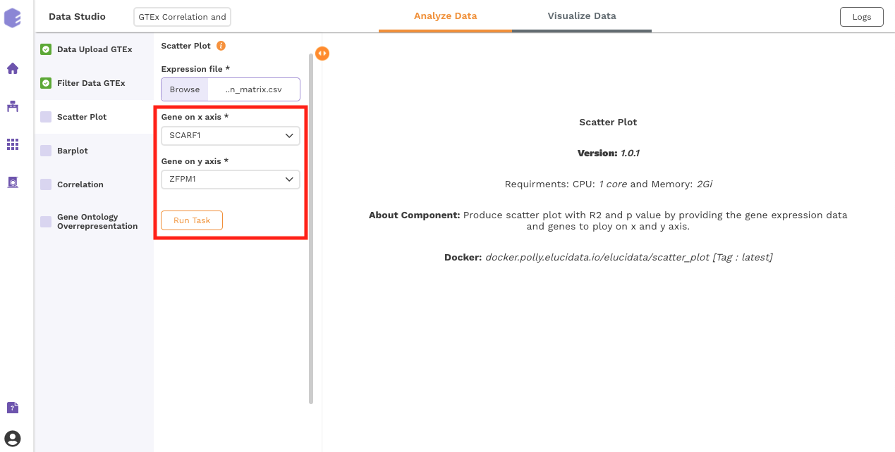 
 **Figure 8.** Scatter plot parameters 

After executing the component, an interactive scatter plot will be generated as the output.

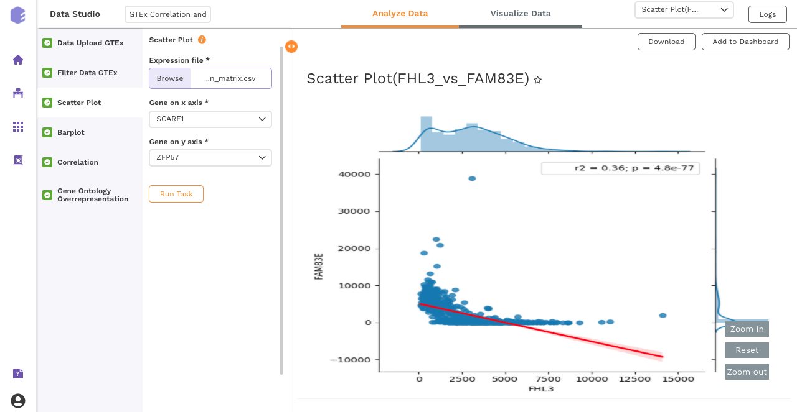 
 **Figure 9.** Scatter plot output 

### Bar Plot

This component allows you to visualize data as a vertical bar plot.

**Inputs:**

* *Expression matrix file:* GTEx gene matrix containing TPM counts of the genes in rows and samples in columns

* *Metadata File:* GTEx sample metadata containing sample's characteristics of the selected dataset (cohort info and other supporting information)

* *Select Cohort:* Dropdown to select one of the metadata columns

* *Select Gene:* Dropdown to select one of the metadata columns

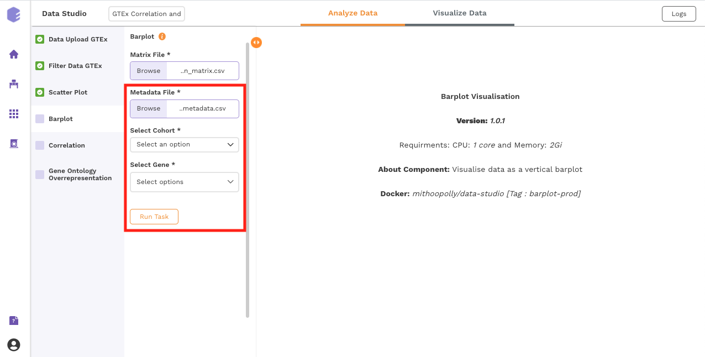 
 **Figure 10.** Bar plot parameters 

Once all the parameters are selected, execute the component by clicking on *Run Task*.

After executing the component, an interactive bar plot will be generated as the output. 

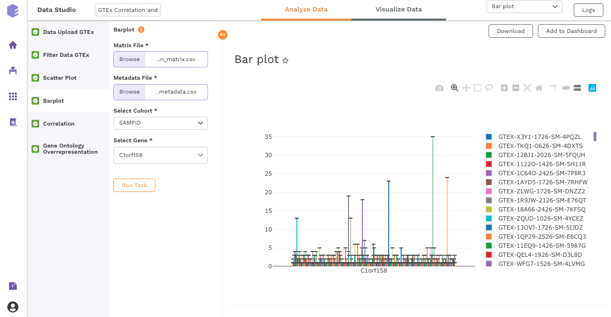 
 **Figure 11.** Bar plot output 

### Correlation:

This component uses the Pearson, Kendall or Spearman method to calculate the correlation between a selected gene and the remaining ones.

**Inputs:**

* *GTEX expression:* GTEX expression matrix from the Upload component

* *Gene for correlation:* The correlation of this gene vs the rest of the genes will be calculated.

* *Correlation method:* Plot and calculate significance using the selected metric. *P-value* is the value returned by the algorithm while Adjusted *P-value* is the corrected value after applying one of the correction methods above.

* *Correlation threshold:* Select the appropriate threshold for the correlation metric. Correlation lower than -(threshold) and greater than threshold will be omitted from subsetted table.

* *P-Value Metric:* Plot and calculate significance using the selected metric. *P-value* is the value returned by the algorithm while Adjusted *P-value* is the corrected value after applying one of the correction methods above.

* *P-value threshold:* User can select the appropriate threshold for the selected *P-Value* metric. P-values lower than this threshold will be marked as Significant

* *Plot on x:* Variable to plot on x axis of volcano plot.

* *Plot on y:* Variable to plot on y axis of volcano plot.

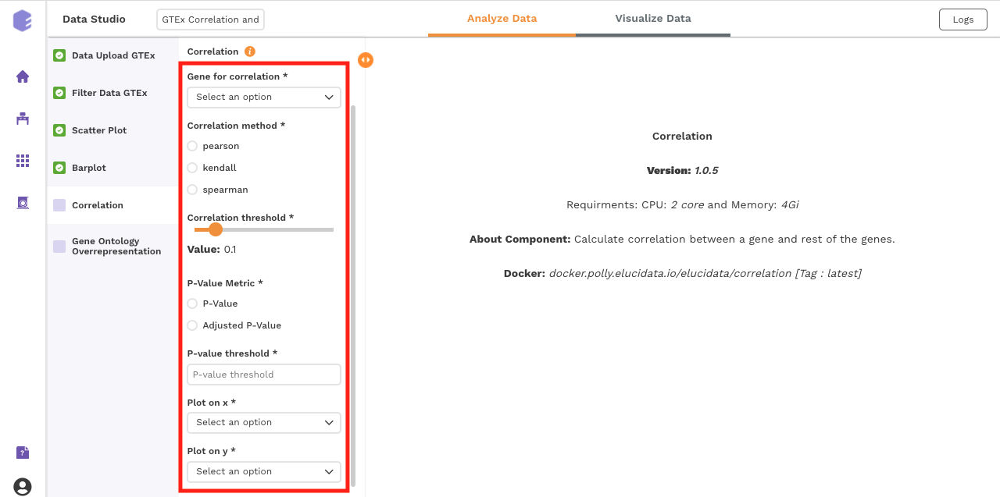 
 **Figure 12.** Correlation parameters 

Once all the parameters are selected, execute the component by clicking on *Run Task*. It will generate three output files:

**Outputs:**

* *Correlation(All) table:* Table for the correlation values of gene vs all the genes.

* *Correlation(Filtered) table:* Subsetted table for the correlation values of gene vs all the genes, filtered based on the parameters.

* *Data for Pathway Visualization:* This data is subsequently used for the gene ontology over-representation analysis.

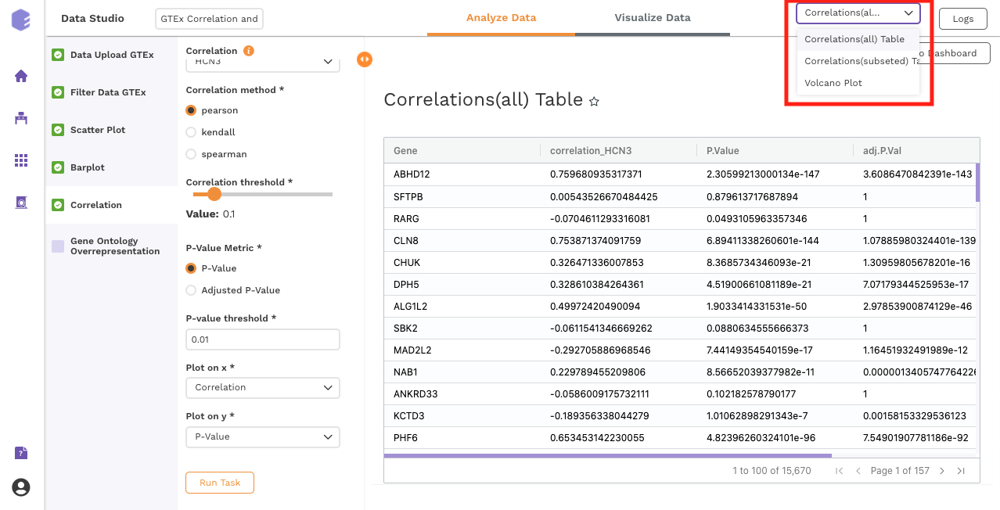 
 **Figure 13.** Correlation outputs 

### Gene Ontology Overrepresentation

Over-representation analysis determines whether a subset of genes that you have already separated out associates significantly with certain pathways.

**Inputs:**

* *Data for pathway enrichment:* Data for pathway enrichment from the correlation component.

* *P Value Cutoff:* Set cut-off P value. The pathways having significance greater than this value (p value smaller than this) will be shown in the results.

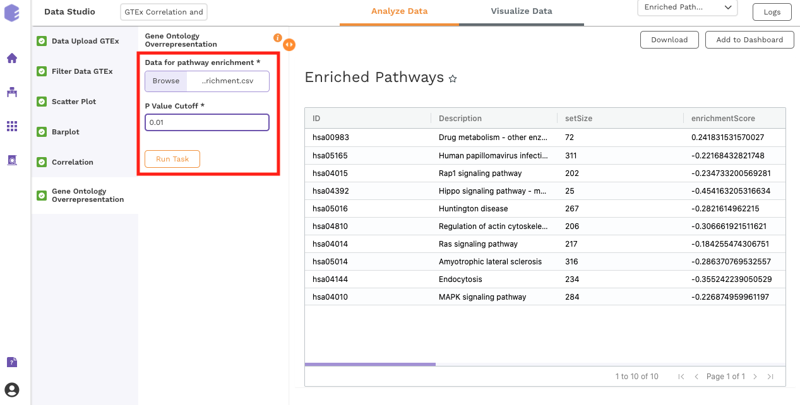 
 **Figure 14.** Gene ontology parameters 

Once all the parameters are selected, execute the component by clicking on *Run Task*. This will generate two output files:

* Enriched Pathways

* Gene Ontology

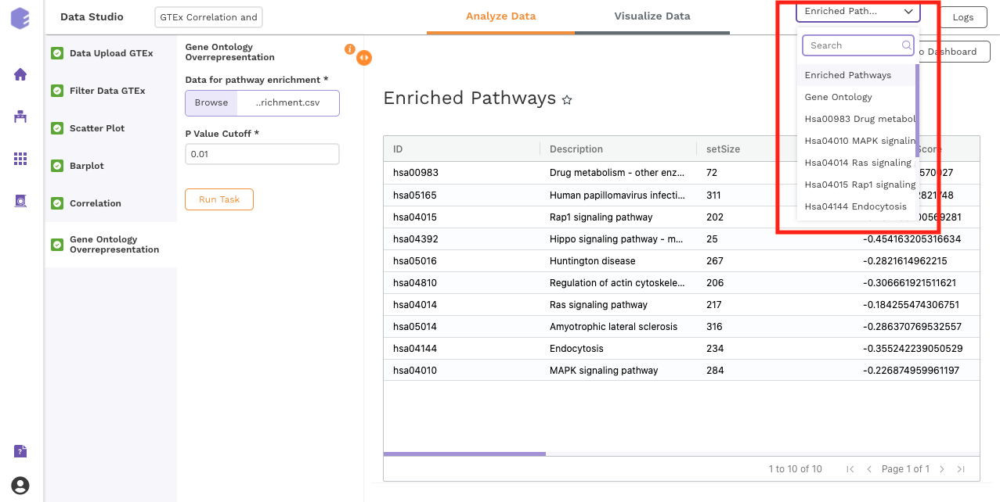 
 **Figure 15.** Gene ontology outputs 

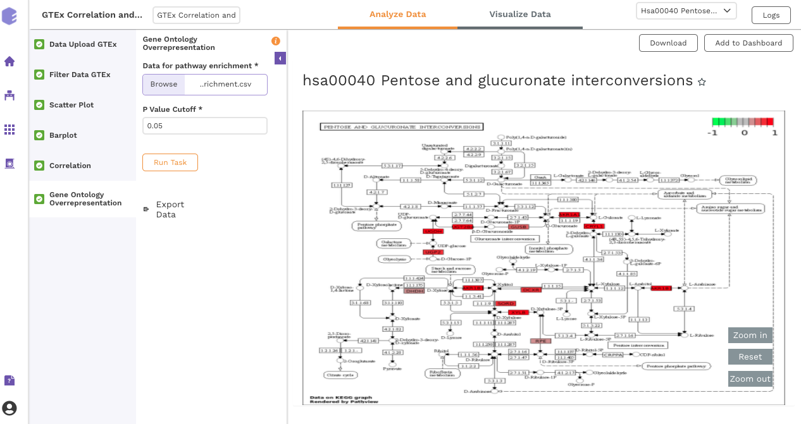 
 **Figure 16.** Enriched pathway maps 

### Dashboard

Data Studio lets you visualize your data with a variety of highly configurable charts and tables that can be [saved and added to dashboards](https://docs.elucidata.io/Apps/Data%20Studio/Data%20Studio.html#saving-a-chart), and customized as needed. The [Visualization Dashboard](https://docs.elucidata.io/Apps/Data%20Studio/Data%20Studio.html#visualizing-the-dashboard) provides an at-a-glance view of the selected visualization charts. The dashboard is [customizable](https://docs.elucidata.io/Apps/Data%20Studio/Data%20Studio.html#editing-a-dashboard) and can be organized to help you understand complex relationships in your data and create engaging and easy-to-understand reports. A template of the report can also be defined to generate the output.

The generated reports are interactive and can be seamlessly shared with team members and collaborators, enabling them to compare, filter and organize the exact data they need on the fly, in one report.

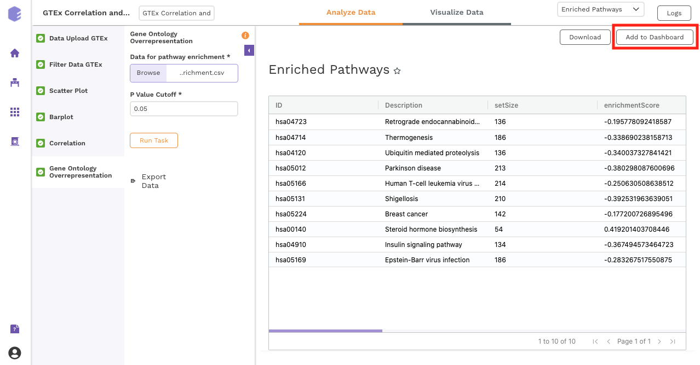 
 **Figure 17.** Adding data to the visualization dashboard 

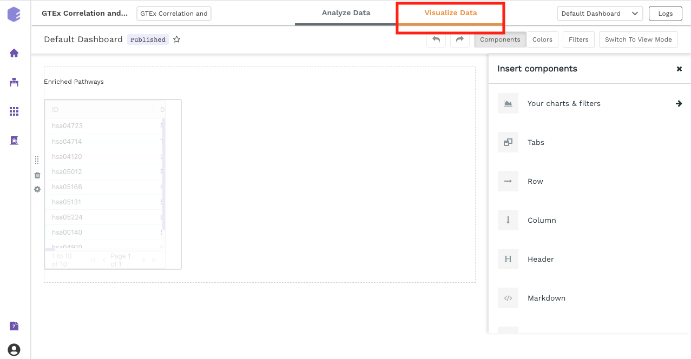 
 **Figure 18.** Visualization dashboard 

