#Introduction

##Overview

With the capability of rapid screening, large quantity of data is generated in a considerably short period of time and we subsequently need rapid extraction of biochemical significance from the heaps of data generated. High Throughput Drug Screening allows you to rapidly screen diverse compounds, by conducting chemical, genetic or pharmacological tests and provide key insights on active compounds, genes or antibodies that regulate the bio-molecular pathway of interest. The results obtained provide a deeper understanding and present a starting point for drug design.

##Scope of the app

*   Automates post-processing of your data output from high throughput sequencing experiments
*   Rapid visualizations of the results giving you insights about various drug-dosage combinations
*   Percentage proliferation vs concentration dosage for all the drugs in the library at a glance
*   Percentage proliferation difference vs concentration dosage selectivity plot for drugs and cell lines
*   IC50 values
*   Lethality estimation of all the drugs for the provided cell lines
*   Analyze the results for a drug individually
*   Download tabular representation of the post-processed results

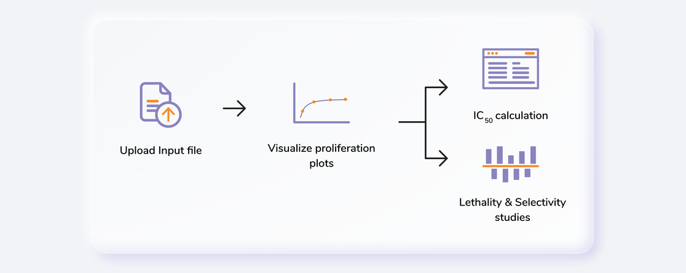 
**Figure 1.** High Throughput Drug Screening

#Getting Started

##User Input

High Throughput Drug Screening requires the following two files as input:

**RLU Sample Files**

RLU files are machine generated and should not be tampered with. The second sheet of the file contains all the valuable information that the app needs as shown in Figure 2.

 
**Figure 2.** Second sheet of RLU file

**Drug Key-Dosage Files**

Drug key-dosage file contains the information pertaining to the names of the drugs and their concentration values. It should contain only the drugs from one library i.e. for 40 drugs as shown in Figure 3.

 
**Figure 3.** Drug key-dosage file

##Steps in data processing

*   Upload input files
*   Performs visualizations for proliferation, IC50, lethality and selectivity values

##Caveats

*   The input file format has to be exactly same as the demo data.

#Tutorial

##Upload files

Select High Throughput Drug Screening Application from the dashboard under the *Screening and Sequencing Data* Tab.

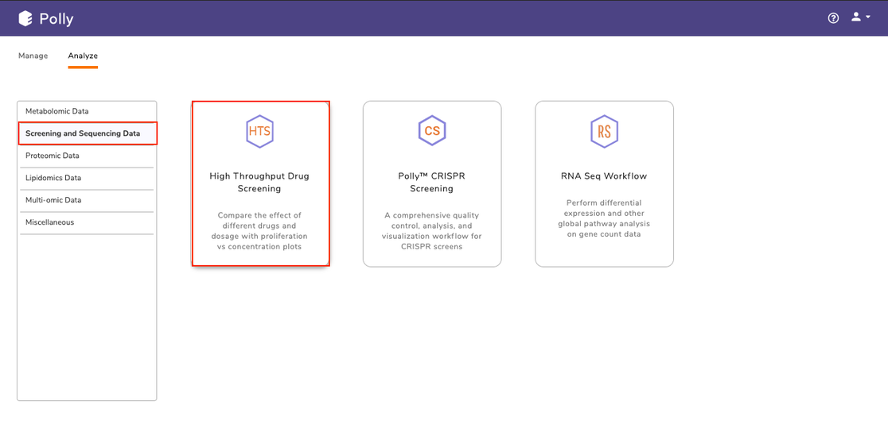 
**Figure 4.** Polly Dashboard

Create a *New Project* or choose the existing one from the drop down to be redirected to *High Throughput Drug Screening* application's upload page.

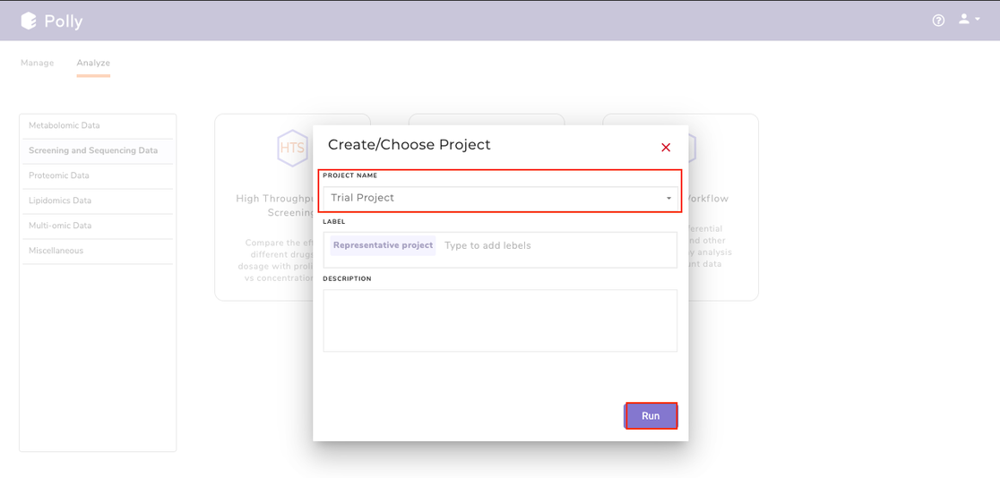 
**Figure 5.** Project Selection

Choose no. of cell lines from the drop down as shown in Figure 6.

 
**Figure 6.** Cell line selection

For each cell line:

*   Provide a name to your cell line
*   Click on the *Browse* option to select the input files files.
*   *Browse* option for replicate files provides multiple file selection option so that all your replicate files can be selected and added here.
*   Click on *Browse* to add metadata file in the metadata option. It allows only single file selection and only one metadata file would be added for one cell line.
*   Repeat steps 1-4 for other cell lines if selected.

 
**Figure 7.** File upload for cell line 1

Once all the input files are selected, click on *Go*. You will be able to see the information of the uploaded cell lines along with their input files at the top right section of the interface.

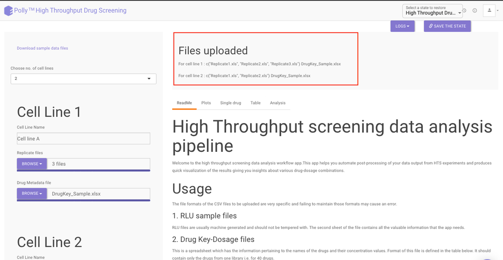 
**Figure 8.** Upload Interface

##Visualization Interface

Once the input files are uploaded in the side panel, the results are generated and the plots, single drug and table tabs are populated. To see the plots click on *Plots* present at the top.

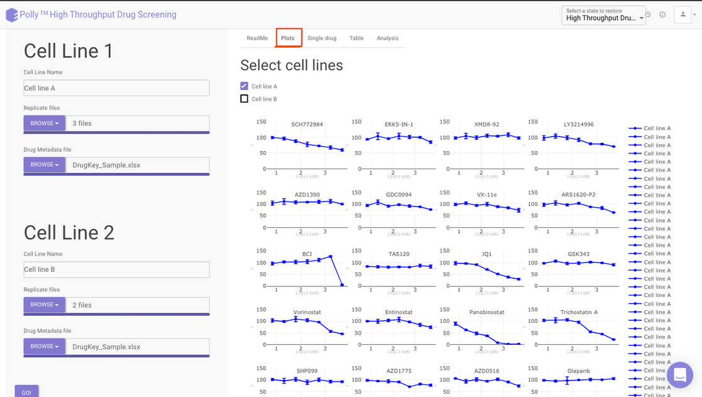 
**Figure 9.** Plot for percentage proliferation vs concentration dosage for all the drugs

Under the *Plots* tab, you can see the percent proliferation *vs* concentration dosage for all the drugs in the library at a glance. The x-axis represents the dosage concentration values in log10 of (nM) and the y-axis represents the percent proliferation.

Choose the desired cell line by clicking on the selection box present beside the cell lines a shown in Figure 10. You can choose multiple cell lines as well and their Percent proliferation *vs* concentration dosage information would be overlaid on the prior plots.

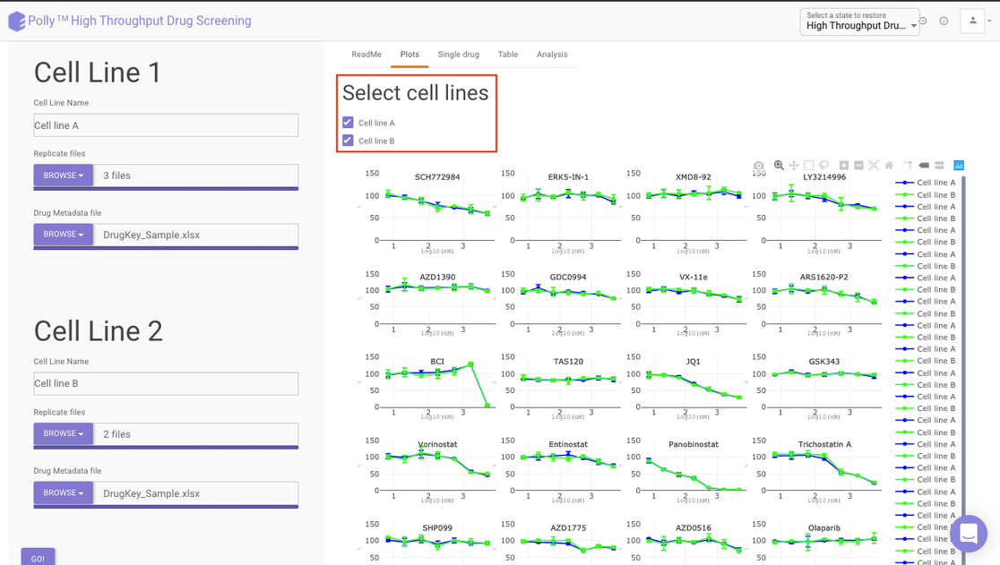 
**Figure 10.** Cell line selection on Plots interface

Within the plot, you can see the name of the drug at the top while different cell lines would be represented with different colors. To know the information of data points within the plot simply hover over the point you want to see.

To analyze the results for a single drug, click on the *Single Drug* present at the top and then select the cell line you want to analyze by clicking on the selection box beside it.

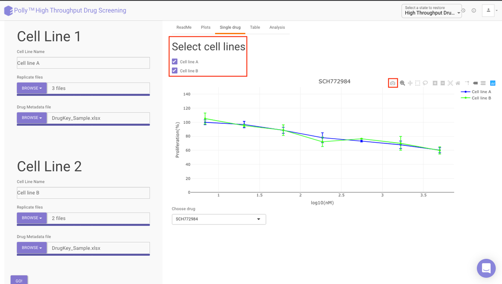 
**Figure 11.** Cell line selection at single drug interface

For selecting the drug, move to the bottom of the page to the *Choose drug* option and select the desired drug from the drop down. The plot would get updated as per your drug selection.

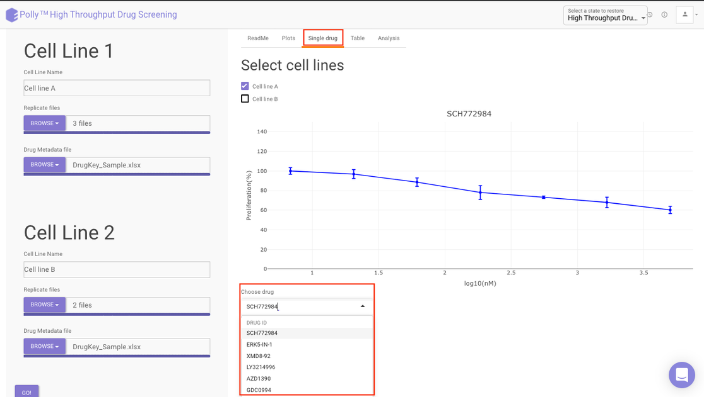 
**Figure 12.** Metabolite selection at single drug interface

##Post-Processing results

The results are available in a tabular format in the *Table* section. Choose your cell line to view the processed file of that cell line as shown in Figure 13.

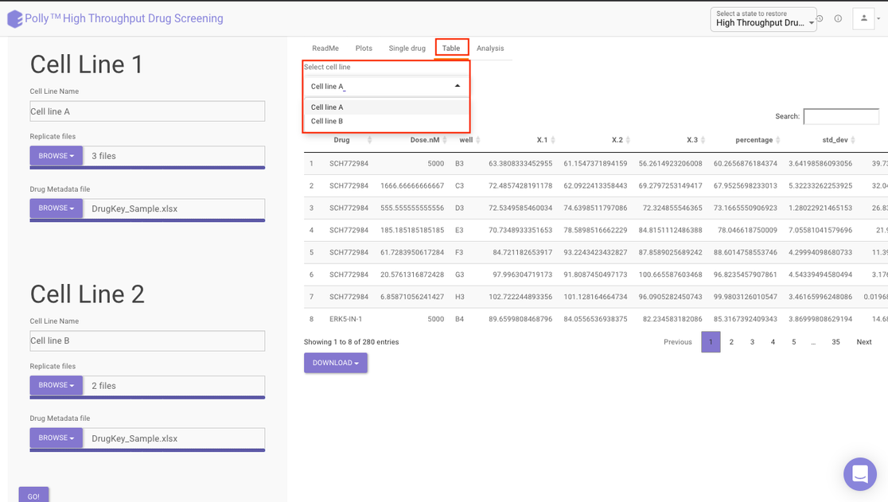 
**Figure 13.** Cell line selection for tabular results

##Analysis

The *Analysis* section provides further detailed insights in three sections:

**IC50:** The half maximal inhibitory concentration (IC50) is a measure of the effectiveness of a substance in inhibiting a specific biological or biochemical function. This quantitative measure indicates how much of a particular drug is needed to inhibit a given biological process (or component of a process, i.e. an enzyme or cell receptor) by half. According to the FDA, IC50 represents the concentration of a drug that is required for 50% inhibition in vitro.

Selecting a cell line from the drop down as shown in Figure 13 will display three different lists pertaining to the drugs that fall under the following categories:

*   Drugs with IC50 values in the given dosage range
*   Drugs with IC50 values lesser than the tested minimum dosage
*   Drugs with IC50 values greater than the tested maximum dosage

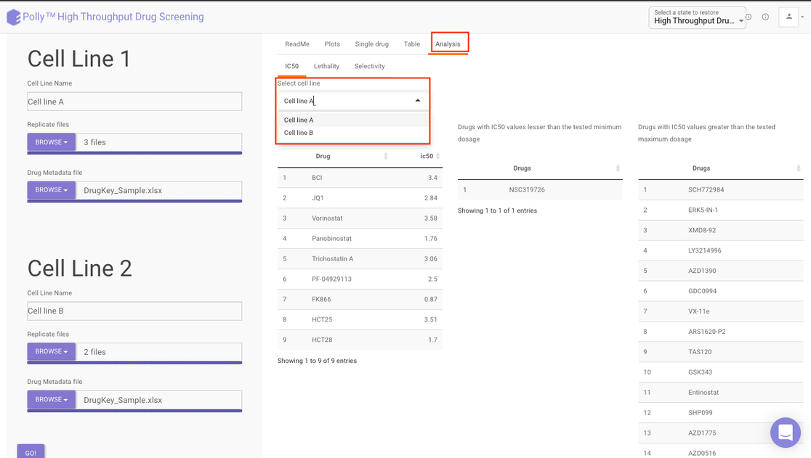 
**Figure 13.** IC50 Plot

**Lethality:** It offers an indication of the lethal toxicity for a given drug. It provides the degree to which a drug is harmful to a user or how capable it is of causing death.

The *Lethality* section provides a chart showing relative lethality of drugs for all the cell lines uploaded.

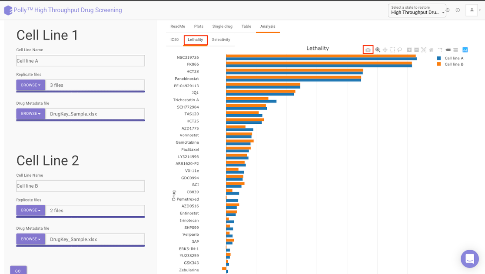 
**Figure 14.** Lethality Plot

**Selectivity:** It refers to a drug’s ability to preferentially produce a particular effect and is related to the structural specificity of drug binding to receptors. Drug selectivity is an important aspect and is used for evaluating the ADRs (Adverse Drug Reaction) of drugs.

The *Selectivity* section provides a percent proliferation difference vs concentration dosage selectivity plot.

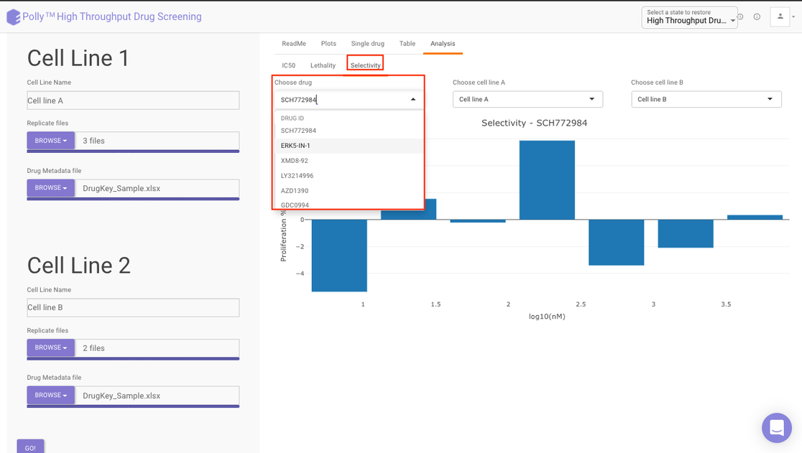 
**Figure 15.** Selectivity Plot

Select you desired drug as well as the cell lines to get the visualization as shown in Figure 16.

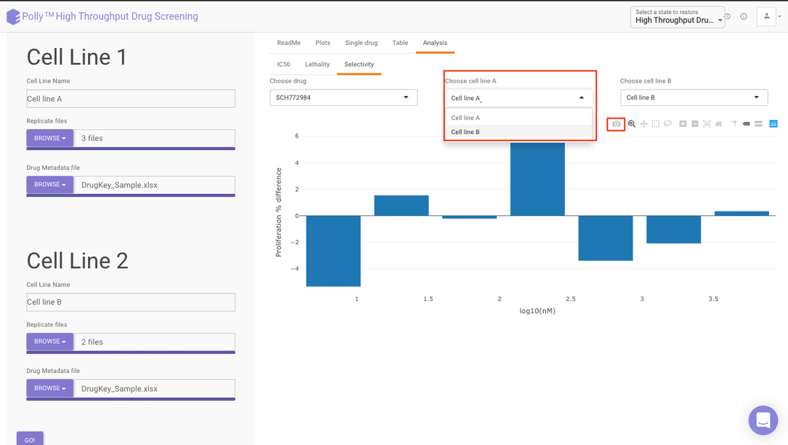 
**Figure 16.** Cell line selection for Selectivity

