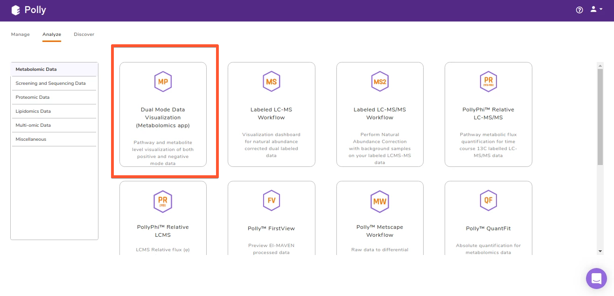
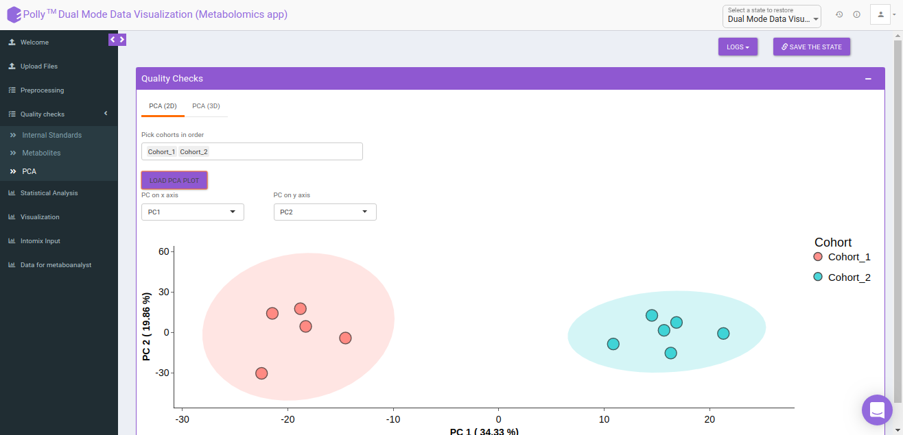

#Host Apps

Polly can host Shiny applications, other web applications, and desktop applications. This means all your applications can reside on a single platform and can be shared with your colleagues easily. The following are the advantages of hosting applications on Polly: 

*	Get the Shiny application to run locally and leave the rest to Polly.

*	The applications scale automatically on the Polly infrastructure for multiple users to use simultaneously.

*	Access to the application is controlled by Polly authentication. Only users in your organization with required Polly authorization can access the applications.

*	Have input and output data along with analysis stored at the same location in a Polly Workspace.

*	Share the analyses along with input and output data by simply sharing the Workspace. 

*	Additional benefits for Shiny apps

	*	Restorability: Polly provides an infrastructure to store a state of UI elements of the Shiny app. If any saved state has been restored, the app would redo the computations required to get back to the saved state automatically. 

#Shiny Applications

##Machine configurations available

The following are the machine configurations available on Polly for hosting shiny apps: 

| vCPUs | Memory (GBs) |
|-------|--------------|
| 1     | 2            |
| 2     | 4            |
| 2     | 6            |
| 2     | 8            |
| 4     | 4            |
| 4     | 8            |

If you need any other machine configuration, please contact us at [polly@elucidata.io](mailto:polly@elucidata.io).

##Languages Supported

We support various versions of R and Python for Shiny App development.

Versions of R available: 

*	3.5.2

*	3.6.0

*	3.6.1

*	3.6.2

Contact us at [polly@elucidata.io](mailto:polly@elucidata.io) in case you need a different version and we will add for you.

Versions of Python available : 

*	2.7.16

*	3.5.9

*	3.6.10

*	3.7.6

*	3.8.1

Contact us at [polly@elucidata.io](mailto:polly@elucidata.io) in case you need a different version and we will add for you.

The Shiny apps run on the base dockers maintained by Polly.

Custom dockers with other languages can also be used on Polly. To add custom dockers for Shiny apps, fill [this form](https://forms.gle/qsMxhxBAPsHHnqny6) and we will get back to you in a day with the docker ready on Polly.

[This gist](https://gist.github.com/GeorgeSabu/43d3e8437f4b745c96d29b433b9356ee) will help in getting the file dependencies that are required for docker building.

##Writing a Shiny Application

*	Packrat is used for R dependencies. Install packrat using the following command to avail all the Polly advantages.

	<pre><code>remotes::install_github("GeorgeSabu/packrat")</code></pre>

*	Install R dependencies required for Shiny Application using packrat by referring this documentation.

*	The mapping between the name of requirement files and the corresponding Python versions (check the Python versions supported by Polly) is mentioned here. Any Python dependency has to be added in the requirement files. 

	*	2.7.16 → requirements2.txt 

	*	3.5.9 → requirements3.5.txt

	*	3.6.10 → requirements3.6.txt

	*	3.7.6 → requirements3.7.txt

	*	3.8.1 → requirements3.txt

*	Install Shiny executing the mentioned command. Note that installation using this command will ensure that you get all the Polly benefits. 

	<pre><code>remotes::install_github("GeorgeSabu/shiny")</code></pre>

*	Write the Shiny application in the usual way.

##Hosting a Shiny Application on Polly

*	Share the Github or Bitbucket Repository with the Shiny Application with the organization `Elucidatainc`.

*	Mail the following details to [polly@elucidata.io](mailto:polly@elucidata.io)

	*	Name of the Application

	*	A brief description of the application (upto 255 characters)

	*	Link to the Github or Bitbucket Repo

	*	Memory (RAM) and Number CPUs required for the application

#Other Web Applications

Any web application that can be dockerized can be hosted on Polly.

Here are the steps to host Web Applications on Polly: 

*	Dockerize the Application and make sure that it runs locally.

*	Share the docker file through Github or Bitbucket with the organization `Elucidatainc`.

*	Mail the following details to [polly@elucidata.io](mailto:polly@elucidata.io)

	*	Name of the Application

	*	A brief description of the application (upto 255 characters)

	*	Link to the Github or Bitbucket Repo

	*	Memory (RAM) and Number CPUs required for the application

#Desktop Applications

Any desktop application that can be dockerized can be hosted on Polly.

Here are the steps to host Web Applications on Polly: 

*	Dockerize the Application using the base docker 
	
	<pre><code>mithoopolly/gui_desktop_base_apps:bionic</code></pre>.

*	To run the docker locally, execute the following command.

	<pre><code>docker run --privileged -p 8080:8080 --shm-size=1g <docker image></code></pre>

*	Share the docker file through Github or Bitbucket with the organization `Elucidatainc`.

*	Mail the following details to [polly@elucidata.io](mailto:polly@elucidata.io)

	*	Name of the Application

	*	A brief description of the application (upto 255 characters)

	*	Link to the Github or Bitbucket Repo

	*	Memory (RAM) and Number CPUs required for the application

**Note:**

*	To host Windows application on Polly, [wine](https://wiki.winehq.org/Ubuntu) can be used. [Here](https://bitbucket.org/elucidatainc/elmaven_on_web/src/master/) is an example repo of applications that have been hosted on Polly. 

