#Introduction

##Overview

Analysis of lipidomic data involves complex lipidome analysis. Lipidomics analysis across large sample sizes produces large datasets that require dedicated lipid identification, quantification and lipidome visualization. The wide diversity of native lipids and their modifications make their analyses challenging. Lipidomics Visualization Dashboard allows you to visualize, process and analyze the concentration data based on lipid species or classes along with sum of carbons and saturation type. The current version can calculate summary statistics, percentages and perform univariate analysis like ANOVA, Limma t-test along with Multivariate analysis like PCA. It helps you view lipids by their main class, sub class across cohorts.

##Scope of the app

*   Performs preprocessing on input data. 
*   Calculates lipid species concentration percentage for each lipid class and species across multiple cohorts.
*   Plots the lipid class and species concentrations and their percentages along with sum of carbons and saturation type in the form of pie charts and bar plots.
*   Performs PCA for quality check.
*   Performs differential expression using ANOVA or Limma t-test to find significant lipid species or class.
*   Analyze clustering profiles through a heatmap.

 
**Figure 1.** Lipidomics Visualization Dashboard

#Getting Started

##User Input

Lipidomics analysis requires the following two files as input: 

**Concentration File**

The concentration file is the data output from Lipidizer. The file should be in .xlsx format and must contain Lipids/ Fatty Acid concentrations sheet. 

 
**Figure 2.** Concentration file

**Metadata File**

The metadata file contains two columns, *Name* which contains all the samples used under study and *Cohort* which contains the cohort information for all the samples.

 
**Figure 3.** Metadata file

**Species Metadata File**

The *species metadata file* is optional. It is helpful to classify the lipid species the way you desire. It contains three main columns: *Species*, *Class* which contains all the lipid species, and class used understudy and *Chain* which contains the fatty acid chain information for each lipid species.

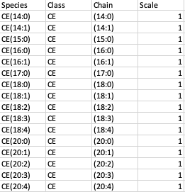 
**Figure 4.** Species Metadata file

##Steps involved in data processing

*   Upload input files
*   Perform preprocessing of data
*   Visualize input data based on lipid class or species, fatty acids or sum of carbons
*   Perform quality checks on your data
*   Perform differential expression using ANOVA or Limma t-test
*   Visualize data in the form of a heatmap 

##Caveats

* Lipidomics Visualization Dashboard only works with the output of SCIEX LipidyzerTM  Platform.

#Tutorial

##Upload Files

Select *Lipidomics Visulalization Dashboard* from the dashboard under the *Lipidomics Data* Tab.                              
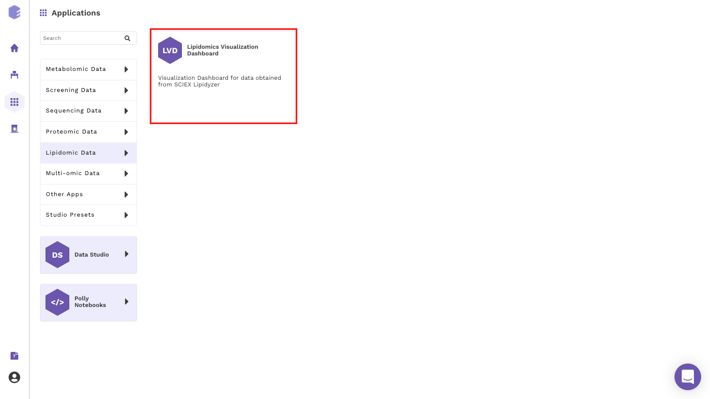 
**Figure 5.** Polly Dashboard

Create a *New Workspace* or choose the existing one from the drop down and provide the *Name of the session* to be redirected to *Lipidomics Visualization Dashboard's* upload page.

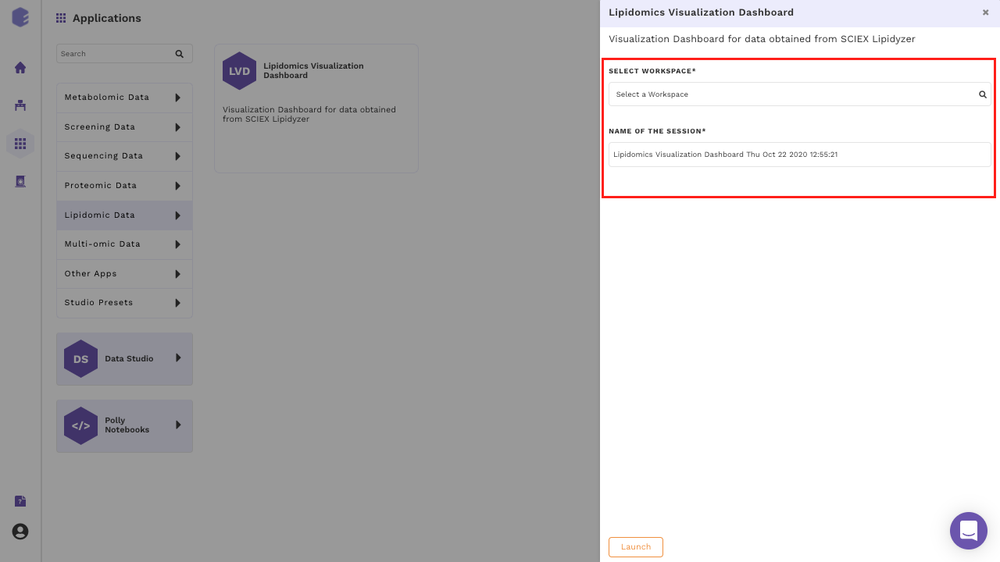 
**Figure 6.** Workspace Selection

##Upload Interface

Upload the concentration and metadata file in the upload space. You can chose to add species metadata file as well by selecting the checkbox. Once all the files are uploaded, click on *Go*. You can preview the uploaded raw data, metadata and species metadata. 

At the top, example files are available for download. You can either upload these example files or click on *Run Example* to automatically load the example data.

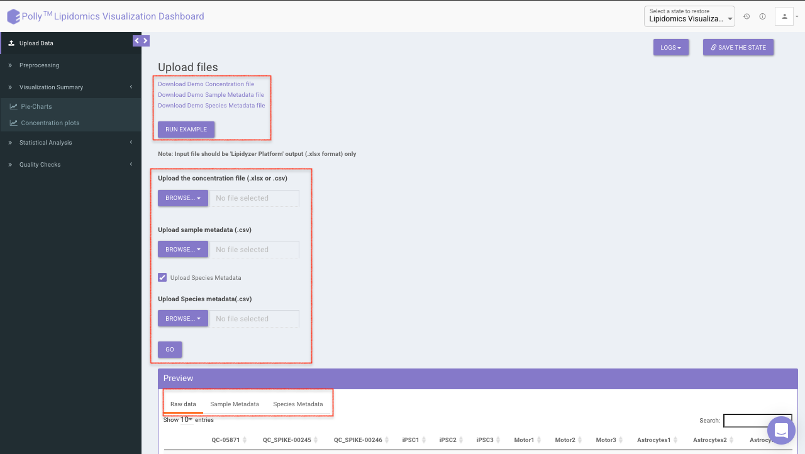 
**Figure 7.** Upload interface

##Preprocessing Interface

The Preprocessing interface allows you to perform a multitude of functions on the data such as:

 
**Figure 8.** Preprocessing Interface

*   *Drop Lipids*

This allows you to drop/remove unwanted lipids from further analysis. You can choose to drop lipids by their *Species* or *Class*. Select the lipid(s) from the drop-down menu and click on *Drop Lipids* to remove the selected lipids on the fly.

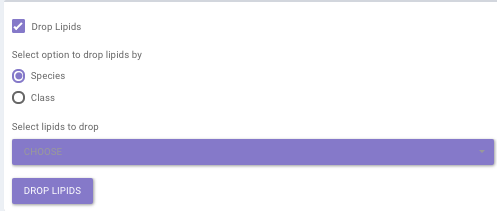 
**Figure 9.** Drop Lipids

*   *Drop Samples*

This allows you to drop/remove certain samples from further analysis which could be blank samples or any samples that didn’t have a good run during processing. Samples can be dropped by clicking on *Drop Samples* as shown in Figure 10 after selecting the sample(s) from the drop-down menu.

 
**Figure 10.** Drop Samples

#Visualization Interface

This interface contains two tabs which allows you to visualize data for concentrations across multiple cohorts using pie charts and bar plots. You can visualize summary of each lipid class as well as each lipid species.

##Pie-Charts

This interface allows you to visualize a summary of each

*  Lipid species

*  Fatty acids: Data is summarized by an individual fatty acid chain. For example “DAG(16:0/16:1)” fatty acid will be “DAG(FA16:0)” and “DAG(FA16:1)”

*  Sum of Carbons: Data is summarized by the total number of carbons within the lipid species. For example for “DAG(16:0/16:1)” the sum of carbons will be “DAG(32:1)”.

*Select Data Type* provides you the option to choose either of the above-mentioned options from the input excel file. 

*Select Cohort* allows you to select cohorts from the list of all cohorts for which the pie chart will be formed. You can select multiple cohorts for cross-cohort comparisons.

 
**Figure 11.** Pie Charts Interface 

*Saturation Type Summary Plot*

This plot allows you to view pie charts for selected cohorts, each representing portions of the saturation type within them.

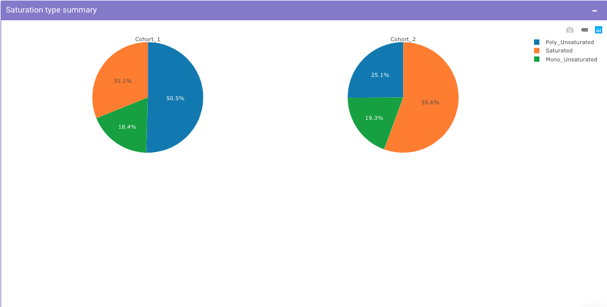 
**Figure 12.** Saturation Type Summary Plot

Select *Lipid Class* allows you to select the lipid class for which they can view the summary of lipid sub-class concentration percentages. *Select Cohort* allows you to select cohorts from the list of all cohorts for which the pie chart will be formed. You can select multiple cohorts to compare concentrations across cohorts a shown in Figure 9.

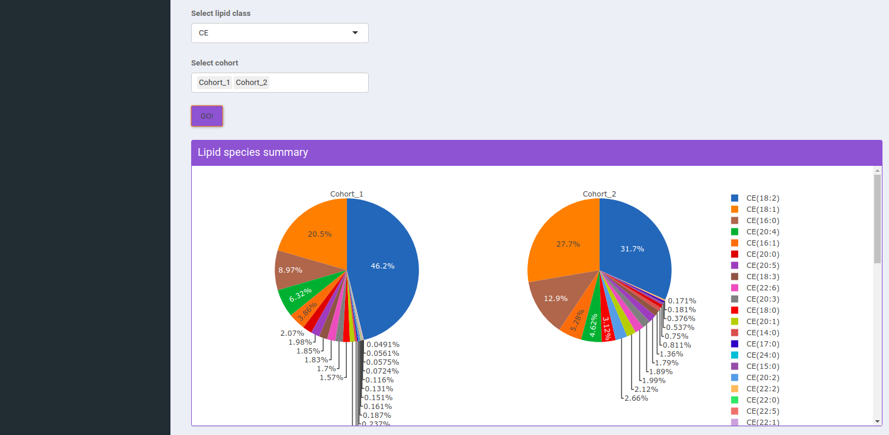 
**Figure 13.** Pie Charts Interface showing Lipid Species Summary

##Concentration Plots

These are the bar plots for the given concentration where the bars would be created by taking the mean value of samples within the cohort. It allows you to select the data type which includes lipid species, fatty acids, and sum of carbons from the input file. You can further select the lipid type from the Lipid Species, Lipid Class, and Saturation Type

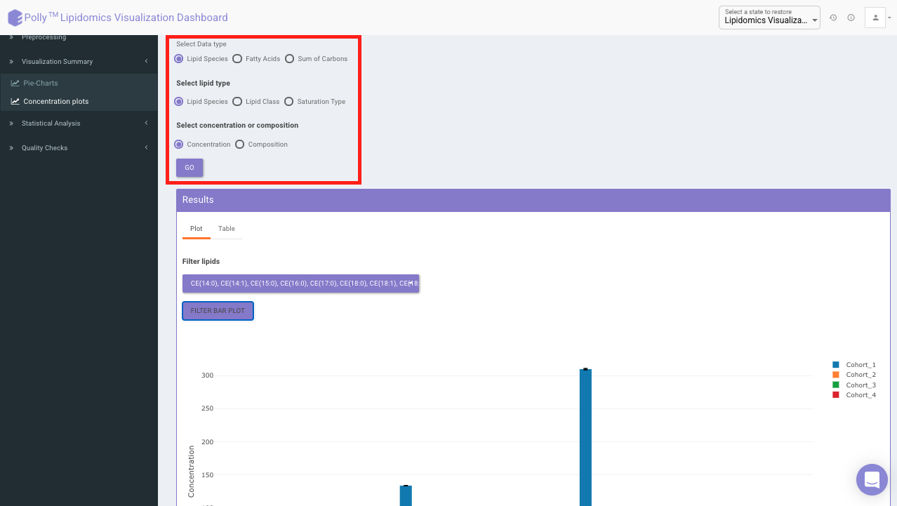 
**Figure 14.** Concentration plot interface

Filter lipids using the the drop down as showed in Figure 15. Multiple lipids can be selected simultaneously.

 
**Figure 15.** Filtering of lipids

**Note:**

*   Data selected by you will be taken as input for all the statistical analysis performed in other tabs.
*   Bar plot is based on the mean concentration values across each cohort.

Filter lipid class/species to visualize mean concentration values for those lipid classes/species only as shown in Figure 16.

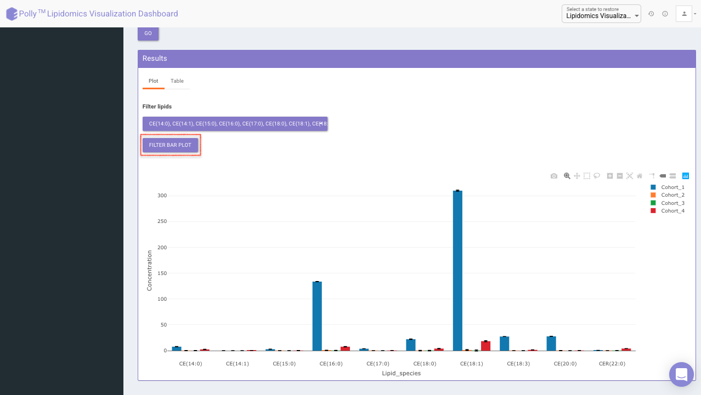 
**Figure 16.** Concentration plot of filtered lipids

Click on *Table* tab to visualize the respective data-table for individual sample concentration as shown in Figure 17.

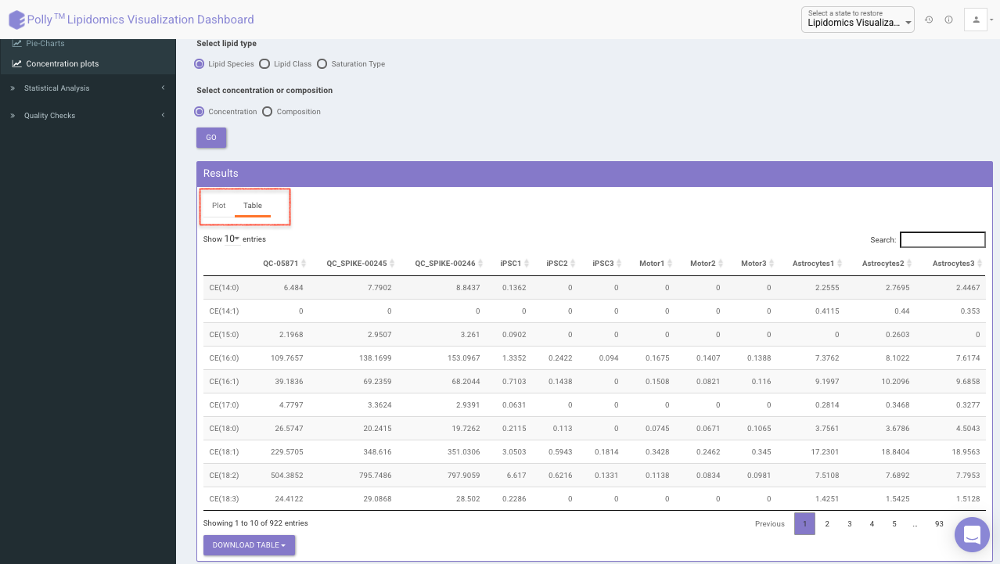 
**Figure 17.** Data table

#Statistical Analysis

##ANOVA Test 

*ANOVA Test* is used to identify the most significant lipid species/lipid classes. Here the results will be calculated based on the data selected in the previous tab (visualization summary) and results are displayed in a tabular format without pressing any button. You can sort any column from the data table and filter the ANOVA results based on a *p*-value cutoff value.

 
**Figure 18.** ANOVA Test results

##Limma t-test

Limma t-test helps to identify significant differentially expressed lipid classes/species between two cohorts. The cohorts to be used can be selected from the drop down menu's labeled *Cohort A* and *Cohort B*. 
Click on *Run Limma*  to perform differential expression and display the results in both volcano plot and tabular form.

 
**Figure 19.** Limma t-test results

The *p*-value and log2 fold change cutoff parameters can be changed to alter the volcano plot generated after clicking on *Filter Limma Results* for Volcano Plot as shown in Figure 16.

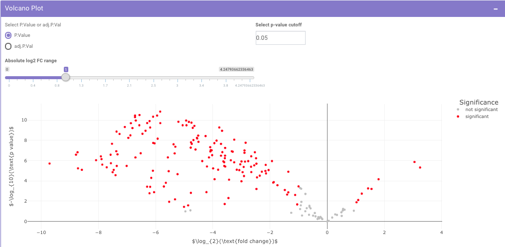 
**Figure 20.** Volcano Plot

*Filtered Differential Expression Table* contains only the metabolites that have significant *p*-values as specified.

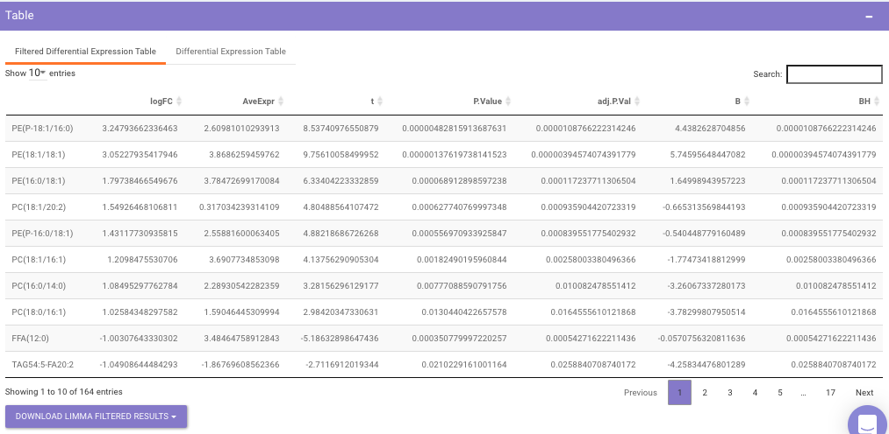 
**Figure 21.** Filtered differential expression table

*Differential Expression Table* contains all the differentially expressed metabolites without any filtering.

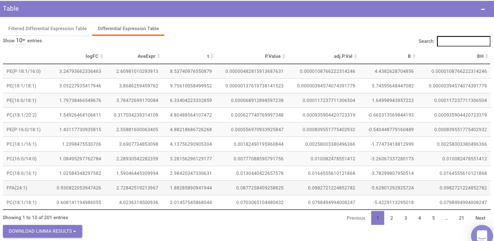 
**Figure 22.** Differential Expression Table

##Heatmap

A heatmap is a graphical representation of data where the individual values contained in a matrix are represented on a color scale. Click on *RESET HEATMAP* to generate the heatmap. Here the Heatmap will be based on the data selected in the previous tab (visualization summary).

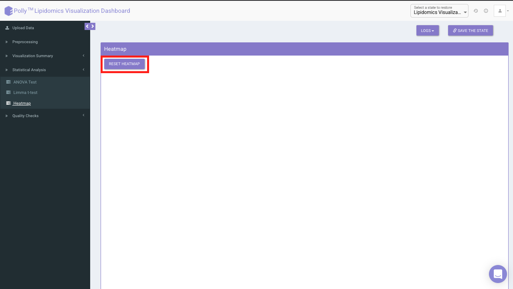 
**Figure 23.** Heatmap Interface

It would represent the selected data type corresponding to the number of samples in the data. The filter icon can be used to filter out the desired samples and lipids. Once the filter is applied, the heatmap containing the selected lipids and sample would be generated.

 
**Figure 24.** HeatMap

#Quality Checks

Principal component analysis (PCA) simplifies the complexity in high-dimensional data while retaining trends and patterns. It does this by transforming the data into fewer dimensions, which act as summaries of features. High-dimensional data are very common in biology and arise when multiple features, such as expression of many genes, are measured for each sample. PCA is an unsupervised learning method similar to clustering wherein it finds patterns without reference to prior knowledge about whether the samples come from different treatment groups or have phenotypic differences. PCA reduces data by geometrically projecting them onto lower dimensions called principal components (PCs), with the goal of finding the best summary of the data using a limited number of PCs. The first PC is chosen to minimize the total distance between the data and their projection onto the PC. The second (and subsequent) PCs are selected similarly, with the additional requirement that they be uncorrelated with all previous PCs. 

The PCA Plot interface allows visualizing PC1 to PC11 using the drop-down menu's labeled *PC on x axis* and *PC on y axis*. Select the PCs to visualize and click on *Run PCA* to generate the PCA plot.

*   PCA (2D) provides PCA visualization in a two-dimensional manner by selecting the PC values for *x-* and *y-* axes. It’s also possible to specify the cohort order for the plots.

 
**Figure 25.** PCA (2D) Plot

*   PCA (3D) provides PCA visualization in a three-dimensional manner by selecting the PC values for *x-*, *y-* and *z-* axes. It’s also possible to specify the cohort order for the plots.

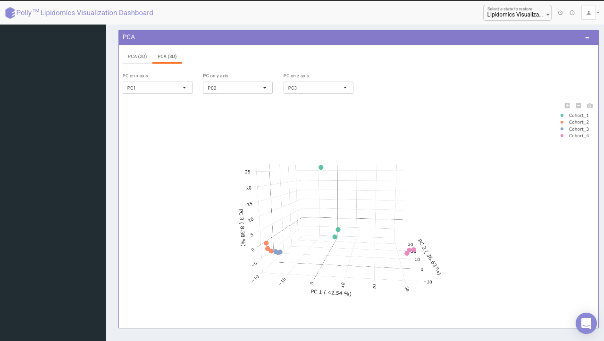 
**Figure 26.** PCA (3D) Plot

