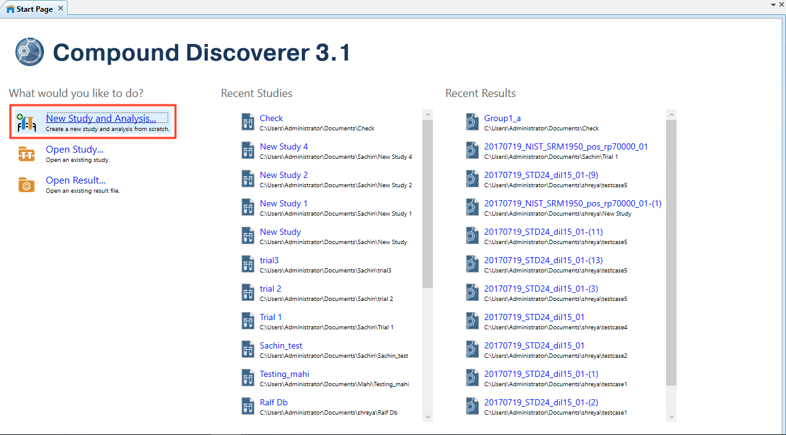
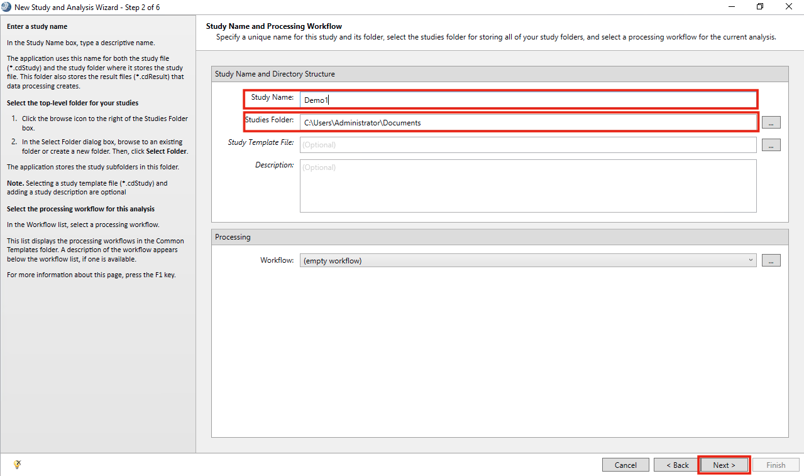
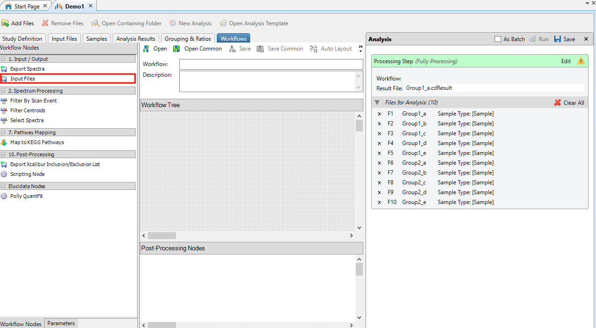
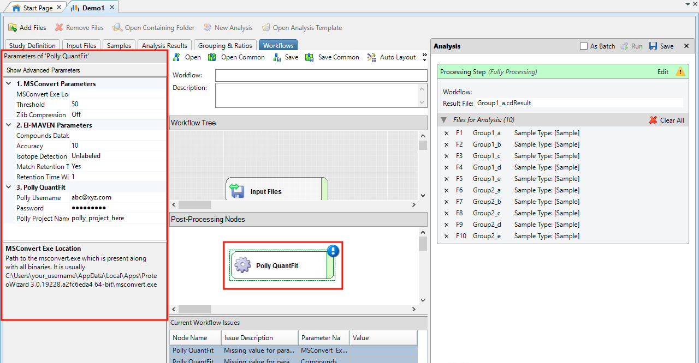

#Overview

We have used Thermo ScientificTM Compound DiscovererTM to set up a node for peak picking on raw data obtained from a thermo mass spectrometer. The absolute quantification is then derived for this data with the Polly QuantFit Node. The following tools were used in the process:

*   Thermo ScientificTM Compound DiscovererTM to set up a node for peak integration, and quantification
*   MSConvert for raw data conversion to an El-MAVEN accepted format
*   El-MAVEN to identify and automatically pick the significant peaks in the data
*   Polly QuantFit used for absolute quantification of data

##Pre Requisites

*   You should have Thermo ScientificTM Compound DiscovererTM version 3.1 to be able to use this Node
*   Thermo ScientificTM Compound DiscovererTM should not be running in the background when you are installing the Polly QuantFit Node
*   The path for MSConvert installation directory is **C:/Users/*UserName*/AppData/Local/Apps/Proteowizard/msconvert.exe**
*   **You should have an account on Polly**

##User Guide

Steps to set up a node in the Thermo ScientificTM Compound DiscovererTM:

*   Install the QuantFit Node from the installer [here](https://cd-polly-test.s3-ap-southeast-1.amazonaws.com/installers/PollyQuant.exe).

 <!-- 
**Figure 1.** Demo Data for PollyTM FirstView
 -->

**Thermo ScientificTM Compound DiscovererTM**

*   Open Thermo ScientificTM Compound DiscovererTM 3.1.
*   Select **New Study and Analysis**

 <!-- 
**Figure 1.** Demo Data for PollyTM FirstView
 -->

*   On **Begin a new Study** page, Click **Next**

 <!-- 
**Figure 1.** Demo Data for PollyTM FirstView
 -->

*   Add a **Study Name**, **Studies Folder** and click **Next**

 <!-- 
**Figure 1.** Demo Data for PollyTM FirstView
 -->

*   Click on **Add files**. Browse to the folder with all the **.raw** files and select them. Click **Finish**.

 <!-- 
**Figure 1.** Demo Data for PollyTM FirstView
 -->

*   Go to **Workflows**

 <!-- 
**Figure 1.** Demo Data for PollyTM FirstView
 -->

*   In **Workflow Tree** drag and drop **Input Files** from **Input/Output** within **Workflow Nodes**

 <!-- 
**Figure 1.** Demo Data for PollyTM FirstView
 -->

*   In **Post Processing Nodes** drag and drop **Polly QuantFit** from **Elucidata Nodes** within **Workflow Nodes**

 <!-- 
**Figure 1.** Demo Data for PollyTM FirstView
 -->

*   Click on **Polly QuantFit** in **Post Processing Nodes**

 <!-- 
**Figure 1.** Demo Data for PollyTM FirstView
 -->

*   The values corresponding to the parameters for conversion and filtering of data have to be entered within this node

    *   **MSConvert Parameters**
        *   **MSConvert Installation Directory:** It is likely to be at a location similar to **C:/Users/*UserName*/AppData/Local/Apps/Proteowizard/msconvert.exe**
        *   **Threshold:** A parameter defined in MSConvert to remove noise from the data.
        *   **Zlib Compression:** The converted files can be compressed to allow processing a larger number of files.  
         

    *   **El-MAVEN Parameters**
        *   **Compound Database:** It has the compound name, formula and retention time information. An example file is attached [here](https://drive.google.com/file/d/1ILGxoweqNC3JNbvgKxCLwCJEcYSEE0__/view).
        *   **Accuracy:** The resolution of the data defined in parts per million (ppm).
        *   **Isotope Detection:** You can choose to do a Labeled or Unlabeled peak detection. You can select the isotopes for which you would want to detect the peaks.
        *   **Match Retention Time:** You can choose to identify peaks for a metabolite at a particular retention time if you have defined the retention time in your compound database. If retention time is not present in your compound database, then please select "No" here.
        *   **Retention Time Window:** You can define a time range (in minutes) for the retention time in which you would want to detect a peak for a metabolite. E.g The retention time for **nicotinamide** is defined as **1.495 min** in the compound database. If you selected match retention time as **Yes** and defined the retention time window as **1 min** then peaks for nicotinamide would be detected in the time range **0.495 - 2.495 min**.  
         

    *   **Polly QuantFit**
        *   **Polly Username:** Enter the email id registered on Polly.
        *   **Password:** Enter the password for this account.
        *   **Polly Project Name:** Enter a new/existing Project name for your projects on Polly.  
         

*   Click on **Run** within **Analysis**

 <!-- 
**Figure 1.** Demo Data for PollyTM FirstView
 -->

*   The processing starts. On completion, you will receive an email on the Polly Email Address used in QuantFit Node. Open the email and click on **Start Quantification**.  

Click [here](../QuantFit/#metadata-interface) for a detailed documentation about Polly QuantFit.

**QuantFit Metadata Interface**

*   You will be redirected to **QuantFit Metadata Interface** on Polly
    *   Upload the **metadata** or create one for your dataset. Watch the demo video [here](https://www.youtube.com/watch?v=A37ra2Lh3yI) to create metadata.  

**Ion Efficiency Correction Interface**

*   This is a normalization method with respect to internal standards in the data. The concentration of biosamples is divided by the concentration of internal standards in the data here. You can also skip this step if you do not have internal standards.  

**Quantification Dashboard**

*   **Calibration Curve:** It gives you the fitted curve for your data on a linear equation by default. The fit details are shown on the panel, right of the curve.
*   **Concentration Plot:** It gives you the biosample concentration 
*   **Different Fit types:** You can also change the fit type from **linear** to **polynomial**, **exponential**, **log-log** or **power equation**.
*   **Removing Standards from data:** You can remove standards from the data to improve the goodness of the fit.
*   **Suggested Fits:** QuantFit also suggests good fits for your data with other fit types and standard rejection that can be used in further analysis by selecting the suggested fit as a **Default Fit**.
*   **Scaling:** Neutralize any internal dilution by scaling the data by any factor within the **Processed Data** tab.  

**Data Export to Thermo ScientificTM Compound DiscovererTM**

*   Click on **Export** on the QuantFit dashboard to export this data back to Thermo ScientificTM Compound DiscovererTM.
*   Go back to your analysis on Thermo ScientificTM Compound DiscovererTM and visualize your data by clicking on **Open Results** within **Job Queue**. This data can be used in further analysis.

 <!-- 
**Figure 1.** Demo Data for PollyTM FirstView
 -->
