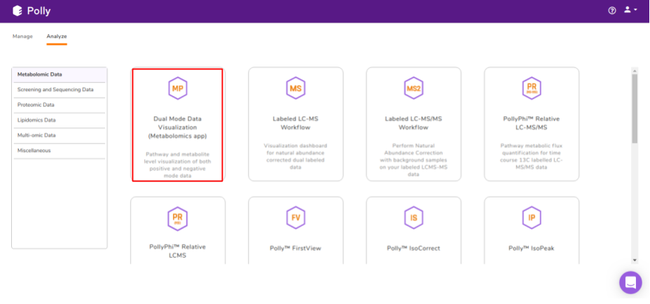
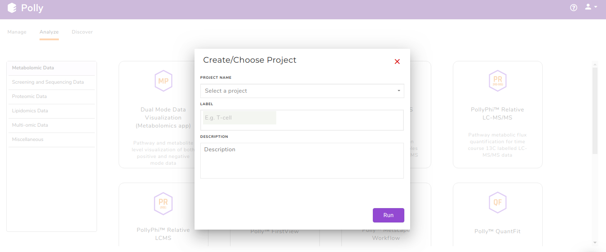
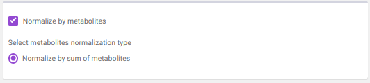
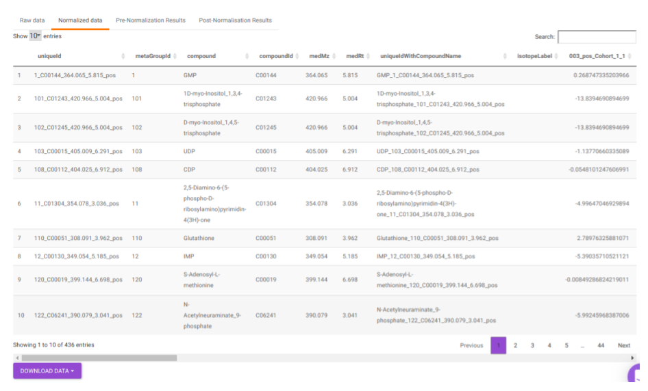
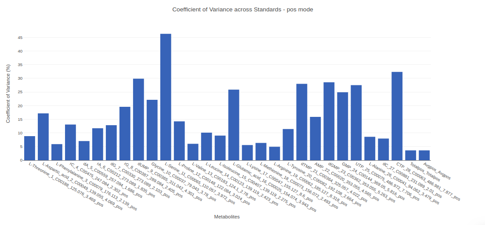
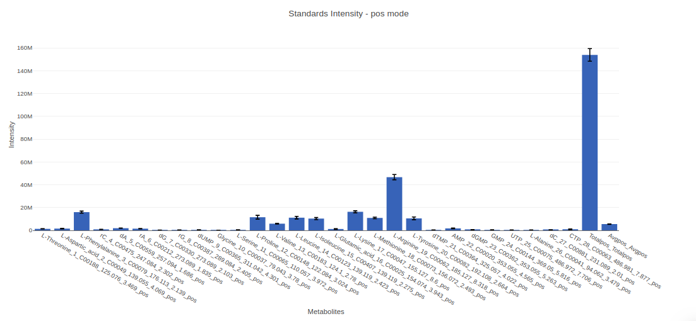
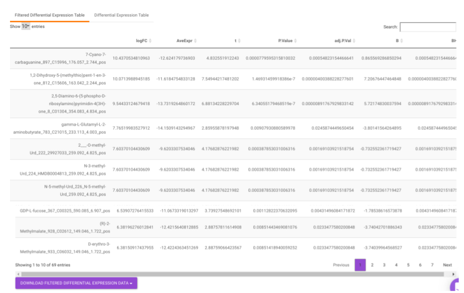
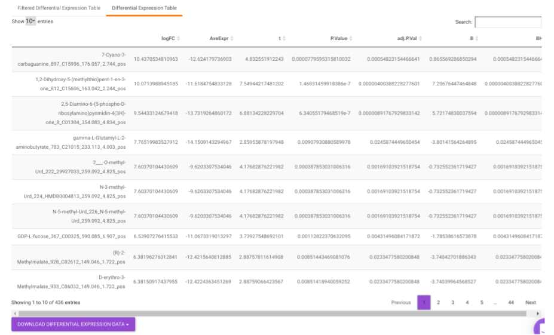

#Introduction

##Overview

Metabolomics is one of the key research areas focusing on small molecules present in a tissue or cell. The Dual Mode Data Visualization (Metabolomics App) allows you to perform downstream analysis on single mode (either positive or negative mode) as well as dual mode (both positive and negative mode) targeted, semi-targeted (without retention time) and untargeted metabolomics data along with insightful visualizations. You are provided with the option to upload either the data as a .csv file from [El-MAVEN](https://github.com/ElucidataInc/ElMaven/wiki) in the group summary matrix format along with the cohort mapping file or as a .gct file format, which contains both the data and metadata. The app provides you with a variety of normalization methods, scaling options and data visualization functionalities, thereby allowing an efficient analysis of the data to get actionable insights.

##Scope of the App

*   Processes negative and positive mode unlabeled LC-MS data together.
*   Works with .gct file format as well.
*   Performs normalization and scaling on the data.
*   Performs quality checks for internal standards, metabolites, and samples.
*   Performs statistical analysis using limma and provide interactive visualizations.

 
**Figure 1.** Dual Mode Data Visualization 

#Getting Started

##User Input

To process single mode data, the following files are required:

*   El-MAVEN Output File

 
**Figure 2.** El-MAVEN raw intensity file obtained using a compound database

*   El-MAVEN Internal Standards File (Optional)

 
**Figure 3.** El-MAVEN raw intensity file of internal standards

*   Cohort Mapping File

 
**Figure 4.** Cohort file

To process dual mode data, the following files are required:

*   El-MAVEN Output Files from both positive and negative mode

 
**Figure 5.** El-MAVEN raw intensity files for positive and negative modes

*   El-MAVEN Internal Standards File from both, positive and negative modes (Optional)

 
**Figure 6.** El-MAVEN raw intensity files for positive and negative modes of internal standards only

*   Cohort Mapping File

 
**Figure 7.** Sample-Cohort metadata file/center>

**NOTE:**

*   An already processed .gct file can also serve as input to the app.
*   The internal standard file is optional.

##Steps in data processing

*   Perform peak annotation on El-MAVEN
*   Prepare the cohort mapping file
*   Perform normalization and scaling on the data
*   View the quality checks for internal standards, metabolites and samples
*   Perform differential expression between two cohort conditions
*   Generate input for [IntOmix](../../Multi-omic Data/IntOmix) to identify significantly changing metabolic network modules between two experimental conditions

##Caveats

*   Single-Mode Data
    *   The metadata file should have at least two columns: *Sample* and *Cohort*. However, it might have additional columns to perform any specific normalization such as *Cell Number* etc.

*   Dual-Mode Data
    *   The metadata file should contain a cohort mapping for samples from both the negative and positive mode.
    *   It should have at least four columns: *Sample*, *SampleName\_neg*, *SampleName\_pos* and *Cohort*. However, it might have additional columns to perform any specific normalization such as *Cell Number* etc.
    *   The sample name should be exactly same between different input files
    *   *Sample* column denotes the new sample name that will be assigned to the specific sample from positive and negative mode after merging the data.

#Tutorial

Select *Dual Mode Data Visualization (Metabolomics App)* from the dashboard under the *Metabolomics Data* Tab as shown in Figure 7. Create a *New Project* to be redirected to Dual Mode Data Visualisation (Metabolomics App)'s upload page.

 
**Figure 8.** Polly Dashboard and Project selection

##Upload Files

The Upload Files interface allows you to upload the input files required for processing through the app which includes the group summary matrix files from El-MAVEN and metadata file, or a .gct file.

 
**Figure 9.** Upload Files Tab

*   *Download all sample files:* This option would allow you to download the demo files which include the El-MAVEN output in group summary matrix format and cohort mapping file.

*   *Upload GCT file:* Checking this box prompts the app that the input data is in the .gct format.

 
**Figure 10.** Upload Files Tab: *Upload gct file* option is checked

*   *Select mode:* This drop-down allows you to select the specific mode of the data in case of single mode, meaning whether it is:
    *   Positive, or
    *   Negative

 
**Figure 11.** Upload Files Tab for single-mode data: default view

To upload the output file of internal standards, click on *Upload internal standards file*.

 
**Figure 12.** Upload Files Tab for single-mode data: *Upload internal standards file* option is checked

*   *El-MAVEN positive/negative mode file:* This allows you to upload the positive/negative mode El-MAVEN output file (depending on the mode selected) in the .csv peak table format.

*   Internal Standards positive/negative mode file: This allows you to upload the positive/negative mode internal standards El-MAVEN output file (depending on the mode selected) in the .csv peak table format.

*   *Metadata file:* This allows you to upload the cohort mapping file in the .csv format.

*   *Data is dual mode:* Checking this box prompts the app that the input data is from dual-mode (positive and negative modes).

 
**Figure 13.** Upload Files interface for dual-mode data

To upload the output file of internal standards, click on *Upload internal standards file*.

 
**Figure 14.** Upload Files Tab for dual-mode data: *Upload internal standards* *file* option is checked

*   *El-MAVEN negative mode file:* This allows you to upload the negative mode El-MAVEN output file in the .csv peak table format.

*   *El-MAVEN positive mode file:* This allows you to upload the positive mode El-MAVEN output file in the .csv peak table format.

*   *Internal Standards negative mode file (optional):* This allows you to upload the negative mode internal standards El-MAVEN output file in the .csv peak table format.

*   *Internal Standards positive mode file (optional):* This allows you to upload the positive mode internal standards El-MAVEN output file in the .csv peak table format.

*   *Metadata file:* This allows you to upload the cohort mapping file in the .csv format.

Click on *Go* to proceed to the next step.

**Note:**

*   The format of the metadata file for dual-mode should be in a specific format.

##Pre-processing

The Pre-processing interface allows you to perform a multitude of functions on the data such as:

 
**Figure 15.** Preprocessing Tab

*   *Drop Samples:* This allows you to drop/remove certain samples from further analysis which could be blank samples or any samples that didn’t have a good run during MS processing. Samples can be dropped by clicking on *Drop Samples* as shown in Figure 16 after selecting the sample(s) from the drop down menu.

 
**Figure 16.** *Drop Samples* option

*   *Select Internal Standards:* This allows you to select the internal standard(s) from within the El-MAVEN output file when a separate internal standards file is not provided as input.

**Note:**

*   In case, the internal standard(s) are not in the El-MAVEN output file but in the separate internal standards file, they will not show up in the drop down menu. To select the desired internal standards, select them in *Normalize by individual internal standards* option under *Normalize by Internal standards* in the *Perform Normalization > Normalization*.

 
**Figure 17.** Selecting internal standards from the data

*   *Normalize by Internal standards* performs normalization using the internal standards.

 
**Figure 18.** Normalize by internal standards options

*   *Normalize by sum of internal standards* normalizes by the sum of the standards provided.

*   *Normalize by average of internal standards* normalizes by the average of the standards provided.

*   *Normalize by individual internal standards* normalizes by the internal standards selected previously.

*   *Normalize by metabolites* normalizes by any particular metabolite selected.

 
**Figure 19.** Normalize by metabolites option

*   *Normalize by sum of metabolites* normalizes by the sum of metabolites

*   *Normalize by metadata column* normalizes by any additional column specified in the metadata file. such as cell number etc.

*   *Normalize by control* normalizes by control samples present in the data.

 
**Figure 20.** Normalize by metadata options

*   *log2*

*   y + log2(x) [where data is shifted by max value of data plus one]

 
**Figure 21.** Scaling options

**Note:**

*   If internal standard(s) have already been selected in the *Select Internal Standards* option, they would be present in the drop down.

Clicking on *Run* will perform the normalization and scaling based on the parameters selected.

*   *Table:* This displays the data table and visualizations for both pre- and post- normalization.
    *   **Raw data:** This displays the raw El-MAVEN data uploaded. This data can be downloaded in the .gct format as shown in Figure 22.
    *   **Normalized data:** This displays the normalized El-MAVEN data based on the parameters selected. This data can be downloaded in .gct format as shown in Figure 23.
    *   **Pre-Normalization Results:** This allows you to have a look at the sample distribution with the help of density plot and box-plot before normalization as shown in Figure 24.
    *   **Post-Normalization Results:** This allows you to have a look at the sample distribution with the help of the density plot and box-plot after normalization. This provides you with the ability to check the effect of the normalization parameters on the data as shown in Figure 25.

 
**Figure 22.** Raw data table
  

 
**Figure 23.** Normalized data table
  

 
**Figure 24.** Pre-Normalization Results

 
**Figure 25.** Post-Normalization Results

##Quality Checks

This tab allows you to perform quality checks for the internal standards, metabolites and across samples with the help of interactive visualizations.

**Internal Standards**

It allows you to have a look at the quality of the internal standards used in the data with the help of the different visualizations for any individual as well as for all internal standards.

*   Internal Standards (All): You can visualize Coefficient of Variance, Standards Intensity, Standards Intensity-CoV across all the internal standards present in the data. For dual mode data, the plots will be displayed for the internal standards in negative and positive mode.

 
**Figure 26.** Coefficient of Variance across Standards plot

 
**Figure 27.** Standards Intensity plot

 
**Figure 28.** Standards Intensity-CoV *vs* Mean plot

*   Internal Standards (Individual): You can visualize the quality checks for any internal standard specifically. This allows you to select the internal standard by name, followed by another drop down to select by uniqueId of the feature. It’s also possible to specify the cohort order for the plots. For dual mode data, you can specify the internal standard of the particular mode from the *Select uniqueIds* drop down.

 
**Figure 29.** Internal Standards (Individual) options

 
**Figure 30.** CV Distribution across cohorts

 
**Figure 31.** CV Distribution across samples

*   Metabolites: It allows you to have a look at the quality of the metabolites present in the data with the help of the Coefficient of Variation plots

    *   Metabolites CoV Boxplot visualizes the Coefficient of Variation across different cohorts in the data in the form of the boxplot. It’s also possible to specify the cohort order for the plots as shown in Figure 32.
    *   Metabolites CoV Barplot visualizes the Coefficient of Variation as a quality check for any specific metabolite. To use this, select the metabolite followed by the unique id of the feature using the drop downs shown in Figure 32. It’s also possible to specify the cohort order for the plots as shown in FIgure 33.

 
**Figure 32.** Metabolites CoV Boxplot option and CV Distribution across Cohorts boxplot
 

 
**Figure 33.** Metabolites CoV Barplot

 
**Figure 34.** CV Distribution across cohorts for selected metabolite

 
**Figure 35.** CV Distribution across samples for the selected metabolite

**PCA**

This allows you to understand the clustering pattern between biologically grouped and ungrouped samples.

*   PCA (2D) provides PCA visualization in a two-dimensional manner by selecting the PC values for *x-* and *y-* axes. It’s also possible to specify the cohort order for the plots.

 
**Figure 36.** Two-dimensional PCA plot

*   PCA (3D) provides PCA visualization in a three-dimensional manner by selecting the PC values for *x-*, *y-* and *z-* axes. It’s also possible to specify the cohort order for the plots.

 
**Figure 37.** Three-dimensional PCA plot

##Statistical Analysis

This interface allows you to perform differential expression analysis with the aim to identify metabolites whose expression differs between any specified cohort conditions. The 'limma' R package is used to identify the differentially expressed metabolites. This method creates a log2 fold change ratio between the two experimental conditions and an 'adjusted' *p*-value that rates the significance of the difference.

 
**Figure 38.** Statistical Analysis interface

The following parameters are available for selection:

*   Select *Cohort A* and *Cohort B:* Default values are filled automatically for a selected cohort condition, which can be changed as per the cohorts of interest.
*   Select *p-val* or *adj. p-val*: Select either *p*-value or adj. *p*-value for significance.
*   *p-val* or *adj. p-val* cutoff: By default, the value is 0.05 but can be changed if required.
*   *log2FC:* Specify the cut-off for log2 fold change with the help of the slider.

Once the parameters are specified, click on the *Update* button to plot the volcano plot. Based on the parameters specified, a volcano plot is displayed. The volcano plot helps in visualizing metabolites that are significantly dysregulated between two cohorts.

 
**Figure 39.** Volcano plot

*Filtered Differential Expression Table* contains only the metabolites that have significant *p*-values as specified.

 
**Figure 40.** Filtered Differential Expression Table

*Differential Expression Table* contains all the differentially expressed metabolites without any filtering.

 
**Figure 41.** Differential Expression Table

##Visualization

This interface allows you to visualize the cohort-based distribution of a specific metabolite or a group of metabolites on the basis on its normalized intensity values.

 
**Figure 42.** Visualization tab options

*   *Enter metabolite:* Select the metabolite(s) of interest from the drop down option.
*   *Select uniqueIds:* You can specifically select the metabolic feature of interest for the metabolite from the drop down option.
*   *Select order of cohort:* You can also specify the particular order of the cohort to visualize the bar plot.

Once the parameters are selected, click on *Load Plots* to plot the bar plot for the metabolite.

 
**Figure 43.** Cohort-wise bar plot with the normalized intensity of selected metabolite

##IntOmix Input

This tab allows you to generate the input for [IntOmix](/IntOmix/#tutorial) where you can visualize the significantly altered metabolic network modules between any two experimental conditions.

 
**Figure 44.** IntOmix Input Tab options

Specify two or more cohorts from the *Select cohorts* drop down option for which you want to generate the IntOmix input. Once the required cohorts are selected, click on *Generate* to generate the IntOmix input.

 
**Figure 45.** IntOmix Table for the cohort conditions specified

**NOTE:**

*   At least two cohorts are required to create the input file.

##Data for MetaboAnalyst

This tab allows you to generate the input for MetaboAnalyst that enables statistical, functional and integrative analysis of metabolomics data by providing a variety of modules for different functionalities.

 
**Figure 46.** *Data for MetaboAnalyst* Tab options

Specify the cohort comparison of interest by sleecting the cohorts from the *Select cohort A* and *Select cohort B* drop downs. Click on *Download data for metaboanalyst* to download the .csv file. Clicking on *Go to metaboanalyst* will redirect you to MetaboAnalyst’s homepage.

**NOTE:**

*   Normalized intensity data (normalization method chosen in pre-processing tab) is downloaded.
