#Introduction

##Overview

Quantification of pathway activity with metabolic flux studies has become an integral part of understanding cellular phenotypes and mechanisms of action. Labeled studies with isotope tracers have emerged as key protocols to gain a deeper understanding of cellular metabolism. Processing and analysis of labeled LC-MS data follows a two-part protocol beginning with peak curation followed by downstream analysis. In this workflow, peak curation is performed using [El-MAVEN](https://resources.elucidata.io/elmaven). Peaks curated using automated peak picking on El-MAVEN can be pushed directly to Phi Relative LC-MS app using the built-in integration. The Phi Relative Labeled LC-MS app allows you to process labeled LC-MS targeted data with insightful visualizations. The application performs natural abundance (NA) correction and provides fractional enrichment, pool totals and NA corrected intensity visualizations across selected cohorts.

##Scope of the App

*   Raw data to visualizations in less than 5 minutes.
*   Process high-resolution and low-resolution data of up to 100 samples.
*   Analyze single labeled 2D, 13C, 15N and 34S data.
*   Automated peak picking with manual curation.
*   Quality Check of samples to identify and reject outliers.
*   Perform NA Correction, calculate Fractional Enrichment and Pool Total values.

 
**Figure 1.** El-MAVEN Phi Relative LC-MS workflow

#Getting Started

##User input

El-MAVEN Phi Relative LC-MS requires two types of files:

**Raw MS files**

These files are instrument generated and can be in different formats such as:

*   .RAW (Thermofisher)
*   .RAW (Waters)
*   .d (Agilent)
*   .d (Bruker)
*   .wiff (ABSciex)

**Compound Database**

Compound database is a .csv file that consists of two mandatory columns, *compound* which contains metabolite names and *formula* which contains the metabolite formula. Additionally, you can add the HMDB or KEGG ID in the column *id* or retention time in the column *rt* if known. Any other information present in this file is ignored by El-MAVEN and PollyPhiTM Relative LC-MS.

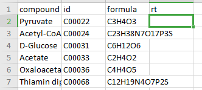 
**Figure 2.** Compound Database 

##Steps involved in data processing

*   Convert instrument specific files to .mzML or .mzXML format using MSConvert
*   Perform peak annotation in El-MAVEN
*   Push data to PollyPhiTM Relative LC-MS using the built-in integration
*   Visualize fractional enrichment, pool total and NA corrected intensity plots for each metabolite across cohorts
*   Visualize PCA and Correlation Plot and remove outliers if any
*   Visualize EIC and reject metabolites or specific labels if required

#Tutorial

##[MSConvert](http://proteowizard.sourceforge.net/download.html)

MSConvert is a command-line/ GUI tool that is used to convert between various mass spectroscopy data formats, developed and maintained by ProteoWizard. Raw data files obtained from mass spectrometers need to be converted to certain acceptable formats before processing in El-MAVEN. msConvert supports the following formats:

*   .mzML
*   .mzXML
*   .RAW (Thermofisher)
*   .RAW (Waters)
*   .d (Agilent)
*   .d (Bruker)
*   .wiff (ABSciex)

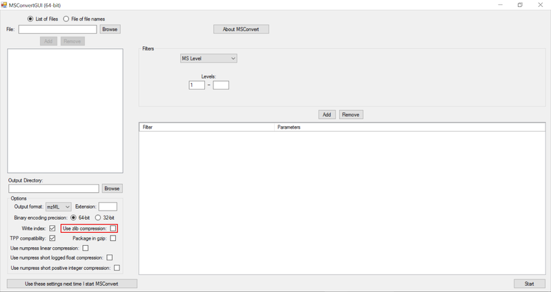 
 **Figure 3.** MSConvert GUI 

**NOTE:**

*   Zlib compression is enabled by default in msConvert. El-MAVEN now supports Zlib compression.

##El-MAVEN

Once sample files are ready for processing, launch El-MAVEN. El-MAVEN consists of a sample space and EIC window as shown in Figure 4.

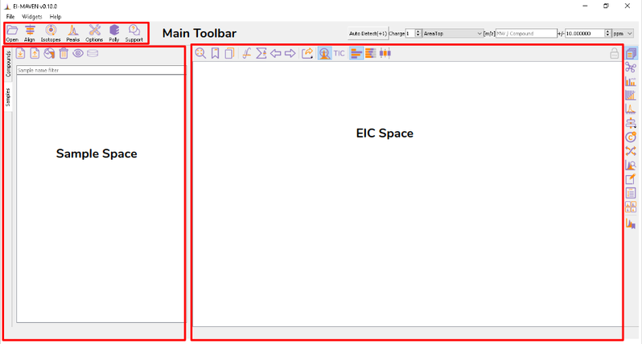 
 **Figure 4.** El-MAVEN UI

**Load Samples and Compound Database**

You can load the sample by going to *Load Samples|Workspaces|Peaks* option in the Sample space menu. Then navigate to the folder containing the sample data and select all .mzXML or .mzML files. A loading bar displays the progress at the bottom. When the samples have loaded, you should see a sample panel on the left side. If it is not displayed automatically, click on the Samples Widget button on the widget toolbar. El-MAVEN automatically assigns a color to every sample. You can select/deselect any sample by clicking the checkbox on the left of the sample name or completely remove it from the *Remove sample* option. To mark samples as blank, click on the *Mark the Blanks* icon in the *Samples* menu. This will change the color of the marked samples to black to easily differentiate them from other samples. Multiple blanks can be marked together.

 
 **Figure 5.** El-MAVEN toolbars 

 
 **Figure 6.** After uploading the samples 

To load the compound database, click on *Compounds* tab in the sample space, import standard database file from Library Manager, select the appropriate .csv file.

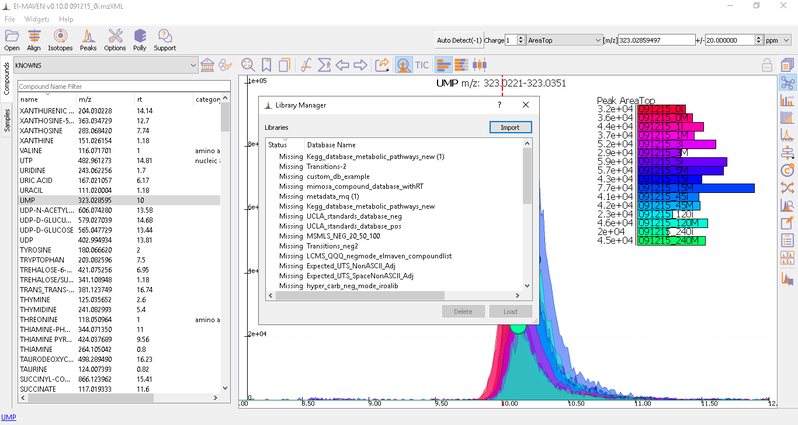 
 **Figure 7.** Uploading compound database

**Adjust Global Settings**

Global Settings can be changed from the *Options* dialog. There are 9 tabs in the dialog. Each of these tabs has parameters related to a different module in El-MAVEN.

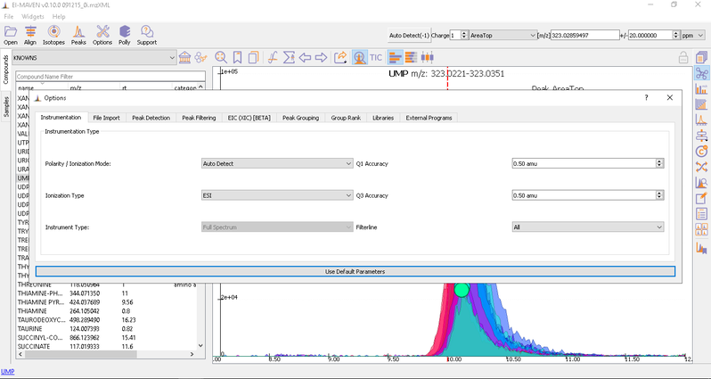 
 **Figure 8.** Options dialog 

You have an option to set *Ionization* mode to *Positive, Negative or Neutral* on the top left corner.

The *[m/z]* option scans the groups to find any specific m/z value and plot its corresponding EIC. The *+/-* option to its right is to specify the expected mass resolution error in parts per million (ppm).

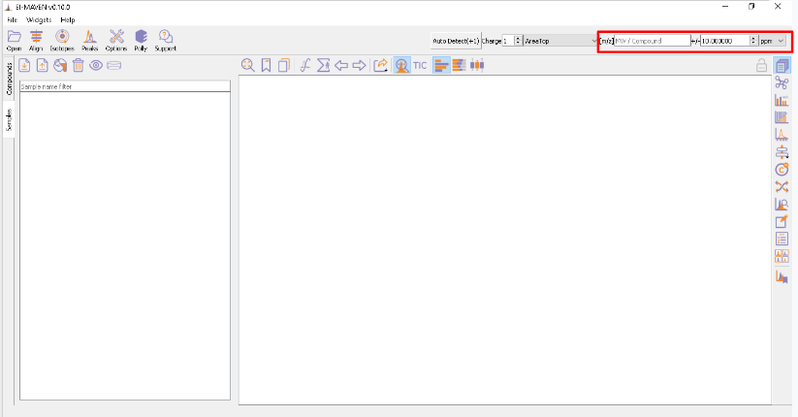 
 **Figure 9.** Set m/z value 

**Alignment**

Prolonged use of the LC column can lead to a drift in retention time across samples. Alignment shifts the peak RTs in every sample to correct for this drift and brings the peaks closer to median RT of the group. *Alignment visualization* can be used to judge the extent of deviation from median RT.

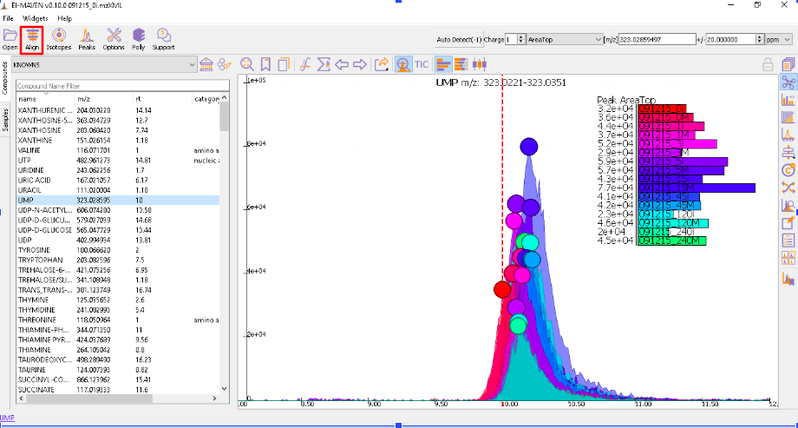 
 **Figure 10.** Peaks before alignment 

In the above visualization, each box represents a peak from the selected group at its current RT. Samples are said to be perfectly aligned when all peak boxes lie on the same vertical axis. The peaks are considerably scattered in the above image and therefore the samples should be aligned for better grouping of peaks. Pre-alignment, the peaks were scattered while the aligned peaks lie nearly on the same axis.

You can run alignment again with different parameters if required. Alignment settings can be adjusted using the *Align* button. This example was set to OBI-Warp algorithm.

 
 **Figure 11.** OBI-Warp Algorithm 

Post-alignment the peaks in the group should appear closer to the median RT of the group.

 
 **Figure 12.** Peak group after alignment 

Watch the demo video below for more information.

    <iframe src="https://www.youtube.com/embed/Zu5N1Vawrm4" frameborder="0" allowfullscreen style="position: absolute; top: 0; left: 0; width: 100%; height: 100%;"></iframe>

 

**Isotope Settings**

If the samples are labeled, check on *Report Isotopic Peaks* and select the isotopic tracer and set the parameters for isotope filtering.

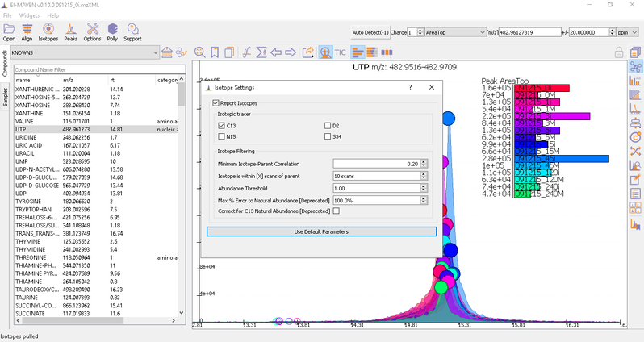 
 **Figure 13.** Isotope selection 

**Peak Curation**

Generally there are two broad workflows to curate peaks in El-MAVEN:

*   **Manual Peak Curation using Compound DB widget**: To use manual curation using the compound DB widget, you have to iterate over all the compounds in the compound DB, as highlighted in the images below.

 
 **Figure 14.** Compound selection 

Once on a compound, El-MAVEN shows the highest ranked group for that m/z. you can now choose a group or reject it. You can read more about the bookmarks table [here](https://github.com/ElucidataInc/ElMaven/wiki/Introduction-to-ElMaven-UI#5-eic-window).

 
 **Figure 15.** Double click on peak group to get details on Bookmark table 

*   **Automated Peak Curation:** Clicking the *Peaks* icon on the top opens the Feature Detection Selection dialog. For Labeled LC-MS analysis, check on *‘Compound Database Search’* algorithm. In case compound database has the RT information, you can check on *Match Retention Time* option. In the Group Filtering dialog, you can set the parameters by using the slide bar.

 
 **Figure 16.** Automated peak detection 

 
 **Figure 17.** Group filtering dialog 

After setting the parameters, click on Find Peaks. You can read more about the peak detection settings [here](https://github.com/ElucidataInc/ElMaven/wiki/Introduction-to-ElMaven-UI#peak-detection).

##El-MAVEN Phi Relative LC-MS Integration

**Export data to Phi Relative LC-MS**

You can push the curated data to the cloud with the Polly Widget for the labeled LC-MS workflow. Click on th ewidget and enter your Polly credentials to create a folder on Polly to export files.

 
 **Figure 18.** Peak Table 

After curating the detected metabolites, go to option to export the data directly to *PollyPhi*.

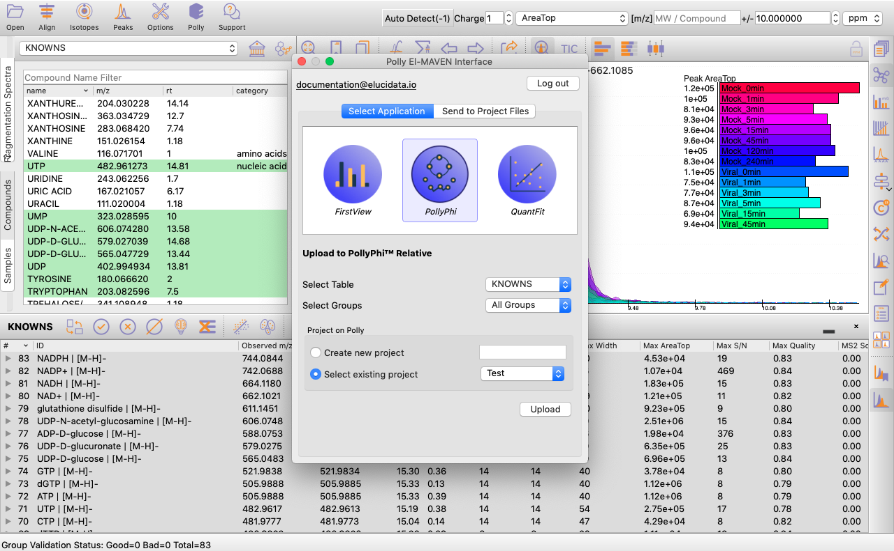 
 **Figure 19.** El-MAVEN Phi Interface 

You can select the peak table and/or create a new workspace to be pushed to PollyPhi for Flux analysis and hit on *Upload*. This will take a while. Click on Start Fluxing. After giving the command to upload, you would receive an email containing the link to the analysis which can be accessed anytime. After clicking on *Start Fluxing*, you will be redirected to the GSheet interface where cohort information has to be entered.

 
 **Figure 20.** Automated email with analysis link 

 
 **Figure 21.** GSheet Interface 

**Visualization Interface**

After this, you will land on the *Visualization Interface*. This interface allows you to visualize NA Corrected Intensities, Fractional Enrichment and Pool Total values.

*   You can switch between the metabolites from the metabolite carousel at the top of the interface.
*   You can remove any isotopologues they don’t wish to visualize from the plots by clicking on the label.
*   You can visualize the position of the metabolite on the metabolism pathway. If HMDB ID is not provided or not detected, you will the see complete central carbon metabolism pathway.
*   You can select cohorts for visualization by clicking on the *Settings* icon present on the top right corner.

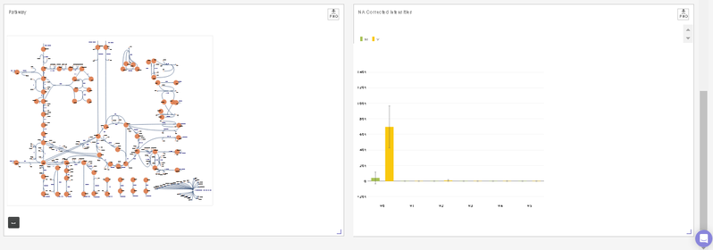 
 **Figure 22.** Visualization interface 

**Quality Check Interface**

This interface allows you to visualize sample outliers with the help of a PCA (Principle Component Analysis) plot and a Correlation Plot.

 
 **Figure 23.** QC Interface 

To reject any outliers, you can hover over the data points and click on *Remove Sample*. To apply this change, click on *Update* towards the bottom right of the screen upon which the outliers will be removed from the quality check plots and the subsequent analyses as well.

Below the plots, you can view the list of the samples that have been rejected. The rejected samples can be added back to the plots and the subsequent analyses by clicking on the cross icon present alongside each sample. To finalize this selection, click on *Update* towards the bottom right of the screen upon which the outliers will be added back to the plots and the subsequent analyses as well.

**Peak Picking Interface**

After annotating peaks, a new window with the list of detected metabolites their peaks and intensities are shown. You can click on any metabolite and find the peak of interest in EIC. Hover on any peak to view its *Sample Name*, *Quality*, *Retention Time* and *Intensity*.

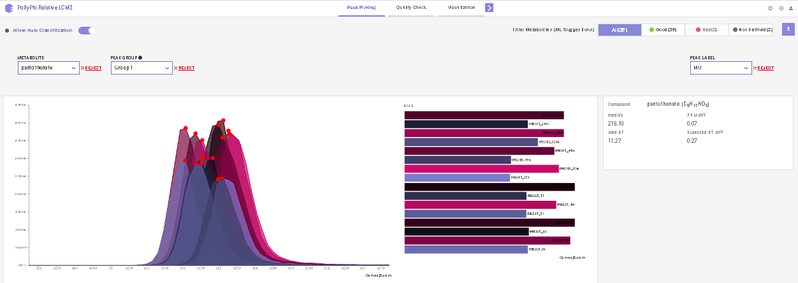 
 **Figure 24.** Peak picking Interface 

This interface allows you to visualize the EIC plot and reject metabolites or isotopologues with erroneous peaks. You can visualize EIC plot by selecting the metabolite of interest from the metabolite drop down. EIC plot of a particular isotopologue can be visualized by selecting the label from the list of labels. You can reject an erroneous peak by clicking on *Reject Label*. All isotopologues of a metabolite can also be rejected by clicking on *Reject Metabolite*. To accept a rejected isotopologue or a metabolite by clicking on *Accept Label* or *Accept Metabolite* respectively.

**Note:**

*   Label M0 corresponds to C12 PARENT, M1 to C13-label-1 and so on.

##Frequently Asked Questions (FAQs)

| **S.No.** | **Questions** | **Answers** |
| --- | --- | --- |
|1.| **My files are not in .mzXML or .mzML format. What should I do?** | You can easily convert your raw files to .mzXML or .mzML using MSConvert.|
|2.| **What is the compound database?** | The compound database is a .csv file which contains the metabolite of interest and their formulas. It can also contain retention time and KEGG/HMDB ID's though they are not mandatory.|
|3.| **Can I use El-MAVEM Phi Relative LC-MS to analyze unlabeled data?** | No. El-MAVEN Phi Relative LC-MS is built to analyze labeled data.|
|4.| **Can I use public datasets on El-MAVEN Phi Relative LC-MS?** | Yes. All you need is to convert the instrument specific raw files to .mzXML or .mzML format and a compound database.|
|5.| **Can I check the quality of my samples in El-MAVEN Phi Relative LC-MS?** | Yes. you can check quality of your dataset using PCA and Correlation Plot.|
|6.| **Can I reject any metabolites from the analysis?** | On the Peak Picking Interfac, click on *Reject Metabolite* to reject any particular metabolite from your analysis.|
|7.| **Can I reject any label of a selected metabolite from the analysis?** | As mentioned above, you can use the *Reject Metabolite* option for any specific isotopologue as well.|
|8.| **Is there any limit on the file size tha can be uploaded on El-MAVEN Phi Relative LC-MS?** | No. You can upload data irrespective of its size.|
|9.| **How can I edit parameters for natural abundance correction?** | El-MAVEN Phi Relative LC-MS does not allow you to edit the natural abundance correction parameters. To have more flexibility over your analysis, please refer to [Labeled LC-MS Workflow](https://docs.elucidata.io/Apps/Metabolomic%20Data/Labeled%20LC-MS%20Workflow.html).|
|10.| **Can the values be normalized based on the external standards I have?** | Yes. To support user specific customizations, you can use [Polly Notebooks](https://docs.elucidata.io/Scaling%20compute/Polly%20Notebooks.html).|

