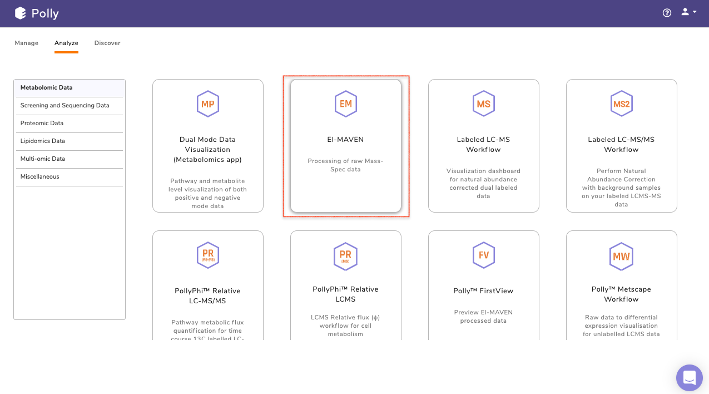
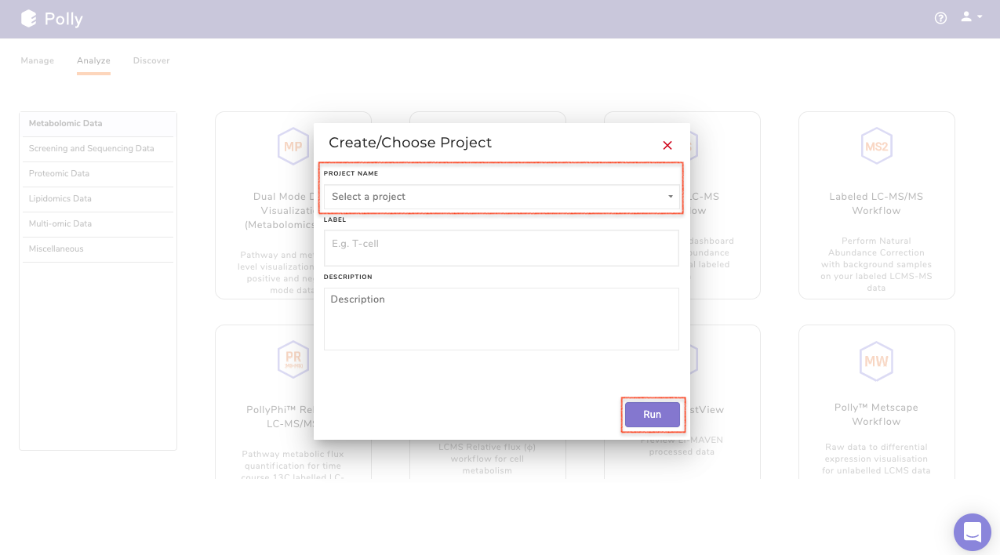

#Introduction

##Overview

Polly is capable of hosting any desktop applications that can be dockerized. One such desktop application is [El-MAVEN](https://resources.elucidata.io/elmaven).

It is an open-source LC-MS data processing engine that is optimal for isotopomer labeling and untargeted metabolomic profiling experiments. Currently El-MAVEN exists as a desktop application that runs on Windows, Linux, and Mac systems. The software can be used to view the mass spectra, align chromatograms, perform peak-feature detection, and alignment for labeled and unlabeled mass spectrometry data. The aim of this software package is to reduce the complexity of metabolomics analysis by using a highly intuitive interface for exploring and validating metabolomics data.

El-MAVEN is now hosted on the Polly platform. This means El-MAVEN and all your Polly applications can reside on a single platform and can be shared with your colleagues easily. The following are the advantages of having El-MAVEN on Polly:

*   The application scale automatically on the Polly infrastructure for multiple users to use simultaneously.

*   Access to the application is controlled by Polly authentication. Only users in your organization with required Polly authorization can access the applications.

*   Have input and output data along with analysis stored at the same location in the [Polly Management Dashboard](https://docs.elucidata.io/Getting%20Started/Project%20Management%20Dashboard.html).

*   Share the analyses along with input and output data by simply sharing the Project.

#Getting Started

Select El-MAVEN from PollyTM Dashboard under the *Metabolomics Data* Tab as shown in Figure 1. Create a *New Project* to be redirected to choose the machine configuration.

 
**Figure 1.** Select Application

 
**Figure 2.** Project selection

The size of the data varies from a few MBs to hundreds of GBs, and in order to process and analyze this huge data, you would need the computation power from a small machine to a large workstation. Polly supports configurations having 16 to 120 GB Ram and 4 to 16 CPU cores as of now. While other machine configurations can be added on customer request.

 
**Figure 3.** Mchine configurations

*   **General purpose:** Configuration 4 CPU cores 16 GB RAM fall under this category.

| Name               | CPU/Cores | RAM   |
|---------------        |-----------       |-------|
| Polly x-large   | 4                  | 16 GB |

*   **Memory optimized:** Configurations from 4 to 16 CPU cores and 32 to 120 GB RAM fall under this category. The various configurations are:

| Name                       | CPU/Cores         | RAM   |
|----------------               |-----------               |-------|
| Polly 2x-large         | 4                          | 32 GB |
| Polly 3x-large         | 8                          | 64GB |
| Polly  4x-large         | 16                         |120GB|

Choose from these pre-configured machines. Upon selecting you will see a progress bar that will tell you the status of your app launch.

 
**Figure 4.** App Launch Status

This application act as a one-stop interface for all your peak curation needs. It contains:

*   El-MAVEN desktop application: For peak picking

*   [MSConvert](http://proteowizard.sourceforge.net/download.html): For raw file conversions

*   Browser: To access data from anywhere on the cloud

*   Terminal: For transferring your raw and processed data to and from the project. Also it can be used as a general terminal for other operations as well.

 
**Figure 5.** Provided Apps and functionalities

##El-MAVEN

Once the server is ready, you will see El-MAVEN opened on the browser. The interface is similar to the desktop version. You can start analyzing by adding your files.

 
**Figure 6.** El-MAVEN Application

##MSConvert

To cater to the needs of your file conversions. Polly also hosts MSConvert application.

It is a command-line/GUI tool that is used to convert between various mass spectroscopy data formats. Raw data files obtained from mass spectrometers need to be converted to certain acceptable formats before processing in El-MAVEN. MSConvert supports the following formats:

*   .mzXML

*   .mzML

*   .RAW (Thermofisher)

*   .RAW (Waters)

*   .d (Agilent)

*   .wiff (ABSciex)

Select the tab next to El-MAVEN to access it as and when required.

 
**Figure 7.** MSConvert Application

##Browser

Polly also provides a **web browser** for you to surf the internet on the fly. You can now search for any data related query or get data from anywhere on the cloud (Polly Projects, FTP, etc) within the same interface.

![Browser] (../../img/El-MAVEN/Browser.png) 
**Figure 8.** Browser

##Terminal

Once the *Terminal* option is selected, it provides access to the command-line interface to execute any sets of commands. You have access to all the file types which are available in Polly through the terminal. You can use it for getting data into the El-MAVEN instance from the Projects and sending processed data back. The terminal option also allows you to install Python or R packages, managing system binaries and system configurations and helps you working with code repositories hosted on GitHub, Bitbucket, etc.

 
**Figure 9.** Terminal

##Accessing directories

You can fetch directories from the Project. The contents of any directory within a Project can be listed using the following command on the terminal.

<pre><code>polly files list --workspace-path "" -y</code></pre>

Here the path of the directory has to start with “*polly://*”.

To view the contents within a folder called “Data” in the project, the following command will have to be executed on the terminal.

<pre><code>polly files list --workspace-path "polly://Data" -y</code></pre>

To access the directory, the following command will have to be executed on the terminal.

<pre><code>polly files sync -s "" -d "" -y</code></pre>

If the folder called “Data” is to be accessed from Project in the folder called “Input”, execute the following command.

<pre><code>polly files sync -s "polly://Data" -d "Input" -y</code></pre>

To save directories back to Project, keep the source as it is and destination as Polly Project in the same command as mentioned above.

<pre><code>polly files sync -s "" -d "" -y</code></pre>

To save the folder called “Output” back to Polly Project, use the following command.

<pre><code>polly files sync -s "Output" -d "polly://" -y</code></pre>

##Instance Termination

Since peak picking can take days, there is an option to keep the instance running in the background even if the browser tab is closed. For this, you have separate options to *Stop* and *Terminate* the instance. Stopping the instance would keep the data (picked peaks) intact in the machine and the instance can be later resumed. (This option will soon be available on Polly)

Once you are done with your analysis, you can transfer back your results to the Project and choose to terminate the instance.

 
**Figure 10.** Termination

##Restore Analysis 

Polly contains the restore functionality that allows any analysis to be restored to the last step. Analyses can be restored by navigating to the *Analysis* section of a project. Click on *History* for the specific analysis to restore.

 
**Figure 11.** History

 
**Figure 12.** Restore

Clicking on *Restore Analysis* will take you back to the application with the same data used before. It helps you to restore the incomplete analysis and improves reproducibility.

**NOTE**:

*   This functionality would be available only if the instance has not been terminated.

In case you have terminated the instance, you can use the *Restart Analysis* tab to restart your instance. It will take you back to the application but unlike the restoring feature the same data does not get restored but you would have to add the files again to perform the analysis.

 
**Figure 13.** Restart
