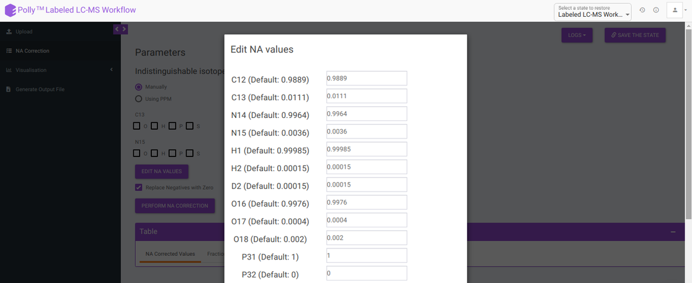
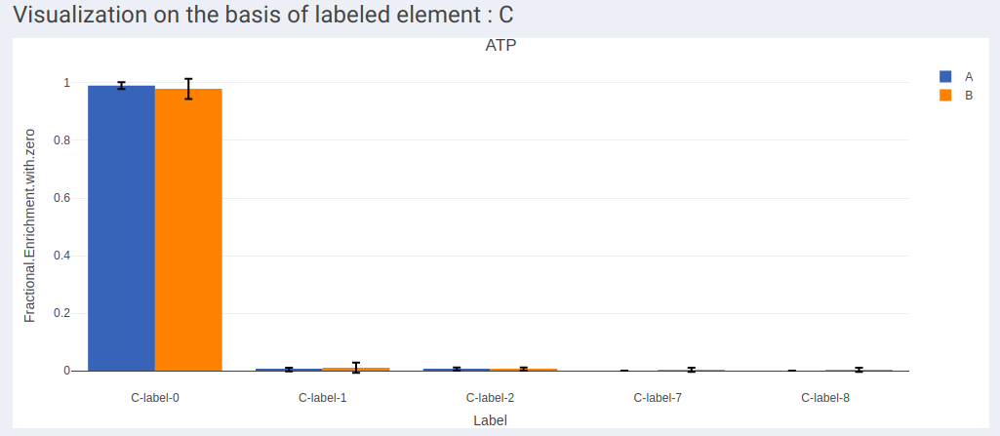
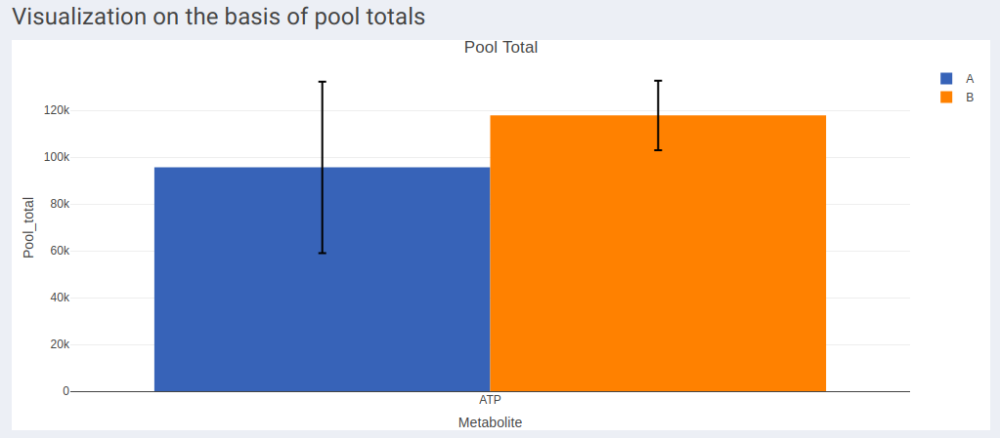
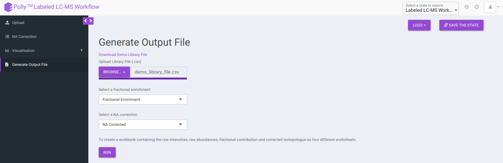
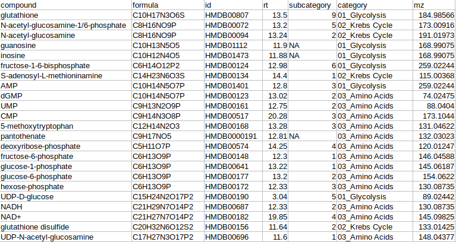
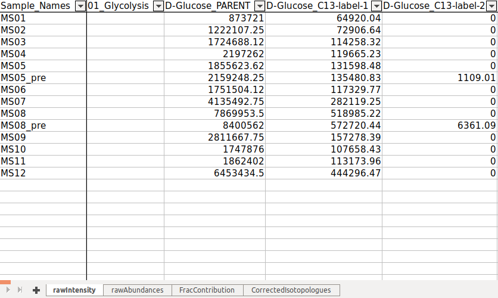

#Introduction

##Overview

The use of isotopically labeled tracer substrates is an experimental approach for measuring *in vivo* and *in vitro* intracellular metabolic dynamics. Stable isotopes that alter the mass but not the chemical behavior of a molecule are commonly used in isotope tracer studies. Because stable isotopes of some atoms naturally occur at non-negligible abundances, it is important to account for the natural abundance of these isotopes when analyzing data from isotope labeling experiments. Specifically, a distinction must be made between isotopes introduced experimentally via an isotopically labeled tracer and the isotopes naturally present at the start of an experiment.

The Labeled LC-MS Workflow factors out the contribution from the Natural Abundance (NA) of each element from the signal of each isotopologue peak obtained from LC-MS techniques in a labeling experiment. It provides visualization for fractional enrichment and pool totals for single as well as dual-labeled data. It also allows you to download an output Excel Workbook with worksheets containing the raw abundances, raw intensities, fractional contributions and corrected isotopologues of the metabolites belonging to different pathways based on the library data provided.

##Scope of the app

*   Performs NA correction on data from LC-MS experiments.
*   Supports data from single (2D, 13C, 15N and 34S) as well as dual-labeled experiments.
*   Plots fractional enrichment, pool total and NA corrected intensity plots for a selected metabolite.
*   Generates a consolidated Excel workbook of outputs.

 
**Figure 1.** Labeled LC-MS Workflow

#Getting Started

##User Input

Labeled LC-MS Workflow requires the following two files as input:

**Intensity file**

The intensity file should be in CSV format as shown in Figure 1. The .csv file exported after peak picking in [El-MAVEN](https://resources.elucidata.io/elmaven) is the input file.

 
**Figure 2.** El-MAVEN output file

**Cohort file**

The cohort file is optional and is used for generating visualizations. In case you only want to perform NA correction, you can skip this step. The cohort file should be in .csv format as shown in Figure 3. This file should contain two columns, *Sample* containing sample names along with *Cohort* for its cohort information.

 
**Figure 3.** Cohort file

##Steps involved in data processing

*   Upload intensity file obtained from El-MAVEN
*   Set analysis parameters and perform NA correction
*   Download NA corrected output files
*   Visualize fractional enrichment, pool total and NA corrected intensity plots
*   Download consolidated output workbook using a library data

##Caveats

*   All the samples present in the intensity files should also be present in the cohort file.
*   The cohort file is optional but visualizations will only be generated if this file is provided.
*   If using the *Edit NA Option*, the natural abundances of all the isotopes of an element should sum to 1.
*   The library file is not required for NA Correction.
*   The name of the metabolites should match exactly between the input and the library file.

#Tutorial

##Upload files

The *Upload Files* tab allows you to upload the input files required for processing through the app. Once the files have been uploaded, click on *Run.* This will validate and process the uploaded files and give error messages or warnings if the format or data in files are incorrect. You can also run the demo files directly by clicking on *Run Demo Files*.

 
**Figure 4.** Upload interface

##Cohort Creation Interface

If you do not wish to create a cohort file, you can utilize the cohort creation interface that allows you to enter the cohort information on the app itself. Upload your intensity file and uncheck *Upload Cohort File* option. Once the intensity file is uploaded, click on *Run* and a cohort creation interface with sample names with input files will open as shown in Figure 4. After entering the cohort information, click on *NA Correction* on the top left side to be taken to the NA correction interface.

 
**Figure 5.** Cohort creation interface

##NA Correction

Isotopologue identification and quantification of thousands of metabolites in the metabolomic experiments can provide a wealth of data for modeling the flux through metabolic networks. But before isotopologue intensity data can be properly interpreted, the contributions from isotopic natural abundance must be factored out (deisotoped). This is referred to as natural abundance (NA) correction. The various analysis parameters for performing NA Correction shown in Figure 5 are defined below:

 
**Figure 6.** NA Correction Tab

*   *Indistinguishable isotopes*: Indistinguishable isotopes can be corrected for natural abundance by electing either of the following options:

    *   Manually: You can manually select a standard list of indistinguishable isotopes with respect to the labelled isotope for NA correction.

    *   Using PPM: You can enable auto detection of indistinguishable isotopes, by selecting *Using PPM* option and providing PPM resolution of the mass spectrometer used for the experiment.

*   *Edit NA values:* Default NA values used in the tool are taken from CRC Handbook of Chemistry and Physics. You can change these values by clicking on *Edit NA Values*. as shown in Figure 6.

 
**Figure 7.** Edit NA values

*   *Replace negatives with zero:* Sometimes negative intensities arise which can be replaced with zero. This option is selected by default.

After all parameters have been decided click on *Perform NA Correction*. Once NA correction has been performed, the output will be displayed in in a tabular format as shown in Figure 7. There are three sections on this interface; *NA Corrected Values*, *Fractional Enrichment* and *Merged Output*. The first two sections only display the NA corrected values and fractional enrichment respectively as shown in Figure 7 and Figure 8 whereas the Third section combines these information to provide you with a single file with the entire information as shown in Figure 9. A detailed description of the merged output file is provided below.

 
**Figure 8.** NA Corrected Values

 
**Figure 9.** Fractional Enrichment

 
**Figure 10.** Merged Output

where,

*   *Name* is Name of the metabolite
*   *Label* is Label information
*   *Formula* is Chemical formula
*   *Sample* is Sample names
*   *Intensity* is Raw intensities
*   *NA Corrected* is NA corrected intensities
*   *NA Corrected with zero* is NA corrected intensities with negative intensities replaced with zero
*   *Indistinguishable isotopes* is List of indistinguishable isotopes for the particular metabolite
*Pool total* is Pool total of a metabolite in a sample
*   *Fractional Enrichment* is Fractional enrichment calculated after NA Correction has been done
*   *Fractional Enrichment with zero* is Negative values are replaced with zero
*   *compoundid* is KEGG or HMDB ID of the metabolites as specified oin the input file

##Visualization

The visualization tab provides fractional enrichment, pool total and NA corrected intensity plots that are generated according to the metabolite and quantification type specified before.

 
**Figure 11.** Visualization Interface

To generate visualizations, select a metabolite using the drop down that contains metabolites present in the intensity file uploaded and a quantification type from *Intensity*, *NA Corrected*, *NA Corrected with zero*, *Fractional Enrichment* and *Fractional Enrichment with zero*. After this, click on *Run* to get the selected visualization.

*   Visualization on the basis of the number of labels shows all the available labels of a metabolite based on the quantification type selected across cohorts.

 
**Figure 12.** Fractional enrichment with zero for ATP

*   In case of dual labeled data, plots for each element can be visualized individually as shown in Figure 13 and Figure 14.

 
**Figure 13.** Fractional enrichment with 0 for ATP and label type C

 
**Figure 14.** Fractional enrichment with 0 for ATP and label type N

*   Visualization on the basis of pool totals shows the pool totals plot for the selected metabolite.

 
**Figure 15.** Pool Total Plot

**Note:**

*   The pool total plot will be shown regardless of the quantification type selection.

##Generate Output File

This tab allows you to generate the output workbook which consists of the Raw Intensities, Raw Abundances, Fractional Contribution and Corrected Isotopologues in four different worksheets where the metabolites belonging to a particular pathway are grouped together based on the metabolite-pathway mapping provided in the Library File uploaded. The various options available are provided below:

 
**Figure 16.** Generate Output File

*   *Download Demo Library File:* Clicking on this would download the demo library file containing the metabolite and pathway mapping.

*   *Upload Library File (.csv):* The library file contains metabolite to pathway mapping information such as name of metabolite, pathway identifiers as supercategory and subcategory as shown in Figure 16. This file should be in .csv format. A detailed description of this file is provided below.

 
**Figure 17.** Library File

where,

*   *compound* is the column that contains the names of the metabolites as in the El-MAVEN output
*   *formula* is the column that contains the elemental formula of the metabolites
*   *id* is the column that contains the compound ids of the metabolites
*   *rt* is the column that contains the retention times of the metabolites
*   *mz* is the column that contains the mzs of the metabolites
*   *category* is the column that contains the pathway name to which the metabolite belongs to. The entries should ideally be pathwaynumber_pathwayname. Example: 01_Glycolysis
*   *subcategory* is the column that contains the pathway number according to the Supercategory column followed by the metabolite number. Example: 9 for glutathione. 

Select whether to proceed with Fractional Enrichment or Fractional Enrichment with zero or NA Corrected or NA Corrected with zero values using *Select a fractional enrichment* and *Select a NA correction* drop down. 

Clicking on *Run* will generate a workbook that consists of the worksheets *rawIntensities*, *rawAbundances*, *FracContribution*, and *CorrectedIsotopologues* with entries for all the metabolite isotopologues across different samples. Further, all the metabolite isotopologues are grouped based on the pathway they belong to (information provided in the library file).

 
**Figure 18.** Output Workbook

#Details of the App

Corna, the algorithm used for NA correction has the ability to auto-detect indistinguishable isotopes in experiments with dual tracers. Some high-resolution mass spectrometer instruments are able to distinguish isotopes like 13C from 15N. The packages available for performing natural abundance correction on these data assume infinite resolution, which means that it is assumed that if 13C can be resolved from 15N at all masses and it can also be resolved from other isotopes like 2D. However, this assumption becomes invalid as the resolution of the machine varies with the mass of the metabolite. Corna does not assume ultra-high resolution and corrects for partial indistinguishability in the data.

*   **Fractional enrichment:**

Fractional enrichment is calculated for each label corresponding to every metabolite in a sample using the formula:

Fractional enrichment = corrected intensity of a label / sum of corrected intensities for all labels

*   **Pool total:**

Sum total of corrected intensities of every isotopologue for each metabolite in a sample using the formula:

pool total of a metabolite in a sample = sum (all corrected intensities for a metabolite)

*   **Calculations in the output workbook:**

    *   *rawIntensities*: It consists of raw intensity values obtained from the NA Corrected output.

    *   *rawAbundances*: It consists of the pool totals values obtained from the NA Corrected output.

    *   *FracContribution*: It consists of the fractional enrichment values obtained from the NA Corrected output in percentage calculated using the formula: 
    
        fractional contribution = na corrected value of isotopologue / na corrected value of parent (M0)

*   *CorrectedIsotopologues*: It consists of the fractional contribution values obtained from the NA Corrected output, wherein the parent (M0) is considered as 100%, and all other isotopologues are relative to it.

#References

*   Midani FS, Wynn ML, Schnell S. The importance of accurately correcting for the natural abundance of stable isotopes. *Anal Biochem*. 2017;520:27–43. doi:10.1016/j.ab.2016.12.011

*   Lide, D. R., “CRC Handbook of Chemistry and Physics (83rd ed.). Boca Raton”, FL: CRC Press. ISBN 0-8493-0483-0, 2002.

*   Moseley H., “Correcting for the effects of natural abundance in stable isotope resolved metabolomics experiments involving ultra-high resolution mass spectrometry”,BMC Bioinformatics, 2010, 11:139.
