#Introduction

##Overview

The Labeled LC-MS/MS Workflow tool factors out the contribution from the natural abundance of each element from the signal of each isotopologue peak obtained from LC-MS techniques in a labeling experiment. It also allows you to visualize plots for NA corrected, fractional enrichment and pool totals for single as well as dual labeled data. The output of the natural abundance correction step is a table containing the raw abundances, fractional contributions and corrected isotopologues of the metabolites, calculated based on the library data provided.

##Scope of the tool

*   The tool supports data from LC-MS/MS and MRM/SRM experiments.
*   Supports data from single as well as dual labeled experiments.
*   Corrects data from 2D, 13C, 15N and 34S labeled experiments
*   Plot fractional enrichment and pool total for a selected metabolite.
*   It performs Phi calculations.

 
**Figure 1.** Workflow

#Getting Started

##User Input

Labeled LC-MS/MS Workflow requrires three types of input files:

*   [El-MAVEN](https://resources.elucidata.io/elmaven) Output

This file is the .csv output from El-MAVEN in peak detailed format.

<table class="relative-table wrapped confluenceTable" style="width: 98.1682%;" data-mkd-display="block" data-mkd-tablehasheader="false"><colgroup data-mkd-display="block"><col style="width: 12.9881%;" data-mkd-display="block"><col style="width: 52.6316%;" data-mkd-display="block"><col style="width: 14.5161%;" data-mkd-display="block"><col style="width: 19.8642%;" data-mkd-display="block"></colgroup><tbody data-mkd-display="block"><tr data-mkd-display="block" data-mkd-index="1" data-mkd-index-row="1"><th class="highlight-grey confluenceTh" data-highlight-colour="grey" data-mkd-display="block" data-mkd-index="1" data-mkd-index-cell="1"><h4 data-mkd-display="block">Column Name</h4></th><th class="highlight-grey confluenceTh" data-highlight-colour="grey" data-mkd-display="block" data-mkd-index="2" data-mkd-index-cell="2"><h4 data-mkd-display="block">Description</h4></th><th class="highlight-grey confluenceTh" data-highlight-colour="grey" data-mkd-display="block" data-mkd-index="3" data-mkd-index-cell="3"><h4 data-mkd-display="block">Required/Optional</h4></th><th class="highlight-grey confluenceTh" data-highlight-colour="grey" data-mkd-display="block" data-mkd-index="4" data-mkd-index-cell="4" data-mkd-pos="last"><h4 data-mkd-display="block">Validation Checks</h4></th></tr><tr data-mkd-display="block" data-mkd-index="2" data-mkd-index-row="2"><td class="confluenceTd" data-mkd-display="block" data-mkd-index="1" data-mkd-index-cell="1">
<strong data-mkd-display="inline">Original Filename</strong>
</td><td class="confluenceTd" data-mkd-display="block" data-mkd-index="2" data-mkd-index-cell="2">
This column contains the name of the samples&nbsp;
</td><td class="confluenceTd" data-mkd-display="block" data-mkd-index="3" data-mkd-index-cell="3">
Required
</td><td class="confluenceTd" data-mkd-display="block" data-mkd-index="4" data-mkd-index-cell="4" data-mkd-pos="last">
No format constraints
</td></tr><tr data-mkd-display="block" data-mkd-index="3" data-mkd-index-row="3"><td class="confluenceTd" data-mkd-display="block" data-mkd-index="1" data-mkd-index-cell="1">
<strong data-mkd-display="inline">Component Name</strong>
</td><td class="confluenceTd" data-mkd-display="block" data-mkd-index="2" data-mkd-index-cell="2">
This column contains the fragment names
</td><td class="confluenceTd" data-mkd-display="block" data-mkd-index="3" data-mkd-index-cell="3">
Required
</td><td class="confluenceTd" data-mkd-display="block" data-mkd-index="4" data-mkd-index-cell="4" data-mkd-pos="last">
Should be a non-negative number or NA
</td></tr><tr data-mkd-display="block" data-mkd-index="4" data-mkd-index-row="4"><td class="confluenceTd" data-mkd-display="block" data-mkd-index="1" data-mkd-index-cell="1">
<strong data-mkd-display="inline">Area</strong>
</td><td class="confluenceTd" data-mkd-display="block" data-mkd-index="2" data-mkd-index-cell="2">
It contains the intensities values
</td><td class="confluenceTd" data-mkd-display="block" data-mkd-index="3" data-mkd-index-cell="3">
Required
</td><td class="confluenceTd" data-mkd-display="block" data-mkd-index="4" data-mkd-index-cell="4" data-mkd-pos="last">
string of form parent mass/daughter mass
</td></tr><tr data-mkd-display="block" data-mkd-index="5" data-mkd-index-row="5"><td class="confluenceTd" data-mkd-display="block" data-mkd-index="1" data-mkd-index-cell="1">
<strong data-mkd-display="inline">Mass Info</strong>
</td><td class="confluenceTd" data-mkd-display="block" data-mkd-index="2" data-mkd-index-cell="2">
It contains mass of parent fragment and daughter fragment “Parent Fragment Mass/Fragment Mass”&nbsp;
</td><td class="confluenceTd" data-mkd-display="block" data-mkd-index="3" data-mkd-index-cell="3">
Required
</td><td class="confluenceTd" data-mkd-display="block" data-mkd-index="4" data-mkd-index-cell="4" data-mkd-pos="last">
string of form parent mass/daughter mass
</td></tr><tr data-mkd-display="block" data-mkd-index="6" data-mkd-index-row="6"><td class="confluenceTd" data-mkd-display="block" data-mkd-index="1" data-mkd-index-cell="1">
<strong data-mkd-display="inline">Sample Name</strong>
</td><td class="confluenceTd" data-mkd-display="block" data-mkd-index="2" data-mkd-index-cell="2">
It contains cohort names. Required to identify cohort replicates. example A 0 min SCS, 10 min etc.
</td><td class="confluenceTd" data-mkd-display="block" data-mkd-index="3" data-mkd-index-cell="3">
Required only if background correction is needed
</td><td class="confluenceTd" data-mkd-display="block" data-mkd-index="4" data-mkd-index-cell="4" data-mkd-pos="last">
No format constraints here
</td></tr></tbody></table>

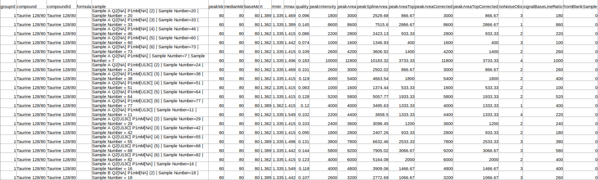 
**Figure 2.** El-MAVEN output file 

*   Fragment Mapping Metadata

The fragment mapping metadata is a .csv, .xls, .xlsx or .txt file that contains mapping information for fragments, their metabolites, isotopic tracer, parent formula and daughter formula. This file's name should start with "metadata_mq".

<table class="relative-table wrapped confluenceTable" style="width: 100.0%;" data-mkd-display="block" data-mkd-tablehasheader="false"><colgroup data-mkd-display="block"><col style="width: 11.6667%;" data-mkd-display="block"><col style="width: 50.5833%;" data-mkd-display="block"><col style="width: 14.25%;" data-mkd-display="block"><col style="width: 23.5%;" data-mkd-display="block"></colgroup><tbody data-mkd-display="block"><tr data-mkd-display="block" data-mkd-index="1" data-mkd-index-row="1"><th class="highlight-blue confluenceTh" data-highlight-colour="blue" data-mkd-display="block" data-mkd-index="1" data-mkd-index-cell="1"><h4 data-mkd-display="block">Column Name</h4></th><th class="highlight-blue confluenceTh" data-highlight-colour="blue" data-mkd-display="block" data-mkd-index="2" data-mkd-index-cell="2"><h4 data-mkd-display="block">Description</h4></th><th class="highlight-blue confluenceTh" data-highlight-colour="blue" data-mkd-display="block" data-mkd-index="3" data-mkd-index-cell="3"><h4 data-mkd-display="block">Required/Optional</h4></th><th class="highlight-blue confluenceTh" data-highlight-colour="blue" data-mkd-display="block" data-mkd-index="4" data-mkd-index-cell="4" data-mkd-pos="last"><h4 data-mkd-display="block">Validation Checks</h4></th></tr><tr data-mkd-display="block" data-mkd-index="2" data-mkd-index-row="2"><td class="confluenceTd" data-mkd-display="block" data-mkd-index="1" data-mkd-index-cell="1"><strong data-mkd-display="inline">Component Name</strong></td><td class="confluenceTd" data-mkd-display="block" data-mkd-index="2" data-mkd-index-cell="2">This column contains entries from "Component Name" column of the raw Multiquant file</td><td class="confluenceTd" data-mkd-display="block" data-mkd-index="3" data-mkd-index-cell="3">Required*</td><td class="confluenceTd" data-mkd-display="block" data-mkd-index="4" data-mkd-index-cell="4" data-mkd-pos="last">No format constraints here</td></tr><tr data-mkd-display="block" data-mkd-index="3" data-mkd-index-row="3"><td class="confluenceTd" data-mkd-display="block" data-mkd-index="1" data-mkd-index-cell="1"><strong data-mkd-display="inline">Unlabeled Fragment</strong></td><td class="confluenceTd" data-mkd-display="block" data-mkd-index="2" data-mkd-index-cell="2">The component name of the fragment which is completely unlabeled. example Citrate has two Unlabeled Fragments in the sample input data Citrate 191/111 (C5H3O3) and Citrate 191/67(C4H3O). Both are processed separately Example: metab, citrate, citrate 191/111</td><td class="confluenceTd" data-mkd-display="block" data-mkd-index="3" data-mkd-index-cell="3">Required*</td><td class="confluenceTd" data-mkd-display="block" data-mkd-index="4" data-mkd-index-cell="4" data-mkd-pos="last">No format constraints here</td></tr><tr data-mkd-display="block" data-mkd-index="4" data-mkd-index-row="4"><td class="confluenceTd" data-mkd-display="block" data-mkd-index="1" data-mkd-index-cell="1"><strong data-mkd-display="inline">Formula</strong></td><td class="confluenceTd" data-mkd-display="block" data-mkd-index="2" data-mkd-index-cell="2">This column contains the chemical formula of the daughter fragment written in the format C4H3O</td><td class="confluenceTd" data-mkd-display="block" data-mkd-index="3" data-mkd-index-cell="3">Required*</td><td class="confluenceTd" data-mkd-display="block" data-mkd-index="4" data-mkd-index-cell="4" data-mkd-pos="last">Validates formula by checking if elements in periodic table and atom numbers are integers</td></tr><tr data-mkd-display="block" data-mkd-index="5" data-mkd-index-row="5"><td class="confluenceTd" data-mkd-display="block" data-mkd-index="1" data-mkd-index-cell="1"><strong data-mkd-display="inline">Parent Formula</strong></td><td class="confluenceTd" data-mkd-display="block" data-mkd-index="2" data-mkd-index-cell="2">This column contains the chemical formula of the parent fragment</td><td class="confluenceTd" data-mkd-display="block" data-mkd-index="3" data-mkd-index-cell="3">Required*</td><td class="confluenceTd" data-mkd-display="block" data-mkd-index="4" data-mkd-index-cell="4" data-mkd-pos="last">Validates formula by checking if elements in periodic table and atom numbers are integers</td></tr><tr data-mkd-display="block" data-mkd-index="6" data-mkd-index-row="6"><td class="confluenceTd" data-mkd-display="block" data-mkd-index="1" data-mkd-index-cell="1"><strong data-mkd-display="inline">Isotopic Tracer</strong></td><td class="confluenceTd" data-mkd-display="block" data-mkd-index="2" data-mkd-index-cell="2">This column contains the iso tracer. Example: if the iso tracer is carbon 13, it is written as C13</td><td class="confluenceTd" data-mkd-display="block" data-mkd-index="3" data-mkd-index-cell="3">Required*</td><td class="confluenceTd" data-mkd-display="block" data-mkd-index="4" data-mkd-index-cell="4" data-mkd-pos="last">Checks if the iso tracer is correctly</td></tr></tbody></table>

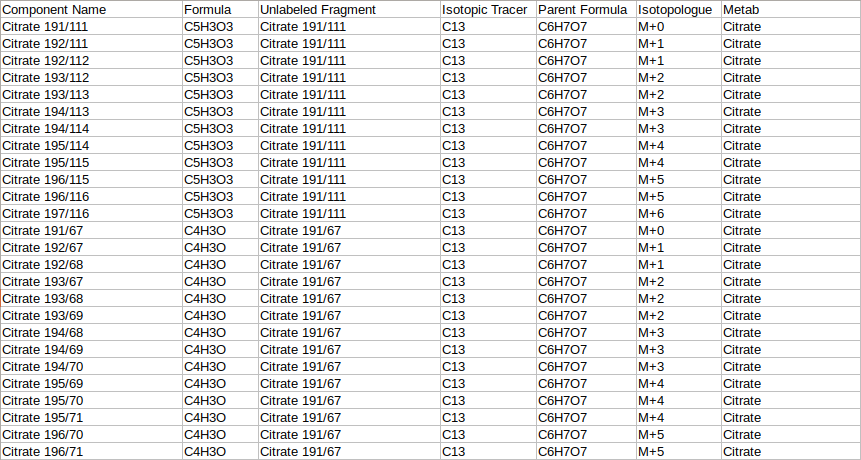 
**Figure 3.** Fragment mapping metadata file 

*   Background Mapping Metadata

The background mapping metadata is a .csv, .xls, .xlsx or .txt file that contains sample metadata like names, background sample, cohort, etc. This file's name should start with "metadata_sample". As this file is used for background correction, it is optional.

<table class="wrapped relative-table confluenceTable" style="width: 100.0%;" data-mkd-display="block" data-mkd-tablehasheader="false"><colgroup data-mkd-display="block"><col style="width: 13.9167%;" data-mkd-display="block"><col style="width: 51.1667%;" data-mkd-display="block"><col style="width: 14.0833%;" data-mkd-display="block"><col style="width: 20.8333%;" data-mkd-display="block"></colgroup><tbody data-mkd-display="block"><tr data-mkd-display="block" data-mkd-index="1" data-mkd-index-row="1"><th class="highlight-green confluenceTh" data-highlight-colour="green" data-mkd-display="block" data-mkd-index="1" data-mkd-index-cell="1"><h4 data-mkd-display="block">Column Name</h4></th><th class="highlight-green confluenceTh" data-highlight-colour="green" data-mkd-display="block" data-mkd-index="2" data-mkd-index-cell="2"><h4 data-mkd-display="block">Description</h4></th><th class="highlight-green confluenceTh" data-highlight-colour="green" data-mkd-display="block" data-mkd-index="3" data-mkd-index-cell="3"><h4 data-mkd-display="block">Required/Optional</h4></th><th class="highlight-green confluenceTh" data-highlight-colour="green" data-mkd-display="block" data-mkd-index="4" data-mkd-index-cell="4" data-mkd-pos="last"><h4 data-mkd-display="block">Validation Checks</h4></th></tr><tr data-mkd-display="block" data-mkd-index="2" data-mkd-index-row="2"><td class="confluenceTd" data-mkd-display="block" data-mkd-index="1" data-mkd-index-cell="1"><strong data-mkd-display="inline">Original Filename</strong></td><td class="confluenceTd" data-mkd-display="block" data-mkd-index="2" data-mkd-index-cell="2">This column contains the name of the samples. Each sample name occurs only once in this file and the names come from Original Filename column of raw multiquant file</td><td class="confluenceTd" data-mkd-display="block" data-mkd-index="3" data-mkd-index-cell="3">Required*</td><td class="confluenceTd" data-mkd-display="block" data-mkd-index="4" data-mkd-index-cell="4" data-mkd-pos="last">Unique sample names, intersection with multiquant file not empty</td></tr><tr data-mkd-display="block" data-mkd-index="3" data-mkd-index-row="3"><td class="confluenceTd" data-mkd-display="block" data-mkd-index="1" data-mkd-index-cell="1"><strong data-mkd-display="inline">Sample Name</strong></td><td class="confluenceTd" data-mkd-display="block" data-mkd-index="2" data-mkd-index-cell="2">This column contains cohort names. It is needed to identify the replicates of each cohort.&nbsp;</td><td class="confluenceTd" data-mkd-display="block" data-mkd-index="3" data-mkd-index-cell="3">Required only if background correction needed</td><td class="confluenceTd" data-mkd-display="block" data-mkd-index="4" data-mkd-index-cell="4" data-mkd-pos="last">No format constraints here</td></tr><tr data-mkd-display="block" data-mkd-index="4" data-mkd-index-row="4"><td class="confluenceTd" data-mkd-display="block" data-mkd-index="1" data-mkd-index-cell="1"><strong data-mkd-display="inline">Any number of additional columns</strong></td><td class="confluenceTd" data-mkd-display="block" data-mkd-index="2" data-mkd-index-cell="2">These columns contain metadata associated with sample names</td><td class="confluenceTd" data-mkd-display="block" data-mkd-index="3" data-mkd-index-cell="3">Optional</td><td class="confluenceTd" data-mkd-display="block" data-mkd-index="4" data-mkd-index-cell="4" data-mkd-pos="last"> </td></tr><tr data-mkd-display="block" data-mkd-index="5" data-mkd-index-row="5"><td class="confluenceTd" data-mkd-display="block" data-mkd-index="1" data-mkd-index-cell="1"><strong data-mkd-display="inline">Background Sample</strong></td><td class="confluenceTd" data-mkd-display="block" data-mkd-index="2" data-mkd-index-cell="2">It contains the sample which is to be taken as reference for background correction</td><td class="confluenceTd" data-mkd-display="block" data-mkd-index="3" data-mkd-index-cell="3">Required only if background correction is needed</td><td class="confluenceTd" data-mkd-display="block" data-mkd-index="4" data-mkd-index-cell="4" data-mkd-pos="last">
The entries in this column are subsets of Original Filename
</td></tr></tbody></table>

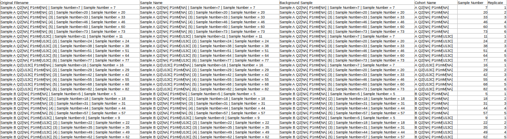 
 **Figure 4.** Background mapping metadata file

##Steps involved in data processing

*   Prepare data files
*   Upload data files
*   Set analysis parameters and perform natural abundance correction
*   Download corrected output files
*   Visualize fractional enrichment and pool total plots
*   Perform Phi calculation by uploading NA corrected file

##Caveats

*   The intensity file should be the El-MAVEN outout in peak detailed format.
*   The fragment mapping metadata file's name should start with "metadata_mq".
*   The backround mapping metadata file's name should start with "metadata_sample".

#Tutorial

Select *Labeled LC-MS/MS Workflow* from the dashboard under the *Metabolomics Data* Tab as shown in Figure 5. Create a *New Project* to be redirected to Labeled LC-MS/MS Workflow's upload page.

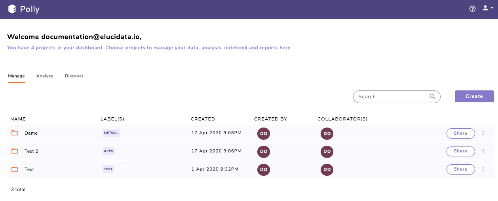

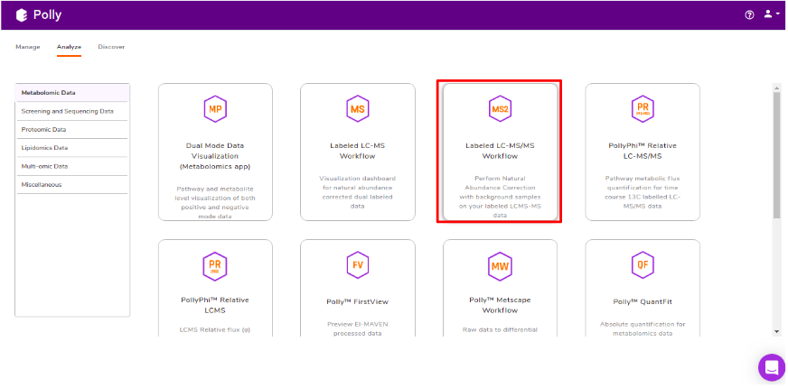 
**Figure 5.** Polly Dashboard and Labeled LC-MS/MS Workflow

##Upload Files

Click on *Upload El-MAVEN Output* and *Upload Cohort FIle* to upload the intensity and metadata files respectively. y or from Polly. This is optional. The metadata is not used in the NA correction, however, if you wants to visualize plots, the sample-cohort mapping would be required. Click on *Run* to proceed.

 
**Figure 6.** Upload interface

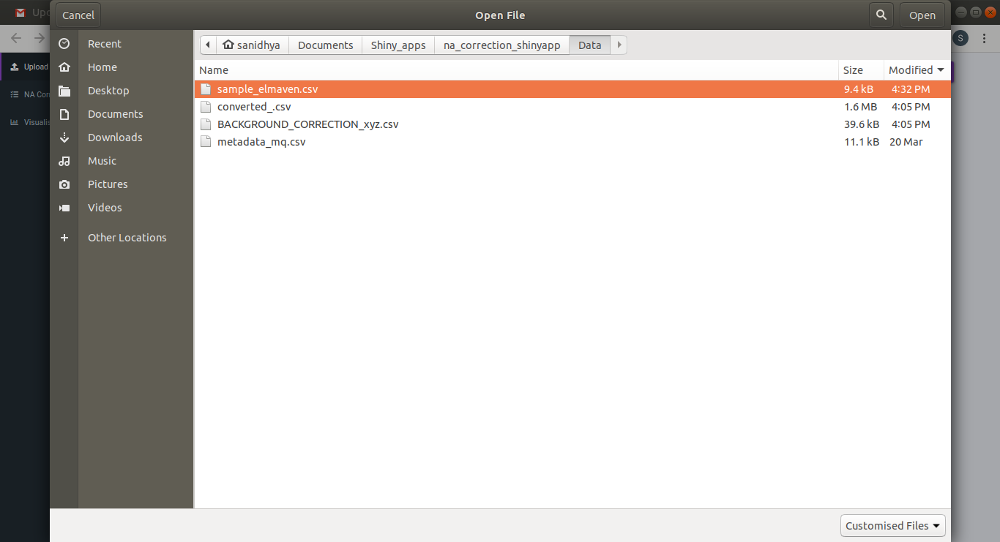 
**Figure 7.** Upload files from the target folder 

 
**Figure 8.** Check/uncheck the option to upload Metadata Sample file 

If you do not upload a *metadata file* and upload a *metadata sample file* you will be provided with the option to *Drop Samples* as well as *Map Replicate to Background Samples*.

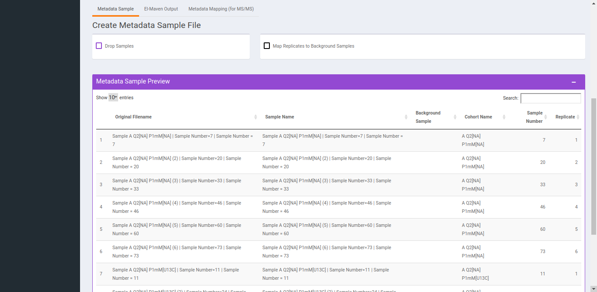 
**Figure 9.** *Drop Samples* and *Map Replicates to Background Samples* option 

1. To *Drop Samples* check the drop samples checkbox and select sample(s) to drop and hit *Drop Samples*.

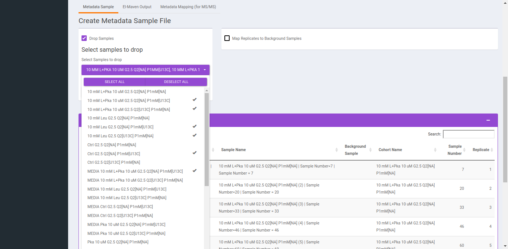 
 **Figure 10.** *Drop Samples* option 

2. To replicate samples to background samples, select the *Replicate Cohort* and *Background Sample Cohort* and hit *Update metadata*.

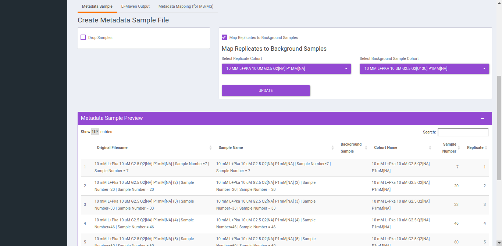 
 **Figure 11.** *Map Replicates to Background Samples* 

##NA Correction

You can navigate to *NA correction* tab by either clicking on *Go to NA Correction* option or by selecting the *NA Correction* tab. There are two options to perform NA correction:

*   Check **Perform Background Correction** checkbox to perform background correction.
*   **Replace negatives with zero** is selected by ddefault. This option replaces any negative intensities obtained with 0.

**Note:**

*   The sum of natural abundances of all the isotopes of an element should be 1.

After selecting the parameters, click on *Perform NA Correction*, to get the NA corrected intensities.

 
 **Figure 12.** NA Correction interface 

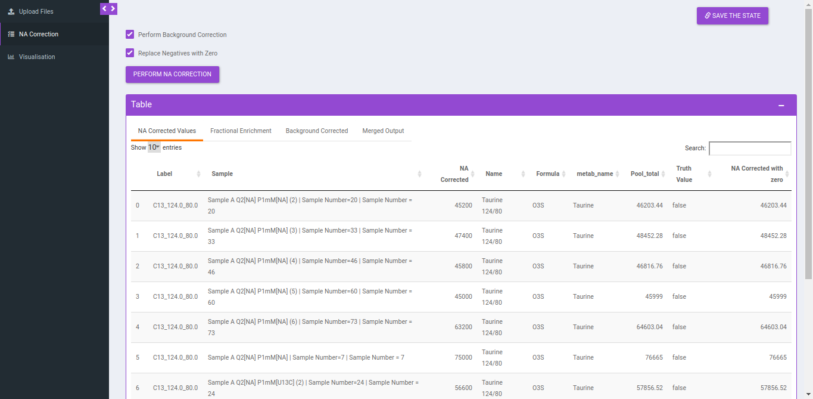 
 **Figure 13.** NA Corrected values 

##Output

**NA Correction data file**

<table class="relative-table wrapped confluenceTable" style="width: 98.1682%;" data-mkd-display="block" data-mkd-tablehasheader="false"><colgroup data-mkd-display="block"><col style="width: 13.073%;" data-mkd-display="block"><col style="width: 50.764%;" data-mkd-display="block"><col style="width: 20.9677%;" data-mkd-display="block"><col style="width: 15.1952%;" data-mkd-display="block"></colgroup><tbody data-mkd-display="block"><tr data-mkd-display="block" data-mkd-index="1" data-mkd-index-row="1"><th class="highlight-green confluenceTh" style="margin-left: 30.0px;" data-highlight-colour="green" data-mkd-display="block" data-mkd-index="1" data-mkd-index-cell="1"><h4 data-mkd-display="block">Column Name</h4></th><th class="highlight-green confluenceTh" data-highlight-colour="green" data-mkd-display="block" data-mkd-index="2" data-mkd-index-cell="2"><h4 data-mkd-display="block">Description</h4></th><th class="highlight-green confluenceTh" data-highlight-colour="green" data-mkd-display="block" data-mkd-index="3" data-mkd-index-cell="3"><h4 data-mkd-display="block">Required/Optional</h4></th><th class="highlight-green confluenceTh" data-highlight-colour="green" data-mkd-display="block" data-mkd-index="4" data-mkd-index-cell="4" data-mkd-pos="last"><h4 data-mkd-display="block">Validation Checks</h4></th></tr><tr data-mkd-display="block" data-mkd-index="2" data-mkd-index-row="2"><td class="confluenceTd" data-mkd-display="block" data-mkd-index="1" data-mkd-index-cell="1">Name</td><td class="confluenceTd" data-mkd-display="block" data-mkd-index="2" data-mkd-index-cell="2">Name of the unlabelled fragment</td><td class="confluenceTd" data-mkd-display="block" data-mkd-index="3" data-mkd-index-cell="3">metadata_mq</td><td class="confluenceTd" data-mkd-display="block" data-mkd-index="4" data-mkd-index-cell="4" data-mkd-pos="last">Unlabelled fragment</td></tr><tr data-mkd-display="block" data-mkd-index="3" data-mkd-index-row="3"><td class="confluenceTd" data-mkd-display="block" data-mkd-index="1" data-mkd-index-cell="1">Label</td><td class="confluenceTd" data-mkd-display="block" data-mkd-index="2" data-mkd-index-cell="2">
It gives label information by the entries of type isotracer_parentmass_daughtermass
<ul data-mkd-display="block" data-mkd-depth="1"><li data-mkd-display="block" data-mkd-index="1"><strong data-mkd-display="inline">Example:</strong> C13_123_23</li></ul></td><td class="confluenceTd" data-mkd-display="block" data-mkd-index="3" data-mkd-index-cell="3">Entries come from Isotracer column of metadata_mq masses from Mass Info of raw multiquant</td><td class="confluenceTd" data-mkd-display="block" data-mkd-index="4" data-mkd-index-cell="4" data-mkd-pos="last"> </td></tr><tr data-mkd-display="block" data-mkd-index="4" data-mkd-index-row="4"><td class="confluenceTd" data-mkd-display="block" data-mkd-index="1" data-mkd-index-cell="1">Formula</td><td class="confluenceTd" data-mkd-display="block" data-mkd-index="2" data-mkd-index-cell="2">Contains chemical formula of the daughter fragment</td><td class="confluenceTd" data-mkd-display="block" data-mkd-index="3" data-mkd-index-cell="3">metadata_mq</td><td class="confluenceTd" data-mkd-display="block" data-mkd-index="4" data-mkd-index-cell="4" data-mkd-pos="last"> </td></tr><tr data-mkd-display="block" data-mkd-index="5" data-mkd-index-row="5"><td class="confluenceTd" colspan="1" data-mkd-display="block" data-mkd-index="1" data-mkd-index-cell="1">Sample</td><td class="confluenceTd" colspan="1" data-mkd-display="block" data-mkd-index="2" data-mkd-index-cell="2">Contains sample name</td><td class="confluenceTd" colspan="1" data-mkd-display="block" data-mkd-index="3" data-mkd-index-cell="3">Raw intensity file</td><td class="confluenceTd" colspan="1" data-mkd-display="block" data-mkd-index="4" data-mkd-index-cell="4" data-mkd-pos="last">Original filename</td></tr><tr data-mkd-display="block" data-mkd-index="6" data-mkd-index-row="6"><td class="confluenceTd" colspan="1" data-mkd-display="block" data-mkd-index="1" data-mkd-index-cell="1">NA corrected</td><td class="confluenceTd" colspan="1" data-mkd-display="block" data-mkd-index="2" data-mkd-index-cell="2">NA corrected intensities</td><td class="confluenceTd" colspan="1" data-mkd-display="block" data-mkd-index="3" data-mkd-index-cell="3"> </td><td class="confluenceTd" colspan="1" data-mkd-display="block" data-mkd-index="4" data-mkd-index-cell="4" data-mkd-pos="last"> </td></tr><tr data-mkd-display="block" data-mkd-index="7" data-mkd-index-row="7"><td class="confluenceTd" colspan="1" data-mkd-display="block" data-mkd-index="1" data-mkd-index-cell="1">NA Corrected with 0</td><td class="confluenceTd" colspan="1" data-mkd-display="block" data-mkd-index="2" data-mkd-index-cell="2">Negative values are replaced with zero</td><td class="confluenceTd" colspan="1" data-mkd-display="block" data-mkd-index="3" data-mkd-index-cell="3"> </td><td class="confluenceTd" colspan="1" data-mkd-display="block" data-mkd-index="4" data-mkd-index-cell="4" data-mkd-pos="last"> </td></tr></tbody></table>

**Background Correction data file**

<table class="relative-table wrapped confluenceTable" style="width: 98.1682%;" data-mkd-display="block" data-mkd-tablehasheader="false"><colgroup data-mkd-display="block"><col style="width: 12.9881%;" data-mkd-display="block"><col style="width: 51.1885%;" data-mkd-display="block"><col style="width: 20.7131%;" data-mkd-display="block"><col style="width: 15.1104%;" data-mkd-display="block"></colgroup><tbody data-mkd-display="block"><tr data-mkd-display="block" data-mkd-index="1" data-mkd-index-row="1"><th class="highlight-blue confluenceTh" data-highlight-colour="blue" data-mkd-display="block" data-mkd-index="1" data-mkd-index-cell="1"><h4 data-mkd-display="block">Column Name</h4></th><th class="highlight-blue confluenceTh" data-highlight-colour="blue" data-mkd-display="block" data-mkd-index="2" data-mkd-index-cell="2"><h4 data-mkd-display="block">Description</h4></th><th class="highlight-blue confluenceTh" data-highlight-colour="blue" data-mkd-display="block" data-mkd-index="3" data-mkd-index-cell="3"><h4 data-mkd-display="block">Required/Optional</h4></th><th class="highlight-blue confluenceTh" data-highlight-colour="blue" data-mkd-display="block" data-mkd-index="4" data-mkd-index-cell="4" data-mkd-pos="last"><h4 data-mkd-display="block">Validation Checks</h4></th></tr><tr data-mkd-display="block" data-mkd-index="2" data-mkd-index-row="2"><td class="confluenceTd" data-mkd-display="block" data-mkd-index="1" data-mkd-index-cell="1">Name</td><td class="confluenceTd" data-mkd-display="block" data-mkd-index="2" data-mkd-index-cell="2">Name of the unlabelled fragment</td><td class="confluenceTd" data-mkd-display="block" data-mkd-index="3" data-mkd-index-cell="3">metadata_mq</td><td class="confluenceTd" data-mkd-display="block" data-mkd-index="4" data-mkd-index-cell="4" data-mkd-pos="last">Unlabelled fragment</td></tr><tr data-mkd-display="block" data-mkd-index="3" data-mkd-index-row="3"><td class="confluenceTd" colspan="1" data-mkd-display="block" data-mkd-index="1" data-mkd-index-cell="1">Formula</td><td class="confluenceTd" colspan="1" data-mkd-display="block" data-mkd-index="2" data-mkd-index-cell="2">Contains chemical formula of the daughter fragment</td><td class="confluenceTd" colspan="1" data-mkd-display="block" data-mkd-index="3" data-mkd-index-cell="3">metadata_mq</td><td class="confluenceTd" colspan="1" data-mkd-display="block" data-mkd-index="4" data-mkd-index-cell="4" data-mkd-pos="last"> </td></tr><tr data-mkd-display="block" data-mkd-index="4" data-mkd-index-row="4"><td class="confluenceTd" colspan="1" data-mkd-display="block" data-mkd-index="1" data-mkd-index-cell="1">
Label
</td><td class="confluenceTd" colspan="1" data-mkd-display="block" data-mkd-index="2" data-mkd-index-cell="2">It gives label information by the entries of type isotracer_parentmass_daughtermass<ul data-mkd-display="block" data-mkd-depth="1"><li data-mkd-display="block" data-mkd-index="1"><strong data-mkd-display="inline">Example:</strong> C13_123_23</li></ul></td><td class="confluenceTd" colspan="1" data-mkd-display="block" data-mkd-index="3" data-mkd-index-cell="3">Entries come from Isotracer column of metadata_mq masses from Mass Info of raw multiquant</td><td class="confluenceTd" colspan="1" data-mkd-display="block" data-mkd-index="4" data-mkd-index-cell="4" data-mkd-pos="last">Original filename</td></tr><tr data-mkd-display="block" data-mkd-index="5" data-mkd-index-row="5"><td class="confluenceTd" data-mkd-display="block" data-mkd-index="1" data-mkd-index-cell="1">Sample</td><td class="confluenceTd" data-mkd-display="block" data-mkd-index="2" data-mkd-index-cell="2">Contains sample name</td><td class="confluenceTd" data-mkd-display="block" data-mkd-index="3" data-mkd-index-cell="3">Raw intensity file</td><td class="confluenceTd" data-mkd-display="block" data-mkd-index="4" data-mkd-index-cell="4" data-mkd-pos="last"> </td></tr><tr data-mkd-display="block" data-mkd-index="6" data-mkd-index-row="6"><td class="confluenceTd" data-mkd-display="block" data-mkd-index="1" data-mkd-index-cell="1">Background corrected</td><td class="confluenceTd" data-mkd-display="block" data-mkd-index="2" data-mkd-index-cell="2">NA corrected intensities</td><td class="confluenceTd" data-mkd-display="block" data-mkd-index="3" data-mkd-index-cell="3"> </td><td class="confluenceTd" data-mkd-display="block" data-mkd-index="4" data-mkd-index-cell="4" data-mkd-pos="last"> </td></tr><tr data-mkd-display="block" data-mkd-index="7" data-mkd-index-row="7"><td class="confluenceTd" colspan="1" data-mkd-display="block" data-mkd-index="1" data-mkd-index-cell="1">Background Corrected with 0</td><td class="confluenceTd" colspan="1" data-mkd-display="block" data-mkd-index="2" data-mkd-index-cell="2">Negative values are replaced with zero</td><td class="confluenceTd" colspan="1" data-mkd-display="block" data-mkd-index="3" data-mkd-index-cell="3"> </td><td class="confluenceTd" colspan="1" data-mkd-display="block" data-mkd-index="4" data-mkd-index-cell="4" data-mkd-pos="last"> </td></tr></tbody></table>

**Fractional enrichment data file**

<table class="relative-table wrapped confluenceTable" style="width: 98.1682%;" data-mkd-display="block" data-mkd-tablehasheader="false"><colgroup data-mkd-display="block"><col style="width: 13.1579%;" data-mkd-display="block"><col style="width: 51.0187%;" data-mkd-display="block"><col style="width: 20.8829%;" data-mkd-display="block"><col style="width: 14.9406%;" data-mkd-display="block"></colgroup><tbody data-mkd-display="block"><tr data-mkd-display="block" data-mkd-index="1" data-mkd-index-row="1"><th class="highlight-red confluenceTh" data-highlight-colour="red" data-mkd-display="block" data-mkd-index="1" data-mkd-index-cell="1"><h4 data-mkd-display="block">Column Name</h4></th><th class="highlight-red confluenceTh" data-highlight-colour="red" data-mkd-display="block" data-mkd-index="2" data-mkd-index-cell="2"><h4 data-mkd-display="block">Description</h4></th><th class="highlight-red confluenceTh" data-highlight-colour="red" data-mkd-display="block" data-mkd-index="3" data-mkd-index-cell="3"><h4 data-mkd-display="block">Required/Optional</h4></th><th class="highlight-red confluenceTh" data-highlight-colour="red" data-mkd-display="block" data-mkd-index="4" data-mkd-index-cell="4" data-mkd-pos="last"><h4 data-mkd-display="block">Validation Checks</h4></th></tr><tr data-mkd-display="block" data-mkd-index="2" data-mkd-index-row="2"><td class="confluenceTd" data-mkd-display="block" data-mkd-index="1" data-mkd-index-cell="1">Name</td><td class="confluenceTd" data-mkd-display="block" data-mkd-index="2" data-mkd-index-cell="2">Name of the unlabelled fragment</td><td class="confluenceTd" data-mkd-display="block" data-mkd-index="3" data-mkd-index-cell="3">metadata_mq</td><td class="confluenceTd" data-mkd-display="block" data-mkd-index="4" data-mkd-index-cell="4" data-mkd-pos="last">Unlabelled fragment</td></tr><tr data-mkd-display="block" data-mkd-index="3" data-mkd-index-row="3"><td class="confluenceTd" colspan="1" data-mkd-display="block" data-mkd-index="1" data-mkd-index-cell="1">Formula</td><td class="confluenceTd" colspan="1" data-mkd-display="block" data-mkd-index="2" data-mkd-index-cell="2">Contains chemical formula of the daughter fragment</td><td class="confluenceTd" colspan="1" data-mkd-display="block" data-mkd-index="3" data-mkd-index-cell="3">metadata_mq</td><td class="confluenceTd" colspan="1" data-mkd-display="block" data-mkd-index="4" data-mkd-index-cell="4" data-mkd-pos="last"> </td></tr><tr data-mkd-display="block" data-mkd-index="4" data-mkd-index-row="4"><td class="confluenceTd" colspan="1" data-mkd-display="block" data-mkd-index="1" data-mkd-index-cell="1">Label</td><td class="confluenceTd" colspan="1" data-mkd-display="block" data-mkd-index="2" data-mkd-index-cell="2">
It gives label information by the entries of type isotracer_parentmass_daughtermass
<ul data-mkd-display="block" data-mkd-depth="1"><li data-mkd-display="block" data-mkd-index="1"><strong data-mkd-display="inline">Example:</strong> C13_123_23</li></ul></td><td class="confluenceTd" colspan="1" data-mkd-display="block" data-mkd-index="3" data-mkd-index-cell="3">Entries come from Isotracer column of metadata_mq masses from Mass Info of raw multiquant</td><td class="confluenceTd" colspan="1" data-mkd-display="block" data-mkd-index="4" data-mkd-index-cell="4" data-mkd-pos="last"> </td></tr><tr data-mkd-display="block" data-mkd-index="5" data-mkd-index-row="5"><td class="confluenceTd" data-mkd-display="block" data-mkd-index="1" data-mkd-index-cell="1">Sample</td><td class="confluenceTd" data-mkd-display="block" data-mkd-index="2" data-mkd-index-cell="2">Contains sample name</td><td class="confluenceTd" data-mkd-display="block" data-mkd-index="3" data-mkd-index-cell="3">Raw intensity file</td><td class="confluenceTd" data-mkd-display="block" data-mkd-index="4" data-mkd-index-cell="4" data-mkd-pos="last">Original file&nbsp;name</td></tr><tr data-mkd-display="block" data-mkd-index="6" data-mkd-index-row="6"><td class="confluenceTd" data-mkd-display="block" data-mkd-index="1" data-mkd-index-cell="1">Fractional enrichment</td><td class="confluenceTd" data-mkd-display="block" data-mkd-index="2" data-mkd-index-cell="2">NA corrected intensities</td><td class="confluenceTd" data-mkd-display="block" data-mkd-index="3" data-mkd-index-cell="3"> </td><td class="confluenceTd" data-mkd-display="block" data-mkd-index="4" data-mkd-index-cell="4" data-mkd-pos="last"> </td></tr></tbody></table>

**Merged Output**

<table class="relative-table wrapped confluenceTable" style="width: 98.1682%;" data-mkd-display="block" data-mkd-tablehasheader="false"><colgroup data-mkd-display="block"><col style="width: 12.9032%;" data-mkd-display="block"><col style="width: 51.2733%;" data-mkd-display="block"><col style="width: 20.8829%;" data-mkd-display="block"><col style="width: 14.9406%;" data-mkd-display="block"></colgroup><tbody data-mkd-display="block"><tr data-mkd-display="block" data-mkd-index="1" data-mkd-index-row="1"><th class="highlight-yellow confluenceTh" data-highlight-colour="yellow" data-mkd-display="block" data-mkd-index="1" data-mkd-index-cell="1"><h4 data-mkd-display="block">Column Name</h4></th><th class="highlight-yellow confluenceTh" data-highlight-colour="yellow" data-mkd-display="block" data-mkd-index="2" data-mkd-index-cell="2"><h4 data-mkd-display="block">Description</h4></th><th class="highlight-yellow confluenceTh" data-highlight-colour="yellow" data-mkd-display="block" data-mkd-index="3" data-mkd-index-cell="3"><h4 data-mkd-display="block">Required/Optional</h4></th><th class="highlight-yellow confluenceTh" data-highlight-colour="yellow" data-mkd-display="block" data-mkd-index="4" data-mkd-index-cell="4" data-mkd-pos="last"><h4 data-mkd-display="block">Validation Checks</h4></th></tr><tr data-mkd-display="block" data-mkd-index="2" data-mkd-index-row="2"><td class="confluenceTd" data-mkd-display="block" data-mkd-index="1" data-mkd-index-cell="1">Sample</td><td class="confluenceTd" data-mkd-display="block" data-mkd-index="2" data-mkd-index-cell="2">Contains sample name</td><td class="confluenceTd" data-mkd-display="block" data-mkd-index="3" data-mkd-index-cell="3">Raw intensity file</td><td class="confluenceTd" data-mkd-display="block" data-mkd-index="4" data-mkd-index-cell="4" data-mkd-pos="last">Original file&nbsp;name</td></tr><tr data-mkd-display="block" data-mkd-index="3" data-mkd-index-row="3"><td class="confluenceTd" colspan="1" data-mkd-display="block" data-mkd-index="1" data-mkd-index-cell="1">Parent Formula</td><td class="confluenceTd" colspan="1" data-mkd-display="block" data-mkd-index="2" data-mkd-index-cell="2">Contains formula of the parent fragment</td><td class="confluenceTd" colspan="1" data-mkd-display="block" data-mkd-index="3" data-mkd-index-cell="3">metadata_mq</td><td class="confluenceTd" colspan="1" data-mkd-display="block" data-mkd-index="4" data-mkd-index-cell="4" data-mkd-pos="last">Parent Formula</td></tr><tr data-mkd-display="block" data-mkd-index="4" data-mkd-index-row="4"><td class="confluenceTd" colspan="1" data-mkd-display="block" data-mkd-index="1" data-mkd-index-cell="1">Name</td><td class="confluenceTd" colspan="1" data-mkd-display="block" data-mkd-index="2" data-mkd-index-cell="2">Name of the unlabelled fragment</td><td class="confluenceTd" colspan="1" data-mkd-display="block" data-mkd-index="3" data-mkd-index-cell="3">metadata_mq</td><td class="confluenceTd" colspan="1" data-mkd-display="block" data-mkd-index="4" data-mkd-index-cell="4" data-mkd-pos="last">Unlabelled fragment</td></tr><tr data-mkd-display="block" data-mkd-index="5" data-mkd-index-row="5"><td class="confluenceTd" colspan="1" data-mkd-display="block" data-mkd-index="1" data-mkd-index-cell="1">NA Corrected</td><td class="confluenceTd" colspan="1" data-mkd-display="block" data-mkd-index="2" data-mkd-index-cell="2">NA corrected intensities</td><td class="confluenceTd" colspan="1" data-mkd-display="block" data-mkd-index="3" data-mkd-index-cell="3"> </td><td class="confluenceTd" colspan="1" data-mkd-display="block" data-mkd-index="4" data-mkd-index-cell="4" data-mkd-pos="last">Entries come from Isotracer column of metadata_mq</td></tr><tr data-mkd-display="block" data-mkd-index="6" data-mkd-index-row="6"><td class="confluenceTd" colspan="1" data-mkd-display="block" data-mkd-index="1" data-mkd-index-cell="1">Label</td><td class="confluenceTd" colspan="1" data-mkd-display="block" data-mkd-index="2" data-mkd-index-cell="2">
14"&gt;It gives label information by the entries of type isotracer_parentmass_daughtermassc3"&gt;: C13_123_23
</td><td class="confluenceTd" colspan="1" data-mkd-display="block" data-mkd-index="3" data-mkd-index-cell="3">Entries come from Isotracer column of metadata_mqmasses from Mass Info of raw multiquant</td><td class="confluenceTd" colspan="1" data-mkd-display="block" data-mkd-index="4" data-mkd-index-cell="4" data-mkd-pos="last"> </td></tr><tr data-mkd-display="block" data-mkd-index="7" data-mkd-index-row="7"><td class="confluenceTd" data-mkd-display="block" data-mkd-index="1" data-mkd-index-cell="1">Intensities</td><td class="confluenceTd" data-mkd-display="block" data-mkd-index="2" data-mkd-index-cell="2">Contains raw intensities</td><td class="confluenceTd" data-mkd-display="block" data-mkd-index="3" data-mkd-index-cell="3">Raw intensity file</td><td class="confluenceTd" data-mkd-display="block" data-mkd-index="4" data-mkd-index-cell="4" data-mkd-pos="last">Area</td></tr><tr data-mkd-display="block" data-mkd-index="8" data-mkd-index-row="8"><td class="confluenceTd" colspan="1" data-mkd-display="block" data-mkd-index="1" data-mkd-index-cell="1">Formula</td><td class="confluenceTd" colspan="1" data-mkd-display="block" data-mkd-index="2" data-mkd-index-cell="2">Contains chemical formula of the daughter fragment</td><td class="confluenceTd" colspan="1" data-mkd-display="block" data-mkd-index="3" data-mkd-index-cell="3">metadata_mq</td><td class="confluenceTd" colspan="1" data-mkd-display="block" data-mkd-index="4" data-mkd-index-cell="4" data-mkd-pos="last"> </td></tr><tr data-mkd-display="block" data-mkd-index="9" data-mkd-index-row="9"><td class="confluenceTd" colspan="1" data-mkd-display="block" data-mkd-index="1" data-mkd-index-cell="1">Enrichment</td><td class="confluenceTd" colspan="1" data-mkd-display="block" data-mkd-index="2" data-mkd-index-cell="2">Fractional enrichment values</td><td class="confluenceTd" colspan="1" data-mkd-display="block" data-mkd-index="3" data-mkd-index-cell="3"> </td><td class="confluenceTd" colspan="1" data-mkd-display="block" data-mkd-index="4" data-mkd-index-cell="4" data-mkd-pos="last"> </td></tr><tr data-mkd-display="block" data-mkd-index="10" data-mkd-index-row="10"><td class="confluenceTd" colspan="1" data-mkd-display="block" data-mkd-index="1" data-mkd-index-cell="1">Component name</td><td class="confluenceTd" colspan="1" data-mkd-display="block" data-mkd-index="2" data-mkd-index-cell="2">Contains the name of the fragments</td><td class="confluenceTd" colspan="1" data-mkd-display="block" data-mkd-index="3" data-mkd-index-cell="3">Raw intensity file</td><td class="confluenceTd" colspan="1" data-mkd-display="block" data-mkd-index="4" data-mkd-index-cell="4" data-mkd-pos="last">Component name</td></tr><tr data-mkd-display="block" data-mkd-index="11" data-mkd-index-row="11"><td class="confluenceTd" colspan="1" data-mkd-display="block" data-mkd-index="1" data-mkd-index-cell="1">Background corrected</td><td class="confluenceTd" colspan="1" data-mkd-display="block" data-mkd-index="2" data-mkd-index-cell="2">Background corrected intensities</td><td class="confluenceTd" colspan="1" data-mkd-display="block" data-mkd-index="3" data-mkd-index-cell="3"> </td><td class="confluenceTd" colspan="1" data-mkd-display="block" data-mkd-index="4" data-mkd-index-cell="4" data-mkd-pos="last"> </td></tr><tr data-mkd-display="block" data-mkd-index="12" data-mkd-index-row="12"><td class="confluenceTd" colspan="1" data-mkd-display="block" data-mkd-index="1" data-mkd-index-cell="1">Pool total</td><td class="confluenceTd" colspan="1" data-mkd-display="block" data-mkd-index="2" data-mkd-index-cell="2">pool total of a metabolite in a sample</td><td class="confluenceTd" colspan="1" data-mkd-display="block" data-mkd-index="3" data-mkd-index-cell="3"> </td><td class="confluenceTd" colspan="1" data-mkd-display="block" data-mkd-index="4" data-mkd-index-cell="4" data-mkd-pos="last"> </td></tr></tbody></table>

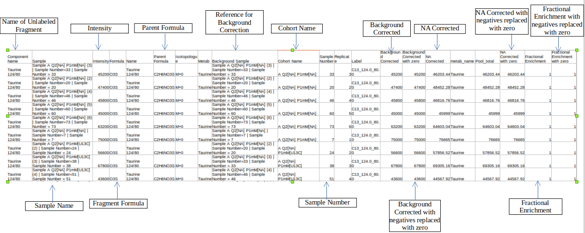 
 **Figure 14.** Merged Output 

##Visualization

After NA correction, you can visualize the NA corrected intensities, fractional enrichment and pool total plots that are generated according to the metabolite and quantification type.

*   **Select component type:** This allows you to select the component types: Component name, Isotopologue or Pool total for the plot.
*   **Select a metabolite**: This allows you to select a metabolite from the drop down options of all metabolites detected as per the intensity file uploaded.
*   **Select quantification type**: This allows you to select a quantification type from the drop down options of *Intensity*, *NA corrected*, *NA corrected with zero*, *Fractional Enrichment* and *Fractional Enrichment with zero*. The default value, in this case, is *NA corrected*.
*   **Select the cohort order to display:** Here you can select which cohort(s) to display. The tab by default shows all the cohorts.

Click "Run* to plot the fractional enrichment plot with all the labels present and for separate label elements and the pool totals plot.

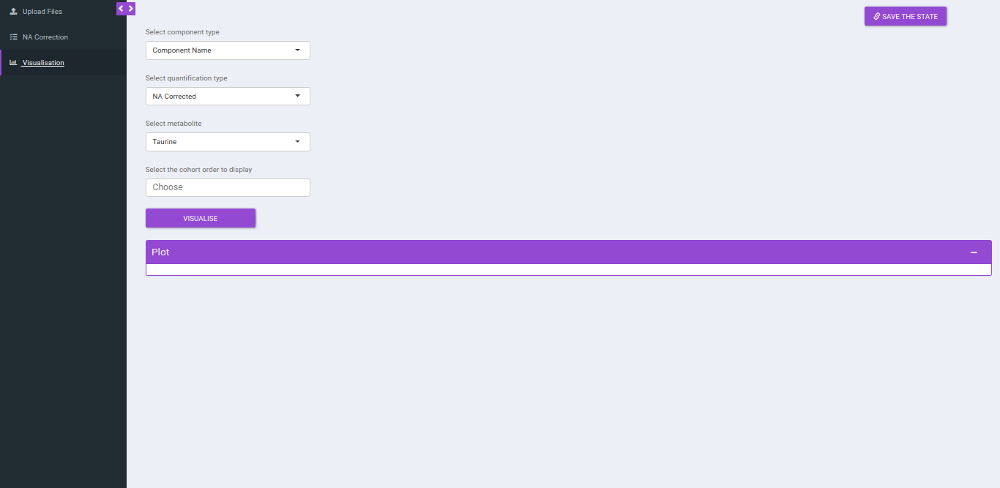 
 **Figure 15.** Visualization interface 

 
 **Figure 16.** Visualization plot 

## PhiBETA Tab

This tab enables you to perform Phi analysis. The term 'Phi' denoted by 'φ' is ratio of fractional enrichments of isotopomers/isotopologues of a product to the fractional enrichments of isotopomers/isotopologues of a precursor in the pathway.

- Consider, 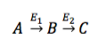, then 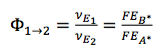, which means if there is **another flux** contributing to the generation of B, then other pathway contributes to **FE****B* **, in this case, **𝛷AB < 1**

- For eg: In the image shown below, Acetyl-CoA is generated from Pyruvate and with some contribution from Fatty acids. Then, **𝜱PAc** < **1** as Acetyl-CoA is also formed from Fatty Acids. If the only contributor is Pyruvate then **𝜱PAc** = **1**

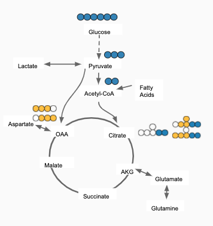
**Figure 17.** Acetyl CoA is generated from Pyruvate and Fatty acids

**Calculate Phi:** This allows you to set the parameters to calculate the Phi values based on the formula specified above. You can upload NA corrected file if it has been performed externally. In case, NA correction is performed within the app, there is no need to upload the NA corrected file and you can directly perform Phi calculation.

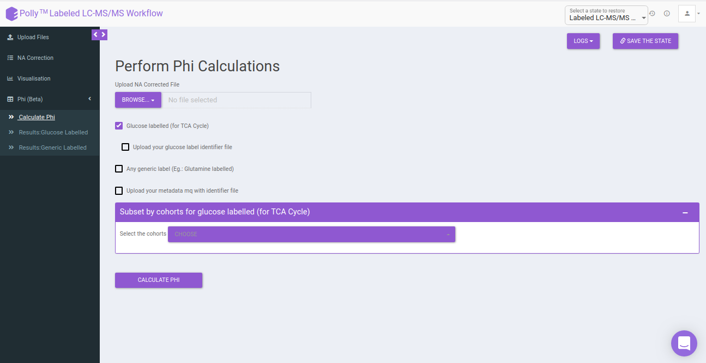 
**Figure 18.** Calculate Phi

Select the following options for Phi calculation:

- **Glucose labeled (for TCA cycle):** In case the data is 13C Glucose labeled, you can select this option for calculating the Phi. This will point to the metabolites of the TCA cycle contributing to the generation of that metabolite.

- **Upload your Glucose label identifier file:** By default, identifiers file with the expressions present within the app is used. If you want to make use of the identifier file for Glucose with additional expressions, you can upload the Phi expression file. Here, you will be provided with the option to upload Phi Expression File and Intermediate Expression File.

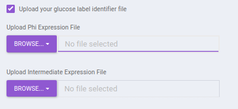 
**Figure 19.** Upload Glucose label identifier file

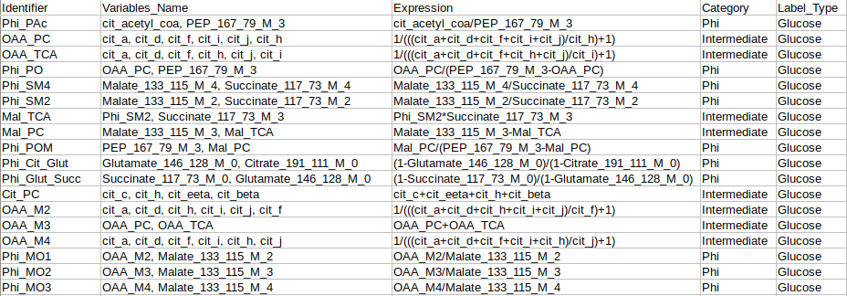

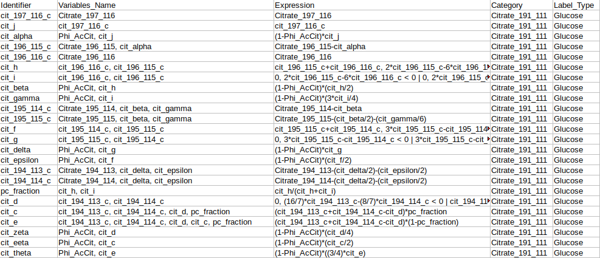
**Figure 20.** Glucose Phi expressions and intermediate expressions identifier file formats

- **Any generic label (eg: Glutamine Labeled):** In case you have any other generic label data other than Glucose, you can make use of this option. The app will perform Phi calculation in the same way as for 13C Glucose labeled elements.

- **Upload your generic label identifier file:** The app by default has the identifier expressions file for glutamine label. If at all, you have the identifier file for glutamine with additional expressions or any other generic label, you can select onto this option and further upload the identifier expression file for the same.

 
**Figure 21.** Upload Generic label identifier file

 
**Figure 22.** Generic label Phi expressions identifier file format

- **Upload your metadata mq with identifier file:** The app by default has the metadata mq identifier loaded, but in case you have made use of any additional expressions for the above parameters, you will have to upload your own metadata mq identifier file. Keeping it unchecked would utilize the metadata mq file within the app.

 
**Figure 23.** Metadata mq identifier file format

- **Subset by cohorts for glucose labeled (for TCA Cycle)**: You can subset the specific cohorts that belong to the Glucose labeled (for TCA Cycle) to proceed with the Phi calculation. You can type out a characteristic string that denotes the particular cohort and select onto the required cohorts from the dropdown.

- **Subset by cohorts for generic labeled**: You can subset the specific cohorts that belong to the belong to generic labeled to proceed with the Phi calculation. You can type out a characteristic string that denotes the particular cohort and select onto the required cohorts from the dropdown.

After uploading the necessary files, click on *Calculate Phi*.

**Results: Glucose Labeled:** This tab contains the output to Phi calculation performed on 13C Glucose samples. It consists of the following sub-tabs namely:

- **Calculated Phis:** This sub-tab contains a table of Phi values belonging to each identifier across the different samples. You can download the data as a CSV file as well.

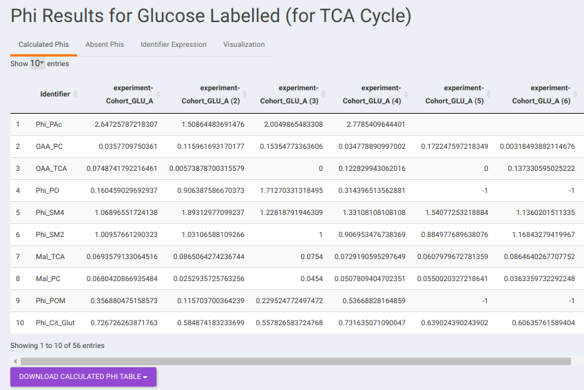 
**Figure 24.** Calculated Phis

- **Absent Phis:** This sub-tab contains a downloadable list of absent Phi values that could not be calculated possibly because of missing fragments withing the data provided.

- **Identifier Expression:** This sub-tab displays the list of identifier formulas used to calculate Phi values for the Glucose labeled data.

 
**Figure 25.** Identifier Expressions

- **Visualization:** The Visualization sub-tab consists of the type of visualizations to view the Phi of identifiers across the cohorts. Select *Individual Plot* or *Multi-select Plot* and enter cohorts to view in the visualization space. Further, you can select the identifiers of interest from the dropdown provided under Select the identifier option. You can as well specify the cohorts order.

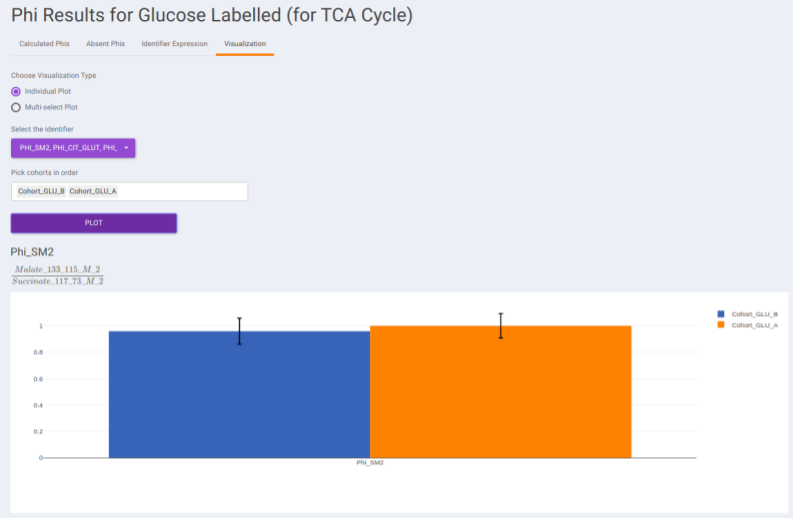 
**Figure 26.** Individual plot visualization

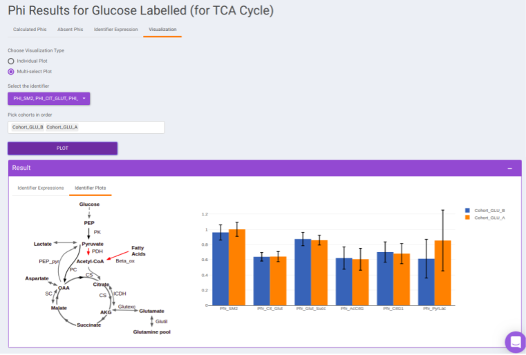 
**Figure 27.** Multi-select plot

**Results: Generic Labeled:** In case, you have selected generic labels i.e., other than 13C Glucose, this tab contains the output to Phi calculation performed on the other samples. It consists of the following sub-tabs namely:

- **Calculated Phis:** This sub-tab contains a downloadable list of Phi values that have been calculated for each identifier.

 
**Figure 28.** Calculated Phis (generic label)

- **Absent Phis:** This sub-tab contains a downloadable list of absent Phi values that the app could not match with the identifier table.

- **Identifier Expression:** This sub-tab displays the list of identifier formulas used to calculate Phi values for the generic labeled data. Here in the figure 28, we have for the glutamine label.

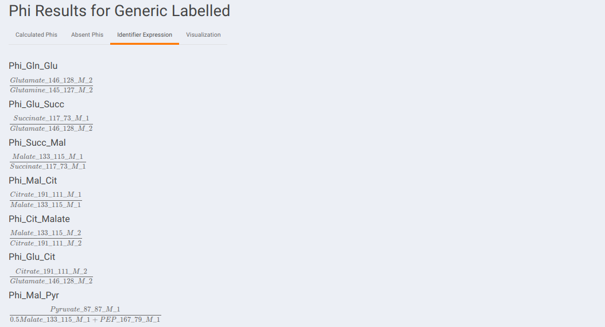 
**Figure 29.** Identifier Expression (generic label)

- **Visualization:** The Visualization sub-tab consists of the type of visualizations to view the Phi of identifiers across the cohorts. Select *Individual Plot* or *Multi-select Plot* and enter cohorts to view in the visualization space. Further, you can select the identifiers of interest from the dropdown provided under Select the identifier option. You can as well specify the cohorts order.

 
**Figure 30.** Individual Plot (generic label)

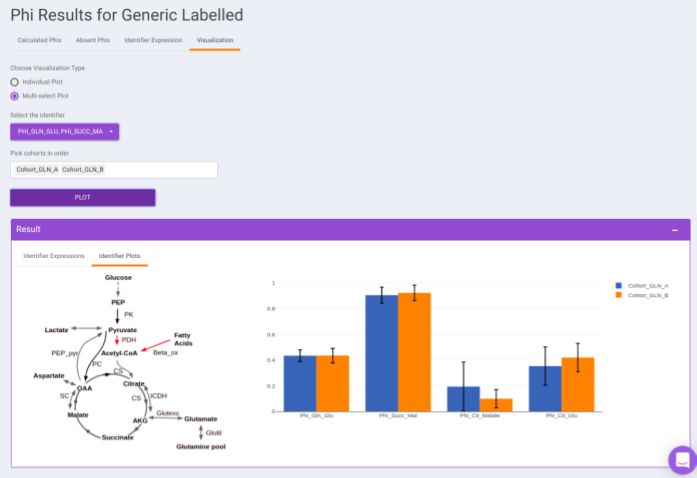 
**Figure 31.** Multi-select plot (generic label)

##Details about the app

**Autodetection of indistinguishable isotope**

A new feature in CORNA has the ability to auto-detect indistinguishable isotopes in experiments with dual tracers. Some high-resolution mass spectrometer instruments are able to distinguish isotopes like 13C from 15N. The packages available for performing natural abundance correction on these data assume infinite resolution, which means that it is assumed that if 13C can be resolved from 15N at all masses and it can also be resolved from other isotopes like 2D. However, this assumption becomes invalid as the resolution of the machine varies with the mass of the metabolite. Corna does not assume ultra-high resolution and corrects for partial indistinguishability in the data.

**Fractional enrichment**

Fractional enrichment is calculated for each label corresponding to every metabolite in a sample.

Fractional enrichment = corrected intensity of a label / sum of corrected intensities for all isotopologues including PARENT

**Pool total**

Sum total of intensities of every isotopologue (label) for each metabolite in a sample.

Pool total of metabolite ‘m’ in sample 1 = Sum (intensities of all labels of ‘m’ in sample 1)

#References

*   Lide, D. R., “CRC Handbook of Chemistry and Physics (83rd ed.). Boca Raton”, FL: CRC Press. ISBN 0-8493-0483-0, 2002.

*   Moseley H., “Correcting for the effects of natural abundance in stable isotope resolved metabolomics experiments involving ultra-high resolution mass spectrometry”,BMC Bioinformatics, 2010, 11:139.

