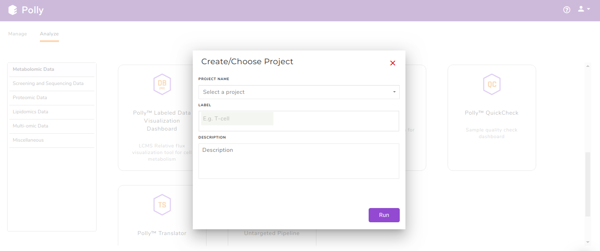

#Introduction

##Overview

Metabolomics is one of the key research areas focusing on small molecules present in a tissue or cell. MetScape Workflow allows you to process unlabeled LC-MS targeted, semi-targeted (without retention time) and untargeted data with insightful visualizations. You can directly upload CSV files obtained after peak detection in [El-MAVEN](https://resources.elucidata.io/elmaven) along with the cohort information. The [Polly Notebook](https://docs.elucidata.io/Scaling%20compute/Polly%20Notebooks.html) enables you to use in-built scripts for normalizing, transforming and visualizing data along with the ability to upload and use your custom scripts. The pathway dashboard allows you to track differentially expressed metabolites across cohorts and form hypothesis on not only individual metabolites but on pathways as well.

##Scope of the app

*   Supports analysis of targeted LC-MS data.
*   Processes high-resolution and low-resolution data of up to 100 samples.
*   Allows preprocessing of data through Polly Notebook.
*   Perform PCA and differential expression analysis.
*   Visualize significant metabolites on a global pathway map.
*   Use the differentially expressed results with the output of [RNA Seq Workflow](https://docs.elucidata.io/Apps/Screening%20&%20Sequencing%20Data/RNA%20Seq%20Workflow.html) to integrate multi-omics data in [IntOmix](https://docs.elucidata.io/Apps/Multi-omic%20Data/IntOmix.html).

 
**Figure 1.** MetScape

#Getting Started

##User Input

MetScape requires the following two files as input:

**Intensity file**

The intensity file should be in .csv format as shown in Figure 2. The .csv file exported after peak picking in El-MAVEN is the input file. For untargeted analysis, the output of [Untargeted Pipeline](https://docs.elucidata.io/Apps/Metabolomic%20Data/Untargeted%20Pipeline.html) serves as the input. 

 
**Figure 2.** Sample intensity file

**Cohort file**

The cohort file should be in .csv format as shown in Figure 3. This file should contain two columns, *sample* containing sample names along with *cohort* for its cohort information.

 
**Figure 3.** Sample cohort file

##Steps involved in data processing

*   Perform custom normalization, transforming and visualization
*   Perform differential expression analysis using limma (R-Bioconductor package) and visualize it using a volcano plot
*   Identify and reject sample outliers, if any from PCA plot
*   Perform sample based visualizations on Polly Notebook
*   Identify significant pathways and metabolites on the pathway dashboard
*   Move back and forth between various components of the workflow

##Caveats

*   The intensity values should not be NA or NaN for any metabolite.
*   There should not be any blank cell for the intensities.
*   Retention time and m/z information both are required to run the analysis.
*   The metabolites in the input file must have either KEGG IDs or HMDB IDs to map on the pathway dashboard.
*   All the samples present in the intensity files should also be present in the metadata file.
*   Each cohort must have at least three samples to successfully perform differential expression.
*   In the case of dual-mode data, the metabolite name should contain the polarity of the metabolite in the format *"MetaboliteName##polarity"*, ie. Glucose##pos or Fructose##neg.
*   During the identification of significant pathways, if the data consists, where the data consists of duplicates of metabolite features, they are filtered out on the basis of the parameters specified for significance. If at all, there are multiple occurrences of a metabolite, the one with the most significant *p*-value is mapped on the pathway dashboard. You can always revisit the duplicates from the *View Duplicates* option.
*   Differential expression will be performed on all possible cohort comparisons.
*   An analysis can not be restored simultaneously using two different tabs.

#Tutorial

##Upload files

Select *MetScape Workflow* from the dashboard under the *Metabolomics Data* Tab as shown in Figure 4. Create a *New Project* to be redirected to MetScape's upload page.

 
**Figure 4.** Polly Dashboard and Project selection

After the files have been successfully uploaded as shown in Figure 5, click on *Proceed* to move to Polly Notebook.

 
**Figure 5.** Upload page

##Polly Notebook

The Polly Notebook consists of a list of in-built scripts which can be selected from the toolbox present on the left-hand side as we can see in Figure 6.

 
**Figure 6.** Polly Notebook showing the visualization of sample distribution

The function of these in-built scripts is mentioned below:

**Go To Dashboard:** Clicking on this will take you to the next step

**Control Normalization:** This method is used to perform normalization with respect to Control cohort.

<pre><code>df<-control_normalisation(mavenData,metaData,'Control')</code></pre>

**Cyclic Loess Normalization:** To incorporate for negative intensity values post normalization, all intensity values are scaled so the least value is 1.

<pre><code>df<-cyclic_loess(mavenData)</code></pre>

**Log2 Transformation:** To incorporate for 0 intensity values, 1 is added to all intensity values pre-normalization.

<pre><code>df<-log_transform(df)</code></pre>

**Sample View Visualization:** This function is used to get the visualization of the intensity file for both pre- and post-normalization. 

<pre><code>sample_view(mavenData)</code></pre>

Click [here](https://docs.elucidata.io/Scaling%20compute/Polly%20Notebooks.html) for a detailed documentation about Polly Notebook.
    
**Note:**

*   The last data saved after transformation or normalization in *df* is taken forward.
*   After viewing the overall sample distribution and selecting the appropriate normalization technique, click on Go to *Dashboard* and hit Proceed to go to Pathway Dashboard. On the *Parameters* page, select the differential expression algorithm of interest and click on *Get Started* as shown in Figure 7.
*   In case no normalization is performed, you can choose to log2 transform your data just for the purpose of differential expression by checking the *Perform Log Transformation before Limma*.

**Figure 7.** Polly Notebook

 
**Figure 8.** Select algorithm and proceed to dashboard

##Pathway Dashboard

After data processing, a pathway map will be generated based on the default *p*-value and absolute log2 fold-change values as illustrated in Figure 8. Significantly differentially expressed metabolites are displayed as nodes on the KEGG pathway map. Metabolites that fall under the range of these default parameters have color code ranging from red-green, with red representing upregulation and green representing downregulation. The size of the node depends on the level of significance i.e, lower the *p*-value larger the node. Hovering on any node will display a dialog box within formation about the selected metabolite. Upon clicking a node, a bar plot opens comparing intensities of the particular metabolite across cohorts. You can also zoom in/out, select nodes on the interactive map or download in several formats available.

In case there are metabolites that could not be mapped on the pathway dashboard, a pop-up is shown. A list of these metabolites can be downloaded by clicking on *Download List*.

 
**Figure 9.** Pathway Dashboard

##PCA Plot

PCA is a common analysis technique to understand the clustering pattern between biologically grouped and ungrouped samples. Typically, an abnormal cluster or an outlier is representative of an issue in sample preparation. In case a sample displays an unusual behavior in the cluster belonging to a defined group, the sample should be dropped or reprocessed.

The PCA plot also provides you with the option to exclude samples from the dataset which could be blanks, unwanted samples or samples that didn’t have a good run during MS processing. Clicking on any sample will open a dialog box with the option *Remove Outlier*. Clicking on this will allow you to decide whether to remove this sample from the PCA Plot (*Realculate PCA*) or from the entire analysis (*Remove from Dataset*). Recalculate PCA will update the PCA plot whereas *Remove from Dataset* will update the entire analysis including the PCA plot, Volcano plot and the Pathway Dashboard. Excluded samples can be added back by wither clicking on the "+" sign beside the sample name or selecting the relevant samples and clicking on *Add Back*  as we can see in Figure 9.

 
**Figure 10.** PCA Plot

##Volcano Plot

Volcano plot helps you to observe metabolites significantly changing between two cohorts. In Figure. 10, log2 fold change and log10 *p*-values are evaluated based on default parameters set to (log2 fold change > 1 and log2 fold change < -1) and *p* < 0.05 respectively. You can hover over a particular point on the plot to view *p*-value and fold change. In case there are more than one cohort comparison in your data, you can use the drop downs present in *Differential Expression* to choose which specific comparison to visualize and click on *Apply*. Any change in the cohort comparisons will update the Volcano Plot and the Pathway Dashboard accordingly.

 
**Figure 11.** Volcano Plot

##View Duplicates

There might be instances where you would have considered all the putative peak groups reported for a metabolite and goes ahead with the thought to filter them out in the down-stream analysis once you are certain. The duplicates of the metabolite are found on the basis of the *compoundId* column in the intensity file. The first filtering is done by making use of the cut-off specified for the significance where the app takes into consideration only the significant metabolic features, there is a possibility that one might filter out the duplicates here itself. If at all, there are multiple occurrences of a metabolite (based on *compoundId*), then the one with more significant adj. *p*-value is represented on the KEGG map. However, if you want to revisit the metabolic features to select the desired representative feature, the *View Duplicates* option allows you to select onto the required feature from the table as shown in Figure 12.

You can select the metabolite feature(s) from the table by clicking onto the check-box and further, clicking on *Update*. This shall update the pathway dashboard with the selected feature.

 
**Figure 12.** View Duplicates Table

##One Click ReportBETA

One Click Report (OCR) is a functionality that allows you to generate reports in a standard format. It is extremely helpful when standard processes have been decided upon to generate results. Presence of a standardized reporting functionality also ensures reproducibility within an organization over a period of years. It is generated with parameters as specified by you. It can be saved in PDF and HTML formats and will be accessible from the *Report* section inside the project.

The following information is mandatory to generate a report:

*   **Title of the Report:** To provide a name to the report
*   **Description of the Report:** To describe the experiment performed
*   **Analysis Insights:** To list out the insights that are generated from the analysis
*   **Adj. pval cutoff:** To specify the cut-off for the adj. *p*-value used to generate the volcano plot and pathway dashboard
*   **log2FC cutoff:** To specify the cut-off for the log2 fold change used to generate the volcano plot and the pathway dashboard
*   **Create Comparisons:** To specify the cohorts of interest from the data provided. Once, a cohort comparison is specified, you can click on the '+' sign to add another comparison
*   **Generate:** Click on Generate to create the report

 
**Figure 13.**  One Click Report

#Details about the app

MetScape broadly works on the concept of differential expression analysis where the aim is to identify those metabolites whose expression differs under different cohort conditions. These differentially expressed metabolites are mapped onto the KEGG map to enable the global pathway analysis. The 'limma' R package is used to identify the differentially expressed metabolites. This method creates a log2 fold change ratio between the disease and control condition and an 'adjusted' *p*-value that rates the significance of the difference.

# Frequently Asked Questions (FAQs)

| S.No |                                                Questions                                                |                                                                                                                                                                                                                                  Answers                                                                                                                                                                                                                                 |
|------|:-------------------------------------------------------------------------------------------------------:|:------------------------------------------------------------------------------------------------------------------------------------------------------------------------------------------------------------------------------------------------------------------------------------------------------------------------------------------------------------------------------------------------------------------------------------------------------------------------:|
| 1    | **What is MetScape?**                                                                | MetScape is an end-to-end workflow that enables you to process  unlabeled LC-MS targeted, semi-targeted or untargeted data and generate meaningful visualizations.                                                                                                                                                                                                                                                                               |
| 2    | **How can I test MetScape  if I don't have my own data?**                            | You can download the demo data set by clicking on the Demo Files button on MetScape Upload page.                                                                                                                                                                                                                                                                                                                                                     |
| 3    | **What are the required input files?**                                                                  | There are two input files required. The intensity file is the .csv file generated  after peak detection in El-MAVEN. It contains a list of metabolites along with their  m/z, rt and intensity values across different samples. The cohort mapping file consists  of the cohort information of every sample file that is uploaded.                                                                                                                                       |
| 4    | **Can I use MetScape if I  don't have the retention time information?**              | No. Retention time is mandatory as it is useful for separating duplicates.                                                                                                                                                                                                                                                                                                                                                                                               |
| 5    | **Can I use MetScape if I don't have the HMDB IDs or KEGG IDs for my  metabolites?** | To use MetScape you need HMDB IDs or KEGG IDs using which  metabolites are mapped on the pathway dashboard.                                                                                                                                                                                                                                                                                                                                           |
| 6    | **Can I use public data sets on MetScape?**                                          | Yes, public data sets can be processed using the following procedure: Convert  the instrument generated raw files to .mzML or .mzXML using [MSConvert](http://proteowizard.sourceforge.net/tools.shtml). Process  the files in El-MAVEN. For targeted analysis, perform peak annotation against  a compound database. For untargeted analysis, perform feature detection and  then run [Untargeted Pipeline](https://docs.elucidata.io/Apps/Metabolomic%20Data/Untargeted%20Pipeline.html).Prepare the cohort file. Run  the intensity and cohort files in MetScape. |
| 7    | **Can I check the quality of my samples in MetScape?**                               | Yes, for quality check, MetScape prepares interactive PCA  Plot from your data. The interactive plot enables you to remove any outliers  from your analyses.                                                                                                                                                                                                                                                                                          |
| 8    | **What should I do if l get an error on MetScape?**                                  | You can directly message us on Intercom (icon on the bottom right of your screen)  or you can e-mail to the Polly Support Team.                                                                                                                                                                                                                                                                                                                                          |
