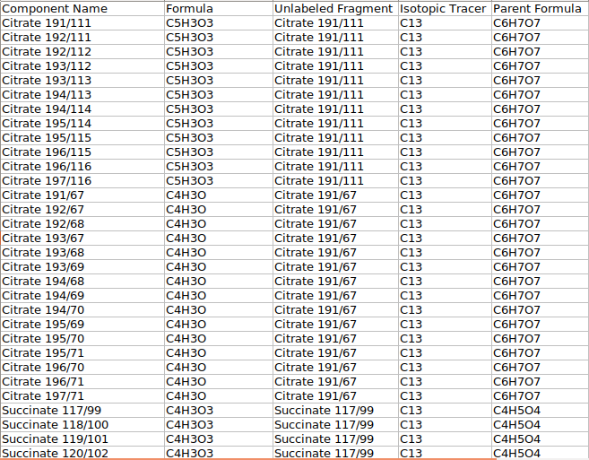
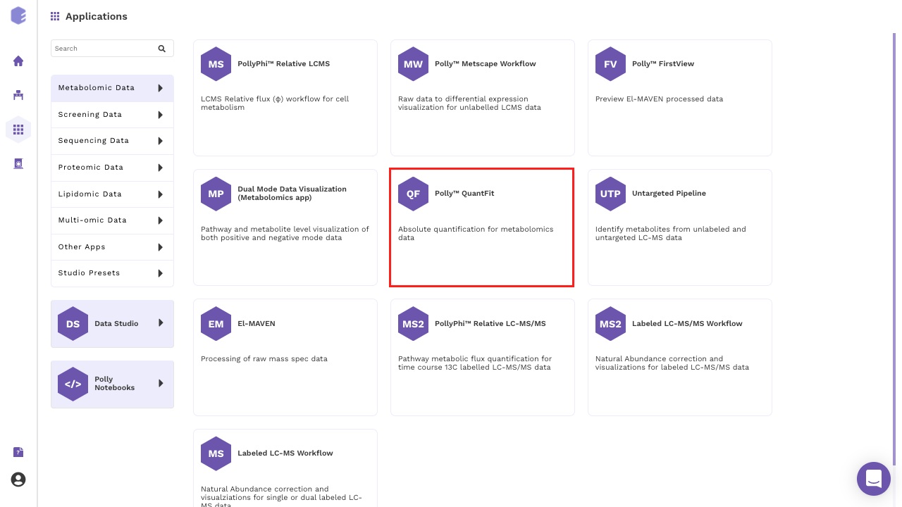
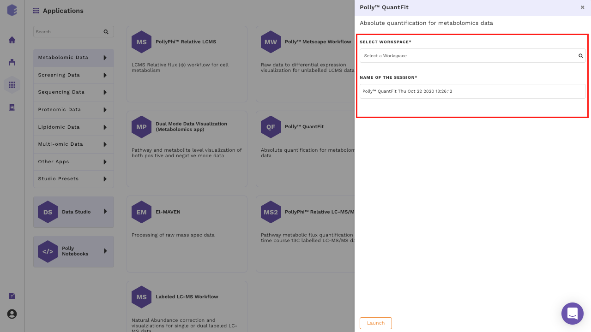
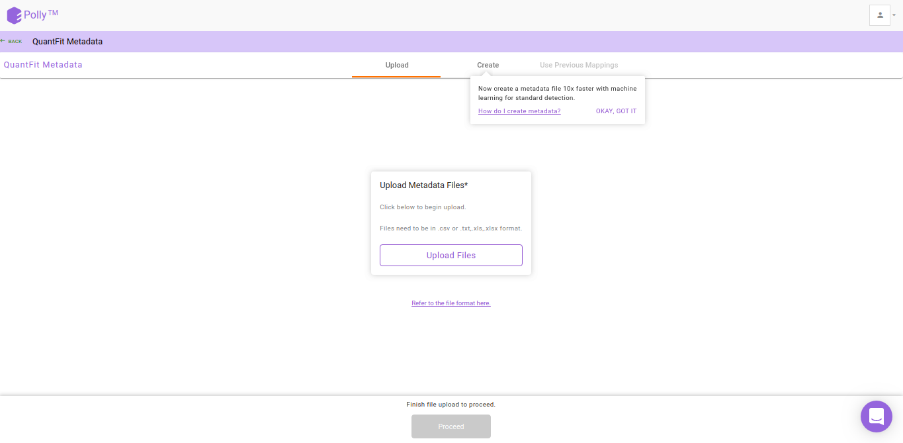
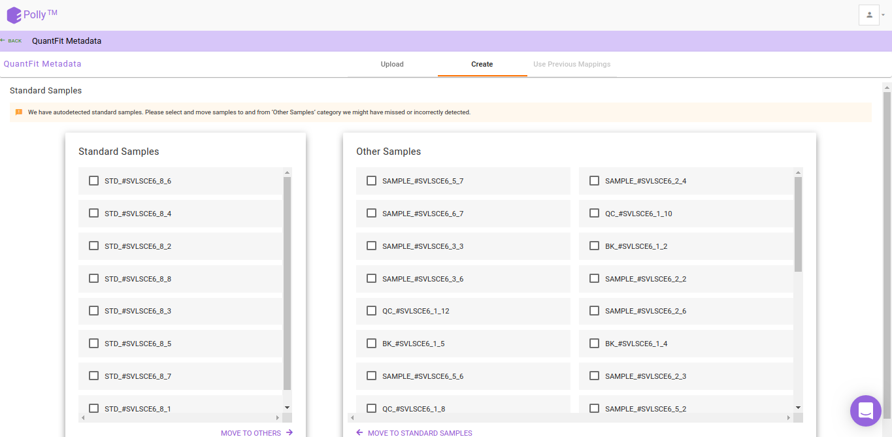
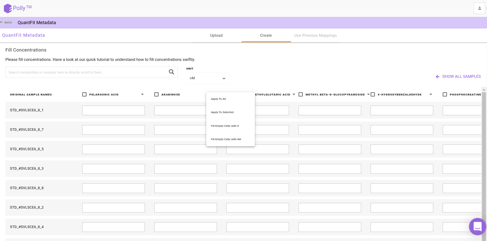
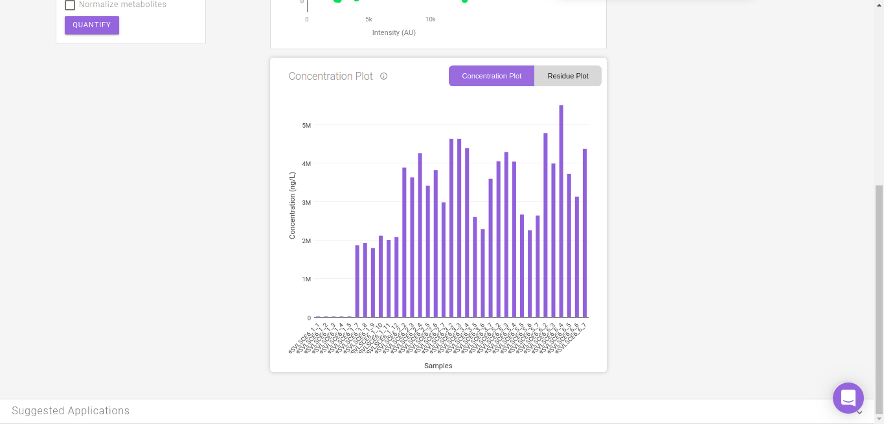
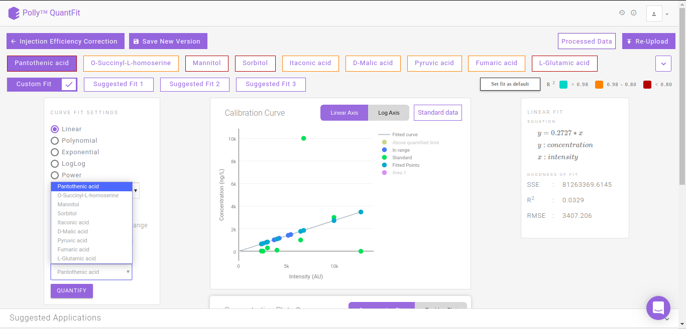
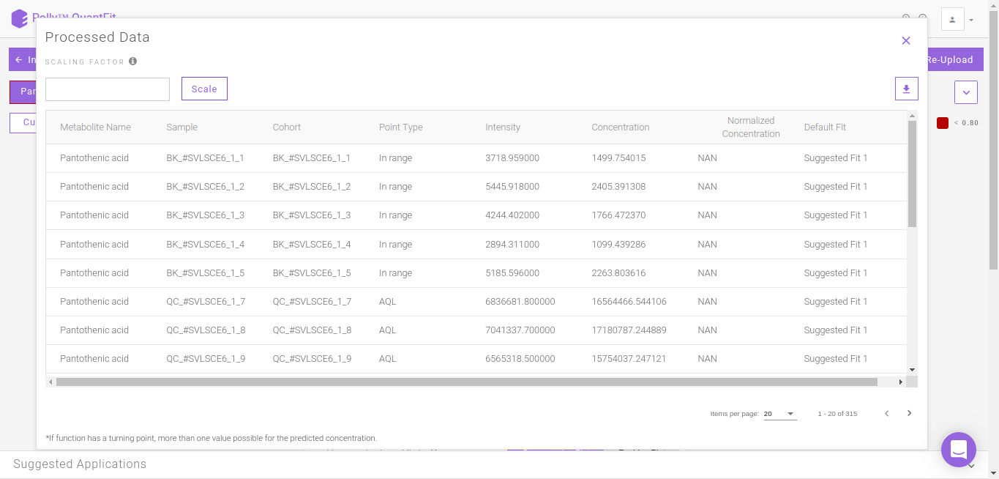
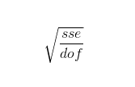

#Introduction

##Overview

Calibration refers to the process of quantifying samples of unknown concentrations with known (standard) samples. Mass spec experiments are a crucial component of metabolomics experiments but the output obtained from software like [El-MAVEN](https://resources.elucidata.io/elmaven) and [MultiQuant](https://sciex.com/products/software/multiquant-software) are intensities which are unitless. From these intensities, we can calculate fractional enrichment and do relative comparisons. But for some analysis like kinetic flux analysis, we need absolute concentrations of the metabolites. These concentrations have units like M, μM, mM like any other chemical concentration. In order to absolutely quantify these metabolites, experiments are done with standard samples of known concentrations. QuantFit uses these data points to get mathematical mappings from intensities to concentrations which are subsequently used to calculate concentrations of experimental intensities.

##Scope of the app

*   Quantifies intensities obtained from El-MAVEN and MultiQuant using internal standards.

*   Supports quantification of metabolites and labeled fragments of metabolites.

*   Provides various curve fitting options like linear, exponential, log-log, polynomial and power.

*   Provides an option to correct the injection efficiency of samples using total ion count normalization.

*   Provides the biosample concentration plot to visualize the concentration of all biosamples in a barplot.

*   Incorporates Grubbs' test to detect outlier samples.

*   Provides various options to optimize the curve fit with e.g.:

    *   Slope-intercept equation for quantification

    *   Rejecting outlier samples

    *   Normalizing concentration values with an internal standard

    *   Assigning weights to the standard samples

 
**Figure 1.** QuantFit

#Getting Started

##User Input

QuantFit requires the following three files as input:

**Intensity file**

The intensity file is mandatory for both LC-MS and LC-MS/MS data and should be in either .csv, .xls, .xlsx, .txt format.  

The intensity file can be either in the long format.

 
**Figure 2.** Sample intensity file in long format

where,

*   *Original Filename* is the Sample name

*   *Sample Name* is the Cohort name

*   *Component Name* is the Name of the metabolite

*   *Mass Info* is the Mass information of fragments

*   *Area* is the Intensities

Or it can be the .csv file exported after peak picking in El-MAVEN.

 
**Figure 3.** Sample intensity file exported from El-MAVEN

**Metadata standard sample file**

The metadata standard file is mandatory for both LC-MS and LC-MS/MS data and should be in either .csv, .xls, .xlsx, .txt format. This file contains concentration information of the standard samples using which quantification is performed.

 
**Figure 4.** Sample metadata standard file

where,

*   *Original Filename* is the Standard sample name

*   *Sample Name* is the Standard cohort name

*   *Concentration* is the Concentration of standard samples

*   *Unit Info* is the Unit of concentration

*   *Unlabeled Fragment* is the Unlabeled fragment information

**Metadata mapping file**

The metadata mapping file is optional LC-MS but mandatory for LC-MS/MS data and should be in either .csv, .xls, .xlsx, .txt format. This file is required to map daughter fragments to their parent fragments.

 
**Figure 5.** Sample metadata mapping file

where,

*   *Component Name* is the Name of the daughter fragments

*   *Formula* is the Formula of the particular daughter fragment

*   *Unlabeled Fragment* is the Name of the metabolite

*   *Isotopic Tracer* is the Element that was labeled

*   *Parent Formula* is the Formula of the parent fragment

##Steps involved in data processing

*   Process MS files using El-MAVEN or MultiQuant

*   Upload intensity files

*   Create/Upload metadata files

*   Adjust quantification parameters and Quantify

*   Download quantification files in CSV format

##Caveats

*   We use the entire standard and negate any background subtraction.

*   All isotopologue intensities are added to the parent intensity in case of labeled data.

*   Standard samples should contain “std” in their cohort name.

*   *Mass Info* column in the metabolite intensity file should be 0 throughout for LC-MS data

*   In case there are no cohorts in your data, the contents of *Sample Name* and *Original Filename* in the standard metadata file should be the same.

*   *Unlabeled Fragment* in the standard metadata file is the metabolite name for LC-MS data.

#Tutorial

##Uplaod Files

Select QuantFIt from the dashboard under the *Metabolomics Data* tab. Create a *New Workspace* or select an existing one from the drop-down and provide the *Name of the Session* to be redirected to QuantFit's upload page.

 <!-- 
**Figure 1.** Sample metadata mapping file
 -->

 
**Figure 6.** Polly Dashboard and Workspace selection

Click on *Upload File* and upload the metabolite intensity file.

 
**Figure 7.** Upload page

##Metadata Interface 

After the file have been successfully uploaded you will be redirected to the Metadata interface. This interface provides you the ability to either upload or create your metadata.

 
**Figure 8.** Upload metadata by clicking on *Upload Files*

 
**Figure 9.** Create metadata by selecting the standards within the data

 
**Figure 10.** Enter concentration values for all the standard samples across all metabolites in a few clicks

Watch the demo video below for more information.

    <iframe src="https://www.youtube.com/embed/A37ra2Lh3yI" frameborder="0" allowfullscreen style="position: absolute; top: 0; left: 0; width: 100%; height: 100%;"></iframe>

 

##Injection Efficiency Correction

Injection Efficiency Correction is used to normalize the biosamples with respect to internal standards in the data on the basis of total ion count. We recommend the highest intensity non-outlier sample when correcting for injection efficiency. You can also select a sample from the outliers detected with Grubbs' test for this normalization. 

To normalize intensities of metabolites present in the sample, by default we calculate a normalizing factor for each sample. This is calculated by dividing each intensity value by the maximum intensity value among the non-outlier samples. Then the intensity values of all metabolites in each sample is divided by the respective normalizing factor. You can also select this highest intensity sample from the list of outlier samples. QuantFit uses [Grubb's test](https://en.wikipedia.org/wiki/Grubbs%27_test_for_outliers) to detect outliers from among the samples.

 
**Figure 11.** Select internal standard metabolite and a sample for injection efficiency correction. 

##Quantification Dashboard

By default, linear quantification will be performed by the tool after performing the above-mentioned steps. However, you can optimize quantification by changing the curve fit to Polynomial, Exponential, LogLog or Power depending upon your data. In case you feel there is an outlier in your data, click on the sample and then on the “-” sign in the pop-up box as shown in FIgure. 13. Click on *Quantify* to recalculate the curve fit  at the new parameters.

 
**Figure 12.** Quantification Dashboard

QuantFit plots quantified values and standard values on the calibration curve. You can optimize the curve fit from this interface or view this curve on linear and log axes for better analysis.

 
**Figure 13.** Calibration curve

The *Concentration Plot* gives the concentrations across all biosamples as a barplot. The *Residue Plot* gives the residual error for the curve fit as a barplot. You can toggle between these plots by clicking on their names as shown in Figure 14.

 
**Figure 14.** Residue and Concentration plot

Clicking on *Standard Data* on the *Calibration Curv*e shown in Figure 12. gives information about the standard mappings in the input file.

 
**Figure 15.** Standard data

##Suggested Fits

The suggested fits option makes it possible for you to save time spent on manually curating data by removing outliers and selecting the best fit. The samples furthest from the default linear curve are removed individually and the curve fit is calculated. Subsequently the fits calcualted with the best r2 apart from the default linear fit (*Custom FIt*) are displayed as *Suggested Fit 1*, *Suggested Fit 2* and *Suggested Fit 3*. You can select any fit and mark it as the default fit by clicking on *Set Fit as Default*.

 
**Figure 16.** Suggested Fits

#Normalization

You can also normalize the quantified concentration values with respect to an internal standard's concentration values. You can select an internal standard from the list of metabolites for normalization. To normalize the concentration of a given metabolite, concentrations from individual samples are divided by the respective concentration of the internal standard.

 
**Figure 17.** Normalization

##Logs

It summarizes all the information of each curve fitting performed for every metabolite.

*   Missing metabolite data: Metabolites for which standard sample is absent

*   Name of metabolite

    *   Curve fit information: Type of fit

    *   Standard Point Information: Standard data information for the metabolite

    *   Curve Fit Performed: Curve fitting information and Goodness of fit

 
**Figure 18.** Logs

##Processed Data

It shows the quantified values of every metabolite in a table. This can be downloaded as a .csv file by clicking on the download icon.

 
**Figure 19.** Processed data

#Details about the app

##Goodness of fit (GOF) parameters

The following section describes the formula used for calculating the curve's goodness of fit

**Sum of squares about the mean**

 <!-- 
**Figure 1.** Processed data
 -->

where:

*y*: list of observed values

*y_av*: the average of observed values

*weight*: weights given to the sample points (by default 1 is given to each sample point)

**Note:**

*   For Gaussian uncertainties, sigma instead of 1/sigma2 is used

**Sum of squares of residuals**

 <!-- 
**Figure 1.** Processed data
 -->

where:

*ob*: list of observed values

*pr*: list of predicted values

*weight*: weights given to the sample points

**Note:** 

*   For Gaussian uncertainties, sigma instead of 1/sigma2 is used

R2

 <!-- 
**Figure 1.** Processed data
 -->

where:

*sst*: the sum of squares of residuals

*sse*: the sum of squares about the mean

**Root mean square error**

 <!-- 
**Figure 1.** Processed data
 -->

where:

*sse*: the sum of squares of residuals

*dof*: the model degrees of freedom, is the length of y minus the number of parameters calculated in the model

##Errors and warnings

**Errors raised while selecting files for uploading**

*   Number of files error: *Three files are required for quantification*. If you try to upload more than two files then this error is thrown by the tool.

*   File type error: *Please select the correct file type*. If the selected file and file type do not match, then this error is thrown by the tool.

**File validation errors and warnings**

*   Missing Value warning: It is raised when any column in the uploaded files has missing values. It also specifies the action taken by the tool if you choose to continue.

    Example:

    Warning - Row Number **8192** : column **Area** has **missing** value Action Taken - Missing value of columns replaced with 0

#Videos

    <iframe src="https://www.youtube.com/embed/Ma5Ti3GRayE" frameborder="0" allowfullscreen style="position: absolute; top: 0; left: 0; width: 100%; height: 100%;"></iframe>

 

#References

*   Gorrochategui E. et al, "Data analysis strategies for targeted and untargeted LC-MS metabolomic studies: Overview and workflow", TrAC Trends in Analytical Chemistry 2016 82, 425-442
