#Introduction

##Overview

Untargeted Metabolomics, otherwise known as discovery metabolomics, analyzes the metabolomic profile globally from each sample thus producing voluminous and complex data. This needs robust bioinformatics tools to help meaningfully interpret this data. The Untargeted Pipeline enables you to perform the annotation and identification of the metabolites. It uses [CAMERA](https://www.ncbi.nlm.nih.gov/pubmed/22111785), a package built for annotation of the adducts, isotopes, fragments and then maps features to a reference compound database (KEGG, HMDB or a custom database). The workflow begins with automated peak curation on El-MAVEN using the Untargeted algorithm and the peak table derived from this is used as input for PollyTM Untargeted  Pipeline.

##Scope of the app

*   Annotate adducts, isotopes and fragments in the data and identify metabolites
*   Perform downstream analysis such as differential expression, anova test and pathway enrichment.

**Figure 1.** Untargeted Pipeline

#Getting Started

##User Input

Untargeted Pipeline can take a csv file are well as a emdb file as input.

**Emdb File**

The emdb file used here is a RSQLite database file generated when an El-MAVEN session is saved. It has all the unannotated features along with other features of the peaks. An emdb file can have multiple feature tables, and you can select the feature table to use in the downsteam pipeline thhrough the dropdown.

**Intensity File**

The intensity file used here is the El-MAVEN output in peak detailed format. This output contains unannotated features along with their retention time and m/z information. 

**Figure 2.** El-MAVEN intensity file

**Metadata File**

The metadata file contains the sample to cohort mapping information that will be used in the downstream processing of the data. 

**Figure 3.** Metadata file

##Steps involved in data processing

*   Process raw data on El-MAVEN using automated feature detection.
*   Export intensity file in peak detailed format.
*   Annotate adducts, isotopes and fragments in the data.
*   Perform identification of metabolites.
*   Perform downstream analysis such as differential expression, anova test and pathway enrichment.

##Caveats

*   The input file should be the peak detailed output of El-MAVEN.
*   The emdb file should be the one generated from El-MAVEN.

#Tutorial

Go to the dashboard and select Untargeted Pipeline under the *Metabolomcis Data* tab. Create a *New workspace* or choose from the existing ones and provide a *Name of the Session* to be redirected to the upload page.

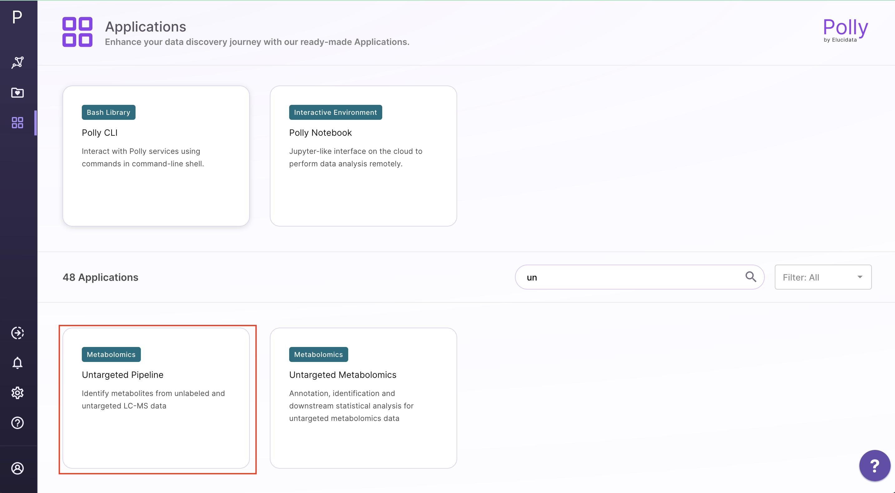
**Figure 4.** Polly Dashboard

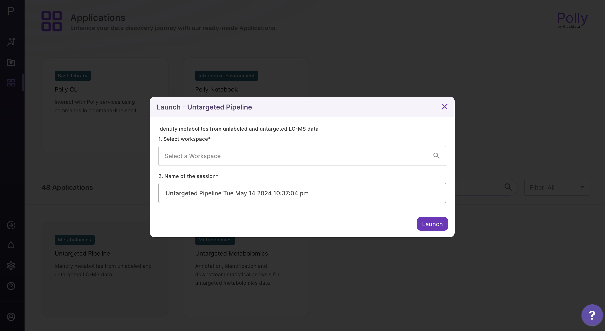
**Figure 5.** Untargeted Pipeline

##Upload Files

The upload data tab allows you to upload El-MAVEN output in a csv format or an emdb file containing peak information along with the cohort file up to 300MB. Upload either the intensity file or an emdb file along with cohort file using the drop downs shown below, select the polarity of the data and then click on *Load Data* to proceed.

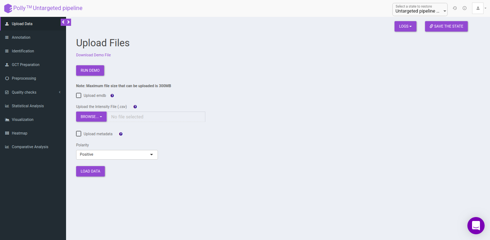
**Figure 6.** Upload files

##Annotation

For annotation, we use the R package, CAMERA. It takes the output in peak detailed format from El-MAVEN which contains. The file should contain *mzmin* and *mzmax* details in the file.

**CAMERA**

CAMERA operates in the following steps:

*   First it groups the features by their retention time
*   It then forms groups by correlation inside samples (EIC) or correlation across samples or both
*   After grouping these features, it annotates the possible isotopes and adducts.

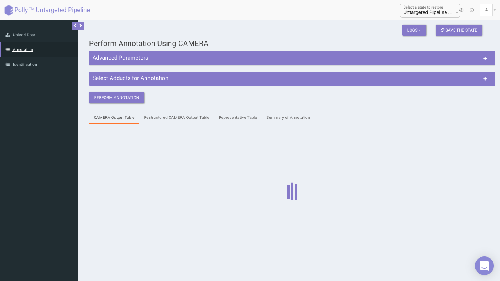
**Figure 7.** Annotation

**Advanced parameters**

The following parameters need to be set before running CAMERA:

*   **cor_exp_th:** Correlation threshold for EIC correlation (Range: 0-1)
*   **pval:** *p*-value threshold for testing correlation of significance (Range: 0-1)
*   **perfwhm:** percentage of FWHM (Full Width at Half Maximum) width used in "*groupFWHM*" function for grouping features
*   **sigma:**  multiplier of the standard deviation used in "*groupFWHM*" function for grouping features
*   **calccis:** Use correlation inside samples for peak grouping (TRUE/FALSE)
*   **calccas:** Use correlation across samples for peak grouping (TRUE/FALSE)
*   **max_iso:** maximum number of expected isotopes (0-8)
*   **minfrac:** The percentage number of samples, which must satisfy the C12/C13 rule for isotope annotation
*   **ppm:** General ppm error
*   **mzabs:** General absolut error in m/z
*   **multiplier:** If no ruleset is provided, calculate ruleset with max. number n of [nM+x] clusterions
*   **max_peaks:** How much peaks will be calculated in every thread using the parallel mode
*   **maxcharge:** maximum ion charge

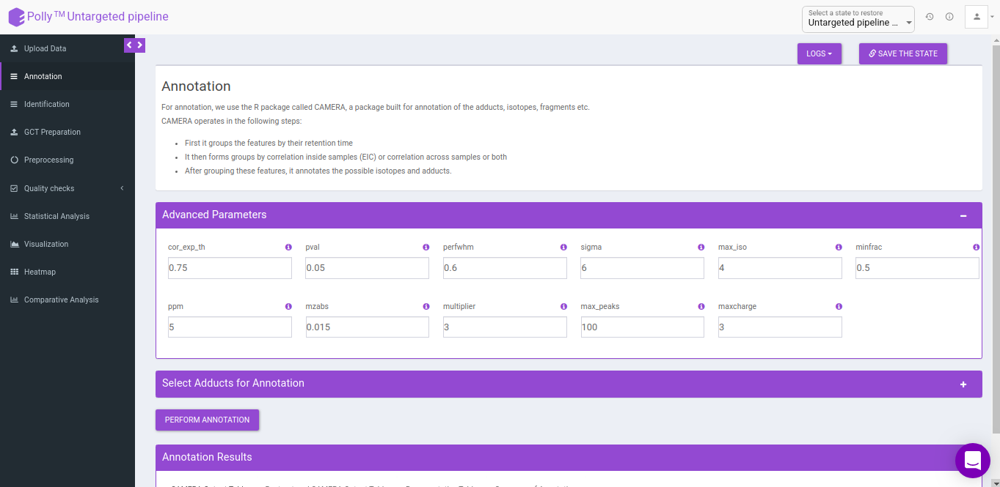
**Figure 8.** Advanced parameters

**Select adducts for annotation**

You can select adducts that are needed for annotation.

*   **Available Adducts Rules:** The default adduct rules file is present which can be used for annotation.
*   **Upload Custom Adducts Rules:** You can upload the custom adducts rules file otherwise.
*   The adducts rules file has the following columns:

    *   *name:* adduct name
    *   *nmol:* Number of molecules (xM) included in the molecule
    *   *charge:* charge of the molecule
    *   *massdiff:* mass difference without calculation of charge and nmol (CAMERA will do this automatically)
    *   *oidscore:* This score is the adduct index. Molecules with the same cations (anions) configuration and different nmol values have the same oidscore, such as [M+H] and [2M+H]
    *   *quasi:* Every annotation which belongs to one molecule is called annotation group. Examples for these are [M+H] and [M+Na], where M is the same molecule. An annotation group must include at least one ion with quasi set to 1 for this adduct. If an annotation group only includes optional adducts (rule set to 0) then this group is excluded. To disable this reduction, set all rules to 1 or 0.
    *   *ips:* This is the rule score. If a peak is related to more than one annotation group, then the group having a higher score (sum of all annotations) gets picked. This effectively reduces the number of false positives.

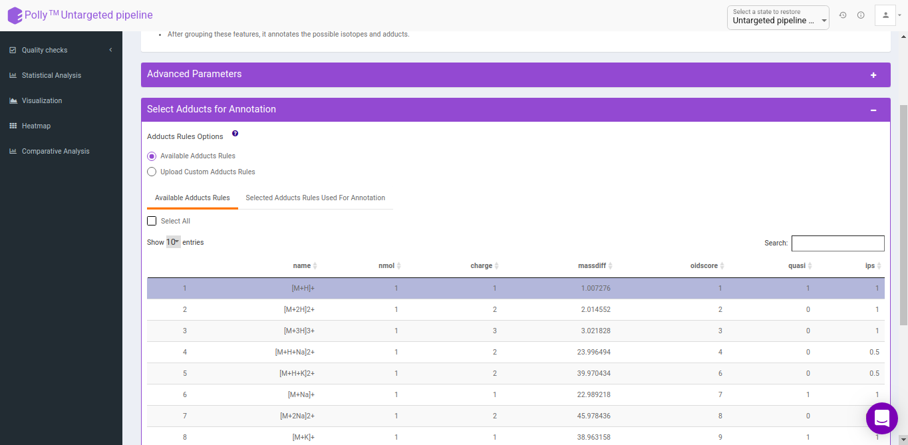
**Figure 9.** Select adducts for annotation

**CAMERA output table**

After annotation CAMERA adds three columns i.e. isotopes, adducts and pcgroup. The isotopes column contains the annotation for the isotopes where annotation is in the format of "[id][isotope]charge" for example [1][M]+, [1][M+1]+, [2][M+3]+. 

The adduct column contains the annotation for the adducts where annotation is in the format of "[adduct] charge basemass" for example [M+H]+ 161.105, [M+K]+ 123.15 etc. The pcgroup column contains the ‘pseudospectra’ which means features are grouped based on rt and correlation (inside and across samples).

**Figure 10.** CAMERA output table

**Restructured CAMERA output table**

The features in the CAMERA output are not grouped together according to the *pcgroup* because it only appends the new columns in the existing feature table without changing the order of the features and also features which are different molecules may have the same *pcgroup*. So to interpret the results better it is necessary to separate the features which belong to different molecules within the same *pcgroup*.

To overcome the above problem, there is another label of grouping based on the features belonging to the same molecule. The other label of grouping is done by assuming that the features which are representing the same molecule should have the same basemass.

The following operations are performed to make the restructured CAMERA output:

*   The *adduct* column is split into two new columns i.e. *adduct_type* and *basemass*. If any feature has more than one combination of *adduct_type* and *basemass* for example "[M+K]+ 123.15 [M+Na]+ 139.124 [M+H]+ 161.105" then they are split into separate rows having other information same.

*   The *isotopes* column is split into two new columns i.e. *isotope_id* and *isotope_type*.

*   A new column *feature_group* is added in the existing table where each value represents a different molecule. The *feature_group* column is filled based on the following assumptions:

    *   Features having basemass will have the same *feature_group* id.

    *   Those features which do not have the adducts (which CAMERA could not annotate) will be filled by [M+H]+ (in positive mode) or [M-H]- (in negative mode) as adduct and based on this adduct information the *adduct_type* and *basemass* columns will be filled.

    *   Features having the same isotope_id will be grouped in the same *feature_group* id.

    *   The same *pcgroup* may have more than one feature_group ids if it has more than one molecule.

**Figure 11.** Restructured CAMERA ouput table

**Representatiove output table**

After restructuring the CAMERA output it is necessary to define the representative feature from the features belonging to the same feature_group id because since these features belong to the same molecule so there is no need to include all features in the identification step. 

The representative feature is defined based on the following assumptions:

*   If the feature group has only one feature then that feature will be considered as the representative feature.

*   The feature group has more than one feature then the representative feature will be determined by the following criteria:

    *   If the feature group has [M+H] (in positive mode) or [M-H] (in negative mode) then that feature will be considered as the representative feature. 

    *   If the feature group does not have [M+H] (in positive mode) or [M-H] (in negative mode) then that feature will be considered as representative whose sum of intensity across all samples is maximum.

**Figure 12.** Representative CAMERA ouput table

**Summary of annotation**

The data is summarized on the basis of the number of features within *pcgroup* and feature group:

*   Number of features vs counts of *pcgroup*

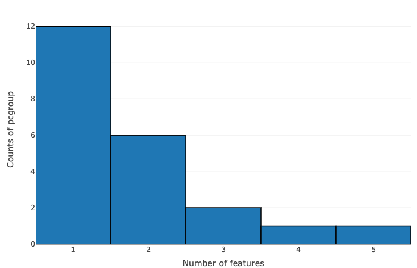
**Figure 13.** Number of features vs counts of *pcgroup*

*   Number of features vs counts of feature groups

**Figure 14.** Number of features vs counts of feature groups

##Identification

The identification is performed on the representative table only. The representative features are searched against the compound database uploaded. 

It uses the *basemass* instead mZ for mass searching because adducts and isotopes are already filtered in the above steps.

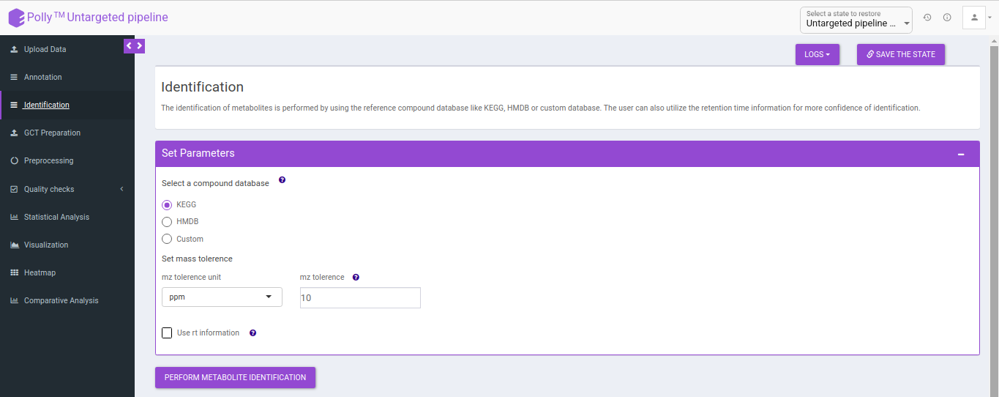
 **Figure 15.** Advanced parameters

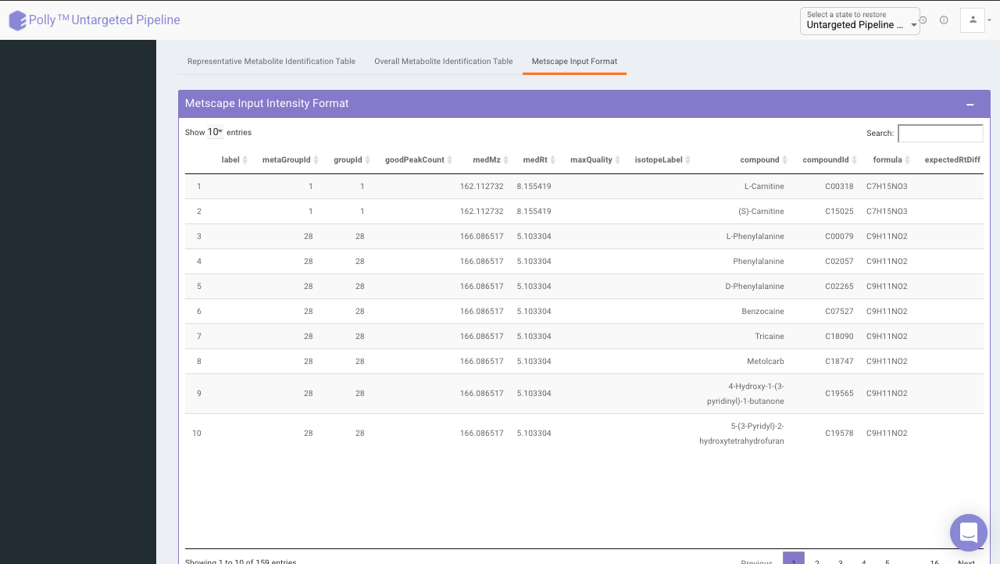
**Figure 16.** Identification

**Representative metabolite identification table**

The representative table is appended by the compound database columns after identification.

**Figure 17.** Representative metabolite identification table

**Overall metabolite identification table**

The representative metabolite identification table is again merged to the restructured camera output.

**Figure 18.** Overall metabolite identification table

**El-Maven format**

The results are generated by converting the representative and overall tables in the group summary format.

**Figure 19.** El-Maven output(Group Summary format)

##GCT-Preparation

This interface allows you to select the data to be used in the downstream pipeline. You can use any data to the downstream analysis by selecting the data from the previous steps.

**Figure 20.** GCT-Preparation Tab

*   *Uploaded data:* This allows you to take the uploaded data to the downsteam pipeline.
*   *Annotated data:* This allows you to take the annotated data to the downsteam pipeline. You can either take the representative data or the overall data to the downsteam pipeline.
*   *Identified data:* This allows you to take the identified data to the downsteam pipeline. You can either take the representative data or the overall data to the downsteam pipeline.

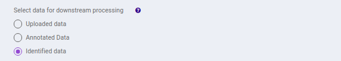
**Figure 21.** Data downstream

*   *Representative:* This allows you to select the representative data from either the annotated data or identified data depending on the above selection.
*   *Overall:* This allows you to select the overall data from either the annotated data or identified data depending on the above selection.

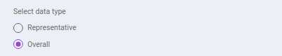
**Figure 22.** Data type

##Pre-processing

The Pre-processing interface allows you to perform a multitude of functions on the data such as:

 
**Figure 23.** Preprocessing Tab

*   *Select Internal Standards:* This allows you to select the internal standard(s) from within the El-MAVEN output file when a separate internal standards file is not provided as input.

**Note:**

*   In case, the internal standard(s) are not in the El-MAVEN output file but in the separate internal standards file, they will not show up in the drop down menu. To select the desired internal standards, select them in *Normalize by individual internal standards* option under *Normalize by Internal standards* in the *Perform Normalization > Normalization*.

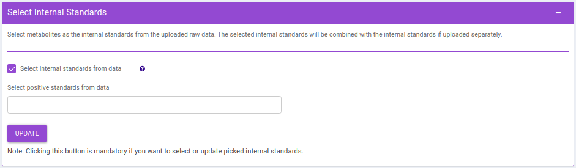 
**Figure 24.** Selecting internal standards from the data

*   *Drop Samples:* This allows you to drop/remove certain samples from further analysis which could be blank samples or any samples that didn’t have a good run during MS processing. Samples can be dropped by clicking on *Drop Samples* as shown in Figure 24 after selecting the sample(s) from the drop down menu.

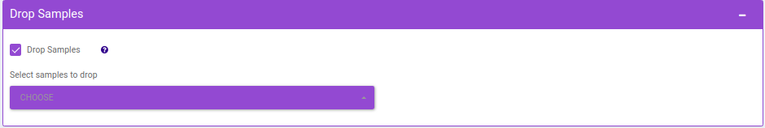 
**Figure 25.** *Drop Samples* option

*   *Normalize by Internal standards* performs normalization using the internal standards.

 
**Figure 26.** Normalize by internal standards options

*   *Normalize by sum of internal standards* normalizes by the sum of the standards provided.

*   *Normalize by average of internal standards* normalizes by the average of the standards provided.

*   *Normalize by individual internal standards* normalizes by the internal standards selected previously.

*   *Normalize by metabolites* normalizes by any particular metabolite selected.

 
**Figure 27.** Normalize by metabolites option

*   *Normalize by sum of metabolites* normalizes by the sum of metabolites. Here, you can select the metabolites from the dropdown option.

*   *Normalize by metadata column* normalizes by any additional column specified in the metadata file. such as cell number etc.

*   *Normalize by control* normalizes by control samples present in the data.

 
**Figure 28.** Normalize by metadata options

*   *log2*

*   y + log2(x) [where data is shifted by max value of data plus one]

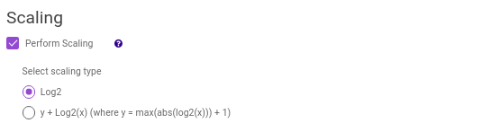 
**Figure 29.** Scaling options

**Note:**

*   If internal standard(s) have already been selected in the *Select Internal Standards* option, they would be present in the drop down.

Clicking on *Run* will perform the normalization and scaling based on the parameters selected.

*   *Table:* This displays the data table and visualizations for both pre- and post- normalization.
    *   **Metadata:** This displays the metadata uploaded. This data can be downloaded in the .csv format as shown in Figure 23.
    *   **Metabolite Mapping data:** This displays the metabolite data uploaded. This data can be downloaded in the .csv format as shown in Figure 30.
    *   **Raw data:** This displays the raw El-MAVEN data uploaded. This data can be downloaded in the .gct format as shown in Figure 31.
    *   **Processed data:** This displays the normalized El-MAVEN data based on the parameters selected. This data can be downloaded in .gct format as shown in Figure 32.
    *   **Pre-Processing Results:** This allows you to have a look at the sample distribution with the help of density plot and box-plot before normalization as shown in Figure 33.
    *   **Post-Processing Results:** This allows you to have a look at the sample distribution with the help of the density plot and box-plot after normalization. This provides you with the ability to check the effect of the normalization parameters on the data as shown in Figure 34.

 
**Figure 30.** Metadata table
 

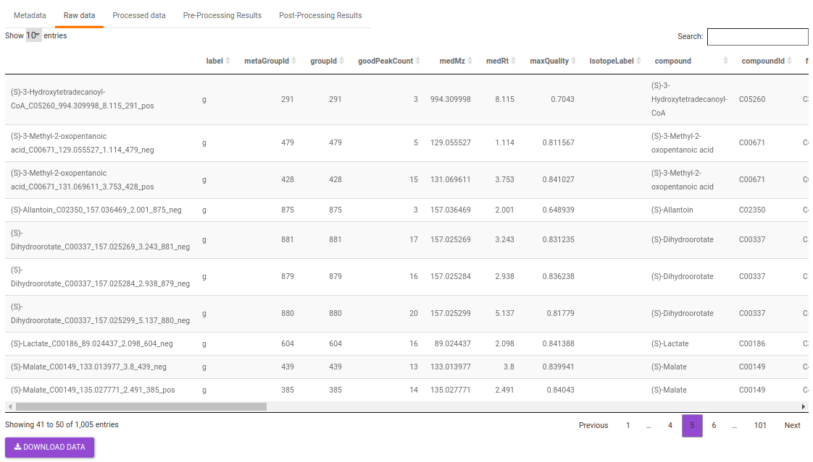 
**Figure 31.** Raw data table
  

 
**Figure 31.** Processed data table
  

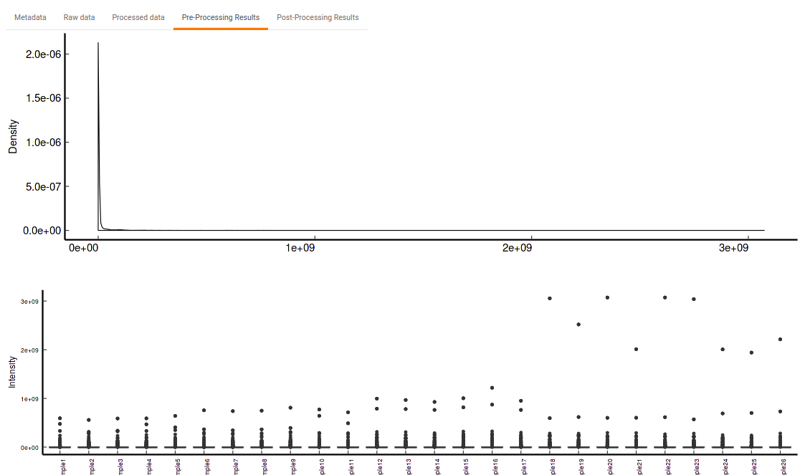 
**Figure 33.** Pre-Processing Results

 
**Figure 34.** Post-Processing Results

##Quality Checks

This tab allows you to perform quality checks for the internal standards, metabolites and across samples with the help of interactive visualizations.

**Internal Standards**

It allows you to have a look at the quality of the internal standards used in the data with the help of the different visualizations for any individual as well as for all internal standards.

*   Internal Standards (Individual): You can visualize the quality checks for any internal standard specifically. This allows you to select the internal standard by name, followed by another drop down to select by uniqueId of the feature. It’s also possible to specify the cohort order for the plots. For dual mode data, you can specify the internal standard of the particular mode from the *Select uniqueIds* drop down.

 
**Figure 35.** Internal Standards (Individual) options

 
**Figure 36.** CV Distribution across cohorts

 
**Figure 37.** CV Distribution across samples

*   Metabolites: It allows you to have a look at the quality of the metabolites present in the data with the help of the Coefficient of Variation plots

    *   Metabolites CoV Boxplot visualizes the Coefficient of Variation across different cohorts in the data in the form of the boxplot. It’s also possible to specify the cohort order for the plots as shown in Figure 38.
    *   Metabolites CoV Barplot visualizes the Coefficient of Variation as a quality check for any specific metabolite. To use this, select the metabolite followed by the unique id of the feature using the drop downs shown in Figure 39. It’s also possible to specify the cohort order for the plots as shown in FIgure 40.

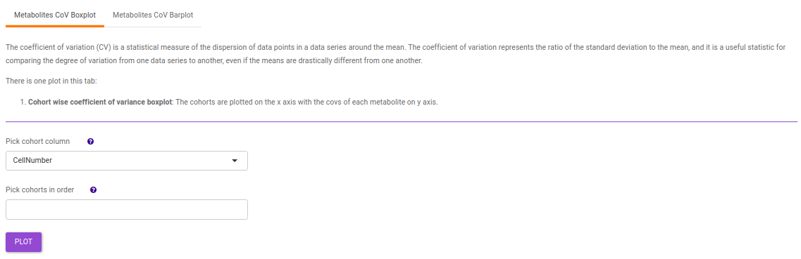 
**Figure 38.** Metabolites CoV Boxplot option and CV Distribution across Cohorts boxplot
 

 
**Figure 39.** Metabolites CoV Barplot

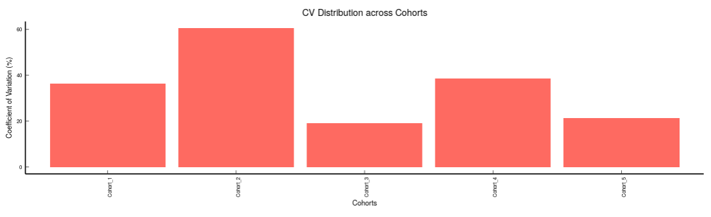 
**Figure 40.** CV Distribution across cohorts for selected metabolite

 
**Figure 41.** CV Distribution across samples for the selected metabolite

**PCA**

This allows you to understand the clustering pattern between biologically grouped and ungrouped samples.

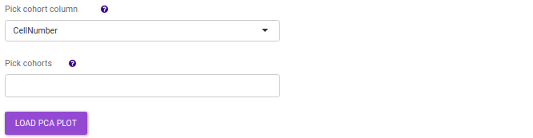 
**Figure 42.** PCA option

*   PCA (2D) provides PCA visualization in a two-dimensional manner by selecting the PC values for *x-* and *y-* axes. It’s also possible to specify the cohort order for the plots.

 
**Figure 43.** Two-dimensional PCA plot

*   PCA (3D) provides PCA visualization in a three-dimensional manner by selecting the PC values for *x-*, *y-* and *z-* axes. It’s also possible to specify the cohort order for the plots.

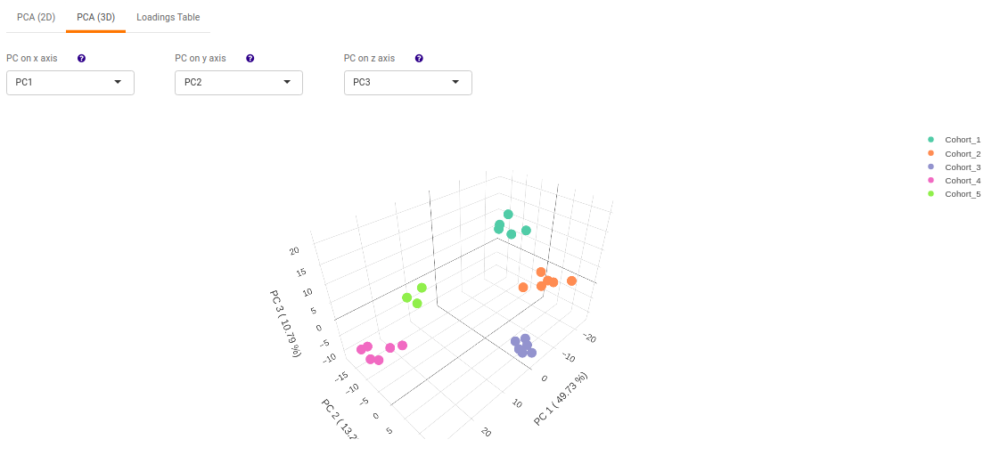 
**Figure 44.** Three-dimensional PCA plot

*   Loadings table displays the individual PC conponents across the uploaded features.

 
**Figure 45.** Three-dimensional PCA plot

##Statistical Analysis

This tab allows you to perform various statistical analysis test on the data, namely limma test and anova test to identify significant and important features from the data.

**Limma Test**

This interface allows you to perform differential expression limma analysis with the aim to identify metabolites whose expression differs between any specified cohort conditions. The 'limma' R package is used to identify the differentially expressed metabolites. This method creates a log2 fold change ratio between the two experimental conditions and an 'adjusted' *p*-value that rates the significance of the difference.

 
**Figure 46.** Statistical Analysis interface

The following parameters are available for selection:

*   Select *Cohort A* and *Cohort B:* Default values are filled automatically for a selected cohort condition, which can be changed as per the cohorts of interest.
*   *Filter and categorize data:* Select this to categorize the data by a column or filter data before performing differential expression.
    - *Categorize data by a column:* Select this to categorize data by a column. The points will be grouped based on this column and will be assigned the same shape on the volcano plot.
    - *Select column for hover info:* Select this to change the hoverinfo of each point on volcano plot. The info in this column will be displayed on when hovering over a point in volcano plot. Select *text_label* to display all information on the hoverinfo.
    - *Filter and categorize data:* Select this to categorize the data by a column or filter data before performing differential expression.
        - *Add condition:* Add a filtering condition by selecting a column from feature metadata and then selecting a value a from a row.
        - *Merge conditions:* Merge two conditions created using the *Add condition* interface. This enables dynamic filtering by allowing you to merge any of the existing conditions.
        - *Select condition:* Select a filtering condition created using the *Add condition* or *Merge conditions* interface. The condition selected here will be used to filter data before performing differential expression.
 
**Figure 47.** Filtering Interface

*   Select *p-val* or *adj. p-val*: Select either *p*-value or adj. *p*-value for significance.
*   *p-val* or *adj. p-val* cutoff: By default, the value is 0.05 but can be changed if required.
*   *log2FC:* Specify the cut-off for log2 fold change with the help of the slider.

Once the parameters are specified, click on the *Update* button to plot the volcano plot. Based on the parameters specified, a volcano plot is displayed. The volcano plot helps in visualizing metabolites that are significantly dysregulated between two cohorts.

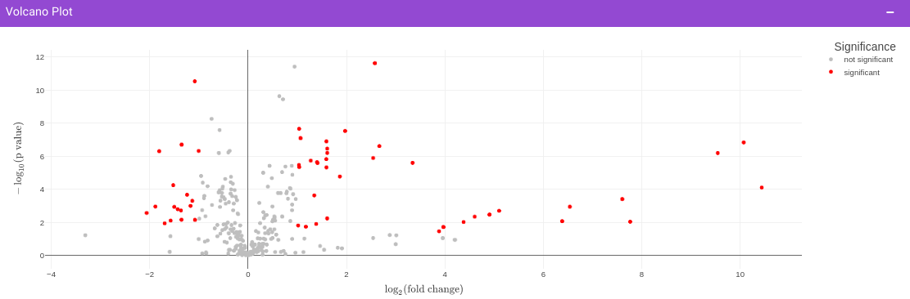 
**Figure 48.** Volcano plot

*Filtered Metabolites Visualization* provides the option to visualize the cohort-based distribution of the features/metabolites that are significant based on the parameters specified through bar plots and boxplots and also to look at the EIC plot of specific features to update categorization of the feature by the peakML algorithm.

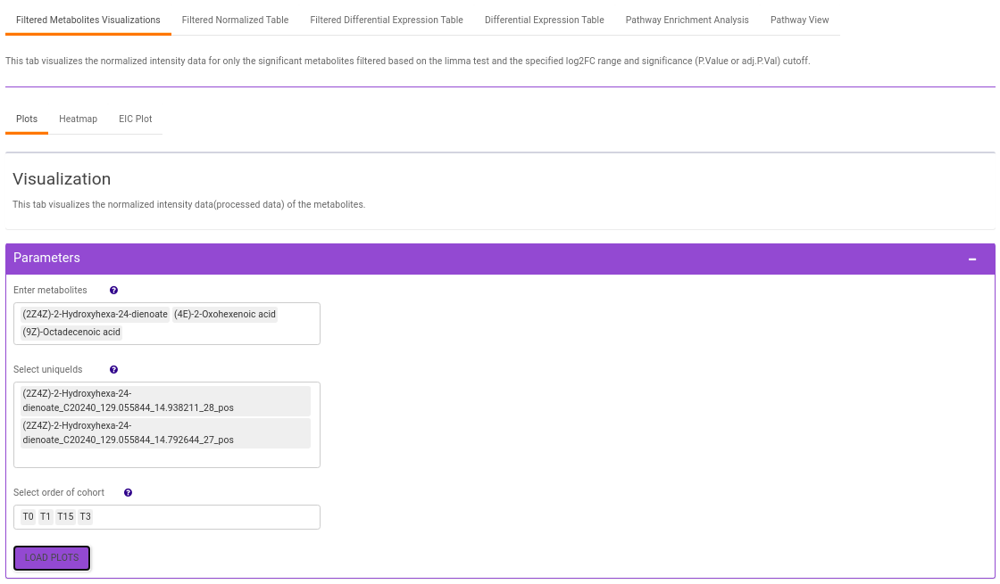 
**Figure 49.** Filtered Metabolites Visualization

*   *Plots*: This tab allows you to visualize the cohort-based distribution of the features/metabolites through barplots and boxplots.
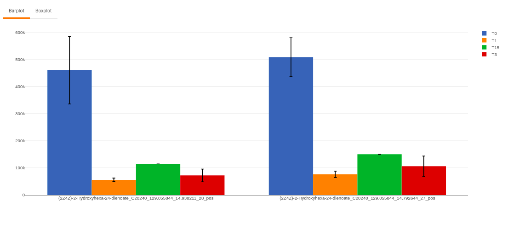 
**Figure 50.** Barplot 

*   *Heatmap*: This tab allows you to produce a heatmap of the filtered features/metabolite data, so that you can observe the level of expression in a visual form. Click on *Load Heatmap* button to generate the heatmap..
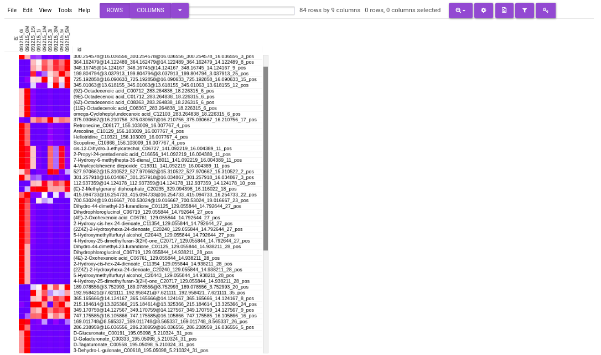 
**Figure 51.** Heatmap

*   *EIC Plot*: This tab allows you to visualize the EIC of specific features so that you can relabel the classification of the feature done by the peakML algorithm. You can also download the updated emdb file after reclassification from the *Downloads* tab.
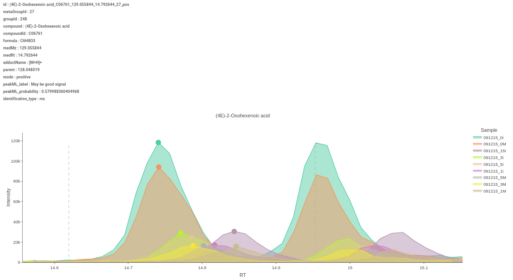 
**Figure 52.** EIC Plot

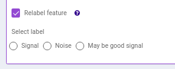 
**Figure 53.** EIC Plot

*Filtered Normalized Table* contains the normalized data of the metabolites that are significant based on the parameters specified.

 
**Figure 54.** Filtered Normalized Table

*Filtered Differential Expression Table* contains only the metabolites that have significant *p*-values as specified.

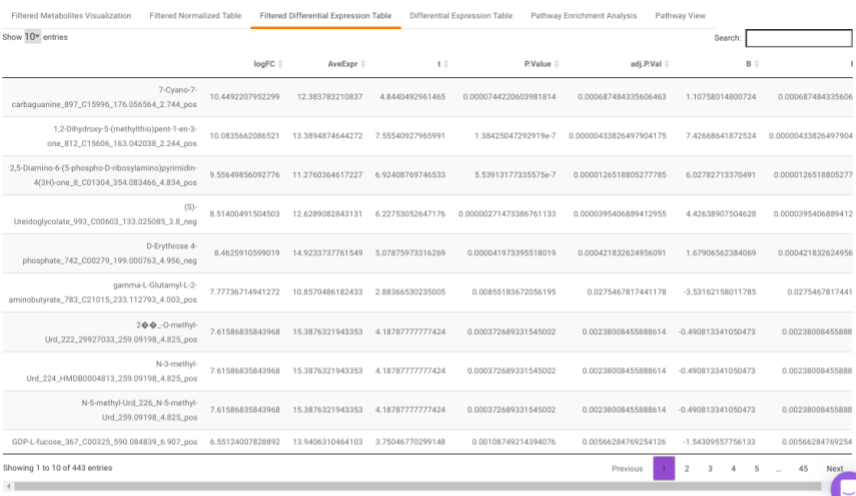 
**Figure 55.** Filtered Differential Expression Table

*Differential Expression Table* contains all the differentially expressed metabolites without any filtering.

 
**Figure 56.** Differential Expression Table

*Pathway Enrichment Analysis* performs the pathway enrichment analysis for the significant metabolites based on the parameters specified for the particular cohort comparison. Click on the *Perform Pathway Analysis* button.
As a result, you get Metabolite Set Enrichment Analysis and Pathway Topology Analysis plots that can be downloaded under the *Plot* panel. You can also obtain the tablular representation of the plots by selecting onto the *Table* panel.

 
**Figure 57.** Metabolite Set Enrichment Analysis Plot

 
**Figure 58.** Pathway Topology Analysis Plot

 
**Figure 59.** Metabolite Set Enrichment Analysis Table

 
**Figure 60.** Pathway Topology Analysis Table

*Pathway View* plots the pathway view of the metabolites that show up in the Metabolite Set Enrichment Analysis. It maps and renders the metabolite hits on relevant pathway graphs. This enables you to visualize the significant metabolites on pathway graphs of the respective metabolites they belong to. You can select your metabolite of interest from the drop-down and click on *Plot*. This will plot the pathway view of the metabolism selected. You can also download the plot as a .png file by clicking onto the *Download Pathview Plot* button.

 
**Figure 61.** Pathway View Plot

**ANOVA Test**

This interface allows you to compare the means of two or more groups using F-statistic under the assumption that samples population are normally distributed. One- way ANOVA allows determining whether one given factor has significant effect in mean values of any groups in the data.

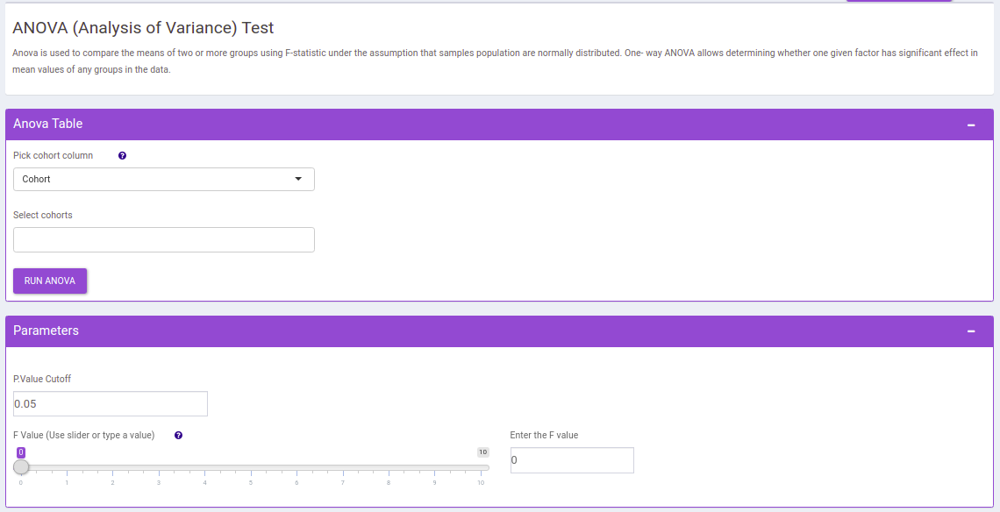 
**Figure 62.** Statistical Analysis interface

The following parameters are available for selection:

*   *Select Cohorts*: Select the cohorts you want to consider while performing the one way anova test.
*   *p-val*: By default, the value is 0.05 but can be changed if required.
*   *F value*: Specify the cut-off for f value with the help of the slider.

Once the parameters are specified, click on the RUN ANOVA button to plot the barplots and boxplots. Based on the parameters specified, the generated tables are filtered.

*Filtered Metabolites Visualization* provides the option to visualize the cohort-based distribution of the features/metabolites that are significant based on the parameters specified through bar plots and boxplots.

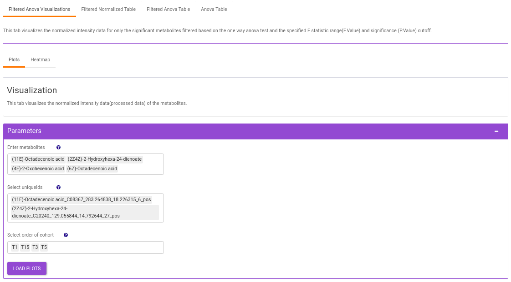 
**Figure 63.** Filtered Metabolites Visualization

*   *Plots*: This tab allows you to visualize the cohort-based distribution of the features/metabolites through barplots and boxplots.
 
**Figure 64.** Filtering Interface

*   *Heatmap*: This tab allows you to produce a heatmap of the filtered features/metabolite data, so that you can observe the level of expression in a visual form. Click on *Load Heatmap* button to generate the heatmap..
 
**Figure 65.** Heatmap

*Filtered Normalized Table* contains the normalized data of the metabolites that are significant based on the parameters specified.

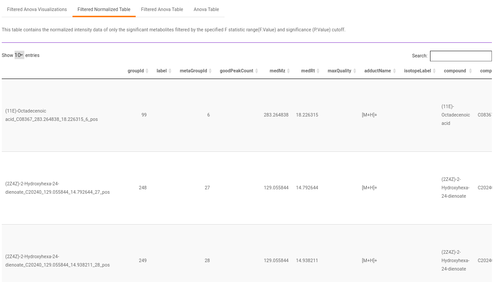 
**Figure 66.** Filtered Normalized Table

*Filtered Anova Table* contains only the metabolites that have significant *p*-values and F statisitic value as specified.

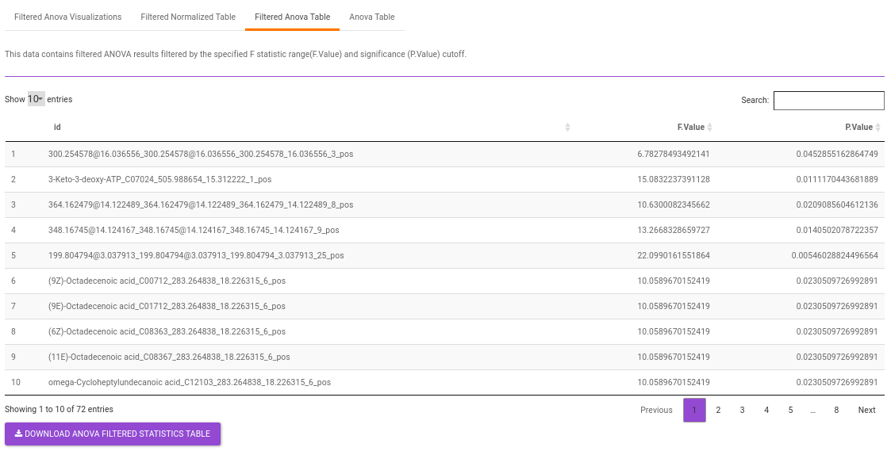 
**Figure 67.** Filtered Anova Table

*Anova Table* contains all the metabolites without any filtering.

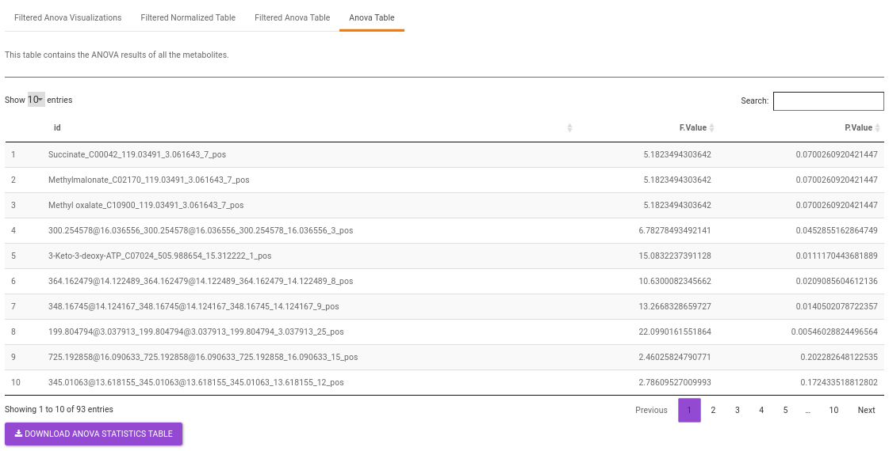 
**Figure 68.** Anova Table

##Visualization

This interface allows you to visualize the cohort-based distribution of a specific metabolite or a group of metabolites on the basis of its normalized intensity values.

 
**Figure 69.** Visualization tab options

*   *Enter metabolite:* Select the metabolite(s) of interest from the drop down option.
*   *Select uniqueIds:* You can specifically select the metabolic feature of interest for the metabolite from the drop down option.
*   *Select order of cohort:* You can also specify the particular order of the cohort to visualize the bar plot.

Once the parameters are selected, click on *Load Plots* to plot the bar plot and boxplot for the metabolite.

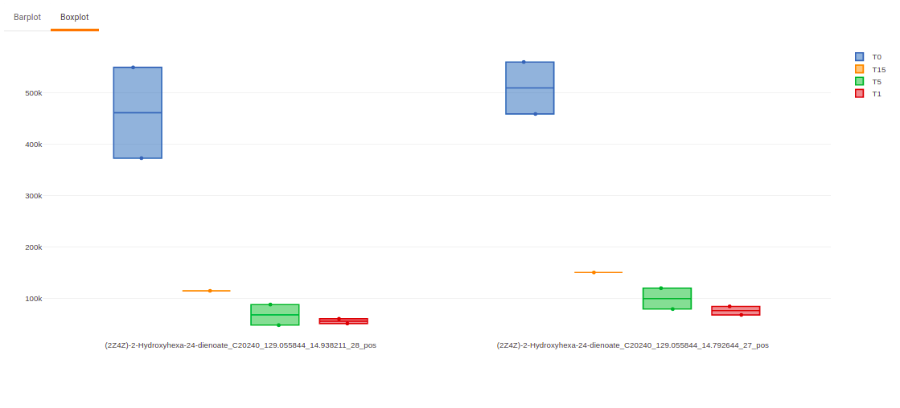 
**Figure 70.** Cohort-wise bar plot with the normalized intensity of selected metabolite

##Heatmap

This tab allows you to produce a heatmap of the processed data, so that you can observe the level of expression in a visual form. Click on *Load Heatmap* button to generate the heatmap.

 
**Figure 71.** Heatmap

##IntOmix Input

This tab allows you to generate the input for [IntOmix](https://docs.elucidata.io/Apps/Multi-omic%20Data/IntOmix.html) where you can visualize the significantly altered metabolic network modules between any two experimental conditions.

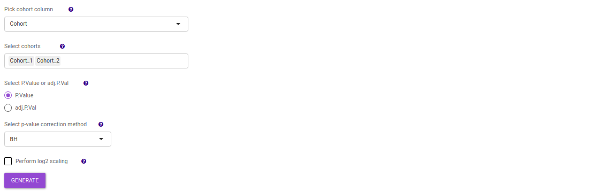 
**Figure 72.** IntOmix Input Tab options

Specify two or more cohorts from the *Select cohorts* drop down option for which you want to generate the IntOmix input. Once the required cohorts are selected, click on *Generate* to generate the IntOmix input.

 
**Figure 73.** IntOmix Table for the cohort conditions specified

**NOTE:**

*   At least two cohorts are required to create the input file.

##Comparative Analysis

This tab allows you to perform comparative analysis between a set of cohorts in your data. As a result of which you can visualize the UpSet plot of the unique and overlapping metabolites for the selected cohort comparisons. Further, you can also perform pathway analysis on the metabolites for the set intersections of interest.

* *Comparison Parameters* tab allows you to select the cohorts of interest for which you would want to get the set intersections. You can select the cohorts from the *Select cohorts* drop-down and click on *Run* button. Further, you can also specify the *p*-value cut-off and log2FC threshold.

 
**Figure 74.** Comparison Parameters Tab options

You will get a table as a result of the parameters specified which will have the significant metabolites for the different cohort comparisons along with their corresponding *p*-values and log2FC values. You can also download this table as a .CSV file.

 
**Figure 75.** Comparison Table

* *UpSet Plot* tab allows you to visualize the set intersections for the cohort comparisons selected where every comparison consists of the significant metabolites associated with the same. You can select the cohort comparisons of interest from the *Select Cohort Comparison* drop-down which represents all the possible comparisons for the cohorts specified in the previous tab. Click on *Plot* to get the UpSet plot for the specified comparisons.

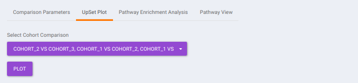 
**Figure 76.** UpSet Plot options

 
**Figure 77.** UpSet Plot

Along with the plot, you can also get all the constituent metabolites for the respective comparisons in a tabular format that can be downloaded as a .CSV file.

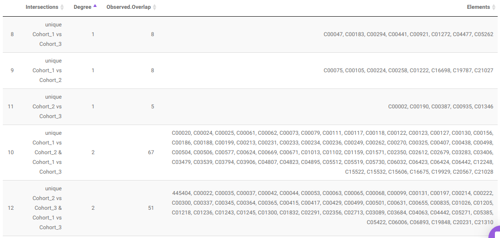 
**Figure 78.** UpSet Plot Table

* *Pathway Enrichment Analysis* tab allows you to perform the pathway enrichment analysis for the significant metabolites that show up based on the parameters specified in the *Comparison Parameters* tab for the particular set of cohort comparison. Click on the *Perform Pathway Analysis* button. As a result, you get Metabolite Set Enrichment Analysis and Pathway Topology Analysis plots that can be downloaded under the *Plot* panel. You can also obtain the tablular representation of the plots by selecting onto the *Table* panel.

 
**Figure 79.** Metabolite Set Enrichment Analysis Plot

 
**Figure 80.** Pathway Topology Analysis Plot

 
**Figure 81.** Metabolite Set Enrichment Analysis Table

 
**Figure 82.** Pathway Topology Analysis Table

*Pathway View* plots the pathway view of the metabolites that show up in the Metabolite Set Enrichment Analysis. It maps and renders the metabolite hits on relevant pathway graphs. This enables you to visualize the significant metabolites on pathway graphs of the respective metabolisms they belong to. You can select your metabolite of interest from the drop-down and click on *Plot*. This will plot the pathway view of the metabolite selected. You can also download the plot as a .png file by clicking onto the *Download Pathview Plot* button.

 
**Figure 83.** Pathway View options

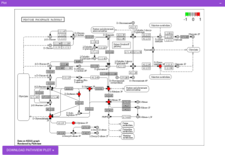 
**Figure 84.** Pathway View Plot

#References

*   CAMERA: An Integrated Strategy for Compound Spectra Extraction and Annotation of Liquid Chromatography/Mass Spectrometry Data Sets Anal. Chem. 2012, 84, 1, 283-289
