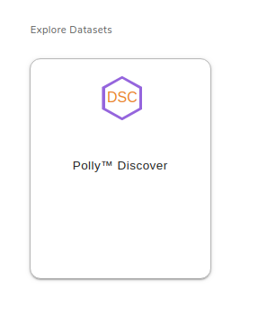
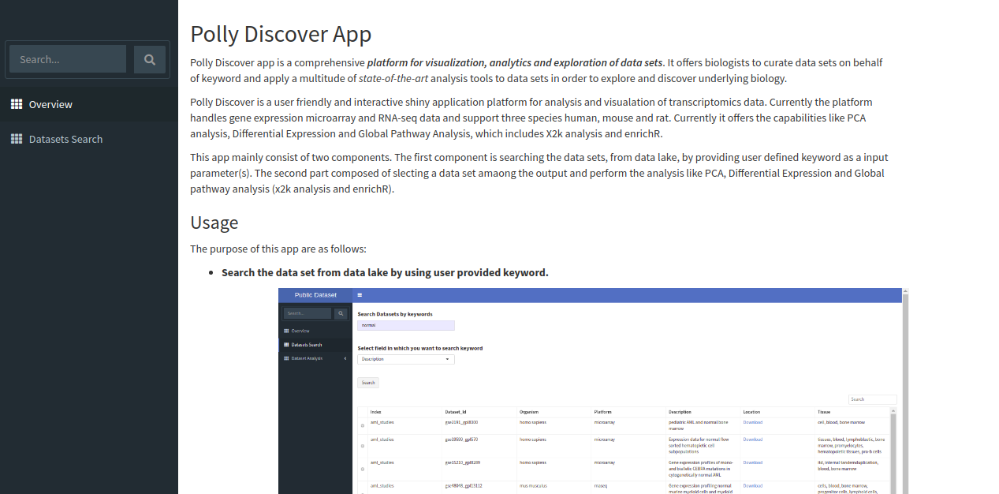
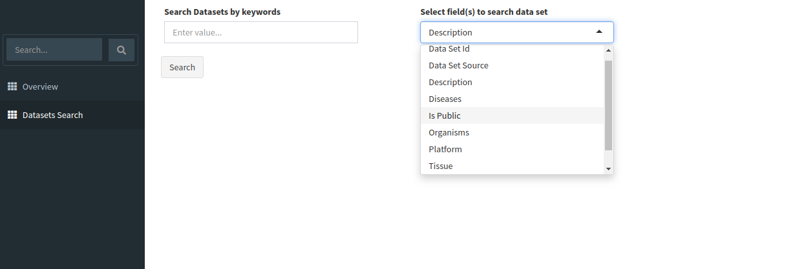
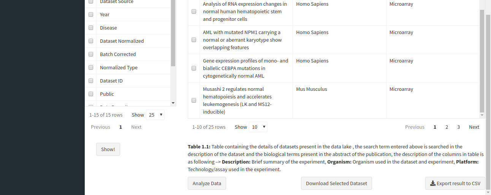
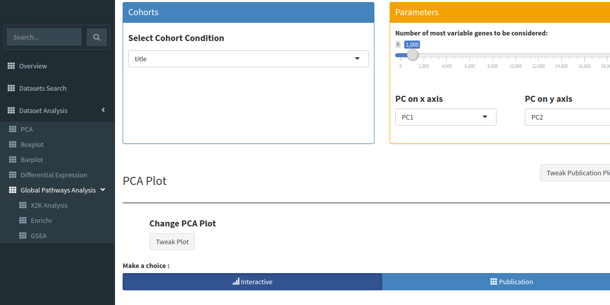

# Polly Discover Application

**Opening the app**

Upon opening the Discover portal on Polly, choose a data repository that you would like to explore. The page should look something like this.

After selecting a repository, you’ll be able to view a filtering interface which provides **parameters** that you can use to filter the datasets within the selected repository. Once you select a dataset , you can access the integrated tools attached with the repository. For transcriptomics data, you can use discover application for further analysis of transcriptomics data.

<!--  -->

  

The app shows overview page which contains a brief **description** of the application, it's **scope** and the **usage** as shown below.

**Exploring the data lake**

Search for relevant datasets by navigating to the *Dataset Search* tab in the navigation pane to the left. Keyword search can be applied to the following fields:

*   Data Set ID
    
*   Data Set Source
    
*   Description
    
*   Diseases
    
*   Is Public
    
*   Organisms
    
*   Platform
    
*   Tissue
    
*   Year
    

The search will return all datasets that are associated with your search. The result should look like the image below.

The table shown above shows very few columns by default. In order to view the other columns in the table, you can select the fields from **Available Columns** and click on *Show!* button. *Download Selected Dataset* button will let you download the dataset that you have selected on your local system. *Export results to CSV* button will let you download the search result table in the form of a .csv file. Once you have narrowed down the relevant datasets, you can analyze one or more datasets on the fly within the app.

**Analyzing a single dataset**

You can analyze a single dataset by selecting the checkbox to the left of the entry in the table. Once you’ve selected the checkbox, click on the *Analyze Data* button below the table description.

After clicking the *Analyze Data* button, the app will read the selected dataset and take you to the *Dataset Analysis* tab. Here, you can perform the following analyses:

*   **Principal Component Analysis (PCA)**

    Principal Component Analysis: Also known as PCA plot, it is used to see the overall differences between cohorts of interest, if a strong separation is found along X axis (PC1) then that means strong biological differences between cohorts of interest. One can also increase the number of genes considered in the PCA plot, as one increases the number of genes, it is bound to decrease the PC1 component.  
     

*   **Boxplot Visualization**

    Boxplot can be really useful in understanding the distribution of expression within a dataset. For any downstream analysis such as differential expression or pathway analysis, the distribution has to be normal since they use tests which assume this distribution.  
     
    
*   **Plots**

    A box and whisker plot (a boxplot) is a graph that presents information from a five-number summary namely lower extreme, lower quartile, median, upper quartile, and upper extreme. In this plot, the median is marked by a vertical line inside the box; the ends of the box are upper and lower quartiles; the two lines outside the box extend to the highest and lowest observations. It is useful for knowing the nature of distribution (i.e., skewed) and potential unusual observations.  
     

*   **Heatmap**

    A heatmap is a graphical representation of data that uses a system of color-coding to represent different values. This heatmap shows the cohort wise mean expression of a particular gene. The samples are aggregated on the basis of a given cohort and the mean is calculated based on the cohort information.  
     
    
*   **Differential Expression**

    Differential expression analysis means taking the normalised read count data and performing statistical analysis to discover quantitative changes in expression levels between experimental groups. For example, we use statistical testing to decide whether, for a given gene, an observed difference in read counts is significant, that is, whether it is greater than what would be expected just due to natural random variation.  
     
    
*   **X2K Analysis**

    X2K infers upstream regulatory networks from signatures of differentially expressed genes. By combining transcription factor enrichment analysis, protein-protein interaction network expansion, with kinase enrichment analysis, X2K produces inferred networks of transcription factors, proteins, and kinases predicted to regulate the expression of the inputted gene list.  
     

*   **Gene Ontology Plot**

    Gene Ontology Annotation Plot is a simple but useful tool for visualizing, comparing and plotting GO (Gene Ontology) annotation results.  
     
    
*   **Enrichr**

    Enrichr, includes new gene-set libraries, an alternative approach to rank enriched terms, and various interactive visualization approaches to display enrichment results using the JavaScript library, Data Driven Documents (D3).  
     
    
*   **GSEA** 

    Gene Set Enrichment Analysis (GSEA) is a computational method that determines whether an a priori defined set of genes shows statistically significant, concordant differences between two biological states (e.g. phenotypes).  
     

*   **Specific Pathway Visualization using Pathview**

    Pathview maps, integrates and renders a wide variety of biological data on relevant pathway graphs.  
     

