#Introduction

##Overview

Proteomics Compound Screening Application allows users to detect modified peptides in high-throughput compound modification experiments. The app enables users to process raw proteomics mass spectroscopy samples treated with compounds and detect all possible modifications at the Cysteine residue. The pipeline is built using modules from openMS software and a targeted approach using expected differences in mass. The application allows users to process multiple samples in parallel and analyze various plate or sample level visualization and reports.

##Scope of the app

* The application can process raw proteomics mass spectrometry data and perform peak detection for peptides with/without modification. 
* Enables users to monitor progress on the fly and combine results from multiple runs.  
* Provides an interactive peptide modification view for a 96-well plate.
* Provides intensity distribution for the detected peptides in a sample.

#Getting Started

##User input

Proteomics Compound screening application can process raw mass spectroscopy data and detect compound or control modification for a peptide in the raw mass spectroscopy data.
Proteomics Compound screening application requires five types of files:

**Raw Sample Files**

These are the raw mass spectroscopy data file, and the following raw sample file formats are supported -
* .D/.d
* .RAW/.raw

**Protein sequence file**

This file has the protein sequence and other information; the followings protein file formats are supported -
* .FASTA/.fasta

**Metadata file**

This file has the information to map the sample with corresponding compound, followings metadata file formats are supported -
* .xlsx

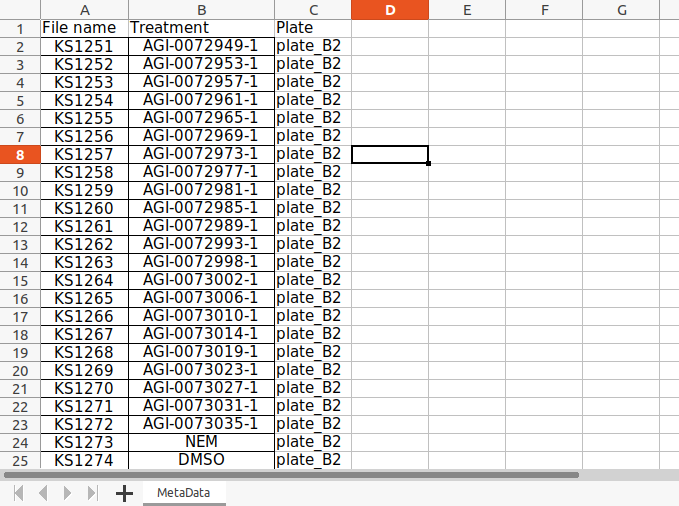 
**Figure 1.** Metadata file

**Mass Metadata file**

This file has molecular weight information for each compound and the expected MW for modification. Followings mass metadata file formats are supported -
* .xlsx

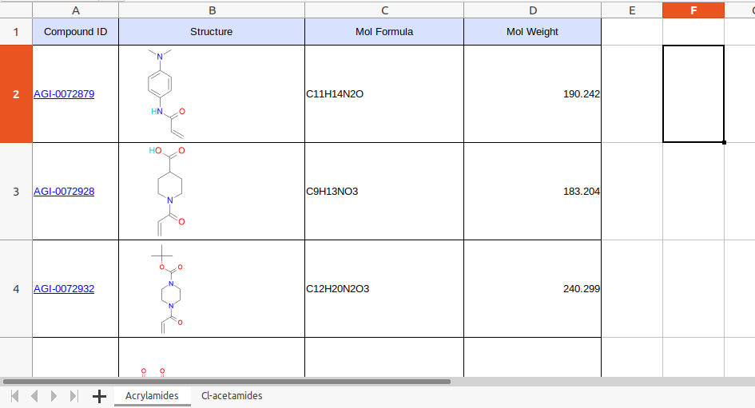 
**Figure 2.** Mass Metadata file

**Plate layout file**
This file has the coordinates for each sample in the 96-well plate. One can use this to construct a plate-level view of each compound. Followings sample file formats are supported -

* .xlsx

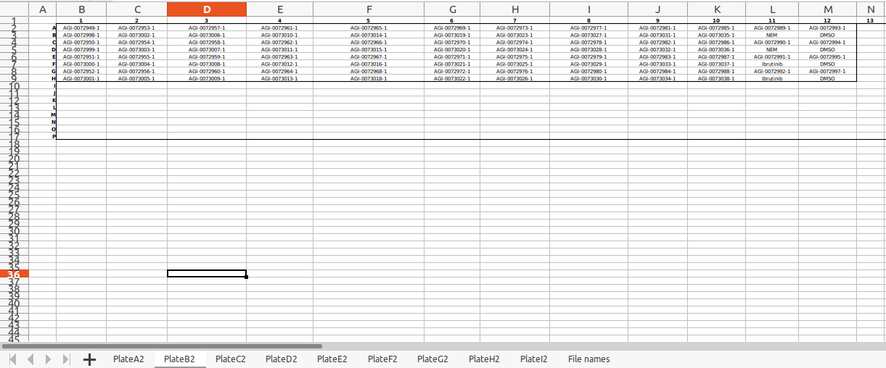 
**Figure 3.** Plate layout file

Note: The plate name should be consistent everywhere 

##Compound screening algorithm 

* The pipeline uses Protein and digestive enzyme information to generate a peptide library.
* The pipeline uses compound mass information to generate a peptide modification library.
* The application uses the "FeatureFinderCentroided" tool from openMS (open-source project for mass spectrometry sample processing).
* Provides an interactive peptide modification view for a 96-well plate
* Provides intensity distribution for the detected peptides in a sample.

##Compound screening algorithm settings:

**Digestive Enzyme**

This setting has a list of digestive enzymes. You can select the enzyme which was used to digest the protein in your experiment.

**PPM acceptance/ Mass tolerance**

Here you can select the level of mass tolerance accepted while mapping an MZ hit to a peptide (modified).

**Charge low**

The lowest charge state you want to consider while searching for a peptide peak.

**Charge high**

The highest charge state you want to consider while searching for a peptide peak.
 
**Minimum spectra for mass trace**

Settings for calculating a score indicating if a peak is part of a mass trace. min_spectra: Number of spectra that have to show a similar peak mass in a mass trace.

**MZ tolerance for mass trace**

Settings for calculating a score indicating if a peak is part of a mass trace.
mz_tolerance: Tolerated m/z deviation of peaks belonging to the same mass trace. It should be larger than the m/z resolution of the instrument. This value must be smaller than that 1/charge_high!
*Q-TOF*: 0.02
*LTQ Orbitrap*: 0.004

**MZ tolerance for isotopic pattern**

Settings for calculating a score indicating if a peak is part of an isotopic pattern (between 0 and 1).
mz_tolerance: Tolerated m/z deviation from the theoretical isotopic pattern. It should be larger than the m/z resolution of the instrument.This value must be smaller than that 1/charge_high!
*Q-TOF*: 0.04
*LTQ Orbitrap*: 0.005

For more details on parameters using in openMS, please refer to [OpenMS-FeatureFinderCentroided](https://abibuilder.informatik.uni-tuebingen.de/archive/openms/Documentation/nightly/html/TOPP_FeatureFinderCentroided.html)

##Workflow

We can divide workflow into two parts. Where in the first part, you submit a compound screening job, and in the second part, you visualize the results, and there is one helper tab where you can check logs for running jobs and earlier submitted jobs.

##Steps for a sample processing job submission

When you launch the application from a workspace, the application interacts with the workspace and lists out all the folders. Here you can choose a folder that has some plates and metadata files in it.
There is a folder structure we maintain

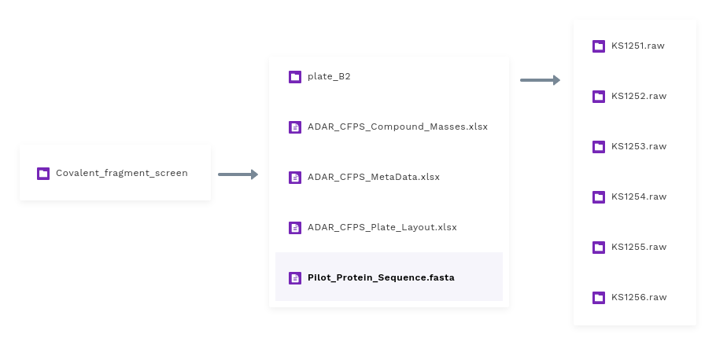 
**Figure 4.** Folder structure

**Experiment**

The parent folder in the workspace represents an actual experiment and contains some plates-wise raw samples and all metadata files corresponding to that experiment.

**Plates**

Each experiment has 8-9 plates, and each plate generally has raw mass spectroscopy data for 96 raw samples.

**Raw samples**

For each run, the instrument writes a folder, which corresponds to a sample. We call it sample raw data.

##Steps

**Select an experiment**

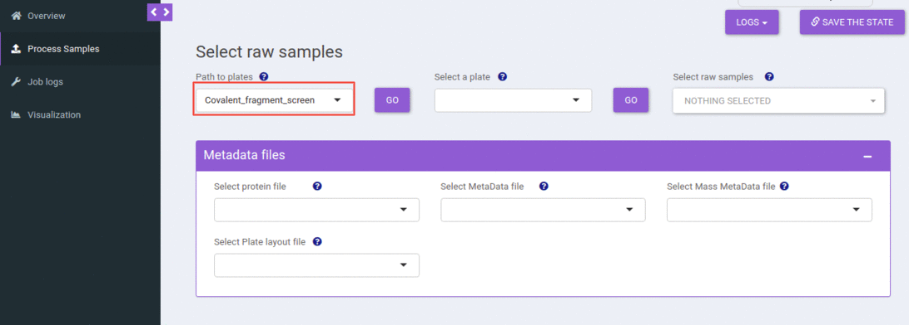 
**Figure 5.** Select an experiment

You can select an experiment from the dropdown. When you hit the go button, that would populate all the plates available in that experiment (folder) and the metadata files present. 
All these metadata file dropdowns use smart selection, where it searches for terms like “masses”, “layout”, “metadata”, “protein” in the file name and tries to map it to the possible corresponding dropdown.

**Select a plate and metadata files**

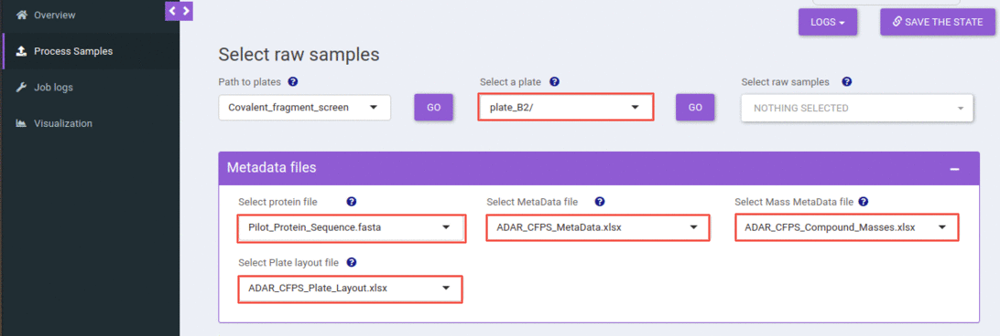 
**Figure 6.** Select a plate and metadata files

You can select a plate from the select plate dropdown, and when you hit the go button, that would populate all the raw samples available in that plate.

**Select one or more raw samples**

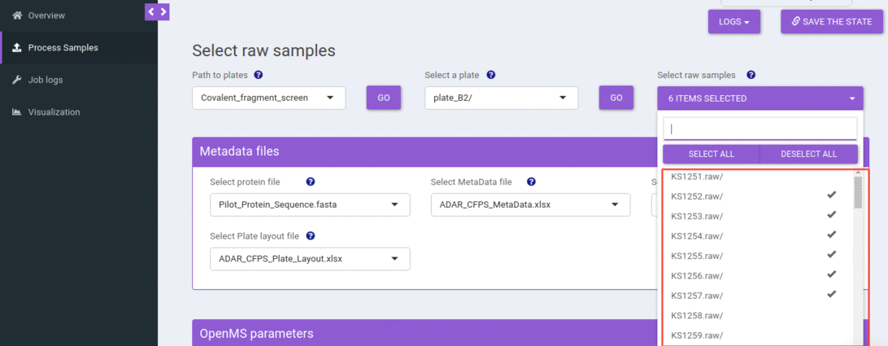 
**Figure 7.** Select one or more raw samples

You can select one or more raw samples from the select sample dropdown to submit the compound screening job.

**Adjust compound screening algorithm settings**

By default, we are using optimized settings for your raw samples. Still, you can change the Compound screening algorithm parameters by clicking the plus icon given on the box of Algorithm parameters.

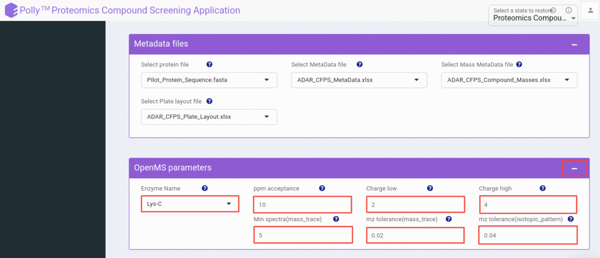 
**Figure 8.** Adjust algorithm parameters

**Submit a Polly job**

You can submit a compound screening job for the selected raw samples by clicking the submit button, which will verify all the supporting metadata files and submit a job successfully. If one or more files are missing or not in the correct format, it will throw an appropriate error.

Depending on the number of raw samples you have selected, we assign a machine for processing. The heaviest machine we offer has 120GBs of memory, which you can process 25 samples in parallel.

when it successfully submits a job

##Steps for checking the job logs

In the job logs tab, one can check the status of all running jobs and check the status for the earlier submitted jobs.
The first two steps are the same as the job submission tab; one can select an experiment followed by a plate.

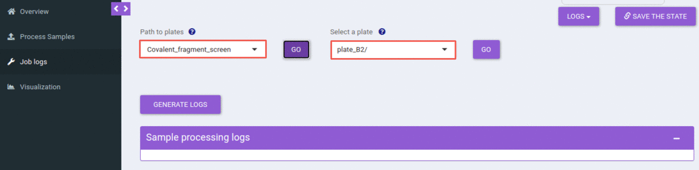 
**Figure 9.** Choose an experiment and plate

This will list out all the jobs that you have submitted for the selected experiment and plate. You can filter out jobs based on a date, time, or the number of samples processed.

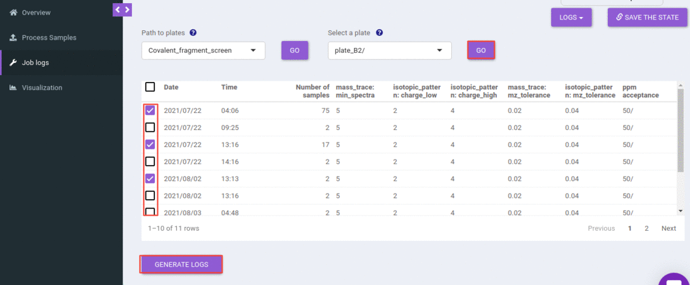 
**Figure 10.** List of all the submitted jobs

You can select one or more rows and can generate the logs.

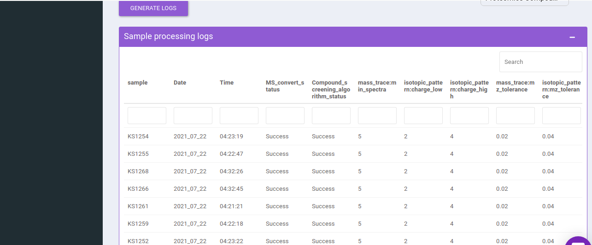 
**Figure 11.** Logs table for the selected job(s)

You can find all the information like the date and time when you submitted the jobs, compound screening algorithm step status, and algorithm parameters.

 
##Steps for visualizing the job results

In the visualization tab, one can visualize and analyze the results of the compound screening algorithm.
The first two steps are the same as job submission and log tab; one can select an experiment followed by a plate.

 
**Figure 12.** Choose an experiment and plate

This will list out all the jobs that you have submitted for the selected experiment and plate. You can choose one or more jobs and can proceed to visualization.

There are two levels of visualizations-
* Plate level
* Sample level

Plate level visualization consists of a heatmap of the number of modified peptides for the selected sample in that run (the job that you have chosen to visualize). And this heatmap is interactive where you can hover over to get the extra information like Raw sample name, compound name, number of modified peptides, and well coordinate.

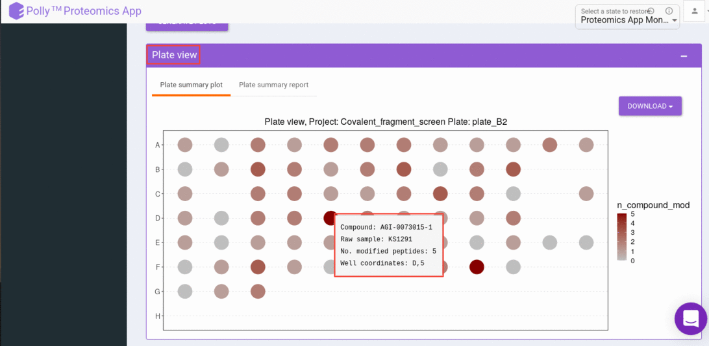 
**Figure 13.** Peptide modification plate view

And can click on a well that gives us a sample-level, visualization. Sample level visualizations are the intensities (raw or normalized) bar plot for detected peptides(modified).

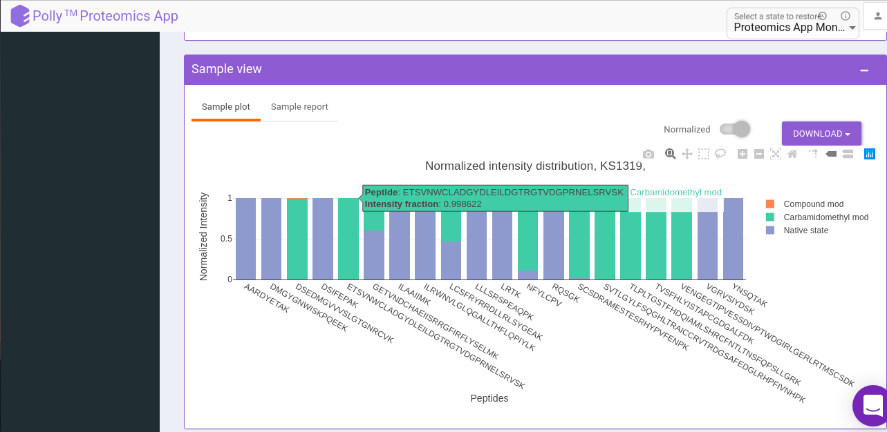 
**Figure 14.** Peptide intensity distribution

**Exporting Results**

You can export the results of the peak report table in the form of CSV and visualizations in the form of png. Following are the options provided to you to export the results

**Compound screening peak report**
You can download the plate peak report and sample peak report as a CSV file by clicking the download button.

**Visualizations**
You can download the plate and sample visualizations as a png file by clicking on the download button.
