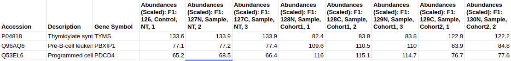
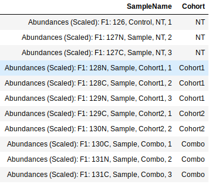
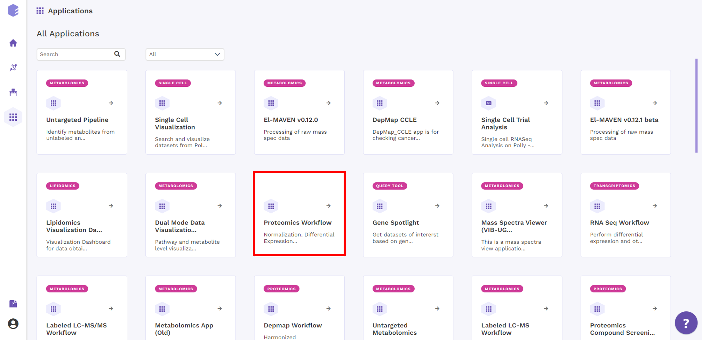
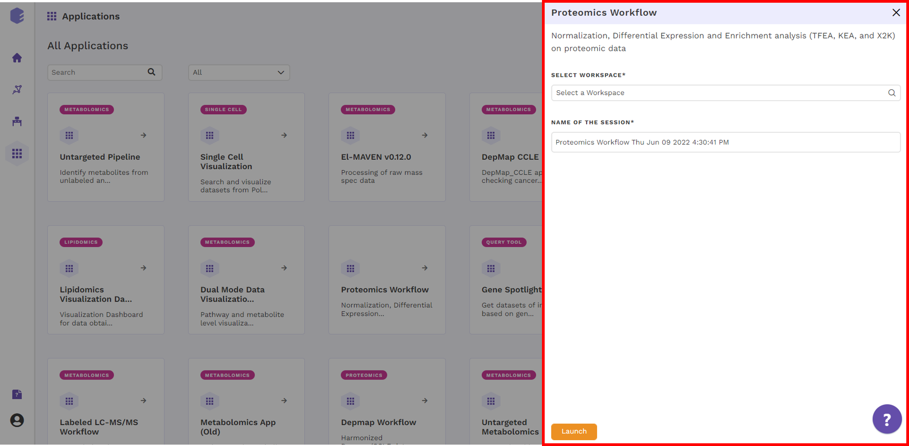
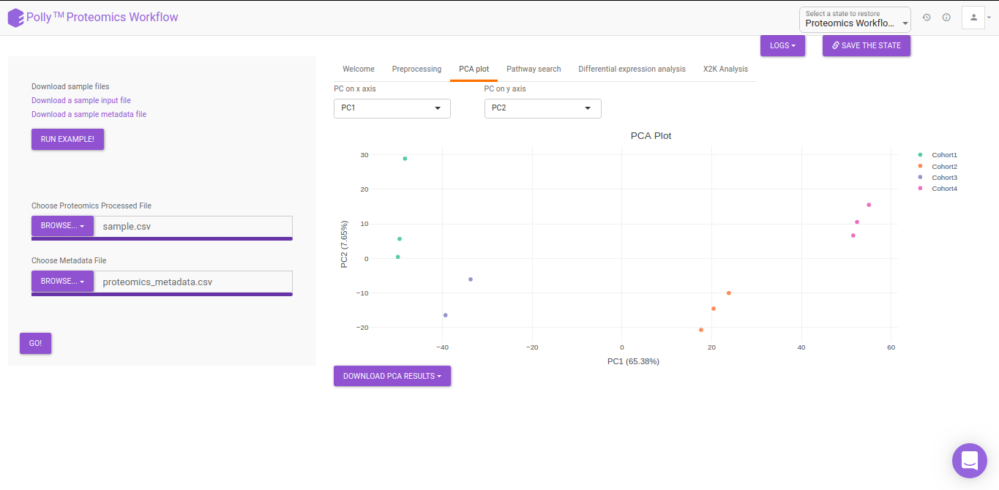
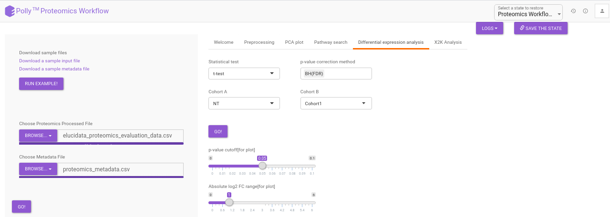
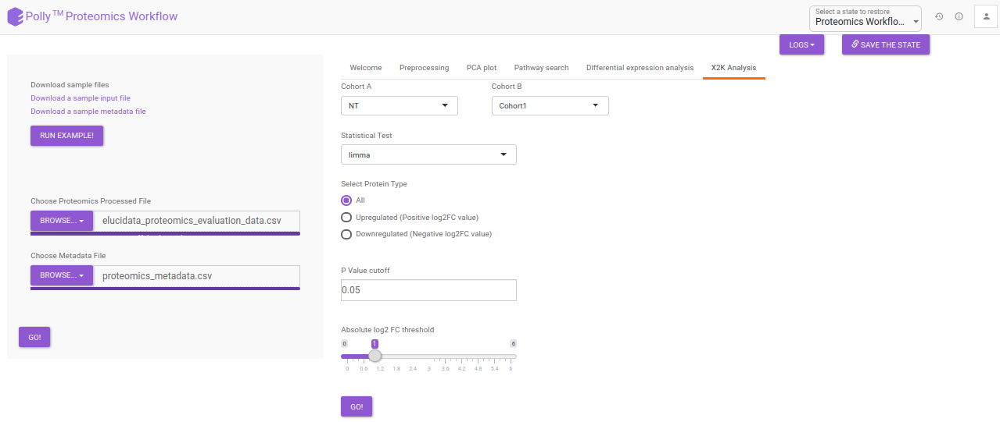
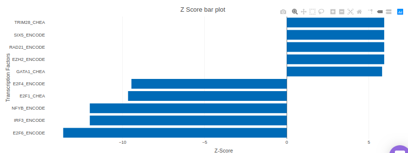

#Introduction

##Overview

Proteomics is a methodical approach used to identify and understand protein expression patterns at a given time in response to a specific stimulus coupled with functional protein networks that exist at the level of the cell, tissue, or whole organism. This has grown into a popular and promising field  for the identification and characterization of cellular gene products (*i.e.* proteins) that are present, absent, or altered under certain environmental, physiological and pathophysiological conditions. With the onset of robust and reliable mass spectrometers which help provide methodical analysis and quantification of complex protein mixtures, it is also important to standardize methods to process this data and perform in-depth analysis resulting in a meaningful outcome. Proteomics Workflow provides a platform to analyze any proteomics data states ranging from pre-processing to in-depth pathway analysis. 

##Scope of the app  

*   Systematic downstream analysis of Proteomics data with ease of switching interfaces.
*   Visualize abundance plots for gene(s) against predefined or custom pathway databases.
*   Perform PCA for quality check.
*   Perform differential expression using different statistical methods and identify most differentially expressed proteins.
*   Perform global pathway analysis using X2K (Expression to Kinase) with adjustable parameters.

 
**Figure 1.** Proteomics Workflow

#Getting Started

##User input

Proteomics Workflow requires two files:

**Abundance File**

This file should contain normalized abundance values, protein names, and their corresponding accessions along with the gene symbols. The input abundance file should have *Accession*, *Gene Symbol* and *Abundances* column.

 
**Figure 2.** Abundance file

**Metadata File**

The metadata file should contain sample cohort mapping for the samples present in the abundance file. It consists of two columns, *SampleName* which contains the samples present in the abundance file and *Cohort* which contains the cohort information for each sample. This file should be in .csv format.

 
**Figure 3.** Cohort file

##Steps involved in data processing

*   Upload abundance and the metadata files.
*   Perform normalization of data.
*   Perform pathway analysis using in-house KEGG, HMDB and Reactome databases or upload a custom database.
*   Perform X2K analysis and visualize enrichment plots

##Caveats

*   The input file format has to be exactly same as the demo data.

#Tutorial

##Upload files

Select *Proteomics Workflow* from the dashboard under the *Proteomics Data* tab. You can either *Add New* Workspace or *Select a Workspace*  which is an already existing workspace as shown in Figure 4. After entering workspace details, you will be redirected to the app.

 
**Figure 4.** Polly Dashboard and Proteomics Workflow

Upload the abundance and cohort file in the upload space and click on *Go*.

 
**Figure 5.** Upload interface

##Pre-processing

The pre-processing section extracts and displays only the protein abundances column for all samples. To perform control normalization, select the cohort using the drop down and click on *Normalize* as shown in Figure 6. Control normalization normalizes every cohort with respect to the cohort selected in the *Control Cohort* section. 

 
**Figure 6.** Pre-processing

##PCA

Principal component analysis (PCA) simplifies the complexity in high-dimensional data while retaining trends and patterns. It does this by transforming the data into fewer dimensions, which act as summaries of features. High-dimensional data are very common in biology and arise when multiple features, such as expression of many genes, are measured for each sample. PCA is an unsupervised learning method similar to clustering wherein it finds patterns without reference to prior knowledge about whether the samples come from different treatment groups or have phenotypic differences. PCA reduces data by geometrically projecting them onto lower dimensions called principal components (PCs), with the goal of finding the best summary of the data using a limited number of PCs. The first PC is chosen to minimize the total distance between the data and their projection onto the PC. The second (and subsequent) PCs are selected similarly, with the additional requirement that they be uncorrelated with all previous PCs. The PCA Plot interface allows visualizing PC1 to PC11 using the drop-down menu's labeled *PC on x axis* and *PC on y axis*. The input data for the PCA Plot is the Log2 Control Normalized Abundances.

 
**Figure 7.** PCA

##Pathway Search 

The Pathway Search interface helps in visualizing the abundance of proteins across different cohorts belonging to a particular pathway. The following customization are possible in the Pathway Search interface:

*   *Choose Pathway Database:* KEGG, HMDB, Reactome pathways are available by default and can be selected using the drop down under *Choose Pathway Database.* Alternatively, custom pathways can be added using the upload option on the right side. The custom pathway file should be in .csv format and should contain the pathway names as well as the proteins involved in the pathway. A sample pathway file can be downloaded by clicking on *Download a sample pathway file*. 
*   *Pathway:* The pathway to be visualized can be selected from the list of pathways present in the selected database. Multiple pathways can be selected simultaneously. 
*   *Protein Name:* The protein to be visualized can be selected from the drop down menu. Only the proteins involved in the pathway selected will show up in this menu. Selecting one protein will add all its phosphosites present in the data to the plot as well. Multiple proteins can be selected simultaneously.

 
**Figure 8.** Pathway Search

##Differential Expression Analysis

The differential analysis supports three methods to perform differential expression; t-test, limma, and One-Way ANOVA. You can select this from the *Statistical test* drop down menu. There are two methods  to perform *p*-value correction; Benjamini-Hochberg and Bonferroni correction. By default Benjamini-Hochberg correction procedure is used however, it is possible to perform either Bonferroni correction procedure or both the methods simultaneously or remove them altogether. The cohorts to be used can be selected from the drop down menu's labeled *Cohort A* and *Cohort B*. The input data for the differential expression analysis is the Log2 Control Normalized Abundances. The *p*-value and log2 fold change cutoff parameters can be changed either before or after the plot has been prepared. Clicking on *Go!* will display a volcano plot prepared between the two selected cohorts using the cutoff parameters defined. You can specify the cohorts for comparison and adjust the parameters of *p-*value and log2 fold change using the drop downs and seek bar as shown in Figure 9. 

 
**Figure 9.** Differential Expression Analysis

##X2K analysis

An X2K analysis involves measuring transcription factors regulating differentially expressed genes which further associates it to PPIs or Protein-Protein interactions thereby creating a subnetwork. A Kinase Enrichment analysis is done on the nodes of this subnetwork. 

The X2K analysis is done after the differential expression is carried out. The differentially expressed data is used as an input for X2K analysis. Here, differential expression is performed where significant genes (*p*-value < 0.05) are selected. These significant genes are ordered on the basis of their log2FC value. You can select top 'n' of the ordered values based on up and downregulation of genes. Finally, on the selected number of genes, X2K is performed. 

 
**Figure 10.** X2K analysis

 
**Figure 11.** TFEA plots

**KSEA**

KSEA (Kinase–Substrate Enrichment Analysis) is one of the several methods used to study biological signaling processes by understanding kinase regulation. This is of increasing interest due to the potential of developing kinase-altering therapies as biological signaling processes have been observed to form the molecular pathogenesis of many diseases. KSEA works by scoring each kinase based on the relative hyper-phosphorylation or dephosphorylation of the majority of its substrates, as identified from phosphosite-specific Kinase–Substrate (K–S) databases. The negative or positive value of the score, in turn, implies a decrease or increase in the kinase’s overall activity relative to the control. The KSEA interface allows identification and visualization of kinase-level annotations from their quantitative phosphoproteomics data sets. The bars in the KSEA bar plot are red for kinases which are significantly enriched.

KSEA is performed after a method is chosen for differential expression in the drop-down menu labeled *Statistical Test*. It is possible to choose either t-test or limma. The results of the differential expression analysis is then used as the input for KSEA. The input is formed in the following manner:

*   One-way ANOVA or other statistical test as selected is performed and significant phosphosites are chosen
*   Differential expression analysis is performed and fold changes and *p*-values are calculated
*   Protein and phosphosites are separated into multiple rows

 
**Figure 12.** KEA plot

 
**Figure 13.** X2K plot

#References

*   Clarke DJB, Kuleshov MV, Schilder BM, Torre D, Duffy ME, Keenan AB, Lachmann A, Feldmann AS, Gundersen GW, Silverstein MC, Wang Z, Ma'ayan A. eXpression2Kinases (X2K) Web: linking expression signatures to upstream cell signaling networks. Nucleic Acids Res. 2018 Jul 2;46(W1):W171-W179

*   Chen EY, Xu H, Gordonov S, Lim MP, Perkins MH, Ma'ayan A. Expression2Kinases: mRNA profiling linked to multiple upstream regulatory layers. Bioinformatics. 28:105 (2012)
