#Introduction

##Overview

RNA sequencing (RNA-seq) uses next generation sequencing (NGS) to estimate the presence and quantity of RNA in the experimental sample. With increase in popularity of a technique comes the challenge to extract maximum relevant information from the results. RNA Seq app takes the sequenced counts file as an input and allows you to perform downstream analysis on it. Since analysis of RNA sequenced data is a complex and extensive process, it helps the user to correctly analyze and process large datasets. It provides the users the ability to pre-process their data and allow them to fully assess the quality of their data, determine the accuracy of their own analysis, and tailor the analysis as per their biological question.

##Scope of the app

*   Clean data and filter protein coding genes as per the selected species. 
*   Perform quantification and normalization on the data.    
*   Perform batch correction.
*   Provides PCA plot as per the selected cohort conditions. 
*   Presents the data in the form of Heatmap, depicting the expression values of each genes corresponding to the number of samples in the data. 
*   Perform differential expression analysis. 
*   Perform enrichment analysis of significant genes using Enrichr and X2K anlysis of significant gene set using X2K. 
*   Use the differentially expressed results with the output of [MetScape](https://docs.elucidata.io/Apps/Metabolomic%20Data/MetScape.html) to integrate multi-omics data in [IntOmix](https://docs.elucidata.io/Apps/Multi-omic%20Data/IntOmix.html).

 
**Figure 1.** RNA Seq Workflow

#Getting Started

RNA Seq Workflow requires the following two files as input:

##User Input

**Feature counts file**

This is a .csv file wherein the first column presents the gene ids of the genes you are analyzing your data against followed by subsequent columns containing counts information from each sample

 
**Figure 2.** Feature counts file

**Metadata File**

This is a .csv file wherein the first column presents the samples and would include all the samples used under study. The column *Cohort* represents your cohort information in which the samples are segregated. Other columns can be added to the metadata file as per your use case but are optional.

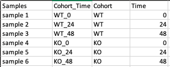 
**Figure 3.** Metadata file

##Steps involved in data processing

*   Upload input files   
*   Clean data and perform quantification, normalization and batch correction on the data
*   Perform differential expression followed by X2K, Enrichr and PGSEA

##Caveats

*   The presence of both *Samples* and *Cohort* columns in a metadata file is mandatory.  

#Tutorial

Select *RNA Seq Workflow* from the dashboard under the *Screening and Sequencing Data* tab.

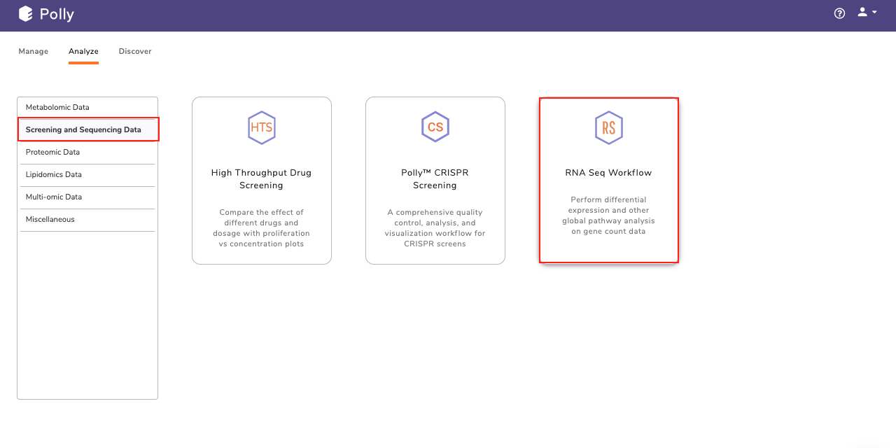 
**Figure 4.** Polly Dashboard

Create a *New Project* or choose the existing one from the drop down to be redirected to *RNA Seq Workflow*'s upload page

 
**Figure 5.** Project selection

##Uplaod Files

Upload the feature countsa and metadata file using the drop downs as shown in Figure 6.

 
**Figure 6.** Upload interface

##Pre-processing

Pre-processing tab contains four sub-tabs which allow you to specify parameters at which to analyze the uploaded data. The sub tabs are as follows:
 
**Data Cleaning** 
    
*Data cleaning* interface presents a visual summary of the counts file which includes the number of genes, number of duplicates in the data, and number of NA and NaN values. It allows you to choose from a set of predefined operations to clean and filter data. These include: 

*   Species selection:
    *   Human
    *   Mouse  
     

*   Data Cleaning methods:   
    *   *Removing NA and NaN values:* Rows having even a single NA or NaN values are removed.
    *   *Removing duplicates:* Duplicates are removed on the basis of a row's mean value, i.e. The one with greater row mean value is retained. 
    *   *Filter Protein Coding Genes:* Only the Protein coding genes are filtered from the complete dataset based on the specified species.
    *   *Replace Ensemble ID with HGNC Symbol:* In case the input data has ENSEMBL IDs, they can be replaced with the HGNC symbols (mandatory for further analysis).                               

Select the desired cleaning method (multiple methods can be selected) and specify the species under study. Once the selection is done, click on *Clean Data*. The visual summary along with the boxplot and data table will get updated once the processing is done.

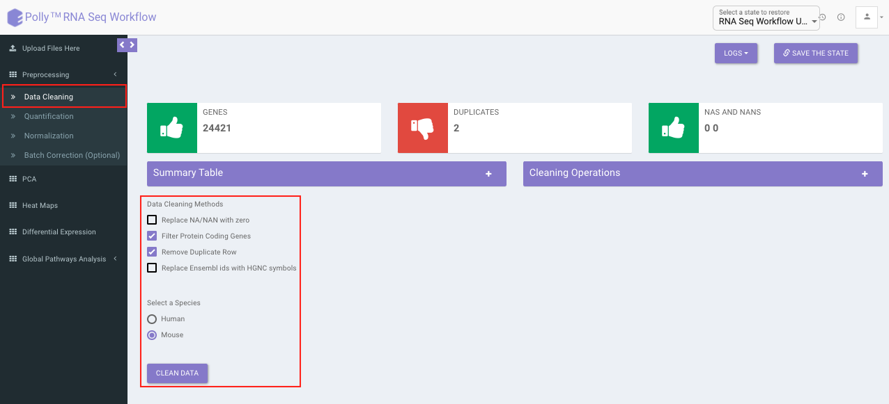

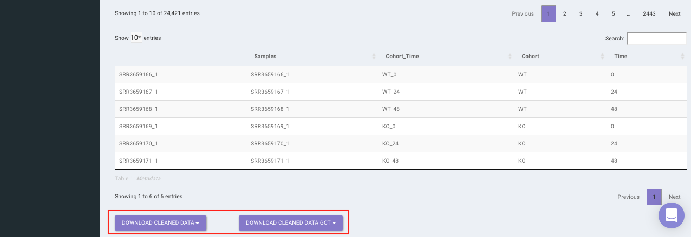 
**Figure 7.** Data cleaning

**Quantification** 

*Quantification* interface provides the following options:

*   *Reads Per Kilobase of transcript, per Million mapped reads (RPKM):*  It is a normalized unit of transcript expression. It scales by transcript length to compensate for the fact that most RNA-seq protocols will generate more sequencing reads from longer RNA molecules. RPKM is calculated as mentioned below:
    *   Count up the total reads in a sample and divide that number by 1,000,000 – this is our “per million” scaling factor.
    *   Divide the read counts by the “per million” scaling factor. This normalizes for sequencing depth, giving you reads per million (RPM).
    *   Divide the RPM values by the length of the gene, in kilobases. This gives you RPKM.  
     

*   *Transcripts Per Million (TPM):* TPM is very similar to RPKM. The only difference is the order of operation. TPM is calculated as mentioned below:
    *   Divide the read counts by the length of each gene in kilobases. This gives you reads per kilobase (RPK).
    *   Count up all the RPK values in a sample and divide this number by 1,000,000. This is your “per million” scaling factor.
    *   Divide the RPK values by the “per million” scaling factor. This gives you TPM.  
     

*   *No Quantification:* This is to undo any quantification that you may have done. It is equivalent to skipping quantification altogether. 

Select the desired quantification (only a single method can be selected at a time). Once the selection is done, click on *Quantify*. The visual summary along with the boxplot and data table will get updated once the processing is done.

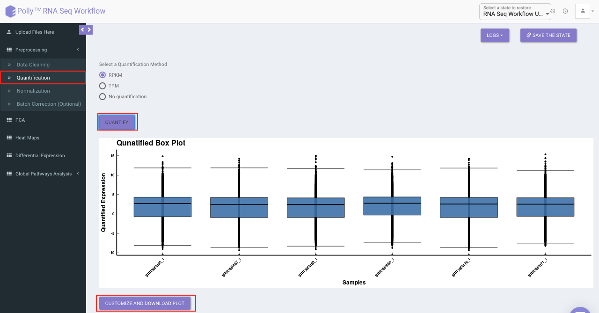

 
**Figure 8.** Quantification interface

**Normalization**

The *Normalization* tab allows you to adjust raw data to account for factors that prevent direct comparison of expression measures. It allows you to choose from a set of predefined operations to normalize. This will be performed on top of quantified data if quantified.

 *  *Quantile:* It is a technique for making two distributions identical in statistical properties. To quantile normalize two or more distributions to each other without a reference distribution, sort as before, then set to the average (usually, arithmetical mean) of the distributions. The highest value in all cases becomes the mean of the highest values, the second highest value becomes the mean of the second highest values, and so on. In the app, this is done using normalize.quantiles function in R.
 *  *R-Log:* This function transforms the count data to the log2 scale in a way which minimizes differences between samples for rows with small counts, and which normalizes with respect to library size. In the app, this is performed using library DESeq. Since, this operation is only performed on counts data (no quantification/normalization/log transformation), trying to run this function after quantification will throw an error. To supersede that you will need to  go back to *Quantification* tab and select *Mo Quantification*, and then select *rlog*.
 *  *Cyclic Loess:* This function is intended to normalize single channel or A-value microarray intensities between arrays. Cyclic loess normalization has similar effect and intention as quantile normalization, but with some advantages, in particular the ability to incorporate probe weights. In the app, this is performed using normalizeCyclicLoess function of the limma package.

Select the desired normalization method (only a single method can be selected at a time). Once the selection is done, click on *Normalize*. The visual summary along with the boxplot and data table will get updated once the processing is done.

 
**Figure 9.** Normalization interface

**Batch Correction**

The *Batch Correction* tab allows you to select a condition from metadata on which you want to run batch effect correction. The app uses sva package to remove the batch effect. ComBat allows you to adjust for batch effects in datasets where the batch covariate is known, using the methodology described in Johnson et al. 2007. It uses either parametric or non-parametric empirical Bayes frameworks for adjusting data for batch effects. You are returned an expression matrix that has been corrected for batch effects. The input data are assumed to be cleaned and normalized before batch effect removal. Histogram of the data is shown by taking log of the data (after Batch Correction). Data Table, showing how the data looks like after performing the above mentioned operations.

Select the cohort condition from the drop down list (single selection). Once the selection is done, click on *Run Batch Correction*. The visual summary along with the boxplot and data table will get updated once the processing is done.

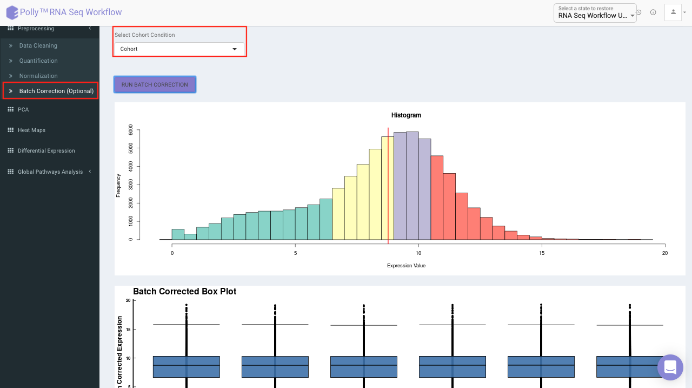

 
**Figure 10.** Batch correction

##PCA Plot

PCA plot allows you to understand the clustering pattern between biologically grouped and ungrouped samples. It provides viusalization by selecting the PC values for x- and y- axes. It’s also possible to specify the cohort order for the plots.

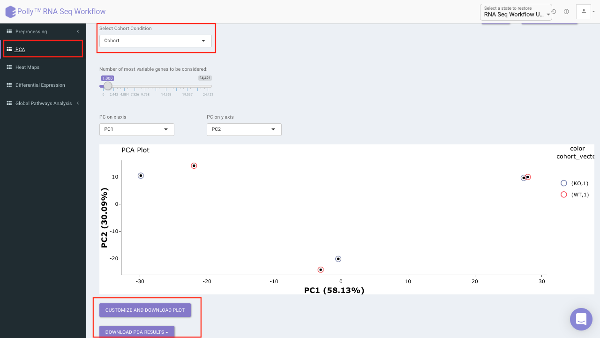 
**Figure 11.** PCA Plot

##Heat map

A heat map is a graphical representation of data where the individual values contained in a matrix are represented on a color scale. Here the heat map represents expression value of each gene corresponding to the number of samples in the data. The filter icon can be used to filter out the desired samples and genes. Once the filter is applied, the heat map containing the selected genes and sample would b generated.

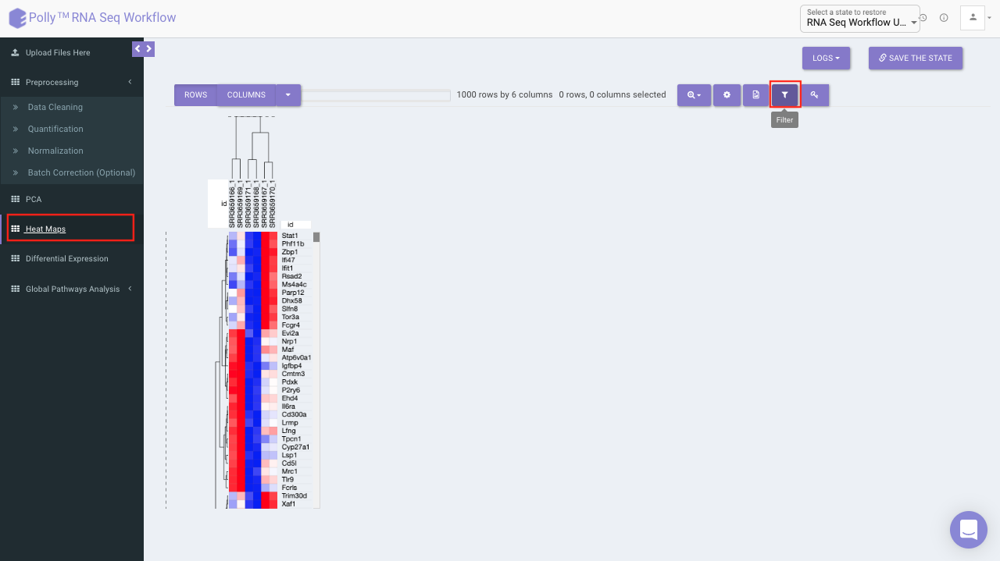 
**Figure 12.** Heat map

##Differential expression

The goal of differential expression analysis is to identify genes whose expression differs under different conditions. An important consideration for differential  expression analysis is correction for multiple testing. This is a statistical phenomenon that occurs when thousands of comparisons (e.g. the comparison of  expression of multiple genes in multiple conditions) are performed for a small number of samples. Following are the components in this tab:

Three types of statistical tests are provided in the app, namely, t-test,limma and One-Way ANOVA.  

*   *t-test:* To perform t-test, the app uses ttest function in R.
*   *limma:* To perform limma, limma function of the limma library is used.
*   *One-Way ANOVA:* To perform One-Way ANOVA, the app uses aov function in R.

 For *p*-value correction, following two methods are provided:

*   *Bonferroni:* In this method the *p*-values are multiplied by the number of comparisons. 
*   BH: The BH method helps you to avoid Type I errors (false positives). Adjusting the rate helps to control for the fact that sometimes small *p*-values (less than 5%) happen by chance, which could lead you to incorrectly reject the true null hypotheses.

p.adjust function takes care of the correction.

Select the statistical test, *p*-val correction method, cohort condition and cohort combination. Once the selection is done click on *Go*. A volcano plot along with the data table which can be used to quickly identify changes in large data sets composed of replicate data is shown. It plots significance versus fold-change on the y and x axes, respectively. This plot colours the significant and insignificant genes based on *p*-value or FDR and log2FC values.                

Based on positive or negative log2FC values, you can choose to further filter the significant genes and create a gene set of up-regulated or down-regulated genes which can then be relayed to Enrichr. By default it takes into consideration all the significant genes.

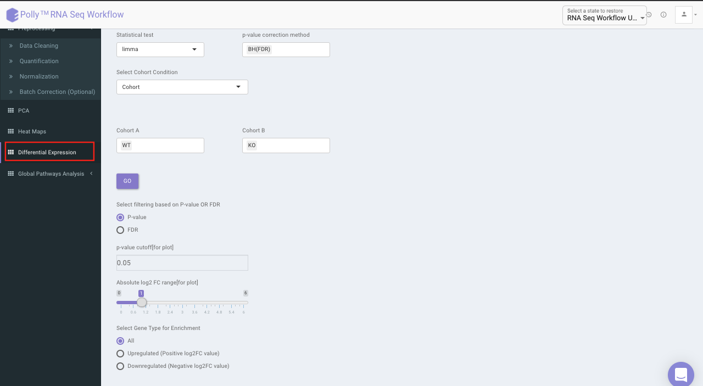

 
**Figure 13.** Differential expression

##X2K analysis (eXpression2Kinases) 

The input for X2K analysis is a gene set consisting significant genes which is formed in the same manner as is for Enrichr in the previous step. Both the steps are autonomous and are not dependent on each other. Once we have the gene set handy, X2K analysis is performed on it, the only other input required from the user is TF-target gene background database to be used for enrichment

 You can choose from the following databases to perform the analysis.

*   ChEA 2015         
*   ENCODE 2015
*   ChEA & ENCODE Consensus
*   Transfac and Jaspar
*   ChEA 2016
*   ARCHS4 TFs Coexp
*   CREEDS
*   Enrichr Submissions TF-Gene co-occurrence

<!-- The Z-Score is calculated using the following formula. Here, s denotes the mean log2(FC) of known Transcription Factor of the given Gene, p represents the mean log2(FC) of all Transcription Factors in the dataset, m denotes the total number of Transcription Factors annotated to the Gene, and d denotes the standard deviation of the log2(FC) across all Transcription Factors in the dataset. -->

On selecting all the options along with the target database, click on the option *Go*. The enrichment results from the Transcription Factor Enrichment Analysis (TFEA), kinase enrichment analysis (KEA) and Expression2Kinase (X2K) can be viewed from the TFEA,KEA and X2K tabs respectively.

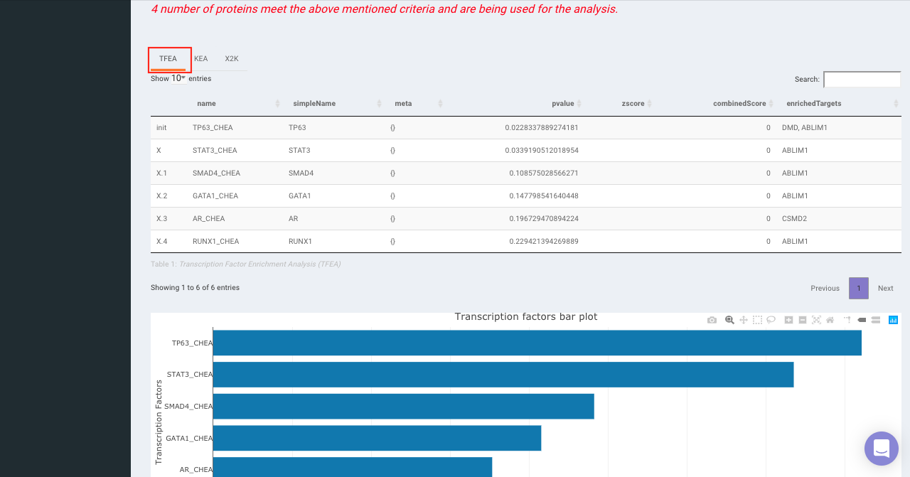 
**Figure 14.** X2K Analysis (TFEA)

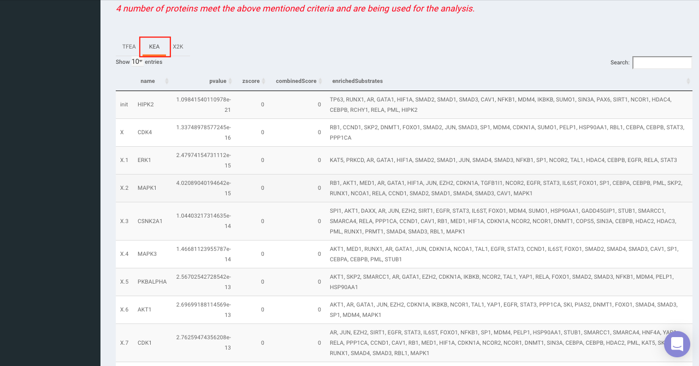

 
**Figure 15.** X2K Analysis (KEA)

 
**Figure 16.** X2K Analysis (X2K)

##Enrichr (Enrichment analysis)

Enrichr performs the enrichment analysis on the gene set relayed, either in the Differential Expression tab or X2K analysis tab. Enrichment analysis is a computational method for inferring knowledge about an input gene set by comparing it to annotated gene sets representing prior biological knowledge. Enrichment analysis checks whether an input set of genes significantly overlaps with annotated gene sets.

To perfomr the enrichment analysis, select the desired Enrichr database.

 
**Figure 17.** Enrichr

##PGSEA (Parametric Gene Set Enrichment Analysis)

It avails you to do exploratory parametric analysis of gene expression data. This type of analysis can assist in determining of lists of genes, such as those deregulated in defined experimental systems, are similarly deregulated in other data sets. It further subsets the data based on lists of genes, computes a summary statistic for each gene list, and returns the results in the form of Heat map.

Click on *Pathway Database* option to select the database of interest from the drop down. Clicking on *Run PGSEA* will generate a data table containing the list of genes along with the heat map.

 
**Figure 18.** PGSEA

#References

*   Johnson, W. Evan, Cheng Li, and Ariel Rabinovic. "Adjusting batch effects in microarray expression data using empirical Bayes methods." Biostatistics 8.1 (2007): 118-127.