#Single Cell Visualization

**Opening the app**

Upon opening the Discover application on Polly, choose a relevant data repository which hosts single cell data. 

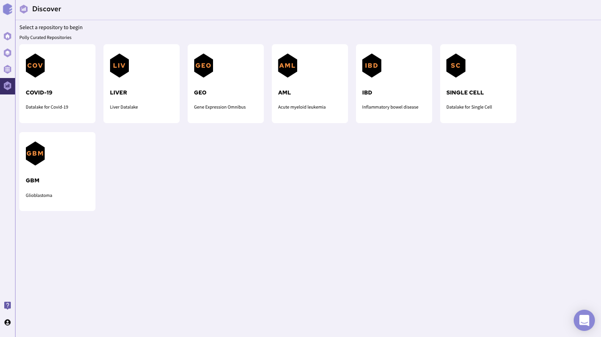

After selecting a repository, you’ll be able to view a filtering interface which provides **parameters** that you can use to filter the datasets within the selected repository. Once you select a dataset you can access the integrated tools attached with the repository. You can use Single Cell Visualization application for further analysis of single cell data.

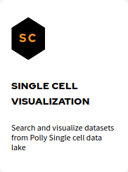

The app will open and you should see the overview page which contains a brief overview of the application, scope and caveats as shown below.

**Exploring the data lake**

Search for relevant datasets by navigating to the *Dataset Search* tab in the navigation panel to the left. Keyword search can be applied to the following fields:

*   DatasetID
    
*   Platform

*   Title
    
*   Description
    
*   Disease
    
*   Pubmed ID
    
*   Organism
    
*   Cell Types
    
*   Tissue

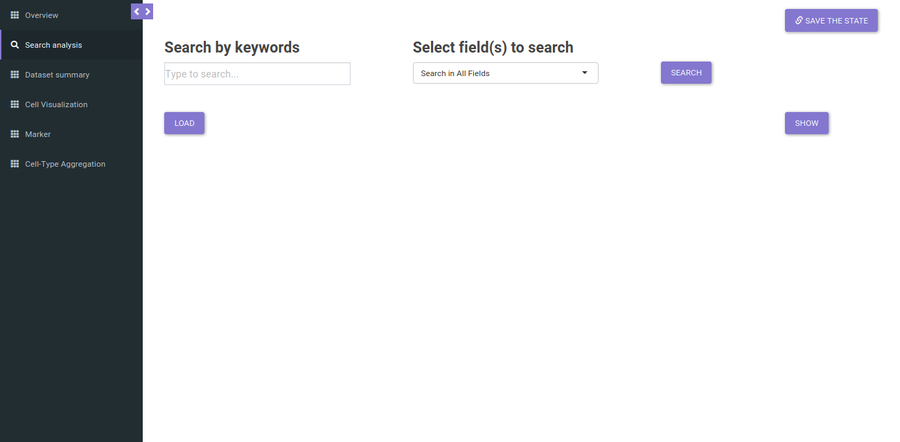

The search will return all datasets that are associated with your search. The result should look like as shown below.

The table shown above shows very few columns by default. In order to view the other columns in the table, you can select the fields from **Available Columns** and click on *Show* button. Once you have narrowed down the relevant datasets, you can analyze one dataset on the fly within the app.

**Analyzing a dataset**

You can analyze a single dataset by selecting the checkbox to the left of the entry in the table. Once you’ve selected the checkbox, click on the *Load* button below the table description.

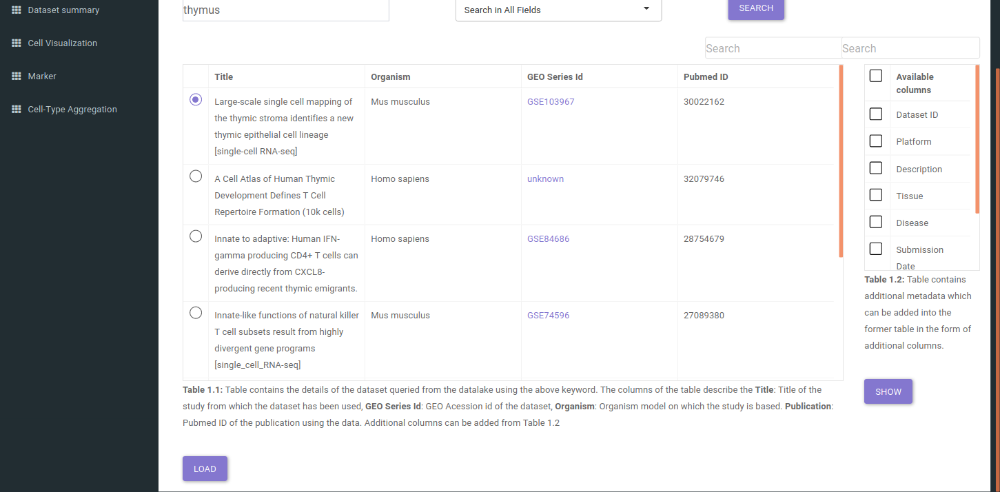

After clicking the *Load* button, the app will read the selected dataset. Once the loading finishes, you can check the further tabs to explore the dataset:

*   **Dataset Summary**

This tab provides quick summary of the selected dataset. The tab reveals the no. of celltype/clusters, genes and cells, available metadata and quality control metrics for the selected dataset. The Value boxes at the top provide information about the no. of genes, cells and celltypes/clusters. 

    
Below it lies the metadata summary table which contains the different metadata fields and their categories. The table is searchable and clicking on a particular metadata shows it's distribution. For instance if you want to see the distribution of cell types in a study, you can search the keyword 'cell_type' in *name* search box. Upon click on it a table describing the distribution of cell types will popup.

Quality Control(QC) Metrics helps in understanding the processing of the dataset. The application provides the opportunity to understand quality control using *QC distribution* and *QC scatter* plots. Using QC distribution one can understand the distribution of a single quality control metric in a particular metadata. For instance, if we want to check the distribution of gene counts in different cell type, we can select 'gene_counts' as QC metric and 'cell_type' as cluster.

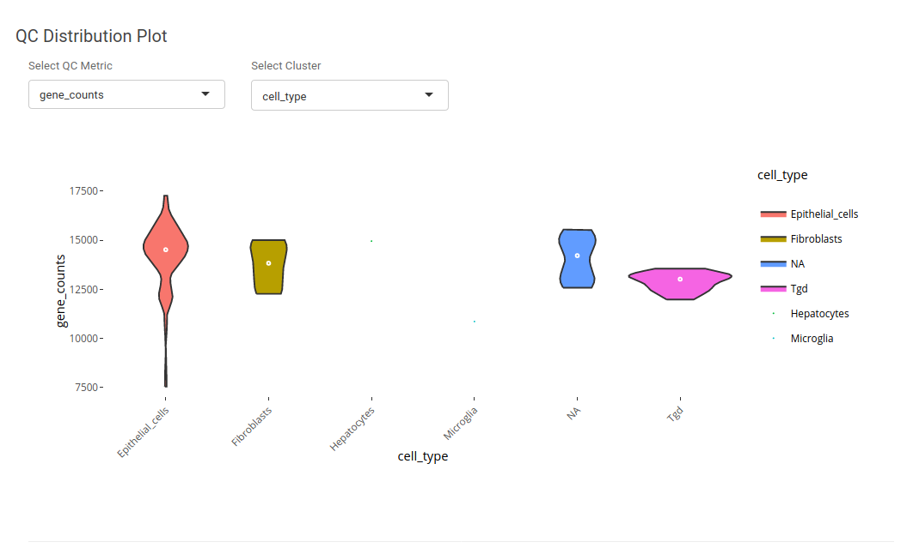

Using QC scatter plot one can understand the assosciation between distribution of two different quality control metrics. It can be useful in understanding the distribution of gene counts and UMI counts.

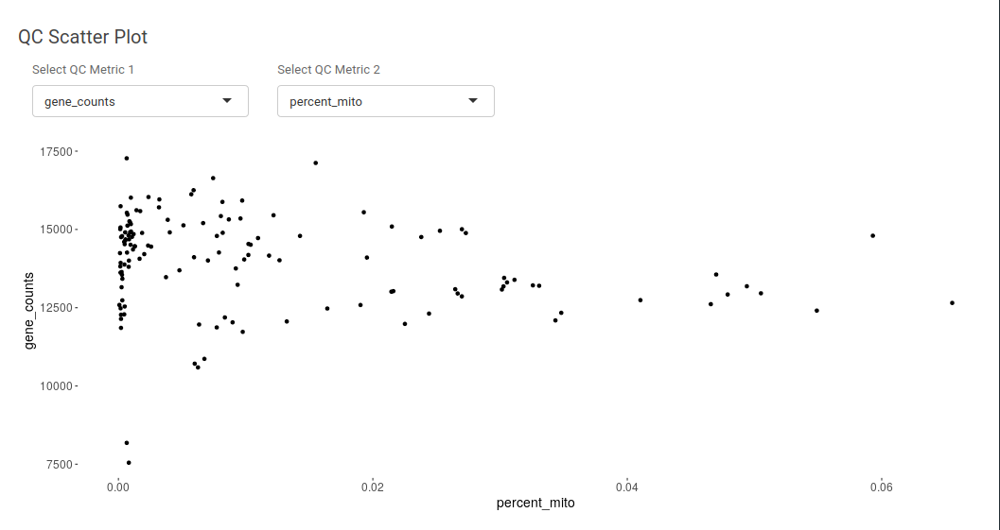

*   **Cell Visualization**

*Cell visualization* provides exploration of cells using dimensionality reduction methods. The tab presents the dimensionality reduction methods such as tSNE, UMAP, PCA and others to visualize the distribution of the cells. The *Visualize cells* panel on the right, shows the distribution of the cells in an interactive way. 

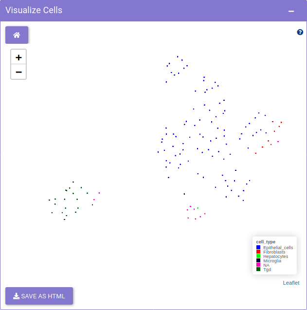

Using *Feature selection* panel, a metadata or a gene feature can be selected for plotting. 

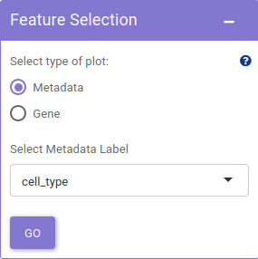
    
The *Customize visualization* panel, offers the scope of customizing visualization features such as *highlight non-zero cells*, *point size* and *method* used based on personal preferences.

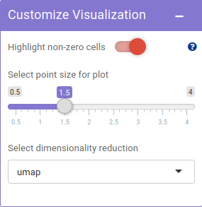       
    
*   **Marker**

*Marker* tab provides exploration of distribution of markers. It presents visualization methods like *dot plot* and *violin plot* to study the distribution of genes across different metadata. The *Marker selection* panel, provides the user with options to choose different genes and metadata for plotting marker distribution. 

The *Marker dot plot* panel, is the area for exploring the average expression and distribution of marker using dot plot in an interactive fashion.
    

The *Marker Violin plot* panel is the area for exploring the marker distribution using violin plot in an interactive fashion. Using *Customize Violin* slider, the range of values used for plotting violin can be adjusted. It is useful for observing a section of data such as the non-zero values of the expression. 

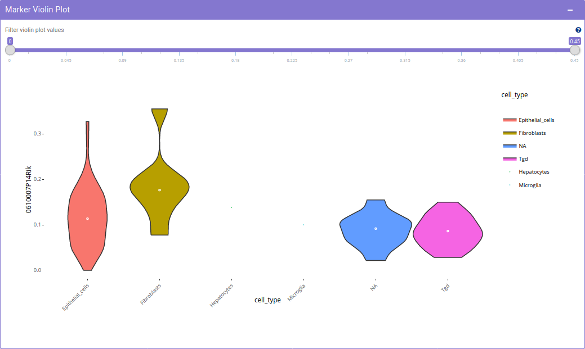

*   **Cell-Type Aggregation**

After having insights about different markers in a single cell study, it is imperative to have a look at the expression of the selected markers across different cell types in different studies. Single cell visualization provides pan-dataset exloratory analysis in the form of *Cell Type Aggregation*. It provides the scope to query the respective repository for median expression of a selected gene across top 20 cell types based on expression. This provides the scope to study expression of a gene in a particular cell type in a given biological context. 

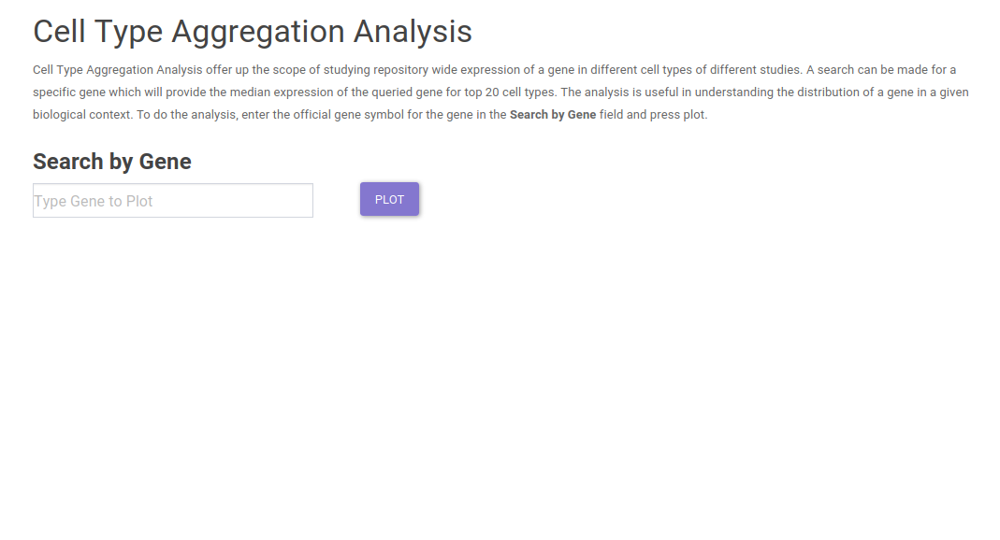
    
Potential use-case example: What is the expression of SARS-CoV2 virus entry specific host protein 'ACE2' across different cell types in different studies? 

    
The *Cell Type Aggregation* tab provides the input in the form of text field where query can be made for a gene, using our internal discover services, the input gene is queried across all the datasets in which it is expressed in the repository. To check for ACE2 expression, simply enter ACE2 in the search field. After entering the gene, clicking on *Search gene* will generate a bar plot showing the median expression and the distribution of gene expression across different studies.

