# Introduction

## Overview

The *Lipidomics Data Analysis* preset allows you to perform downstream analysis on the lipidomics data hosted on any of the data lakes on Polly. The preset provides a variety of tools to visualize the data, as well as allows you to perform statistical analysis, thereby providing an efficient analysis of the data to get actionable insights.

## Scope of the Preset

*  Allows any lipidomic data to be used from any of the data lakes on Polly.
*  Performs quality checks using PCA analysis.
*  Visualizes data distribution using boxplots to observe the median and quantiles for each feature.
*  Performs statistical analysis using limma to get actionable insights.
*  Provides barplot visualization to look at observed values of individual features.

# Getting Started

## User Input

The following are the inputs of the preset, which needs to be specified if the user launches the preset from the Applications interface. The fields are pre-populated if it is launched from a data lake. The inputs are:
* *Repo ID(repo_id)*: The repo id of the data lake from which you want to fetch the data.
* *Dataset ID(dataset_id)*: The name of the dataset you want to fetch from the data lake.
* *Dataset ID Column(dataset_id_col)*: The column which contains the names of the datasets('dataset_id' for all the data lakes).

## Tutorial

Select *Lipidomics Data Analysis* from the dashboard under the Studio Presets tab.

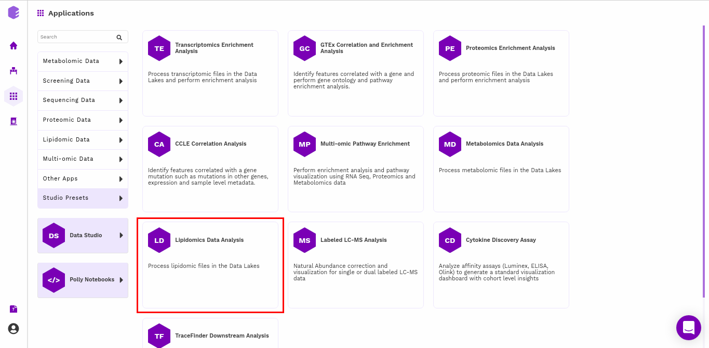 
**Figure 1.** Polly Dashboard

Select an existing Workspace from the drop-down and provide the Name of the Session to be redirected to *Lipidomics Data Analysis* preset's upload page.

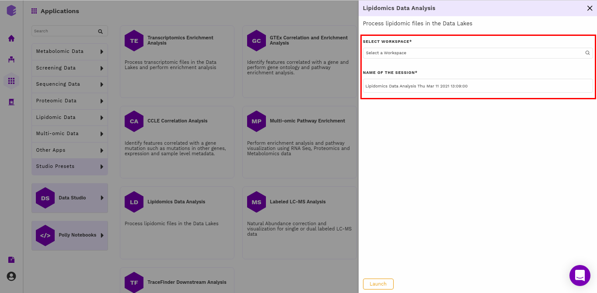 
**Figure 2.** App selection

## Fetching dataset

The first component is the *Data picker*, which allows you to enter the repo from which you want to use the data, and the dataset you want to use in the preset for the analysis. These inputs are filled in a Global input pop-up which comes up just after launching the preset.

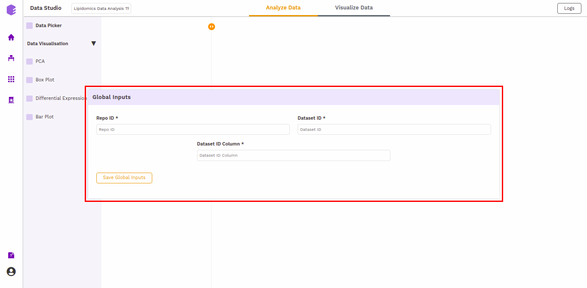 
**Figure 3.** Global Inputs

The inputs specified in the app are prefilled in the *Data picker* component. Click on the Run Task button to execute the component.

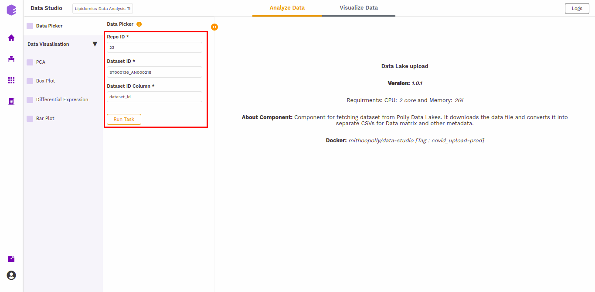 
**Figure 4.** Data Picker Interface

It will generate three output files:

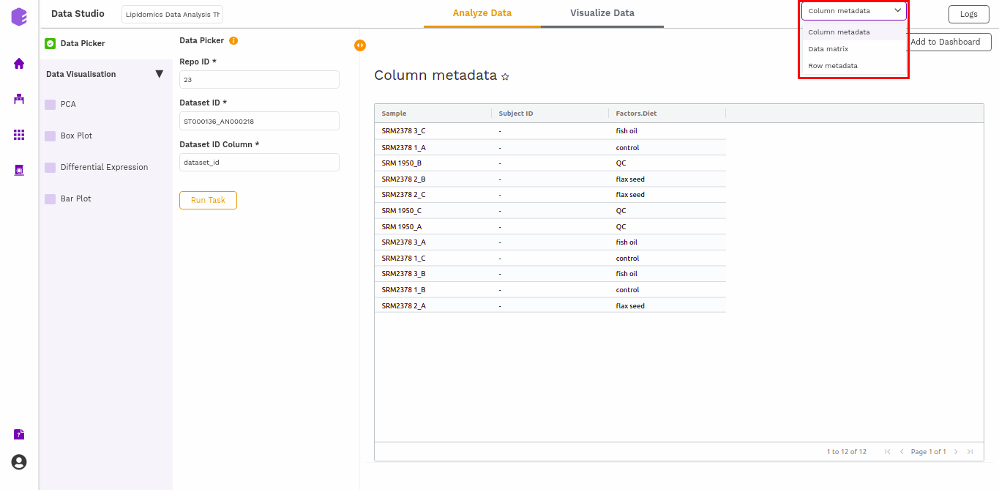 
**Figure 5.** Data Picker Output

* **Column metadata**: Table for the metadata information associated with each sample. Rows represent samples and columns represent various attributes of the samples.
* **Data matrix**: Table for the measured(intensity/ppm etc) values of lipids in various samples with lipids in rows and samples in columns.
* **Row metadata**: Table of supporting metabolite annotations from various databases such as KEGG, HMDB, PubChem, etc.

## Data Visualization

### PCA

This component allows you to simplify the complexity of high-dimensional data while retaining the trends and patterns in it. It projects the data onto a lower dimension with an objective to find the best summary of the data using a limited number of principal components that help in understanding the clustering pattern between biologically grouped and ungrouped samples.

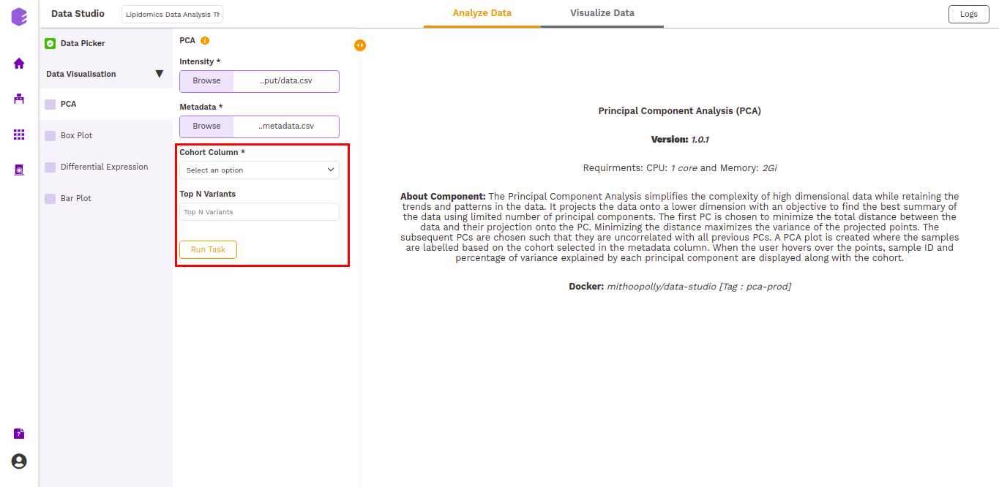 
**Figure 6.** PCA Interface

* **Cohort Column**: Dropdown to select one of the metadata columns.

* **Top N Variants**: The top N variable entities will be used for PCA calculation. Define the number in this box. The default number used is 1500.

It generates two outputs:

* **PCA Plot**: A plot is created where the samples are labeled based on the cohort selected in the metadata column. When you hover over the points, sample ID and percentage of variance explained by each principal component are displayed along with the cohort.

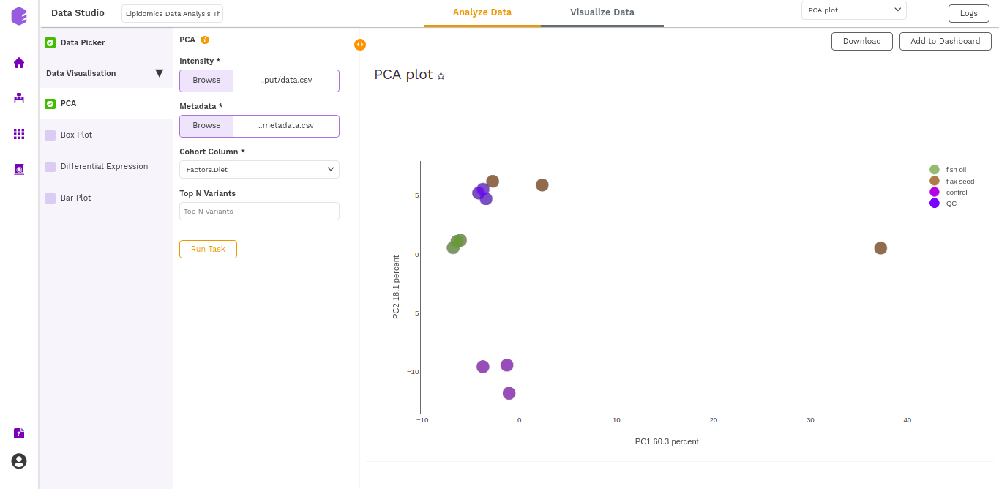 
**Figure 7.** PCA Plot

* **PCA Score**: Table of the first 10 PC values and metadata columns.

 
**Figure 8.** PCA Score

### Boxplot

A boxplot is a graph that presents information from a five-number summary namely lower extreme, lower quartile, median, upper quartile, and upper extreme. 

In this plot the median is marked by a vertical line inside the box; the ends of the box are upper and lower quartiles; the two lines outside the box extend to the highest and lowest observations. It is useful for knowing the nature of distribution (i.e., skewed) and potential unusual observations.

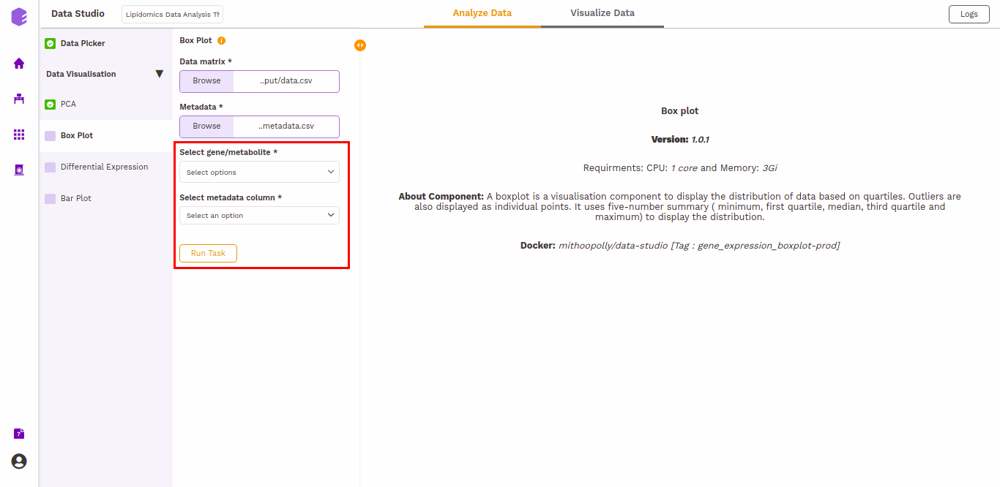 
**Figure 9.** Boxplot Interface

* **Select gene/metabolites**: Dropdown to select the metabolites to plot.
* **Select metadata column:** Dropdown to select one of the metadata columns.

The boxplot is generated based on the selected lipids and the selected cohort column from metadata.

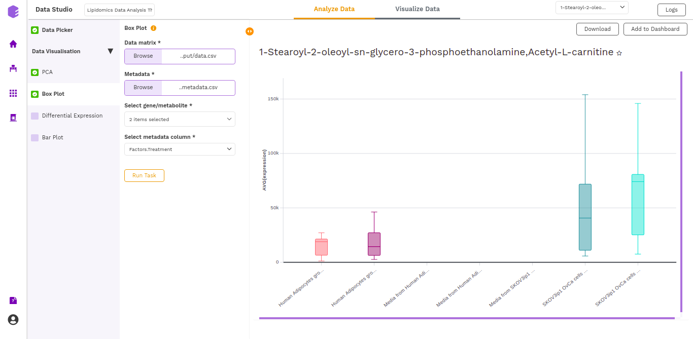 
**Figure 10.** Boxplot Output

### Differential Expression

This component allows the search for differentially expressed (DE) genes, that is, genes that show differences in expression level between conditions or in other ways are associated with given predictors or responses.

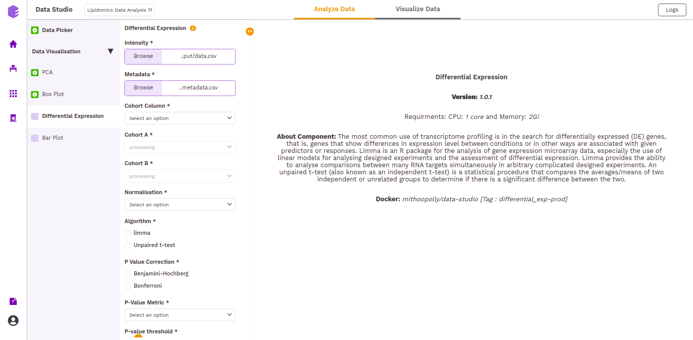 
**Figure 11.** Differential expression interface

* **Cohort Column:** Dropdown to select one of the metadata columns.

* **Cohort A:** Dropdown to select a cohort from the metadata column selected.

* **Cohort B:** Dropdown to select another cohort from the metadata column selected.

* **Normalization:** Perform log2normalization if data is not normalized.

* **Algorithm:** You can select any one of the two algorithms - *limma* or *Unpaired t-test*.

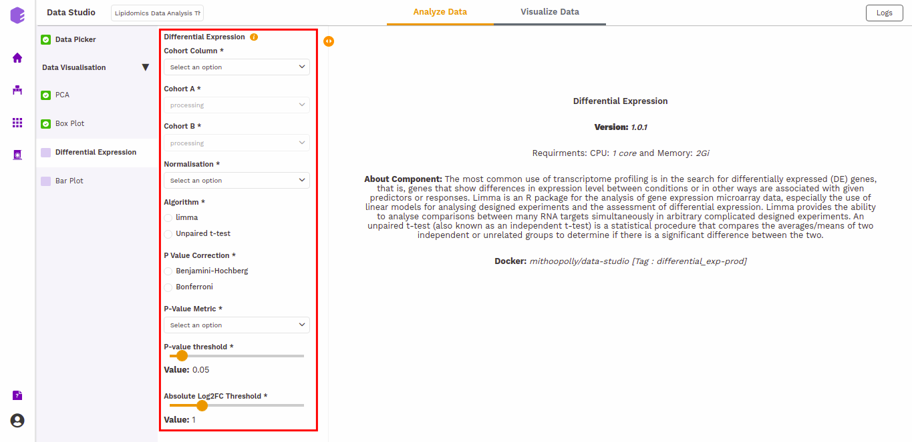
**Figure 12.** Differential Expression parameters

*Limma* is an R package for the analysis of gene expression microarray data, especially the use of linear models for analyzing designed experiments and the assessment of differential expression. Limma provides the ability to analyze comparisons between many RNA targets simultaneously in arbitrary complicated designed experiments.

An *unpaired t-test* (also known as an independent t-test) is a statistical procedure that compares the averages/means of two independent or unrelated groups to determine if there is a significant difference between the two.

*   **P-Value Correction:** You can select the *Benjamini-Hochberg* method to correct the *p*-value for False Discovery Rate or the *Bonferroni* method to correct the *p*-value for Type I errors.

*   **P-Value Metric:** Plot and calculate significance using the selected metric. *p-value* is the value returned by the algorithm while *Adjusted p-value* is the corrected value after applying one of the correction methods above.

*   **P-value threshold:** You can select the appropriate threshold for the selected *p*-value metric. *p8-values lower than this threshold will be marked as significant.

*   **Absolute Log2FC Threshold:** You can select the appropriate fold change threshold. Log2fold change values higher than this will be marked as significant.

Once all the parameters are selected, execute the component by clicking on *Run Task*. It will generate thwo outputs:    

*   **Differential Expression:** Table with Differential Expression results with *p*-value and fold change.

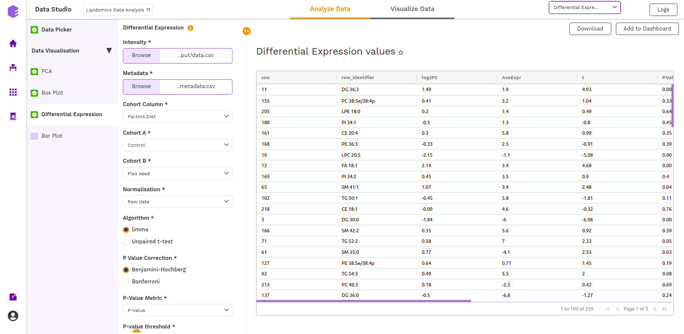
**Figure 13.** Differential expression table

*   **Volcano Plot:** Based on the parameters specified, a volcano plot is displayed. The volcano plot helps in visualizing lipids that are significantly dysregulated between two cohorts. 

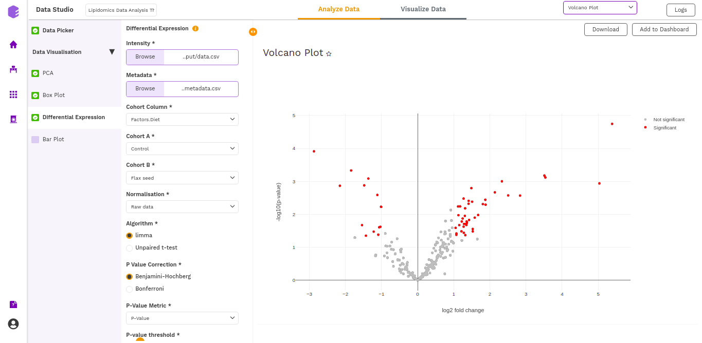
**Figure 14.** Volcano plot

## Bar Plot

A *Barplot* is a chart that visualizes data using rectangular bars or columns that represent the value of the observation in the data for that category. The *barPlot* component allows you to visualize the raw sample-wise values of selected lipids in the form of vertical bar graphs.

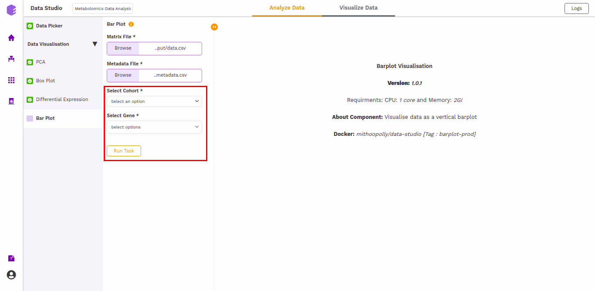 
**Figure 15.** Bar Plot Interface

The barplot is generated based on the selected cohort column from metadata and selected lipids.

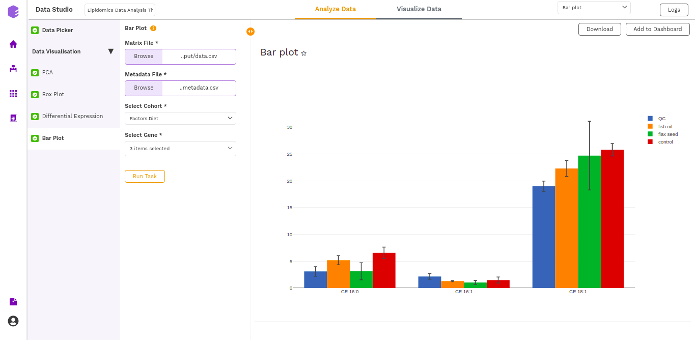 
**Figure 16.** Bar Plot Output

## Dashboard

Data Studio lets you visualize your data with the number of highly configurable charts and tables, which you can save and add to dashboards and then customize as needed. The Visualization Dashboard provides an at-a-glance view of the selected visualization charts. The dashboard is customizable and can be organized in the most effective way to help you understand complex relationships in your data and can be used to create engaging and easy-to-understand reports. A template of the report can also be defined to generate the output if required.

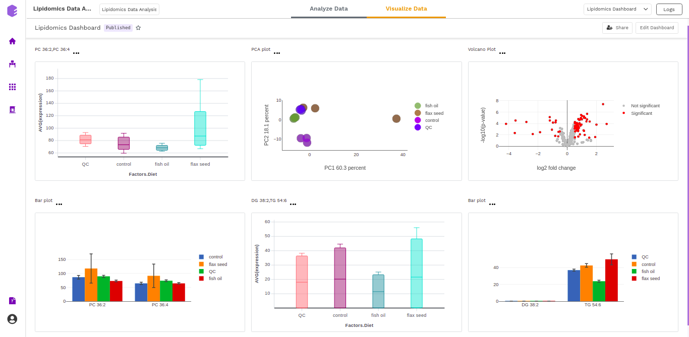 
**Figure 17.** Dashboard

The generated reports are interactive and can be shared with the collaborators. You can easily communicate and act on the customized data where all the members of your team can compare, filter and organize the exact data they need on the fly, in one report.
