# Introduction

## Overview
The *TraceFinder Downstream Analysis* preset performs the downstream analysis of the LC-MS data from the TraceFinder. It allows the user to do various statistical analyses to find valuable insights from the data.

### Scope of the Preset

* LC-MS data from TraceFinder can be used for the downstream analysis.
* Performs quality checks using PCA analysis.
* Visualizes data distribution using boxplots to observe the median and quantiles for each feature.
* Performs statistical analysis using limma to get actionable insights.
* Provides barplot visualization to look at observed values of individual features.

# Getting Started

## User Input

The user needs to upload the following files to the workspace

* *Intensity Matrix:* Raw intensity file with metabolite names.
* *Metadata:* Metadata file containing the cohort and other information.

## Tutorial

Select the *TraceFinder Downstream analysis* preset from the *Studio Preset* section.

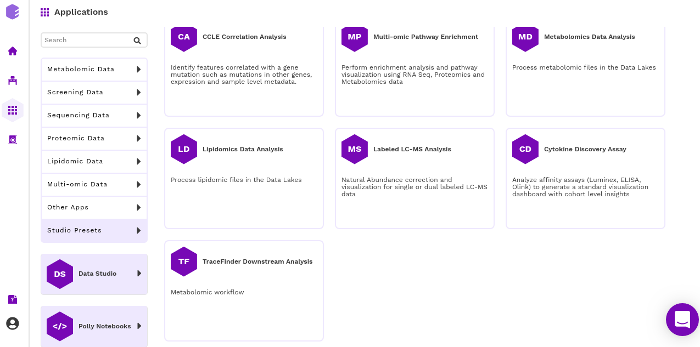

*Select the workspace* from the drop-down and provide the *Name of the session* and click on *Launch.*

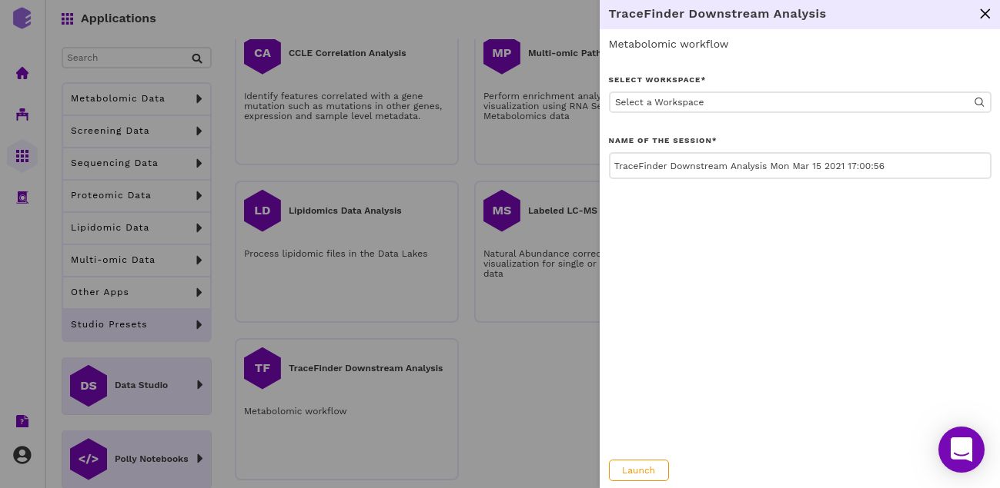

## Pre-processing

### Upload

Select the intensity file and the metadata. Select *transform the data by 1* if you want to transform the data by one or else *Proceed* if you do not want to perform any transformation.

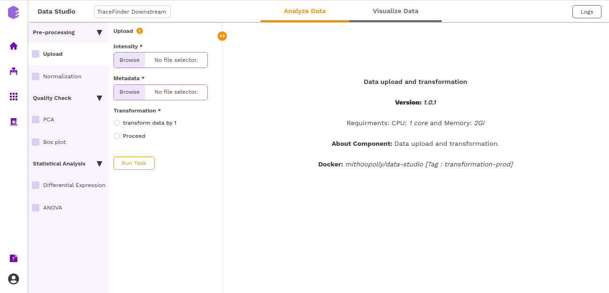

## Normalization

Select the type of normalization that you want to do - sum/median/mean of internal standards.

**Normalization by sum**:  The sum of all the internal standards will be used for normalization. The sample wise data is taken and is divided by the sample wise sum of all the internal standards to perform this normalization.

**Normalization by mean**: The average of all the internal standards will be used for normalization. The sample wise data is taken and is divided by the sample wise average of all the internal standards to perform this normalization.

**Normalization by median:** The median of all the internal standards will be used for normalization. The sample wise data is taken and is divided by the sample wise average of all the internal standards to perform this normalization.

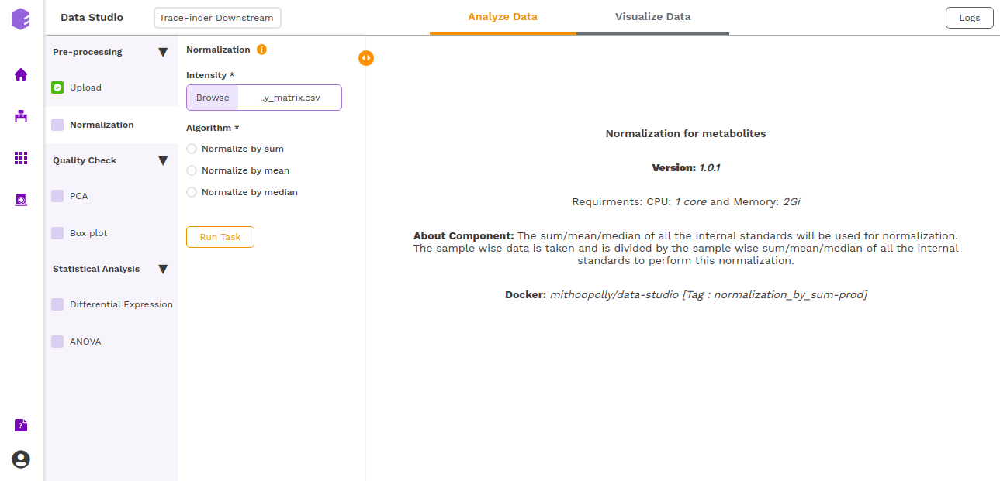

This will give a *boxplot* of normalized intensity for all the samples.

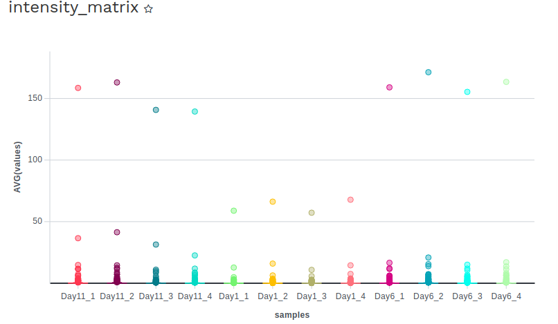

## Quality Check

### PCA

This component allows you to simplify the complexity of high-dimensional data while retaining the trends and patterns in it. It projects the data onto a lower dimension with an objective to find the best summary of the data using a limited number of principal components that help in understanding the clustering pattern between biologically grouped and ungrouped samples.

* *Cohort Column*: Dropdown to select one of the metadata columns.
* *Top N Variants*: The top N variable entities will be used for PCA calculation. Define the number in this box. The default number used is 1500.

It generates two outputs:

* **PCA Plot**: A plot is created where the samples are labeled based on the cohort selected in the metadata column. When you hover over the points, sample ID and percentage of variance explained by each principal component are displayed along with the cohort.

* **PCA Score**: Table of the first 10 PC values and metadata columns.

### Boxplot

A *boxplot* is a graph that presents information from a five-number summary namely lower extreme, lower quartile, median, upper quartile, and upper extreme. In this plot: the median is marked by a vertical line inside the box; the ends of the box are upper and lower quartiles; the two lines outside the box extend to the highest and lowest observations. It is useful for knowing the nature of distribution (i.e., skewed) and potential unusual observations.

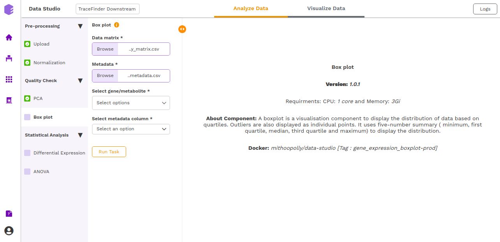

* *Select gene/metabolites*: Dropdown to select the metabolites to plot.
* *Select metadata column*: Dropdown to select one of the metadata columns.

The *boxplot* is generated based on the selected metabolites and the selected cohort column from metadata.

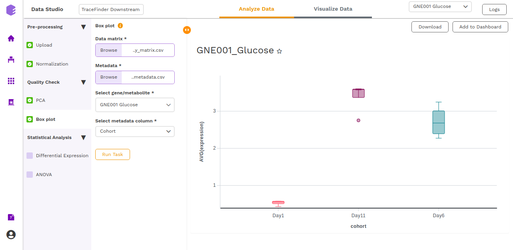

### Differential Expression

This component allows the search for differentially expressed (DE) genes, that is, genes that show differences in expression level between conditions or in other ways are associated with given predictors or responses.

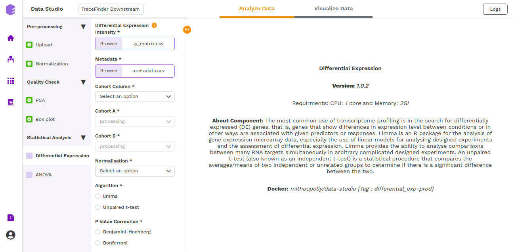

*  *Cohort Column*: Dropdown to select one of the metadata columns.
*  *Cohort A*: Dropdown to select a cohort from the metadata column selected.
*  *Cohort B*: Dropdown to select another cohort from the metadata column selected.
*  *Normalization*: Perform log2normalization if data is not normalized.
* *Algorithm*: You can select any one of the two algorithms - *limma* or *Unpaired t-test*.

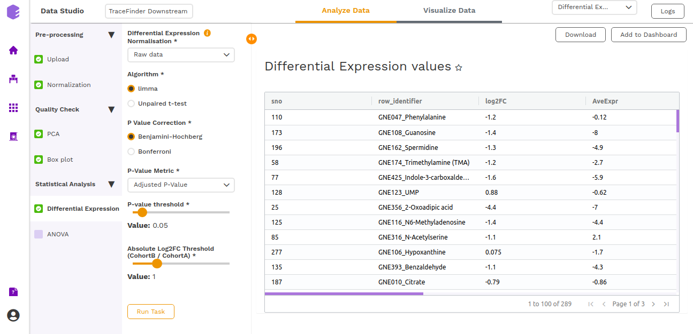

*Limma* is an R package for the analysis of gene expression microarray data, especially the use of linear models for analyzing designed experiments and the assessment of differential expression. Limma provides the ability to analyze comparisons between many RNA targets simultaneously in arbitrary complicated designed experiments.

An *unpaired t-test* (also known as an independent t-test) is a statistical procedure that compares the averages/means of two independent or unrelated groups to determine if there is a significant difference between the two.

*  *P-Value Correction*: You can select the *Benjamini-Hochberg* method to correct the *p-value* for False Discovery Rate or the *Bonferroni* method to correct the *p-value* for Type I errors.
*  *P-Value Metric*: Plot and calculate significance using the selected metric. The *p-value* is the value returned by the algorithm while the *Adjusted p-value* is the corrected value after applying one of the correction methods above.
*  *P-value threshold*: You can select the appropriate threshold for the selected *p-value* metric. *p-values* lower than this threshold will be marked as significant.
* *Absolute Log2FC Threshold*: You can select the appropriate fold change threshold. Log2fold change values higher than this will be marked as significant.

Once all the parameters are selected, execute the component by clicking on *Run Task*. 

It will generate two outputs:

**Differential Expression**: Table with Differential Expression results with *p-value* and fold change.

**Volcano Plot:** Based on the parameters specified, a volcano plot is displayed. The volcano plot helps in visualizing lipids that are significantly dysregulated between two cohorts.

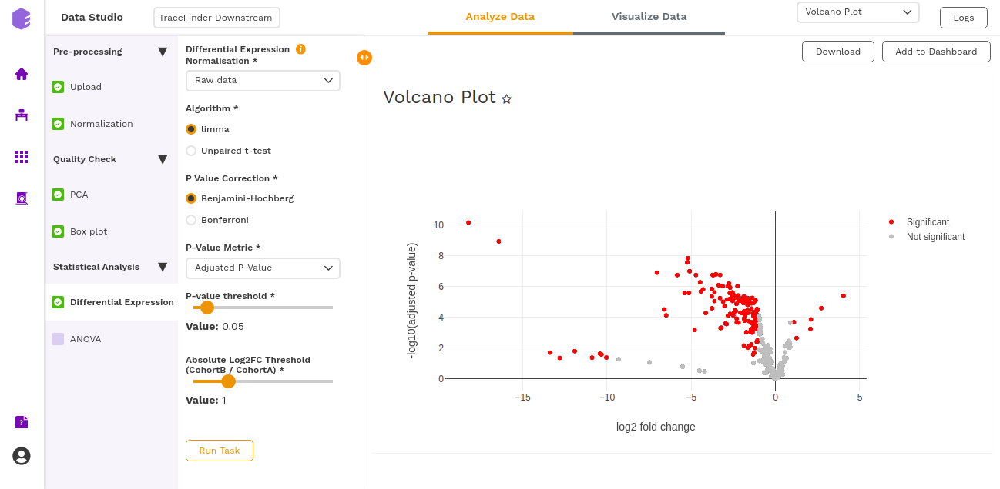

### ANOVA

This component allows the user to do a statistical t-test of whether two or more population means are equal.

* *Cohort Column*: Dropdown to select one of the metadata columns.
* *Cohorts*: Dropdown to select two or more cohorts from the cohort column selected.

This will give the following output:

* **ANOVA barplot**

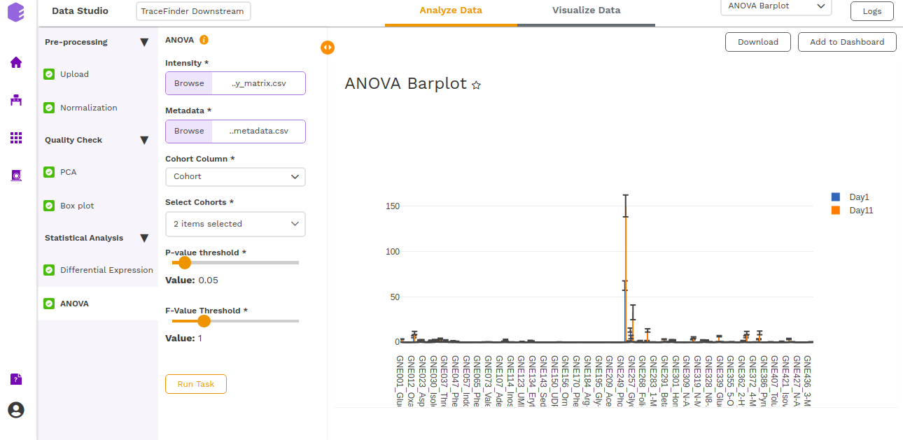

* **ANOVA Boxplot**

* **ANOVA table**

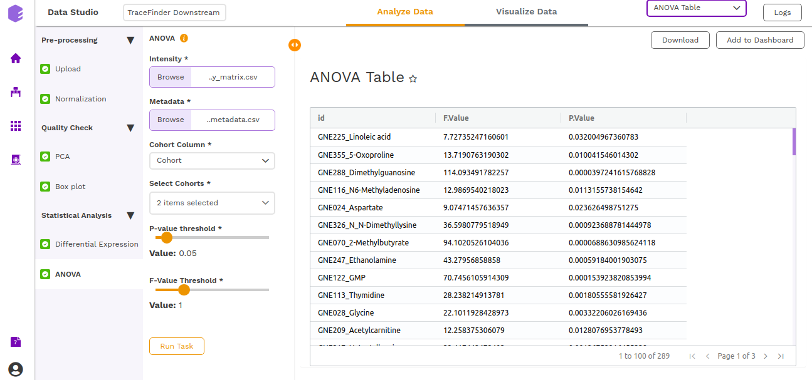
 
## Studio Dashboard
Data Studio lets you visualize your data with the number of highly configurable charts and tables, which you can save and add to dashboards and then customize as needed. The Visualization Dashboard provides an at-a-glance view of the selected visualization charts. The dashboard is customizable and can be organized in the most effective way to help you understand complex relationships in your data and can be used to create engaging and easy-to-understand reports. A template of the report can also be defined to generate the output if required.

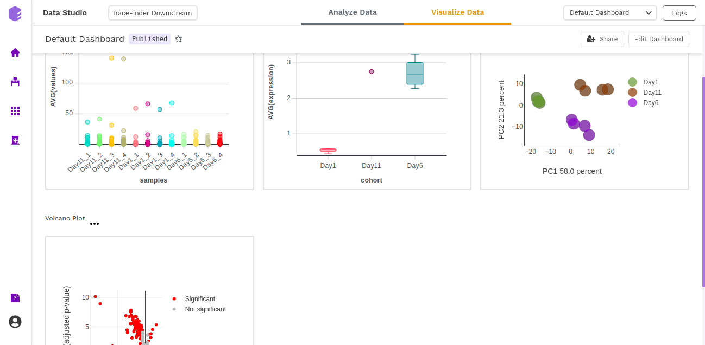

The generated reports are interactive and can be shared with the collaborators. You can easily communicate and act on the customized data where all the members of your team can compare, filter and organize the exact data they need on the fly, in one report.

