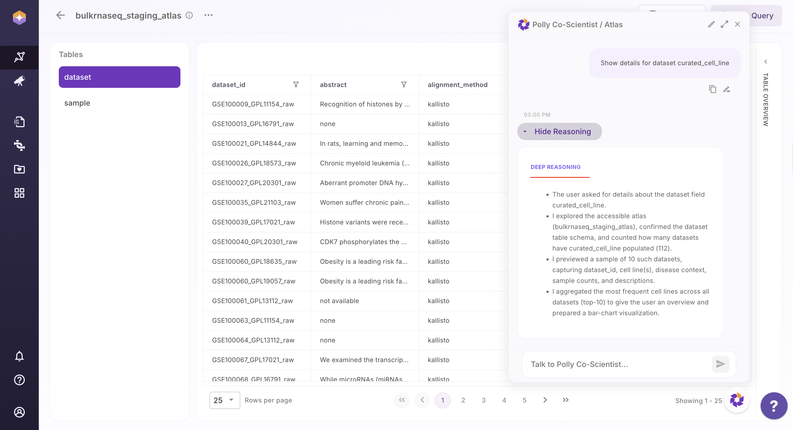
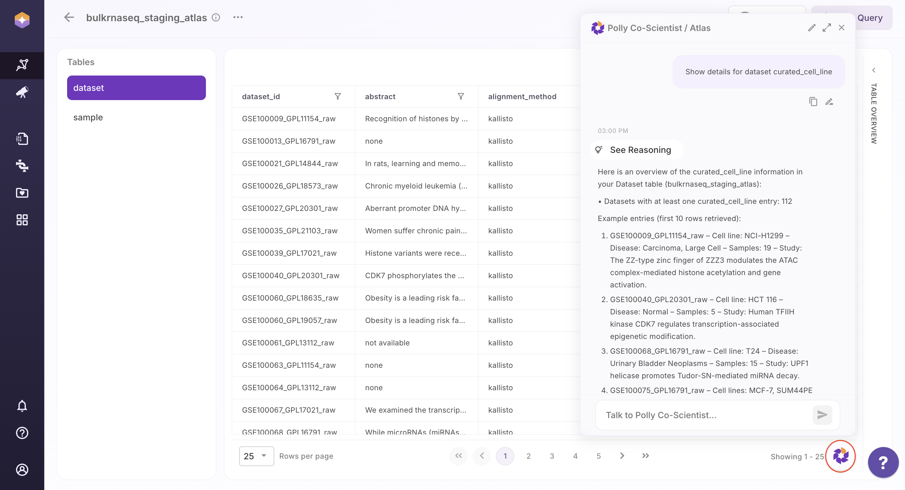

## Polly Co-Scientist

Polly Co-Scientist enables users to interact with Atlas data using **natural language queries (NLQ)**, eliminating the need for writing SQL. Users can simply type a question or request in plain English to explore datasets, retrieve specific information, or understand table contents.

For example, users can ask:
- “Show details for dataset curated_cell_line”
- “List all samples for a specific dataset”

The results are displayed directly in the interface. Users can further inspect how the answer was derived by clicking on **Show Reasoning**, which provides a view of the logic and query construction used by Co-Scientist. 

 
 Reasoning view

The Query is executed and returns relevant results directly from the Atlas, making data exploration faster and more intuitive.

Users can also enhance their experience by switching to **full-screen mode** for better visibility and focus and can also start a **new session** to reset context and initiate a fresh query flow

 
 Polly Co-Scientist

