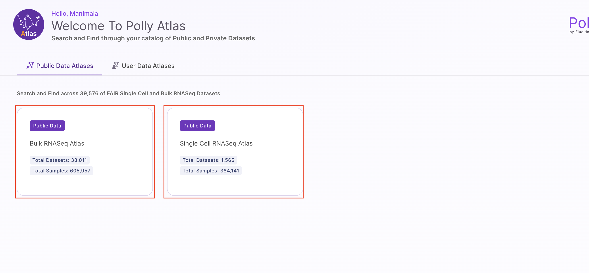

## Overview of Polly Atlas

The Atlas landing page provides a consolidated view of all available Atlases within your workspace, including both public and private datasets. Users can quickly search and navigate through this catalog to identify relevant datasets for their analysis.
Upon selecting an Atlas, users can explore its underlying tables and associated metadata in a structured format. 

The GUI enables intuitive interaction with the data, allowing users to browse, filter, and examine datasets without requiring manual file handling or external tools.
This streamlined experience ensures efficient data discovery and exploration within a unified, user-friendly interface.

 
 Atlas Homepage

## Exploring Polly Atlas

Once you open an Atlas (e.g., `bulkrnaseq_staging_atlas`), you can explore its tables, schema, and associated metadata through the GUI.

### Navigating Between Tables

The left-hand panel lists all available tables within the selected Atlas. Typically, this includes:

- **Dataset Table** – Contains study-level information  
- **Sample Table** – Contains sample-level metadata linked to datasets  

Users can switch between tables to explore different levels of data granularity.

### Understanding Table Schema

Each table provides a **Table Overview**, which displays its schema, including:

- **Field Names** and corresponding **Data Types**  
- Identification of **Primary Keys** and **Foreign Keys**  
- Structural relationships between tables  

For omics datasets:

- In the **Dataset Table**, `dataset_id` serves as the **primary key**  
- In the **Sample Table**, `sample_id` is the **primary key**, while `dataset_id` acts as a **foreign key**  

This relational structure enables users to join tables and analyze data across datasets and samples seamlessly. In able overview, schema view can be repositioned by dragging the elements and adjusting them according to the desired view for better and understanding.

### Downloading Data

Users can download data directly from the interface: User can download the entire CSV for that particular table by linking on the **Download CSV** option. This enables quick access to structured data for downstream analysis.  

###  Filter Table Data

In the main table grid, each column header has a filter icon (funnel). Users can filter the columns alphabetically: **A to Z** to filter the field names in ascending order and **Z to A** to filter the field names in descending order. The table updates instantly to reflect the selected sorting order.

Users can also filter the table based on specific values within a column. This enables users to quickly locate and analyze relevant subsets of data within large tables.

- Search for and select the desired value  
- The table dynamically filters and displays all rows associated with that value  
- All related fields and metadata for the selected value are shown in context  

## Explore the Schema: View ERD

Polly Atlas provides an **Entity Relationship Diagram (ERD)** view to help users understand the structure and relationships within an Atlas. Users can access this view by clicking on **View ERD**, which opens a visual representation of all tables and their connections within the selected Atlas.

The ERD is interactive and designed for ease of use. Users can drag and reposition tables to adjust the layout for better visibility and understanding. Additionally, zoom controls are available at the bottom-right corner of the screen, allowing users to zoom in (**+**) and zoom out (**−**) as needed.

The diagram clearly illustrates how tables are related. For example, it highlights the relationship between the **Dataset** and **Sample** tables, where `dataset_id` acts as the primary key in the Dataset table and as a foreign key in the Sample table. This makes it easy to understand how data is linked across tables and supports more efficient data exploration and querying.

