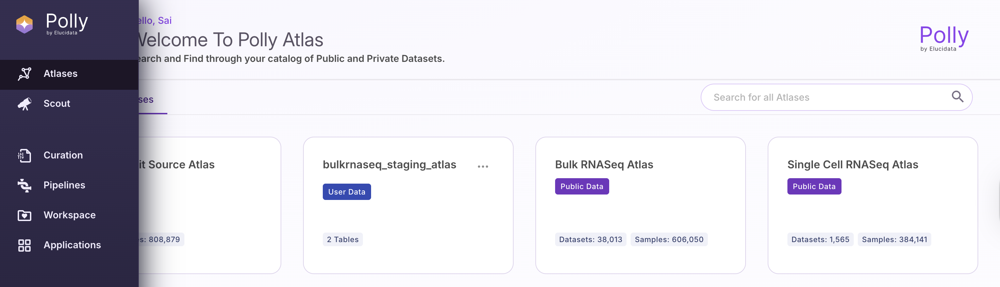
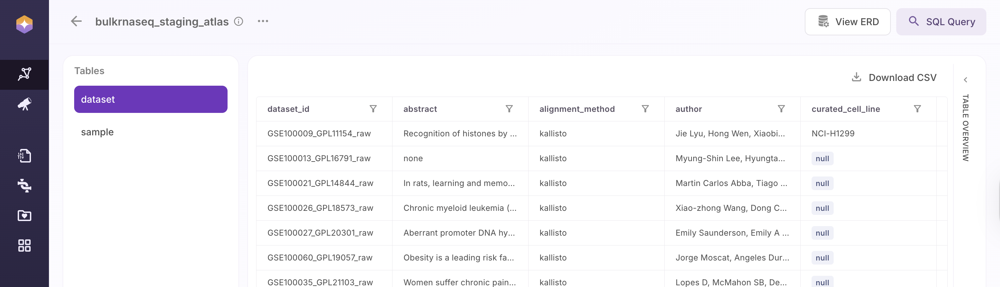
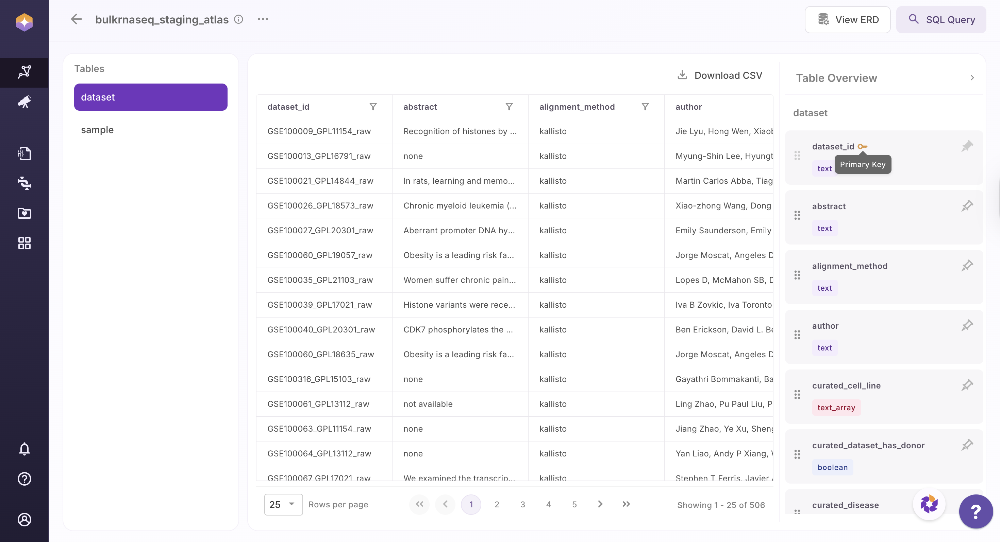
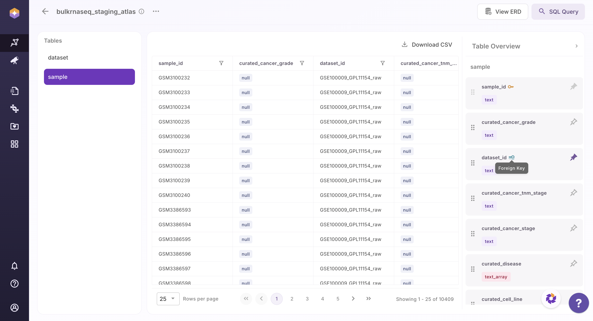
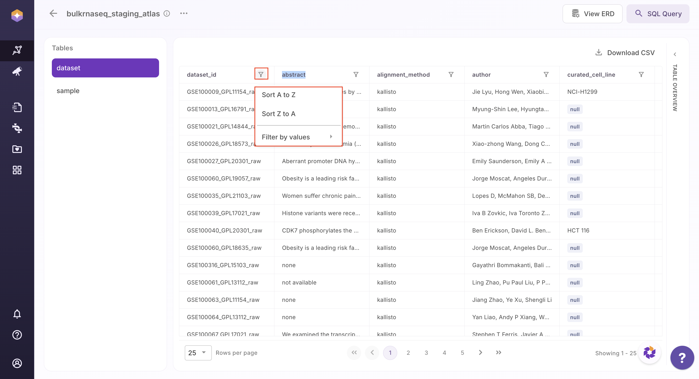
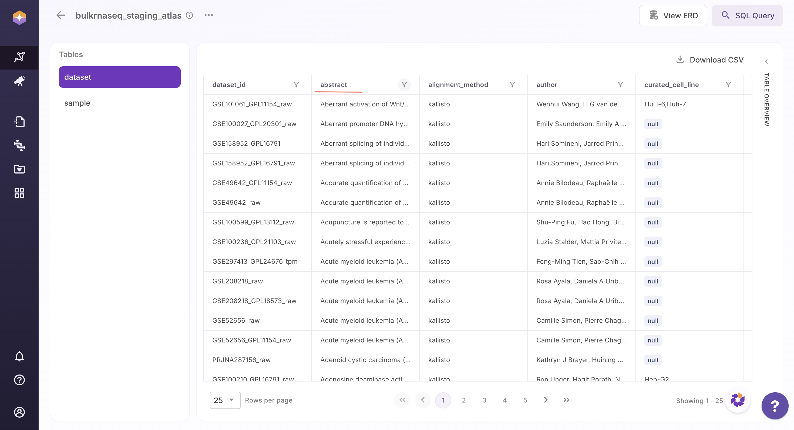
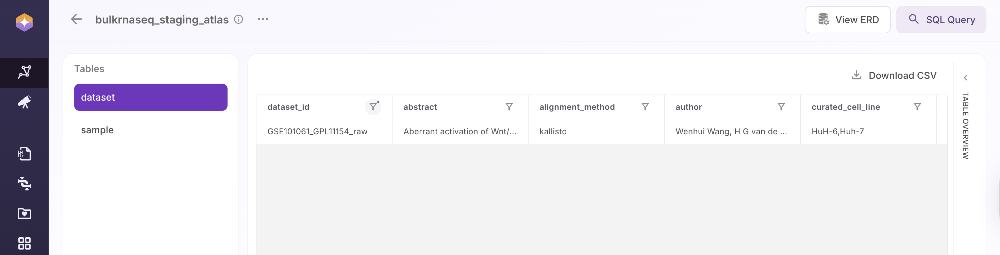
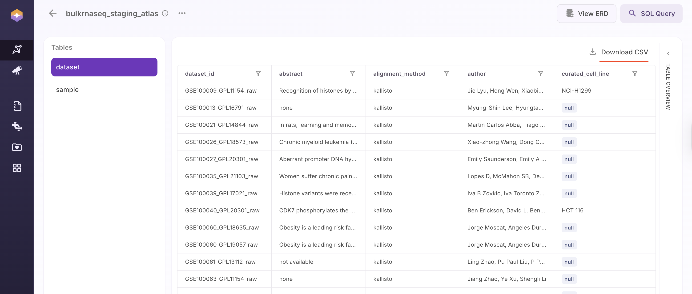
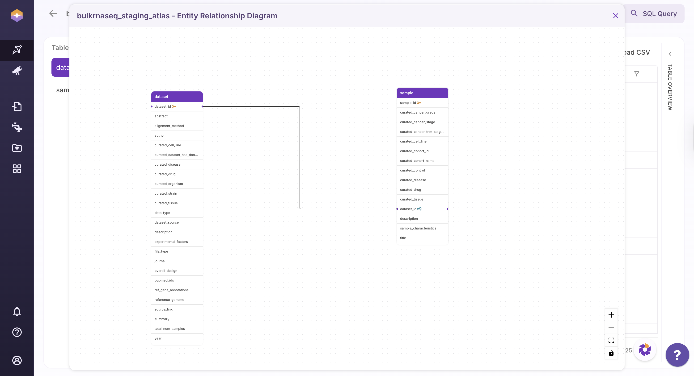
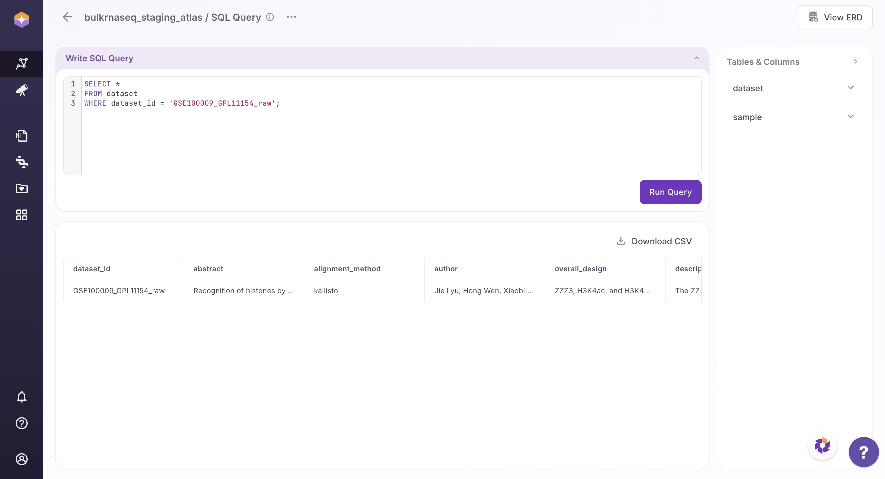

## Overview of Polly Atlas

The Atlas landing page provides a consolidated view of all available Atlases within your workspace, including both public and private datasets. Users can quickly search and navigate through this catalog to identify relevant datasets for their analysis.
Upon selecting an Atlas, users can explore its underlying tables and associated metadata in a structured format. 

The GUI enables intuitive interaction with the data, allowing users to browse, filter, and examine datasets without requiring manual file handling or external tools.
This streamlined experience ensures efficient data discovery and exploration within a unified, user-friendly interface.

 
 Polly Atlas Homepage

## Exploring Polly Atlas

Once you open an Atlas (e.g., `bulkrnaseq_staging_atlas`), you can explore its tables, schema, and associated metadata through the GUI.

### Navigating Between Tables

The left-hand panel lists all available tables within the selected Atlas. Typically, this includes:

- **Dataset Table** – Contains study-level information  
- **Sample Table** – Contains sample-level metadata linked to datasets  

Users can switch between tables to explore different levels of data granularity.

 
 Navigating Between Tables

### Understanding Table Schema

Each table provides a **Table Overview**, which displays its schema, including:

- **Field Names** and corresponding **Data Types**  
- Identification of **Primary Keys** and **Foreign Keys**  
- Structural relationships between tables  

For omics datasets:

- In the **Dataset Table**, `dataset_id` serves as the **primary key**  
- In the **Sample Table**, `sample_id` is the **primary key**, while `dataset_id` acts as a **foreign key**

 
 Table Overview of Dataset Table

 
 Table Overview of Sample Table

This relational structure enables users to join tables and analyze data across datasets and samples seamlessly. In table overview, schema view can also be repositioned by dragging the elements and adjusting them according to the desired view for better and understanding.

###  Sort and Filter Table Data

In the main table grid, each column header has a funnel icon. Users can Sort the columns alphabetically: **A to Z** to sort the field names in ascending order and **Z to A** to sort the field names in descending order. The table updates instantly to reflect the selected sorting order.

 
 Sort Table Data

 
 Sorting Table Data by A to Z 

Users can also **filter the table** based on specific values within a column. This enables users to quickly locate and analyze relevant subsets of data within large tables.

- Search for and select the desired value  
- The table dynamically filters and displays all rows associated with that value  
- All related fields and metadata for the selected value are shown in context  

 
 Filter Table Data by Value

### Pagination and Rows per Page

Users can adjust the number of rows displayed by using the **“Rows per page”** option located at the bottom-left of the table. This allows customization of how many records are visible at once (e.g., 25 rows per page).

To navigate through the dataset, users can use the **page navigation controls** to move between different pages of results. This ensures smooth browsing and efficient access to large volumes of data.

### Download Filtered Data as CSV

Once the table is filtered to the desired subset, users can download the data by clicking **Download CSV** located at the top-right of the table.

The exported file will include only the **current table** and will reflect the **active filters and visible result set**, ensuring that the downloaded data matches the on-screen view.

This functionality enables users to seamlessly move data into external tools such as Python, R, or Excel for further analysis, and to easily share curated subsets of data with collaborators.

 
 Download CSV

## Explore the Schema: View ERD

Polly Atlas provides an **Entity Relationship Diagram (ERD)** view to help users understand the structure and relationships within an Atlas. Users can access this view by clicking on **View ERD**, which opens a visual representation of all tables and their connections within the selected Atlas.

The ERD view enables users to clearly understand how data is organized across tables and how different entities are linked. This is particularly useful for planning joins and downstream analysis, such as identifying the appropriate keys to use when combining dataset- and sample-level information.

The ERD is interactive and designed for ease of use. Users can drag and reposition tables to adjust the layout for better visibility and understanding. Additionally, zoom controls are available at the bottom-right corner of the screen, allowing users to zoom in (**+**) and zoom out (**−**) as needed.

 
 Entity Relationship Diagram

## Run Custom Queries: SQL Query

Polly Atlas provides a built-in SQL editor for advanced data exploration and analysis.

Users can access this feature by clicking **SQL Query** located at the top-right of the interface. This opens the SQL editor for the selected Atlas, enabling users to write and execute custom queries directly within the UI.

Using the SQL editor, users can filter, aggregate, and join data across multiple tables. Query results can be executed and previewed instantly, allowing for iterative analysis without leaving the platform.

This feature is particularly useful when table-level filters are not sufficient, or when more complex logic—such as multi-table joins or aggregations—is required.

 
 Example of SQL Run

