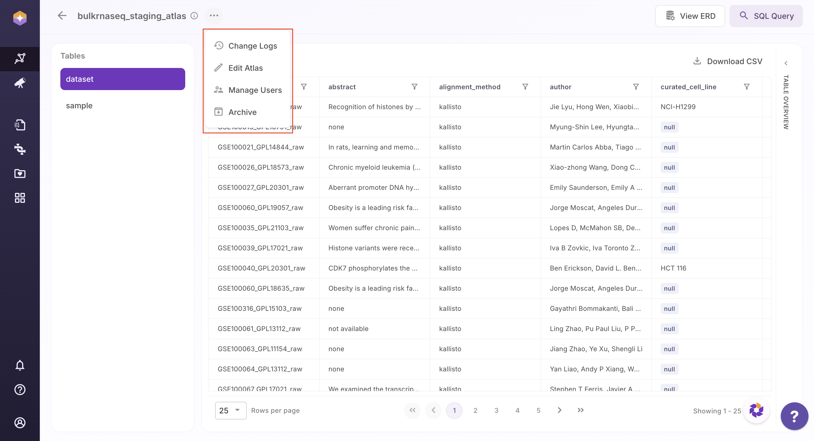
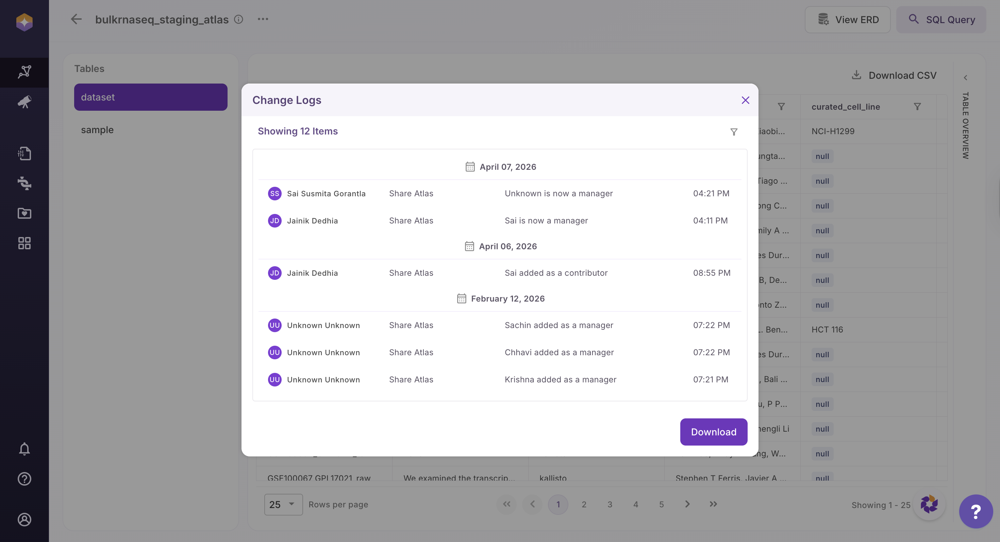
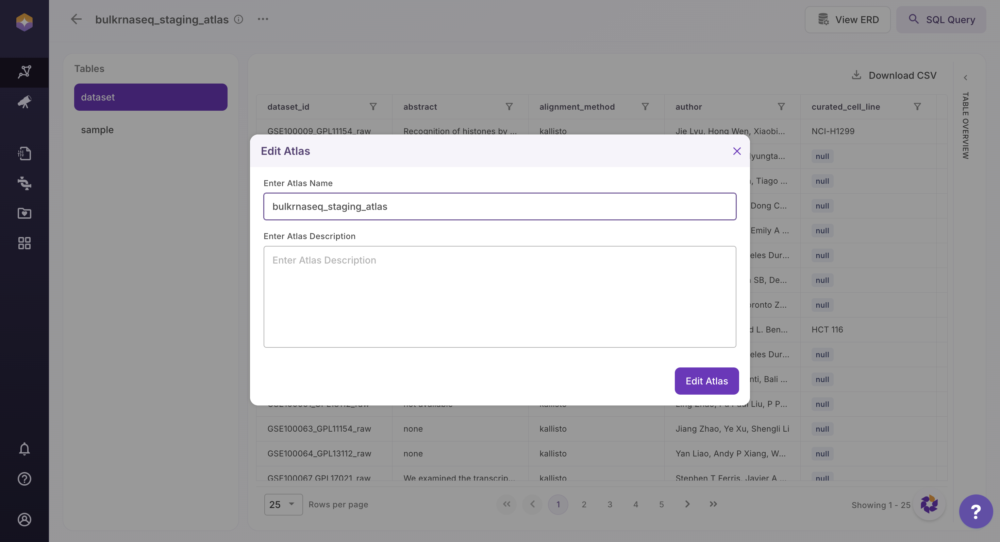
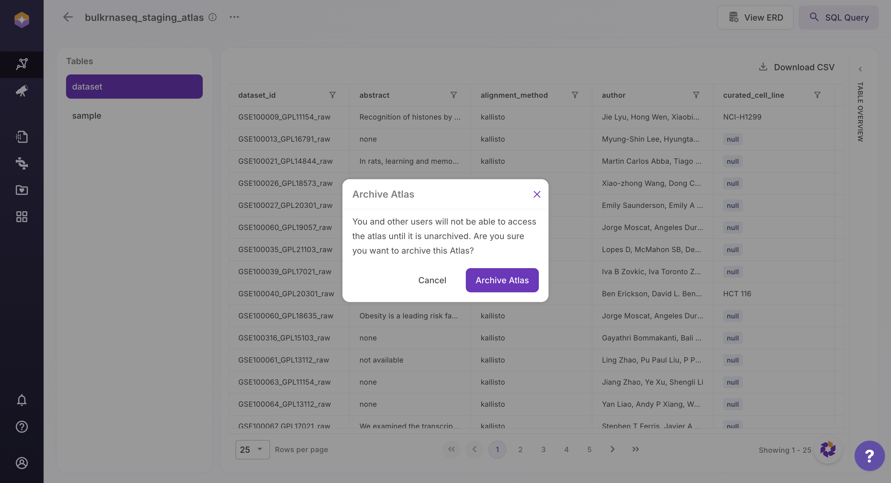

## View Atlas–Level Options 

Polly Atlas provides built-in controls to help users manage, monitor, and govern Atlas-level activities.

### Accessing Atlas Options

Users can access Atlas-level actions by clicking the **three-dot menu** located next to the Atlas name at the top-left of the interface.

 
 View Atlas–Level Options

From the dropdown:

- **Change Logs**: Users can view a complete history of changes made to the Atlas, including schema updates and edits. Change logs can also be downloaded for auditing and traceability.

 

- **Edit Atlas**: Users can update the Atlas name and description to maintain accurate documentation and context.

 

- **Manage Users**: Users can view and manage who has access to the Atlas, including assigning roles and permissions.

 

- **Archive Atlas**: Archiving an Atlas restricts access for all users. Once archived, the Atlas will no longer be accessible to you or other users until it is unarchived.

 

## User Roles in Polly Atlas

Polly Atlas uses role-based access control to ensure secure and structured data access.

The **Org Admin** can create Atlases and assign roles to both internal and external users. Atlases can be shared with multiple users within an organization. Users with the **Manager** role (and Org Admin privileges) can further grant access to other users.

### What Each Role Can Do

- **Manager**  
  Users with this role can fully manage the Atlas, including updating metadata, managing schema, modifying data, and controlling user access.

- **Researcher**  
  Users can create and manage tables, update schema, and add or modify data, but cannot perform administrative actions like archiving the Atlas or managing access.

- **Contributor**  
  Users can add and update data within tables but cannot modify the schema or structure.

- **Consumer**  
  Users can explore, query, and export data but cannot make any changes.

## Permissions Matrix

The table below summarizes what users can do based on their assigned role:

| Action                                  | Manager | Researcher | Contributor | Consumer |
|-----------------------------------------|:-------:|:----------:|:-----------:|:--------:|
| View Atlas                              | Yes | Yes | Yes | Yes |
| View Atlas Change Logs                  | Yes | Yes | Yes | Yes |
| Update Atlas Metadata                   | Yes | Yes | No | No |
| Archive Atlas                           | Yes | No | No | No |
| Create Tables                           | Yes | Yes | No | No |
| View Tables                             | Yes | Yes | Yes | Yes |
| Add Columns to Tables                   | Yes | Yes | No | No |
| Remove Columns from Tables              | Yes | Yes | No | No |
| Update Column Names                     | Yes | Yes | No | No |
| Define Table Relationships              | Yes | Yes | No | No |
| Delete Tables                           | Yes | Yes | No | No |
| Add Data to Tables                      | Yes | Yes | Yes | No |
| Modify Data (Values Only)               | Yes | Yes | Yes | No |
| Delete Data from Tables                 | Yes | Yes | No | No |
| Query & Filter Data                     | Yes | Yes | Yes | Yes |
| Export Data (CSV)                       | Yes | Yes | Yes | Yes |
| View Table Change Logs                  | Yes | Yes | Yes | Yes |

