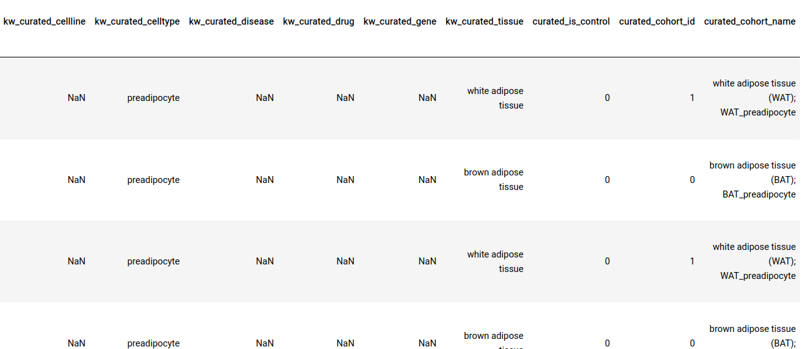
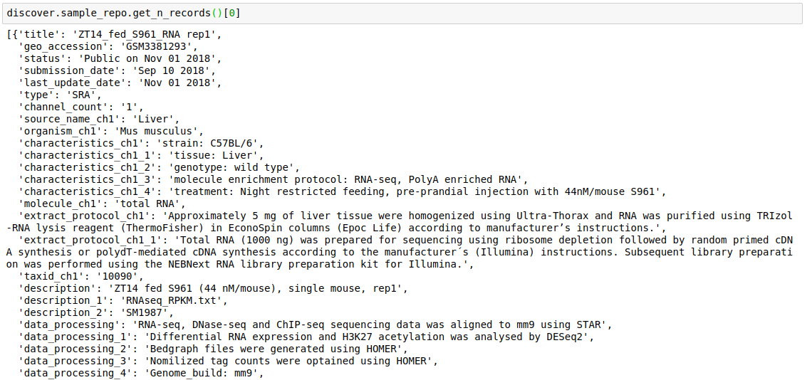
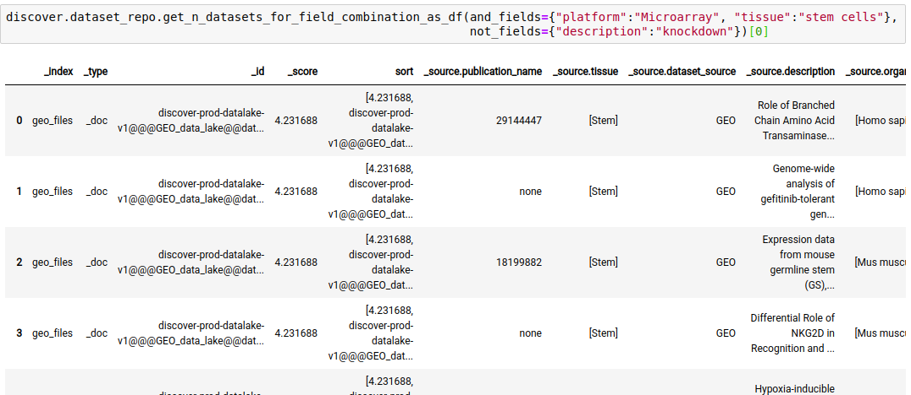
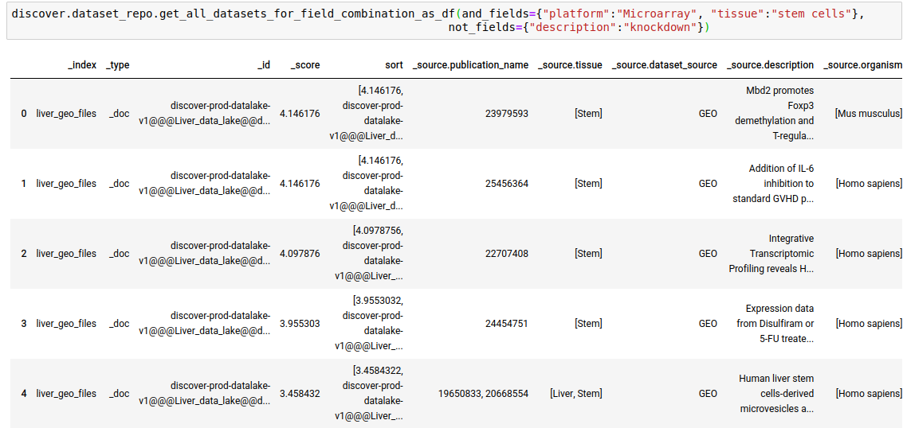
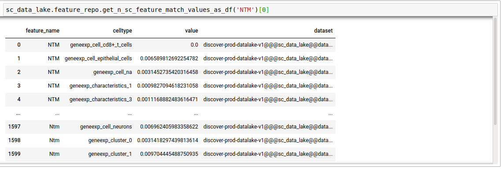
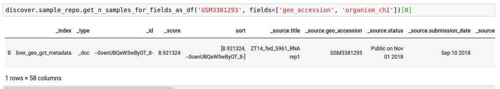
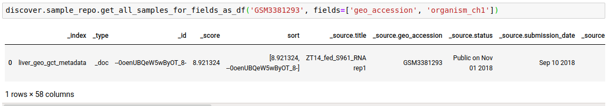
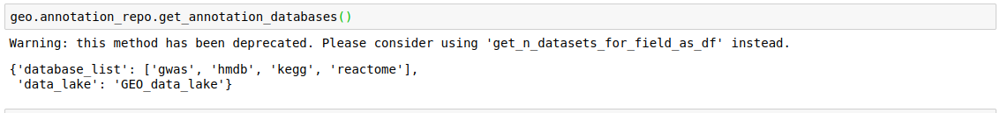
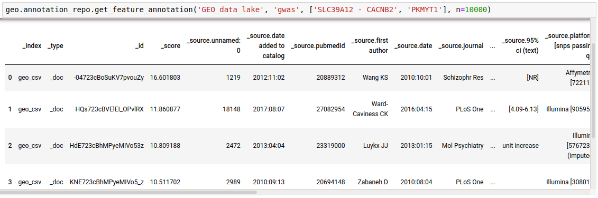

### Table of contents

- [1 What is the curated data that exists in discover?](#1-what-is-the-curated-data-that-exists-in-discover)
  - [1.1 What are the various data repositories on Polly?](#11-what-are-the-various-data-repositories-on-polly)
  - [1.2 How is the data in the data repositories on Polly categorised?](#12-how-is-the-data-in-the-data-repositories-on-polly-categorised)
  - [1.3 What do we mean by curation of data in Polly?](#13-what-do-we-mean-by-curation-of-data-in-polly)
  - [1.4 Index of repositories on Polly Discover](#14-index-of-repositories-on-polly-discover)
    - [1.4.1 GEO](#141-geo)
    - [1.4.2 LINCS](#142-lincs)
    - [1.4.3 DEPMAP](#143-depmap)
    - [1.4.4 CCLE](#144-ccle)
    - [1.4.5 Metabolomics](#145-metabolomics)
    - [1.4.6 Single Cell](#146-single-cell)
    - [1.4.7 TEDDY](#147-teddy)
    - [1.4.8 GTEX](#148-gtex)
- [2. How is this data accessed and consumed?](#2-how-is-this-data-accessed-and-consumed)
  - [2.1 Accessing Discover through Polly's interface](#21-accessing-discover-through-pollys-interface)
    - [2.1.1 Filtering interface](#211-filtering-interface)
      - [2.1.1.1 Filters and Columns](#2111-filters-and-columns)
      - [2.1.1.2 Dataset Selection](#2112-dataset-selection)
    - [2.1.2 GUI based applications](#212-gui-based-applications)
      - [2.1.2.1 Proprietary applications](#2121-proprietary-applications)
      - [2.1.2.2 Open source applications](#2122-open-source-applications)
    - [2.1.3 Polly Discover Notebook](#213-polly-discover-notebook)
    - [2.1.4 Studio Presets](#214-studio-presets)
  - [2.2 Accessing Discover programmatically](#22-accessing-discover-programmatically)
    - [2.2.1 Elastic search indices in Discover](#221-elastic-search-indices-in-discover)
      - [2.2.1.1 Structure of a data repository](#2211-structure-of-a-data-repository)
    - [2.2.2 Discoverpy Usage](#222-discoverpy-usage)
      - [2.2.2.1  Initialisation](#2221--initialisation)
      - [2.2.2.2 Querying](#2222-querying)
        - [2.2.2.2.1 Common methods for multiple indices.](#22221-common-methods-for-multiple-indices)
        - [2.2.2.2.2 Querying at the Dataset Level](#22222-querying-at-the-dataset-level)
        - [2.2.2.2.3 Querying at the feature level](#22223-querying-at-the-feature-level)
        - [2.2.2.2.4 Querying at the sample level](#22224-querying-at-the-sample-level)
        - [2.2.2.2.5 Access annotation repositories](#22225-access-annotation-repositories)
      - [2.2.2.3 Downloading a dataset](#2223-downloading-a-dataset)

  


With Polly you can access datasets from public data repositories and databases which have been curated and stored in the form of various data repositories. You can also store your own datasets in the form of  data repositories. 
These data repositories can then be explored through Polly’s interface, the datasets can be analysed using various proprietary and open source applications, through notebooks, and programatically through a python package.

# 1 What is the curated data that exists in discover?

The amount of public datasets that we curate and store in our data repositories increases everyday. As of March 16, 2021 Polly has around 120,000 unique datasets. These datasets are diverse in terms of the source public data repositories, different omics, the technologies used to measure molecules, diseases and tissues being studied in these datasets and the biological quantities being measured. We continuously keep curating new datasets published in public data sources and expanding the list of sources we use to curate and bring datasets to our platform. 
    
## 1.1 What are the various data repositories on Polly?

These are the current public data repositories we have sourced data from (recorded in March 2021)- 

* GEO: Microarray, bulk RNA sequecing, single cell RNA sequencing

* GTEX: Normal tissue bulk RNA Sequencing datasets from Genotype-Tissue Expression project

* TCGA: Tumor bulk RNA Sequencing datasets from The Cancer Genome Atlas.

* LINCS: Gene expression datasets for cells exposed to a variety of perturbing agents.

* DEPMAP: Gene Dependency, Drug Screening, RNAi Screening datasets for patient populations.

* TEDDY: Metabolomics and Lipidomics datasets  of blood in prediabetic autoimmunity and diabetes patients.

* Metabolights: Metabolomics datasets 

* Metabolomics workbench: Metabolomics datasets

* CCLE: Genomics and Transcriptomics datasets from the Cancer Cell Line Encyclopedia

The details about each of these repositories - source, level of curation, type of datasets, apps and notebooks linked can be found [here](#14-index-of-repositories-on-polly-discover).

## 1.2 How is the data in the data repositories on Polly categorised? 
The primary categorisation of datasets in Polly is based on the source public data repository and type of datasets(based on measurements). All the repositories mentioned above are categorised as combinations of source and the data measurement in those datasets. For example, the bulk Transcriptomics datasets in GEO are included in the GEO repository whereas the Metabolomics datasets from Metabolomics workbench are present in the  Metabolomics repository.

There are also secondary categorisations of datasets based on diseases and tissues. There are various disease-specific and tissue-specific repositories on Polly which contain multi-omic data for those diseases and tissues from various sources. The datasets in these sources are inherited from the source based primary categorisation mentioned above. 

These are the current disease and tissue based repositories (recorded in March 2021):- 

*   AML: Microarray and RNA Sequencing datasets for Acute Myeloid Leukemia.

*   GBM: Microarray and RNA Sequencing datasets for Gliblastoma Multiforme.

*   IBD: Microarray and RNA Sequencing datasets for Inflammatory Bowel Disease.

*   Covid-19: Transcriptomics, Single-cell RNA Sequencing, Proteomics, Metabolomics and Lipidomics datasets for COVID-19 (SARS-CoV-2).

## 1.3 What do we mean by curation of data in Polly?
Omics data in public and private repositories is often unstructured and not always analysis-ready. Researchers have to spend an enormous amount of time grappling with different file formats (CSV, Excel, GCT, Soft files, H5ad etc.) and different conventions for metadata representation.

Curation is the process of transforming this data into a consistent and analyses-ready format and storing them in a central location on Polly. Curation covers a wide range of transformations that we perform on the data. Each dataset on Polly is stored in GCT files which allow for storing sample and molecular-level metadata in a single file (for single cell data we use H5ad). We also make sure that consistent molecular identifiers are used across for all data (e.g. we use HGNC symbols for human transcriptomic data).
We also annotate this data using rich and consistent vocabularies. All datasets are annotated with some or all of the following attributes.
* Disease
* Tissue
* Cell type
* Cell line
* Drug

The values within these fields are standardized across all datasets and correspond to entries in biomedical ontologies like MESH, Brenda Tissue Ontology, Cell Ontology, CHEBI and others. These give users some idea of the biological context in which the experiment was performed.


These attributes are also present at the sample-level.


*Fig caption: A screen grab of the contents of a GCT file. Here, every row is a sample and fields with the prefix ‘kw_curated’ and ‘curated’ contain information that was appended to the file after curation.*

There are 3 additional labels curated_is_control, curated_cohort_id, curated_cohort_name. These labels are also standard across most datasets and are useful when performing certain downstream analyses (like Differential Expression analysis) on a large number of datasets in an automated fashion.


## 1.4 Index of repositories on Polly Discover

### 1.4.1 GEO
Gene Expression Omnibus (GEO) is a database for Gene expression profiling and RNA methylation profiling managed by the National Center for Biotechnology Information (NCBI). These High-throughput screening genomics data are derived from Microarray or RNA-Seq experimental data. These data need to conform to the Minimum information about a microarray experiment (MIAME) format.

**Types of Omics Datasets Curated**
Transcriptomics
*   Microarray
*   Bulk RNA Sequencing

**Source**
GEO is the singular source for the datasets present in this repository

**Curation**

- [x] Dataset Level (Ontology Mapping)

- [x] Sample Level 

    - [x] Ontology Mapping

    - [x] Perturbation/Control identification
 

**URL**
https://www.ncbi.nlm.nih.gov/geo/


### 1.4.2 LINCS
The Library of Integrated Network-Based Cellular Signatures (LINCS) Program aims to create a network-based understanding of biology by cataloging changes in gene expression and other cellular processes that occur when cells are exposed to a variety of perturbing agents.

 
**Types of Omics Datasets Curated**
Transcriptomics

**Source**
LINCS data has been taken from GEO, using GSE70138 and GSE92742.

**Curation**
- [x] Dataset Level (Ontology Mapping)

- [ ] Sample Level 

    - [ ] Ontology Mapping

    - [ ] Perturbation/Control identification
 

**URL**
https://www.ncbi.nlm.nih.gov/geo/query/acc.cgi?acc=GSE70138
https://www.ncbi.nlm.nih.gov/geo/query/acc.cgi?acc=GSE92742


### 1.4.3 DEPMAP
To support systematic discovery of novel dependencies and efficient identification of patient populations for target discovery programs in oncology, the Broad has launched the DepMap Consortium, an opportunity for partners to generate novel data for internal discovery programs, and gain access to know-how, data, and computational tools. By joining the consortium, partners will be able to identify novel targets for treatment development, as well as biomarkers for revealing patient populations most likely to benefit from ongoing discovery efforts.

 

**Types of Omics Datasets Curated**
*   Gene Dependency
*   Drug Screens
*   RNAi Screens

**Source**
DepMap is the singular source for the datasets present in this repository

**Curation**
- [x] Dataset Level (Ontology Mapping)

- [ ] Sample Level 

    - [ ] Ontology Mapping

    - [ ] Perturbation/Control identification
 

**URL**
https://depmap.org/portal/


### 1.4.4 CCLE
The CCLE (Cancer Cell Line Encyclopedia) project is a collaboration between the Broad Institute, and the Novartis Institutes for Biomedical Research and its Genomics Institute of the Novartis Research Foundation to conduct a detailed genetic and pharmacologic characterization of a large panel of human cancer models, to develop integrated computational analyses that link distinct pharmacologic vulnerabilities to genomic patterns and to translate cell line integrative genomics into cancer patient stratification. The CCLE provides public access to genomic data, analysis and visualization for over 1100 cell lines.

**Types of Omics Datasets Curated**
*   Mutation
*   Transcriptomics
*   miRNA
*   Metabolomics
*   RPPA 
*   Copy Number

**Source**
CCLE is the singular source for the datasets present in this repository

**Curation**
- [x] Dataset Level (Ontology Mapping)

- [ ] Sample Level 

    - [ ] Ontology Mapping

    - [ ] Perturbation/Control identification
 

**URL**
https://portals.broadinstitute.org/ccle


### 1.4.5 Metabolomics
This repository consists of datasets from mainly two sources, Metabolomics Workbench and MetaboLights.

Metabolomics Common Fund's National Metabolomics Data Repository(NMDR), housed at the San Diego Supercomputer Center (SDSC), University of California, San Diego, has developed the Metabolomics Workbench. The Metabolomics Workbench serves as a national and international repository for metabolomics data and metadata.

MetaboLights is a database for Metabolomics experiments and derived information. The database is cross-species, cross-technique and covers metabolite structures and their reference spectra as well as their biological roles, locations and concentrations, and experimental data from metabolic experiments. MetaboLights is the recommended Metabolomics repository for a number of leading journals.

 

**Types of Omics Datasets Curated**
*   Metabolomics
*   Lipidomics

**Source**
This repository consists of datasets from mainly two sources, Metabolomics Workbench and MetaboLights.

**Curation**
- [x] Dataset Level (Ontology Mapping)

- [ ] Sample Level 

    - [ ] Ontology Mapping

    - [ ] Perturbation/Control identification
 

**URL**
https://www.metabolomicsworkbench.org/about/index.php
https://www.ebi.ac.uk/metabolights/


### 1.4.6 Single Cell
This repository consists of single cell RNA sequencing datasets from Gene Expression Omnibus (GEO).
Gene Expression Omnibus (GEO) is a database for Gene expression profiling and RNA methylation profiling managed by the National Center for Biotechnology Information (NCBI). These High-throughput screening genomics data are derived from Microarray or RNA-Seq experimental data. 

**Types of Omics Datasets Curated**
Single cell RNA-seq

**Source**
GEO is the singular source for the datasets present in this repository

**Curation**
- [x] Dataset Level (Ontology Mapping)

- [ ] Sample Level 

    - [ ] Ontology Mapping

    - [ ] Perturbation/Control identification


**URL**
https://www.ncbi.nlm.nih.gov/geo/


### 1.4.7 TEDDY
The quantification of primary metabolites in human plasma from TEDDY case-control subjects. The TEDDY study aims to generate a comprehensive understanding of how metabolic signatures in blood are affected in prediabetic autoimmunity and diabetes.

 

**Types of Omics Datasets Curated**
*   Metabolomics
*   Lipidomics

**Source**
Lipidomics and Metabolomics data has been taken from metabolomics workbench using the study ids ST001636 and ST001386 respectively.

**Curation**
- [x] Dataset Level (Ontology Mapping)

- [ ] Sample Level 

    - [ ] Ontology Mapping

    - [ ] Perturbation/Control identification
 

**URL**
https://www.metabolomicsworkbench.org/data/DRCCMetadata.php?Mode=Study&StudyID=ST001636
https://www.metabolomicsworkbench.org/data/DRCCMetadata.php?Mode=Study&StudyID=ST001386


### 1.4.8 GTEX
The Genotype-Tissue Expression (GTEx) project is an ongoing effort to build a comprehensive public resource to study tissue-specific gene expression and regulation. Samples were collected from 54 non-diseased tissue sites across nearly 1000 individuals, primarily for molecular assays including WGS, WES, and RNA-Seq. The GTEx Portal provides open access to data including gene expression, QTLs, and histology images.


**Types of Omics Datasets Curated**
Transcriptomics

**Source**
The data in this repository has been added from GTEX only.

**Curation**
- [x] Dataset Level (Ontology Mapping)

- [ ] Sample Level 

    - [ ] Ontology Mapping

    - [ ] Perturbation/Control identification
 

**URL**
https://www.gtexportal.org/home/


# 2. How is this data accessed and consumed?
## 2.1 Accessing Discover through Polly's interface
### 2.1.1 Filtering interface

For all data repositories, we provide a dataset filtering interface. It allows you to explore and filter the relevant datasets present in the data lake. 

#### 2.1.1.1 Filters and Columns


The filtering interface provides various parameters(depending on the data repository) that you can use to filter the datasets within the selected repository. Some of the parameters that are present in every repository are:

*    Disease: This option will give you an overview of all the diseased type datasets present in the repository. You can choose to work on any of the disease options listed or the normal datasets. In order to do the selection, mark the checkboxes present besides the disease of your interest.

*    Organism: It provides the list of the organisms associated with the datasets of the repository. You can mark a selection to filter the datasets of only the desired organism.

*    Tissue: This section will give you the distribution of tissue across the repository. Click on Load More to look at the entire list, or use the search option to find the tissue type you are looking for. Select the tissue type required to filter the datasets specific to it.

*    Data Type: The dataset variety would be listed in this option. Choose the data type for your study by selecting the checkbox beside it.

When the selections are marked, you can find the filtered datasets on the right panel. 

**Note:**

*    You can select multiple entries at the same time.

*    To clear your filters at any point in time, click on the clear option present beside all the parameters.

#### 2.1.1.2 Dataset Selection


The right panel displays the dataset present in the repository. It displays these fields about the datasets among others.

*    Dataset ID: Unique identifier associated with the dataset.

*    Description: It encompasses the title of the paper.

*    Organism: Organism associated with the dataset

*    Datatype: Datatype of the dataset e.g. Transcriptomic, Metabolomics, Single Cell etc

*    Disease: Disease studied with the selected dataset

*    Tissue: Type of tissue the dataset is from

*    Publication : Provides the link to the publication

Once you have narrowed down relevant omics datasets, you can mark a selection on the checkbox present beside the desired dataset.

### 2.1.2 GUI based applications

You can analyze the selected dataset on the fly using various applications on Polly. They enable you to perform various statistical analyses, displaying intuitive visualizations, and allowing you to create a hitlist of molecules while analyzing multiple datasets simultaneously.

In order to select the tool of your analysis, click on *Select the Application* option at the bottom of the screen after selection of any dataset from the list and choose the analysis platform of your interest and click on open.


Select the workspace where you would like to store the analysis and click on *Launch* to open the selected application/notebook.


  

Data Lake Applications are built on top of data lakes to query and explore relevant datasets. We have both proprietary applications used to visualise and analyse specific data types as well as popular open source applications. 

#### 2.1.2.1 Proprietary applications

*   **[Polly Discover Application:](https://docs.elucidata.io/Data%20Lake.html#discover)**

    It is a platform for visualization, analytics, and exploration for bulk transcriptomics data curated from GEO. It offers users an interactive dashboard for analysis and visualization of transcriptomics data. Currently, the platform handles gene expression microarray and RNA-seq data and supports three species human, mouse, and rat.  
    <br />

*   **[Single Cell Visualization:](https://docs.elucidata.io/Data%20Lake.html#single-cell-visualization)**

    It is a comprehensive visualization platform for single-cell transcriptomics data. The app is helpful in visualizing cells and the association of different genes with the metadata.  
    <br />

*   **DepMap CCLE:**

    Exploration application for cell line dependency and gene expression data from DepMap and CCLE.  
    <br />

*   **[GTEx Application](https://docs.elucidata.io/Data%20Lake.html#gtex)**

    GTEx Application is is a platform for visualization, analytics, and exploration of transcriptomics data from GTEx.  
    <br />

*   **[Dual Mode Data Visualization(Metabolomics App):](https://docs.elucidata.io/Apps/Metabolomic%20Data/Dual%20Mode%20Visualization.html)**

    This app allows you to perform downstream analysis on untargeted unlabeled metabolomics data along with insightful visualizations. It provides a variety of normalization methods, scaling options, and data visualization functionalities, thereby allowing an efficient analysis of the data to get actionable insights.  
    <br />

You can read about these applications in the [Apps Section](https://docs.elucidata.io/Apps/) of the documentation. 

#### 2.1.2.2 Open source applications


*   **[Cellxgene:](https://chanzuckerberg.github.io/cellxgene/posts/annotations)**

    It is an interactive data explorer for single-cell transcriptomics datasets.  
    <br />
 
### 2.1.3 Polly Discover Notebook

It is possible to analyse and visualise a dataset in a [Polly Notebook](https://docs.elucidata.io/Scaling%20compute/Polly%20Notebooks.html) for custom visualisations and analysis. This can be done by selecting the Notebook option in the application launch menu from the filtering screen. We have various types of notebook environments for different data types in Discover. 


| Polly Notebook| Docker      | Machine Configuration   |
|---------------|-----------|-------|
| Discover Notebook Single-cell  | Single Cell Downstream   | Memory-optimized 32GB, Polly 2x-large |
| Discover Notebook Transcriptomics  | RNA-Seq Downstream     | RNA-Seq Downstream  |
| Discover Notebook Proteomics   | RNA-Seq Downstream   | Polly medium 4GB  |
| Discover Notebook Metabolomics| Metabolomics | Polly medium 4GB |
    

### 2.1.4 Studio Presets
It is also possible to import datasets from a Discover repository into a studio preset for analysis.

## 2.2 Accessing Discover programmatically
It is possible to interact with discover repositories programatically by using **DiscoverPy**- a python package developed by us for querying, filtering and downloading data from discover repositories. DiscoverPy comes pre-installed in all Polly notebooks. As of now it can be used only in a Polly environment, as it requires the environment for granting access to data repositories. 

### 2.2.1 Elastic search indices in Discover
   
All data in discover is stored in an elastic search database and can be queried using the various elastic search indices using APIs. These elastic search indices allow access at the dataset level (file level), sample level (based on the samples present in a dataset), and feature level (based on the molecular identifiers in a dataset such as genes, metabolites, proteins).

#### 2.2.1.1 Structure of a data repository
A data repository is a collection of different files having different file types. To ensure easy access at a granular level to all datasets a data repository is organized in the following manner. Under this schema, each repository can be considered as a collection of indices which can be used for querying. 


The discoverPy package in essence is a python wrapper which can access all indices of a data repository using these API endpoints.


### 2.2.2 Discoverpy Usage

#### 2.2.2.1  Initialisation

1. Start with a discover object
This discover object is used to interact with a data repository in Discover.


<pre><code>from discoverpy import Discover
discover = Discover() 
discover</code></pre>


2. List all available data repositories along with their indices, and ID. 
Each data repository on Polly has a unique ID which is used to refer to that repository. The following commands lists the available data repositories, their IDs, and the elastic search indices associated with them. This method can be used to choose the repository you want to interact with.


<pre><code>discover.get_repositories()</code></pre>


3. Set a repository for the discover object
You can use the id of a repository to set the discover object to point to that repository.

* For single cell repositories use `mode='single_cell'`.
* For bulk data repositories use `mode='bulk'` (default)

For instance, tge GEO repository has repo_id 9.

<pre><code>discover.set_repo('9')</code></pre>
The single cell repository's repo_id is 17.

<pre><code>discover.set_repo("17", mode="single_cell")</code></pre>
After you’ve added the indices for a repository, you can view the discover object. It lists the various indices associated with the repository set.

<pre><code>discover</code></pre>


#### 2.2.2.2 Querying

##### 2.2.2.2.1 Common methods for multiple indices.

There are the methods available on all levels of repository indices. You just need to replace `<INDEX_LEVEL_NAME>` with one of `sample_repo` | `feature_repo` | `dataset_repo` | `annotation_repo`

* Get fields present in the index.
`discover.<INDEX_LEVEL_NAME>.get_all_fields()`
For example, to get the fields present for the datasets in this repository,

<pre><code>discover.dataset_repo.get_all_fields()</code></pre>


* Fetch the top `n` records from a repository.
`discover.<INDEX_LEVEL_NAME>.get_n_records()`

For example, to get the fields present for datasets in this repository,
<pre><code>discover.dataset_repo.get_all_fields()</code></pre>




* Output the records as a dataframe - 
`discover.<INDEX_LEVEL_NAME>.get_n_records_as_df()[0]`


* Note: You would find there are many methods that have the *_as_df variant as well, which takes exactly the same arguments and return the result in Dataframe.

* Instead of just `n` records, you can fetch all records as well by using 
  `discover.<INDEX_LEVEL_NAME>.get_all_records_as_df()`


##### 2.2.2.2.2 Querying at the Dataset Level


* Fetch dataset entries that match against the `value` for a `field`.
<pre><code>discover.dataset_repo.get_n_datasets_for_field(field, value, regexp, n=Discover.DEFAULT_PAGE_SIZE, cursor=None, sort_by=Discover.DEFAULT_SORT_ORDER)</code></pre>
Optionally a regular expression (`regexp`) can be provided instead of a `value`. 

For example, The following query lists all datasets in the repository, where ‘publication name’ fields has the pubmed id ‘28756234’


<pre><code>discover.dataset_repo.get_n_datasets_for_field_as_df('publication_name', '28756234', regexp=False)[0]</code></pre>


The following query lists all datasets in the repository where ‘tissue’ is ‘liver’

<pre><code>discover.dataset_repo.get_n_datasets_for_field_as_df('tissue', 'liver', regexp=False)[0]</code></pre>


Instead of just `n` datasets, you can fetch all datasets as well.

`discover.dataset_repo.get_all_datasets_for_field_as_df(field=None, value=None, regexp=False, sort_by=Discover.DEFAULT_SORT_ORDER)`

* Fetch dataset entries that satisfy the given match combinations.

<pre><code>discover.dataset_repo.get_n_datasets_for_field_combination(and_fields, or_fields, not_fields, n=Discover.DEFAULT_PAGE_SIZE, cursor=None, sort_by=Discover.DEFAULT_SORT_ORDER)</code></pre>

The following query fetches datasets where platform is Microarray, tissue is stem cells, and the keyword ‘knockdown’ is NOT present in the description of the study.

<pre><code>discover.dataset_repo.get_n_datasets_for_field_combination_as_df(and_fields={"platform":"Microarray", "tissue":"stem cells"}, not_fields={"description":"knockdown"})[0]</code></pre>



Instead of just `n` datasets, you can fetch all datasets as well.

<pre><code>discover.dataset_repo.get_all_datasets_for_field_combination_as_df(and_fields={"platform":"Microarray", "tissue":"stem cells"},not_fields={"description":"knockdown"})</code></pre>



##### 2.2.2.2.3 Querying at the feature level

* Fetch feature values matching against the `feature_name` term. The `n` here decides the number of datasets that will be searched.

<pre><code>discover.feature_repo.get_n_feature_match_values(feature_name, n=Discover.DEFAULT_PAGE_SIZE, cursor=None, sort_by=Discover.DEFAULT_SORT_ORDER)</code></pre>

The following query fetches the expression level of the gene `OLfr1396` in the various samples of the repository

<pre><code>discover.feature_repo.get_n_feature_match_values_as_df("Olfr1396")[0]</code></pre>


Instead of just `n` feature values, you can fetch all as well.


* Fetch feature values matching against the `feature_name` term, in single-cell datasets. The `n` here decides the number of datasets which will be searched. This is for the case where mode was set to single cell. It outputs the average expression of the gene in the pool of cells corresponding to each unique cell type in the repository, per dataset.

<pre><code> discover.feature_repo.get_n_sc_feature_match_values(feature_name, n=Discover.DEFAULT_PAGE_SIZE, cursor=None, sort_by=Discover.DEFAULT_SORT_ORDER)</code></pre>

<pre><code>discover.feature_repo.get_all_sc_feature_match_values_as_df("NTM")[0]</code></pre>




Instead of just `n` feature values, you can fetch all as well.

`discover.feature_repo.get_all_sc_feature_match_values_as_df(feature_name, sort_by=Discover.DEFAULT_SORT_ORDER)`


##### 2.2.2.2.4 Querying at the sample level

* Fetch sample entries that match against the `value` for a `field`.

<pre><code>discover.sample_repo.get_n_samples_for_field(field, value, regexp, n=Discover.DEFAULT_PAGE_SIZE, cursor=None, sort_by=Discover.DEFAULT_SORT_ORDER)</code></pre>

The following example fetches the samples whose source is “stem cells”.


* Dataframe output variant - `get_n_samples_for_field_as_df`

Instead of just `n` feature values, you can fetch all as well.


* Fetch sample entries that match against the `search_term` in any of the given fields. This is useful if you do not know the field to query on beforehand, or want to search across all fields, or a list of fields.


<pre><code>discover.sample_repo.get_n_samples_for_fields(search_term, fields=[], n=Discover.DEFAULT_PAGE_SIZE, cursor=None, sort_by=Discover.DEFAULT_SORT_ORDER)</code></pre>



* Dataframe output variant - `get_n_samples_for_fields_as_df`

Instead of just `n` sample matches you can fetch all as well.

<pre><code>discover.sample_repo.get_all_samples_for_fields_as_df(search_term, fields=[], sort_by=Discover.DEFAULT_SORT_ORDER)</code></pre>



* Fetch sample entries that satisfy the given field combinations.

<pre><code>discover.sample_repo.get_n_samples_for_field_combinations(and_fields={}, or_fields={}, not_fields={}, n=Discover.DEFAULT_PAGE_SIZE, cursor=None, sort_by=Discover.DEFAULT_SORT_ORDER)</code></pre>


* Dataframe output variant - `get_n_samples_for_field_combinations_as_df`

Instead of just `n` sample matches you can fetch all as well.

<pre><code>discover.sample_repo.get_all_samples_for_field_combinations_as_df(and_fields={}, or_fields={}, not_fields={}, sort_by=Discover.DEFAULT_SORT_ORDER)</code></pre>


##### 2.2.2.2.5 Access annotation repositories
The various gene annotation databases can also be accessed through discoverpy. These can be used to get information about a particular gene or a set of genes.

* Get all annotation databases

<pre><code>discover.annotation_repo.get_annotation_databases()</code></pre>



* Get annotations for a list of genes from a particular database. Getting Reactome pathways for the genes.

<pre><code>discover.annotation_repo.get_feature_annotation(data_lake, _docid, list_of_genes, n=10000)</code></pre>




#### 2.2.2.3 Downloading a dataset
Discoverpy can be used to download a dataset from a repository. This can be done by using the “key” of the dataset in the repository. 

<pre><code>query_list = discover.dataset_repo.get_n_datasets_for_field('publication_name', '28756234', regexp=False)[0]
# Get key of the first file returned by the query
file_key = query_list[0]["_source"]["kw_key"]</code></pre>

```
'GEO_data_lake/data/Microarray/GSE100129/GCT/GSE100129_GPL10558_curated.gct'
```

<pre><code>discover.get_file(key, repo_id="9", local_fp="downloaded_file.gct")</code></pre>

This will download the file to the local environment.
