### Table of contents

- [1 What is the curated data that exists in discover?](#1-what-is-the-curated-data-that-exists-in-discover)
  - [1.1 Organization of data repositories on Polly](#11-organization-of-data-repositories-on-polly)
  - [1.2 What do we mean by curation of data in Polly?](#12-what-do-we-mean-by-curation-of-data-in-polly)
    - [1.2.1 Dataset-level annotations](#121-dataset-level-annotations)
    - [1.2.2 Sample-level annotations](#122-sample-level-annotations)
  - [1.3 Index of repositories on Polly Discover](#13-index-of-repositories-on-polly-discover)
    - [1.3.1 GEO](#131-geo)
    - [1.3.2 LINCS (The Library of Integrated Network-Based Cellular Signatures)](#132-lincs-the-library-of-integrated-network-based-cellular-signatures)
    - [1.3.3 DEPMAP](#133-depmap)
    - [1.3.4 Metabolomics](#134-metabolomics)
    - [1.3.5 Single Cell](#135-single-cell)
    - [1.3.6 TEDDY](#136-teddy)
    - [1.3.7 TCGA](#137-tcga)
- [2. How is this data accessed and consumed?](#2-how-is-this-data-accessed-and-consumed)
  - [2.1 Accessing Discover through Polly's interface](#21-accessing-discover-through-pollys-interface)
    - [2.1.1 Filtering interface](#211-filtering-interface)
      - [2.1.1.1 Filters and Columns](#2111-filters-and-columns)
      - [2.1.1.2 Dataset Selection and Search](#2112-dataset-selection-and-search)
    - [2.1.2 GUI based applications](#212-gui-based-applications)
      - [2.1.2.1 Proprietary applications](#2121-proprietary-applications)
      - [2.1.2.2 Open source applications](#2122-open-source-applications)
    - [2.1.3 Polly Discover Notebook](#213-polly-discover-notebook)
    - [2.1.4 Studio Presets](#214-studio-presets)
  - [2.2 Accessing Discover programmatically](#22-accessing-discover-programmatically)
    - [2.2.1 Elastic search indices in Discover](#221-elastic-search-indices-in-discover)
    - [2.2.2 Discoverpy Usage](#222-discoverpy-usage)
      - [2.2.2.1  Initialisation](#2221--initialisation)
      - [2.2.2.2 Querying](#2222-querying)
        - [2.2.2.2.1 Common methods for multiple indices.](#22221-common-methods-for-multiple-indices)
        - [2.2.2.2.2 Querying at the Dataset Level](#22222-querying-at-the-dataset-level)
        - [2.2.2.2.3 Querying at the feature level](#22223-querying-at-the-feature-level)
        - [2.2.2.2.4 Querying at the sample level](#22224-querying-at-the-sample-level)
        - [2.2.2.2.5 Access annotation repositories](#22225-access-annotation-repositories)
      - [2.2.2.3 Downloading a dataset](#2223-downloading-a-dataset)
- [Get key of the first file returned by the query](#get-key-of-the-first-file-returned-by-the-query)


With the development and widespread use of high-throughput technologies in biomedical research over the past decade, there has been an exponential increase in the amount of omics data being generated. The increase in data generation, however, does not ensure easy accessibility and reusability. Currently, there are numerous data repositories (such as [GEO - Gene Expression Omnibus](https://www.ncbi.nlm.nih.gov/geo/), [LINCS](https://lincsproject.org/), [TCGA](https://www.cancer.gov/about-nci/organization/ccg/research/structural-genomics/tcga), etc.) where researchers can store their data to facilitate reuse by other research groups. Owing to a lack of standardized protocols for data deposition in these repositories, data is often unstructured and hard to access. Consequently, a considerable amount of time has to be invested in cleaning and pre-processing the data before it can be used to gain new insights. Polly Discover presents a solution to these issues.

#### What is Discover?

Polly Discover is a centralized datalake containing curated multi-omics data from multiple publicly available data repositories. This data is stored in the form of individual data repositories to facilitate easy exploration and can be analyzed using various proprietary and open source applications on Polly, through Polly notebooks, and through a python SDK. In addition to public data, Discover also enables the analysis of proprietary data generated by the user. At present, Discover provides access to more than 150,000 unique datasets through repository-specific data lakes.

# 1 What is the curated data that exists in discover?

The number of public datasets that we add to our datalake is doubling every quarter and updated every day. As of March 16, 2021, Polly has around 150,000 unique datasets. These datasets are diverse in terms of the source public data repositories, omics, disease, drug, cell-line, and tissue being studied.

## 1.1 Organization of data repositories on Polly
A data repository on Polly is a collection of datasets organized based on the source of the datasets (the corresponding public data repository). For example, the bulk Transcriptomics datasets in GEO are included in the GEO repository.

There are also some secondary categorizations of datasets based on diseases and tissues. There are various disease-specific and tissue-specific repositories on Polly which contain multi-omic data for those diseases and tissues from various sources.

These are the current disease and tissue-based repositories (recorded in March 2021):-

* AML: Microarray and RNA Sequencing datasets for Acute Myeloid Leukemia.

* GBM: Microarray and RNA Sequencing datasets for Glioblastoma Multiforme.

* IBD: Microarray and RNA Sequencing datasets for Inflammatory Bowel Disease.

* Covid-19: Transcriptomics, Single-cell RNA Sequencing, Proteomics, Metabolomics and Lipidomics, datasets for COVID-19 (SARS-CoV-2).

## 1.2 What do we mean by curation of data in Polly?
Omics data in public and private repositories is often unstructured and not always analysis-ready. Researchers have to spend an enormous amount of time grappling with different file formats (CSV, Excel, GCT, Soft files, H5ad etc.) and different conventions for metadata representation.

Curation is the process of transforming this data into a consistent and machine-readable format and making it accessible on the platform. It is guided by the [FAIR principles](https://www.nature.com/articles/sdata201618) (**F**indable, **A**ccessible, **I**nteroperable and **R**e-usable) for scientific data management.

Datasets on Polly are stored in GCT (Gene Cluster Format from Broad Institute) files which allow for storing sample and molecular-level metadata in a single file. The only exception is single-cell data for which we use H5ad. We also make sure that consistent molecular identifiers are used across all data (e.g. we use HGNC symbols for all human transcriptomic data).

In addition to this, we append annotations to each dataset on Polly. These annotations on Polly are present at two levels. First, each file or dataset is designated descriptive metadata (dataset-level annotations). Second, each sample within each dataset is also annotated with relevant metadata (sample-level annotations). The annotations are generated through model-assisted labeling. We have an in-house team of expert curators who manually curate roughly 10% of all data. The labels generated during this process are used to train ML models which are then run on the remaining 90%.

### 1.2.1 Dataset-level annotations
**Ontology mapping**: Each dataset is mapped to terms in biomedical ontologies. Currently, we have 6 different types of mappings:

* Organism: ([NCBI Taxonomy](https://www.ncbi.nlm.nih.gov/taxonomy)) Organism from which the samples originated.

* Disease: ([MeSH](https://www.ncbi.nlm.nih.gov/mesh/)) Disease(s) being studied in the experiment.

* Tissue: ([Brenda Tissue Ontology](https://www.ebi.ac.uk/ols/ontologies/bto)) The tissue from which the samples originated.

* Cell type: ([Cell Ontology](https://www.ebi.ac.uk/ols/ontologies/cl)) Cell type of the samples within the study.

* Cell line: ([The Cellosaurus](https://web.expasy.org/cellosaurus/)) Cell line from which the samples were extracted.

* Drug: ([CHEBI](https://www.ebi.ac.uk/chebi/)) Drugs that have been used in the treatment of the samples or relate to the experiment in some other way.

Users can view and query dataset-level annotations both using discoverpy and the filtering interface.

These values are standardized across all datasets. The names of the ontologies we use are also mentioned above. The standardization of these fields is in line with [FAIR guidelines](https://www.nature.com/articles/sdata201618) for improving findability, interoperability, and re-usability. In particular, these annotations address the FAIR principles F2, F3 and I2 (see [here](https://www.go-fair.org/fair-principles/) for more details).

### 1.2.2 Sample-level annotations
**Ontology Mapping**: Similar to dataset-level ontology mappings, there are 5 sample-level mappings -  Disease, Tissue, Cell type, Cell line, Drug. While the dataset-level mappings can be used to narrow down a dataset of interest, sample-level mappings directly describe the biological characteristics of the sample. For instance, if a sample is labeled with a drug, it means that that drug was used to treat the sample. On the other hand, if a dataset is tagged with a drug it doesn’t necessarily mean that the samples were treated with that drug, only that it was mentioned somewhere in the description of the study.

All sample-level annotations are stored in the GCT as shown below.

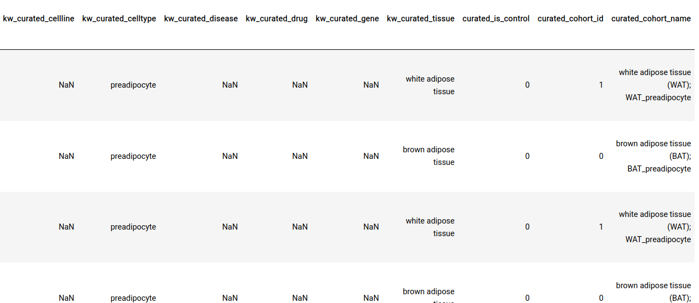
*A screen grab of the contents of a GCT file. Here, every row is a sample, and fields with the prefix ‘kw_curated’ and ‘curated’ contain information that was appended to the file after curation.*

**Perturbation/control identification**: In addition to ontology mappings we also have the following three annotations at the sample-level.

1. curated_is_control: This indicates whether the sample is a control or a perturbation sample within the context of a particular experiment.

2. curated_cohort_id: Indicates the cohort that the sample belongs to. Samples within the same cohort have the same value for this field

3. curated_cohort_name: This is a short textual description of the cohort. It tries to capture sample properties that are exclusive to the samples within a cohort.

These labels are present for most datasets and are useful when performing certain downstream analyses (like Differential Expression) on a large number of datasets in an automated fashion. These annotations also address the FAIR metrics R1.2 (see [here](https://www.go-fair.org/fair-principles/]) for more details).

**Manual curation of perturbation/control labels**: To do this perturbation/control classification we use a machine learning classifier that uses the textual metadata associated with each sample to classify it as control or perturbation. To train this classifier and improve its accuracy on different types of omics datasets, we manually curate these labels for a subset of the datasets in our data lake.  This manual labeling is done by graduate and undergraduate students who are well versed in understanding biological data generation. We use these manually annotated datasets to train our classifier and improve its accuracy. The current classification model has an accuracy of ~90% on sample metadata for transcriptomics datasets.


## 1.3 Index of repositories on Polly Discover

### 1.3.1 GEO

**Introduction**

GEO (Gene Expression Omnibus), managed by the National Center for Biotechnology Information (NCBI) is a public repository that archives and freely distributes microarray, next-generation sequencing, and other forms of high-throughput functional genomics data submitted by the research community.

The three central data entities of GEO are Platforms, Samples, and Series.

Platform - A Platform is composed of a summary description of the array or sequencer. Each Platform record is assigned a unique GEO Identifier (GPLxxx).

1. Sample - A Sample record describes the conditions under which an individual Sample was handled, the manipulations it underwent, and the expression of each element derived from it. Each Sample record is assigned a unique GEO Identifier (GSMxxx). A Sample entity must reference only one Platform and may be included in multiple Series.

2. Series - A Series record links together a group of related Samples and provides a focal point and description of the whole study. Series records may also contain tables describing extracted data, summary conclusions, or analyses. Each Series record is assigned a unique GEO Identifier (GSExxx).

3.  Dataset represents a curated collection of biologically and statistically comparable GEO Samples referring to the same Platform. To enforce this dataset definition, on Polly, each dataset is denoted using a unique ID of the format GSExxxx_GPLxxxx.

For example, GSE100003_GPL15207 would translate to a collection of samples from the series GSE100003 sequenced using the platform GPL15207.

Samples sequenced using X number of Platforms in a particular Series would result in X number of Datasets.

On Polly, you can find all the information corresponding to a dataset in one place (i.e. one GCT file) which includes, study metadata (title, description, author, disease, organism, etc.), sample metadata, and expression data. This saves a considerable amount of time and effort in finding relevant metadata and mapping it to the expression data which can be better spent on the analysis of data.

Moreover, each dataset has been annotated with study metadata fields such as disease, organism, drug, tissue, and dataset ID that can be used to identify relevant dataset(s) on Polly.

**Types of Omics Datasets**

- Bulk Transcriptomics
  -  Microarray
  -  RNA Sequencing


**Usage**

This is the largest curated transcriptomics repository with over 50k datasets. A user can easily identify dataset(s) of relevance and perform analysis. Analysis of Transcriptomics data generally includes comparing specific pairs of samples. The differences may be due to different phenotypes (samples from diseased or healthy tissue, samples with different treatments, samples at different time points undergoing the same treatment, etc.). More commonly, healthy and disease sample groups are compared to discover quantitative changes in expression levels of genes between the two groups, in turn identifying differentially expressed Genes.

Furthermore, the following analyses can be done on top of the differentially expressed Genes:

1. Gene Ontology (GO) and Pathway enrichment analysis
2. Identification of alternative splicing events and Single Nucleotide Polymorphisms (SNPs)
3. Analysis of the protein-protein interaction network

**Level of curation**

Since most of the RNAseq datasets in GEO do not have processed counts and only have raw data in the form of FASTQ files, we did raw data processing using our in-house star alignment pipeline to generate counts. This counts data is then VST normalized using DESEQ package before being wrapped along with the sample metadata as a Dataset.

**Dataset Level** 

We have mapped the following study metadata fields to an ontology so that they remain consistent throughout the repository and querying based on these fields yield appropriate results:
1. Disease
2. Tissue
3. Cell type
4. Cell line
5. Drug
6. Organism

**Sample Level** 

We have mapped the above-mentioned fields in the sample metadata to an onology so that they remain consistent throughout the repository and querying based on these fields yield appropriate results.

We have also deployed our proprietary Machine Learning Model that accurately identifies the samples as Perturbation and Control, which can allow the user to seamlessly analyze a large number of datasets in batches.

**Source**

https://www.ncbi.nlm.nih.gov/geo/


### 1.3.2 LINCS (The Library of Integrated Network-Based Cellular Signatures)
**Introduction**

LINCS program is an initiative by NIH to create a network-based understanding of biology by cataloging the gene expression as well as other cellular processes. When we expose cells to a variety of perturbating agents then it causes a change in gene expression as well as other cellular processes. Developing the network-based approach, it will enable a new understanding of health and disease through an integrative approach the will help to identify the patterns of common network and cellular responses across different types of tissues and cell in response to a broad range of perturbations.

**Types of Omics Datasets**

- Microarray

**Usage**

By generating and making public data that indicates how cells respond to various genetic and environmental stressors, the LINCS project will help us gain a more detailed understanding of cell pathways and aid efforts to develop therapies that might restore perturbed pathways and networks to their normal states.Polly enables the user to query metadata search  across all annotations associated with perturbations, model systems, and signatures.

LINCS database played a crucial role to investigate the reproducibility of the prototypical perturbational assay: quantifying the responsiveness of cultured cells to anti-cancer drugs and influential in the requirement of FAIR data. With additional curations available as part of Polly, facilitates cross comparison in turn ensuring reproducibility.

Identifying the transcription factors (TFs) responsible for observed changes in gene expression is an important step in understanding gene regulatory networks. Enrichment results from these distinct sources are integrated to generate a composite rank that improves the prediction of the correct upstream TF compared to ranks produced by individual libraries.

**Level of curation**

Changes in each cell line measured against treating it with different perturbations which can be drugs or genetic perturbations (CRISPR knockdown perturbations). Each dataset contains the gene expression values for perturbation as well as control vehicle, control untreated and control vector for the respective cell line.  Moreover, these datasets are curated at their dataset and sample level to make them standardized and consistent.

**Dataset Level**

At the dataset level, we tag the metadata of the dataset with ontologies. The fields in the dataset level metadata are
1. disease
2. tissue
3. organism
4. drug
5. author of the study

**Sample Level** 

We have mapped the above-mentioned fields in the samples of the datasets to ontologies so that they remain consistent throughout the repository and querying based on these fields yields appropriate results.

**Source**

Level 3 LINCS data for a gene and drug perturbations has been taken from GEO, using GSE70138 and GSE92742.

* https://www.ncbi.nlm.nih.gov/geo/query/acc.cgi?acc=GSE70138 
* https://www.ncbi.nlm.nih.gov/geo/query/acc.cgi?acc=GSE92742
* https://lincsproject.org/LINCS/

### 1.3.3 DEPMAP
**Introduction**

With the advent of knowledge in the molecular basis of cancer, the next question that faced researchers was to establish cause and effect relationship. DepMap consortium is a step in that direction to make the dependency map between the studied alterations in cancer, available drug molecules and physiological processes while enables identifying small molecule sensitivities and predictive biomarkers.

**Types of Omics Datasets**

- Gene Dependency
- RNAi
- Drug Screens
  
**Usage**

After the phenomenal success of the TCGA portal in mankind's fight against cancer, DepMap is to be the most important next step to understand how the molecules (drugs) affect the overall physiological workflow.

DepMap scientists are profiling hundreds of cancer cell line models for genomic information and sensitivity to genetic and small molecule perturbations. The information available as part of results in pooled-cell line chemical-perturbation viability screens has the potential to replace the initial part on drug lead screening. The data for about 4518 compounds can very efficiently be used for novel drug discovery pipelines as well as for approved drug repositioning or repurposing.

CRISPR-Cas9 viability screens are increasingly performed at a genome-wide scale across large panels of cell lines to identify new therapeutic targets for precision cancer therapy. The integration of these data with the already available pool of molecular understanding of cancer recapitulate findings from the individual datasets, provide greater statistical power to cancer- and subtype-specific analyses, unveil additional biomarkers of gene dependency, and improve the detection of common essential genes.

The DepMap dataset is extensively used to perform and predict the interaction between genes. Few therapies target the loss of tumor suppressor genes in cancer. CRISPR-SpCas9 and RNA-interference loss-of-function screens enable the identification of new therapeutic targets associated with genomic loss of tumor suppressor genes.

Additionally, computational biologists, are efficiently using DepMap for developing in-silico methods to detail the in-vivo process. Cell lines are key tools for preclinical cancer research, but it remains unclear how well they represent patient tumor samples. Direct comparisons of tumor and cell line transcriptional profiles are complicated by several factors, including the variable presence of normal cells in tumor samples. Computational tools developed using DepMap data could be used to guide the selection of cell lines that more closely resemble patient tumors and improve the clinical translation of insights gained from cell lines.

**Level of curation**

DepMap repo contains a wide variety of dataset including Gene dependency, Drug screens and RNAi. Though the data is quite structured as far as the DepMap repository is concerned the metadata of cell lines and drugs is available as separate objects. While curating the data, merging of the different information from cell lines, Drugs, probe performance was merged using precise unique IDs to make the holistic information available for the user.

**Dataset Level** 

At the dataset level, we tag the metadata of the dataset with ontologies. The fields in the dataset level metadata are : 
1. disease
2. tissue
3. organism
4. drug
5. description
6. author of the study

**Sample Level**

The data includes information for failed screens which was cleaned as part of curation process.
In order to facilitate quick learning about the cell lines used, Cell line info is made available as column metadata.
For RNAi, we do not currently have a globally standardized reference database, hence the probe Id along with gene symbols were used to annotate the metadata.

**Source**

https://depmap.org/portal/
 


### 1.3.4 Metabolomics
**Introduction**

Metabolomics repository contains all the publicly available metabolomics data sourced from two public repositories - Metabolomics Workbench and Metabolights. Metabolomics Workbench serves as a national and international repository for metabolomics data and metadata. MetaboLights is also a database for Metabolomics experiments and derived information. The database is cross-species, cross-technique. We curate the data from these repositories and make it available in a FAIR manner.

***Datasets in Metabolomics Workbench (MeWork)*** 

Each study on MeWork can have multiple datasets designated by analysis ids. The metadata template of MeWork consists of the following key sections to cover metadata reporting standards recommended by MSI: project, study, experimental design, subjects, treatment, collection, sample preparation, chromatography, analysis and MS/NMR. Each metadata section in turn contains a set of required and optional data fields pertaining to appropriate details about the experiment. For example, the analytical metadata sections include details regarding sample storage conditions, sample preparation and extraction protocols, sample procurement and analytical methods. The dataset id on Polly is framed as STUDYID_ANALYSISID of the corresponding study on MeWork.


***Datasets in MetaboLights***

The two data entities in each MetaboLights Study are MAF and Sample Metadata

Metabolite Assignment File (MAF) - A TSV file containing information about the metabolites investigated in the study. Information regarding database accession IDs , wherein the spectra the metabolite is found and data pertaining to its abundance within the study samples is present in this file. The file name is of the format : m_MTBLSxxx_POS/NEG_Sample_MS/NMR_maf.tsv. Example : m_MTBLS1080_POS_LC-LTQ-MS_metabolite_profiling_v2_maf.tsv

Sample Metadata - The sample information provides all relevant facts about each sample and any controls/standards included in the study. There is ONE sample file corresponding to each MAF file. Sample metadata includes a unique sample name, organism, organism part (for controls use eg. experimental blank and solvent) and sample type (ie. control, QC, experimental sample). Further sample descriptors may include other columns such as Gender, Age, Treatment, etc.  The file name is of the format : a_MTBLSxxx_POS/NEG_Sample_MS/NMR.txt.Example : a_MTBLS1080_POS_LC-LTQ-MS_metabolite_profiling.txt

Study - A study can have multiple MAF and Sample Metadata Files. Each study record is assigned a unique MetaboLights Identifier (MTBLSxxx).A Dataset represents a curated collection of MAF and its corresponding Sample Metadata. To enforce this dataset definition, on Polly, each dataset is denoted using a unique ID of the format MTBLSxxx_m_MTBLSxxx_POS/NEG_Sample_MS/NMR.For example, MTBLS100_m_dwhsaliva_metabolite_profiling_NMR_spectroscopy would translate to a collection of saliva samples from the study MTBLS100 processed using the NMR Spectroscopy protocol. On Polly, you can find all the information corresponding to a dataset in one place (i.e. one GCT file) which includes, study metadata (title, description, author, disease, organism, etc.), sample metadata, and abundance data. This saves a considerable amount of time and effort in finding relevant metadata and mapping it to the abundance data which can be better spent on the analysis of data. Moreover, each dataset has been annotated with study metadata fields such as disease, organism, Ion Mode, tissue, and dataset ID that can be used to identify relevant dataset(s) on Polly.

**Types of Omics Datasets**

- Metabolomics
- Lipidomics

**Usage**

Default application on Polly allows you to perform downstream analysis on single-mode (either positive or negative mode) as well as dual-mode (both positive and negative mode) targeted, semi-targeted (without retention time) and untargeted unlabeled metabolomics data along with insightful visualizations. The app provides a variety of normalization methods, scaling options and data visualization functionalities, thereby allowing an efficient analysis of the data to get actionable insights.

- The application supports data with a simple matrix having samples in the columns and metabolites in the rows.
- It provides different normalization and scaling methods to perform on the data.
- Performs quality checks for internal standards, metabolites, and samples.
- Performs statistical analysis using limma and provides interactive visualizations.
- Performs pathway enrichment analysis and provides pathway visualizations.
- Provides heatmap visualization along with different algorithms like hierarchical clustering, k-means, correlation etc.
- Performs comparative analysis for the different cohort comparisons.

Users can also start a notebook and analyze the datasets using many popular packages like metaboanalyst.

**Level of curation**

Each analysis contains the intensity of metabolites and related metadata for the analysis. Thus the curation for these datasets includes curation at the dataset level.

**Dataset Level** 

At the dataset level, we tag the metadata of the dataset with ontologies. The fields in the dataset level metadata are disease, tissue, organism and drug as well as the description and author of the study.

**Sample Level**

The sample level information in this repository is yet not curated, we are doing both automatic and manual curation for this repository.

**Caveats** 

We discourage comparing multiple datasets in this repository since the experimental conditions  metabolomics can be vastly different.

**Source**

This repository consists of datasets from mainly two sources, Metabolomics Workbench and MetaboLights.

- https://www.metabolomicsworkbench.org/about/index.php 
- https://www.ebi.ac.uk/metabolights/


### 1.3.5 Single Cell
**Introduction**

Single cell sequencing technologies have grown exponentially in the last few years in terms of the number of cells that can be sequenced. With the advent of de-multiplexing platforms like 10x, it is possible to sequence hundreds of thousands of cells in one go. The single cell repository on Polly contains data from these high-throughput platforms(10x, InDrops) as well as datasets generated using older platforms (such as CELSeq, SmartSeq) where the throughput of cells is relatively lower. This is the largest curated single cell RNASeq data repository in the world with over 1500 datasets. Most of the datasets in this repository are sourced from the Gene Expression Omnibus(GEO). It is updated every day to include the recent single cell RNASeq datasets published on GEO. 
This repository also contains singlecell RNASeq datasets from the Human Cell Atlas.

**Types of Omics Datasets**

- Single cell RNA-seq

**Usage**

The use of Single-cell RNA sequencing (scRNA-seq) in understanding cellular biology and disease mechanisms is unparalleled. It allows us to identify and discover complex and rare cell populations, understand the regulatory relationships between genes at the cellular level, and map the trajectory of cellular differentiation. Understanding a biological system in such a precise manner enables us to catch biological signals otherwise missed at the bulk level and design targeted therapies. 

Different types of analyses can be performed on these single cell datasets to answer a variety of biological questions. Clustering and biomarker analysis- to identify the cell types in the population, trajectory inference- to understand the differentiation paths adopted by different sub-populations,  differential gene expression analysis- to identify biomarkers of cell types and genes that differentiate two cell types are some examples of the vast number of analyses that can be done on single cell RNASeq datasets.

These analyses can be performed using various open source packages such as  [Scanpy](https://scanpy.readthedocs.io/en/stable/), [Seurat](https://satijalab.org/seurat/) and [Monocle](https://github.com/cole-trapnell-lab/monocle3) among others. We store the datasets in this repository in the h5ad file format. The h5ad file format is an HDF5 file format that is widely accepted in the single cell sequencing community. It is designed to store large amounts of data, and allow fast querying of parts of a file without accessing the complete file in memory. The dataset h5ad files can be consumed using Polly notebooks, via popular single cell analysis packages like Scanpy and Seurat, which are pre-installed in Polly Notebook environments. They can also be consumed through a GUI-interface, using the [Cellxgene](https://github.com/ElucidataInc/polly-docs/blob/discover_doc_revamp/docs/Data%20Lake%20Revamp.md#2121-proprietary-applications) app or the [single cell visualisation app](https://github.com/ElucidataInc/polly-docs/blob/discover_doc_revamp/docs/Data%20Lake%20Revamp.md#2121-proprietary-applications) hosted on Polly. 

**Level of curation**

A lot of the datasets in this repository are a collection of samples whose cells have been sequenced together. Thus the curation for these datasets includes curation at the study level (title, description, author, disease, organism, etc.), sample level, as well as cell level.  

**Dataset Level**

At the dataset level, we tag the metadata of the dataset with ontologies. The fields in the dataset level metadata are disease, tissue, organism and drug as well as the description and author of the study.

**Sample Level**

We have mapped the above-mentioned fields in the samples of the datasets to ontologies so that they remain consistent throughout the repository and querying based on these fields yields appropriate results. 

**Cell level**

In some datasets we have also manually curated the cell types present in the dataset. This means, that each cell present in the dataset is tagged with a cell type within the context of the study. 

**Source**

- Gene Expression Omnibus - https://www.ncbi.nlm.nih.gov/geo/
- Human Cell Atlas- https://data.humancellatlas.org/

### 1.3.6 TEDDY
**Introduction**

The TEDDY study - The Environmental Determinants of Diabetes in the Young - is looking for the causes of type 1 diabetes mellitus (T1DM). Research tells us that children who get diabetes have certain kind of genes that make them highly susceptible to getting diabetes. However, not all children who are in the high-risk category get diabetes.  It is believed that something happens to "triggers" a child with these risky genes to actually get diabetes. It is the purpose of this study to try and find out what are the triggers that cause children to get diabetes.

The study encompasses results from ~11,000 patients.

**Types of Omics Datasets**

Lipidomics - Case Study [ST001636](https://www.metabolomicsworkbench.org/data/DRCCMetadata.php?Mode=Study&StudyID=ST001636) (Lipidomics)

Metabolomics - Case Study [ST001386](https://www.metabolomicsworkbench.org/data/DRCCMetadata.php?Mode=Study&StudyID=ST001386) (Metabolomics)

**Usage**

Given the fact that the data ultimately comprises of Lipidomic and Metabolomic expression intensities (but that of young children), they can be easily combined with any other library of Lipidomic or Metabolomic studies (mostly of Adults) to possibly find if any Perturbation group in other studies have similar Lipidomic or Metabolomic features in children and, hence, possibly warn them or even prevent onset of an illness by taking suitable preventive measures to possibly mitigate or even cure the child of the said perturbation.

**Level of curation**

Whenever an instant (a child) is found to be ‘IA’ positive, control instants are then chosen from amongst the remaining samples such that they have similar features (like diet, viral infections, etc). A more in-depth analysis into how do they do the sampling can be found [here](https://www.ncbi.nlm.nih.gov/pmc/articles/PMC4058423/). These pairs are tied together using a Case Index which is unique to each such pair.

For each Case Index, we can have multiple samples under Control and also under Case.

**Sample Level**

The sample [meta-data](ftp://www.metabolomicsworkbench.org/Studies/ST001386_TEDDY_GCTOF_study_design_data_dictionary.xlsx) for each child has the following attributes which can be set by the instant which is shown to be ‘IA’ positive and it is referred to as a ‘case’:

- 'ia_case' -  a Boolean variable: 1 means it is positive for 'IA'
- 'ia_case_ind_1' - it is a case-control pair ID that helps pair up the case instant (this one) with its control instant. Unique for all pairs.
- 'ia_endptage_1' - this is the age in days when the persistent presence of 'IA' was confirmed (2 successive tests).
- ‘sex’ - Gender

The 'IA''s control counterpart also has a similar definition.

Similarly, whenever an instant comes up which is found to be 'T1D' (Type 1 Diabetes) positive, this 'case's control counterpart is chosen from amongst all those instances which are not 'T1D' positive and have similar features. 

**Dataset Level**

The dataset-level meta-data is inherently the same as the sample-level meta-data as the dataset was sliced according to the unique samples that were present.

In this study, given an instant (sample or child) from a class of Perturbation (either IA positive or T1D positive), we also have a set of Control cases that were similar to the Perturbation when it occurred (features like diet history, illness history, visits, stool sample, etc). Now, having dissented up the data on the basis of sample ID (one sample ID per child in the study), Polly allows us to easily pick one perturbation sample and its corresponding set of control samples by simply filtering according to Which sort of perturbation we want (IA positive or T1D positive), and 

Pick a Case Index number that will pull up one Perturbation Instant and its corresponding set of Control Instances.

**Source**

- Case Study [ST001386](https://www.metabolomicsworkbench.org/data/DRCCMetadata.php?Mode=Study&StudyID=ST001386)
- Case Study [ST001636](https://www.metabolomicsworkbench.org/data/DRCCMetadata.php?Mode=Study&StudyID=ST001636)


### 1.3.7 TCGA
**Introduction**

The Cancer Genome Atlas (TCGA) is a publicly funded project that aims to catalog and discover major cancer-causing genomic alterations to create a comprehensive “atlas” of cancer genomic profiles.
TCGA molecularly characterized over 20,000 primary cancer and matched normal samples spanning [33 cancer types](https://www.cancer.gov/about-nci/organization/ccg/research/structural-genomics/tcga/studied-cancers); generated over 2.5 petabytes of genomic, epigenomic, transcriptomic, and proteomic data.
TCGA is cornerstone in cancer biology. It has enabled a deeper understanding of cancer at molecular levels, helped research in science and technology  that has fastened the pace of drug discovery helped patients at the clinic in real-time. TCGA has been influential in R&D processes of many immuno-therapeutics.

**Types of Omics Datasets**

- Transcriptomics (mRNA,miRNA)
- Proteomics
- Copy Number Alteration
- Single Nucleotide Variations & Small Indels
- Methylation

**Usage**

All the available data can be sliced and diced as per user's exquisite research problem to run downstream analysis including but not limited to pathway enrichment, differential expression, TMB, cross-study summary statistics.
Comprehensive curation done for ontologies related to disease, tissue, source, publication, sample (control/perturbation), etc enables easy integration of data from different assays (expression, mutation, etc.) and different cohorts (BRCA, LUAD, etc) for multi-omics integration analysis for putative biomolecular discovery.
In conclusion, TCGA remains the holy grail for cancer researchers and all the novel findings will facilitate diagnosis, treatment, and cancer prevention.

**Level of curation**

Though meticulous efforts have been done at TCGA to structure and standardize the data, none the less some hurdles still exist in accessing and analyzing the data. Polly aims to reduce and where possible eliminate these barriers by standardizing molecular nomenclature (e.g genes will be represented as HGNC ids, and conversions from other formats like Ensemble will be done whenever necessary) and representing sample IDS across the study/Repository.

**Dataset Level**

Comprehensive curation done for ontologies related to the below
1. Cancer Type/Project
2. Disease Type
3. Disease Stage
4. Data type/Assay type
5. Sample Type (Tumor or normal)
6. Gender
7. Vital Status &/or Cause of death
These enable consistency throughout the repository and querying based on the above fields yield appropriate results

**Sample Level**

Sparsity in clinical data has been a consistent problem to deal, polly enables by cleaning up clinical data and adding additional annotations for pathological status, drugs, response, etc. that are the result of research on primary TCGA data.
The [TCGA barcode](https://docs.gdc.cancer.gov/Encyclopedia/pages/TCGA_Barcode/) is made up of multiple strings representing various information. Clinical data is represented at patient level, but the various assay data are represented at s sample and/or aliquot level.
For eg. Clinical data will have a unique key to be Patient Barcode (tcga-5l-aat0), whereas the transcriptomics (and other assays too) data will have a unique key at the sample level, whether taken from tumor sample or normal site. A single patient can have multiple tumor sample assessments too, example given for a breast (or lung) cancer patient where a patient has developed tumors in both the breasts (or lungs). Additionally, aliquot Barcode is needed to assess the assay-specific information, for e.g the same sample (tumor biopsy) is used to analyze the DNA and transcriptome (also methylation etc depending on the size of initial biopsy) in such case the Sample barcode for the patient is similar across the assays for that given patient and time point. Considering these representations, it becomes a critical task for the user to merge clinical and assay level data. To ease this for the user, in the curation process, the team has parsed all the relevant barcodes available in TCGA and the mappings have been done accordingly. So that for the user wants the task to merge the clinical data (1 patient 1 record) to transcriptomics data for example ( 1 patient 3 records - normal, tumor left breast, tumor right breast) is already done as part of curation and the data on Polly is ready to use for deeper and insightful analysis.
Additionally, it is a known fact that clinical data in TCGA is a bit sparse, so the team has curated additional papers that provide meaningful information. E.g. though TCGA has the drug data, the associated response is not clearly mentioned, additional annotations (from publications/curation packages) have been done in this regard to provide the user with the information not available within TGGA.

**Source**

https://portal.gdc.cancer.gov/

# 2. How is this data accessed and consumed?
## 2.1 Accessing Discover through Polly's interface
### 2.1.1 Filtering interface

For all data repositories, we provide a dataset filtering interface that is built around F.A.I.R guidelines. It gives a listing of datasets along with their metadata fields obtained from dataset level curation. This curation makes the dataset findable using a controlled vocabulary.

- Apart from this, the filtering interface- 
- provides standardized metadata fields to search for datasets (Findability)
- provides access to datasets using their unique identifiers (Accessibility)
- uses a controlled vocabulary (obtained from biological ontologies) for the values stored in the metadata fields (Interoperability)
- provides a link to the source of the dataset (Reusability)

#### 2.1.1.1 Filters and Columns

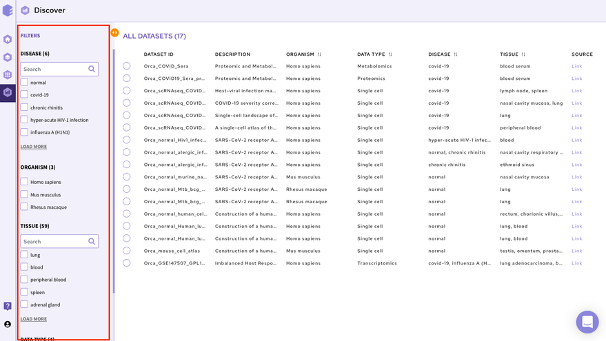

The filtering interface provides various fields(depending on the data repository) that you can use to filter the datasets within the selected repository. These fields are obtained from the dataset level curation of the datasets. All these fields in the repository store values using a controlled biological vocabulary inline with the interoperability principle of the FAIR guidelines. Some of the common fields that are present in every repository are-

* Disease: This field will give you a list of all the diseased type datasets present in the repository. You can choose to work on any of the disease datasets listed or the ‘normal’ datasets. In order to do the selection, mark the checkboxes present besides the disease of your interest.

* Organism: This field will give you a list of the organisms associated with the datasets of the repository. You can mark a selection to filter the datasets of only the desired organism.

* Tissue: This field will give you the distribution of tissue across the repository. Click on Load More to look at the entire list, or use the search option to find the tissue type you are looking for. Select the tissue type required to filter the datasets specific to it.

* Data Type: This field will give you the different types of omics datasets present in the repository. Choose the data type for your study by selecting the checkbox beside it.

When the selections are marked, you can find the filtered datasets on the right panel.

**Note:**

*    You can select multiple entries at the same time.

*    To clear your filters at any point in time, click on the clear option present beside all the parameters.

#### 2.1.1.2 Dataset Selection and Search


The right panel displays the dataset present in the repository. It displays these fields about the datasets among others(depending on the repository)-

*    Dataset ID: Unique identifier associated with the dataset.

*    Description: It encompasses the title of the paper.

*    Organism: Organism associated with the dataset

*    Datatype: Datatype of the dataset e.g. Transcriptomic, Metabolomics, Single Cell etc

*    Disease: Disease studied with the selected dataset

*    Tissue: Type of tissue the dataset is from

*    Publication : Provides the link to the publication

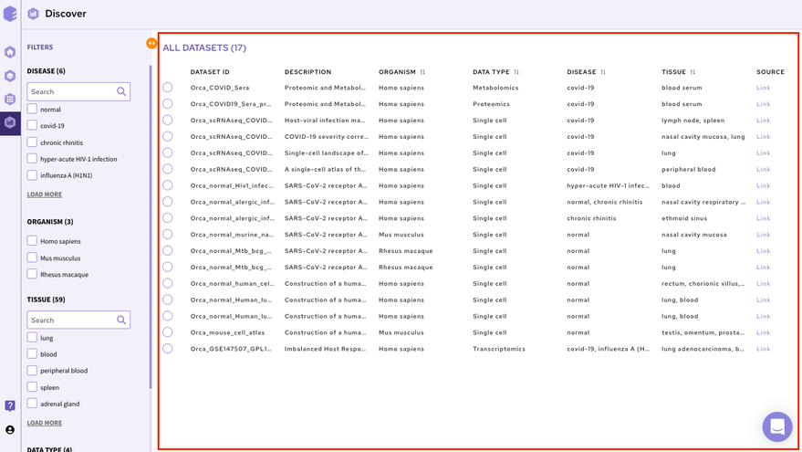

It is also possible to search for datasets by entering the complete or partial dataset ID in the search box above this panel. This search runs across the unique dataset IDs in the repository.

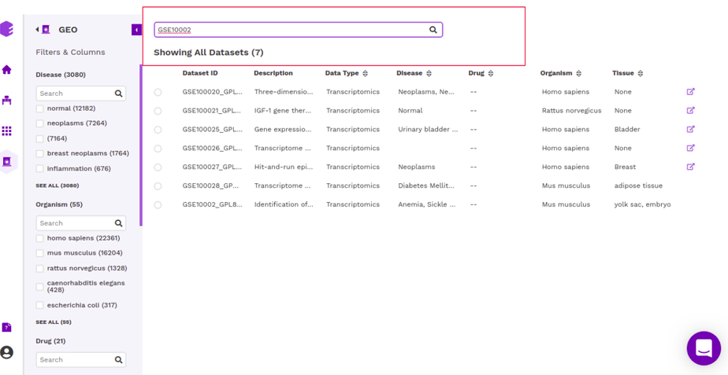

Once you have narrowed down to a relevant omics datasets, you can mark a selection on the checkbox present beside the desired dataset and start analyzing the dataset through the various applications available on Polly.

### 2.1.2 GUI based applications

You can analyze the selected dataset on the fly using various applications on Polly. They enable you to perform various statistical analyses, displaying intuitive visualizations, and allowing you to create a hitlist of molecules while analyzing multiple datasets simultaneously.

In order to select the tool of your analysis, click on *Select the Application* option at the bottom of the screen after selection of any dataset from the list and choose the analysis platform of your interest and click on open.

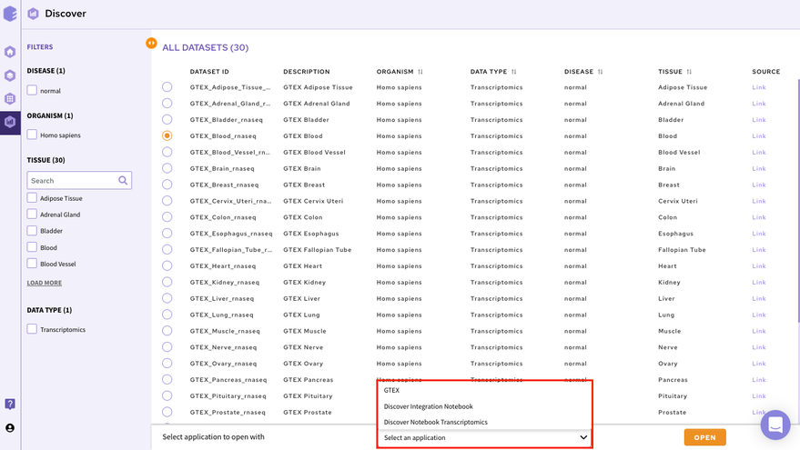

Select the workspace where you would like to store the analysis and click on *Launch* to open the selected application/notebook.

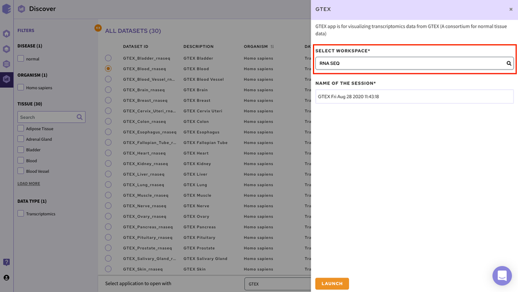
  

Data Lake Applications are built on top of data lakes to query and explore relevant datasets. We have both proprietary applications used to visualize and analyze specific data types as well as popular open source applications. 

#### 2.1.2.1 Proprietary applications

*   **[Polly Discover Application:](https://docs.elucidata.io/Data%20Lake.html#discover)**

    It is a platform for visualization, analytics, and exploration for bulk transcriptomics data curated from GEO. It offers users an interactive dashboard for analysis and visualization of transcriptomics data. Currently, the platform handles gene expression microarray and RNA-seq data and supports three species human, mouse, and rat.  
    <br />

*   **[Single Cell Visualization:](https://docs.elucidata.io/Data%20Lake.html#single-cell-visualization)**

    It is a comprehensive visualization platform for single-cell transcriptomics data. The app helps visualise cells and the association of different genes with the metadata.  
    <br />


*   **[GTEx Application](https://docs.elucidata.io/Data%20Lake.html#gtex)**

    GTEx Application is is a platform for visualization, analytics, and exploration of transcriptomics data from GTEx.  
    <br />

*   **[Dual Mode Data Visualization(Metabolomics App):](https://docs.elucidata.io/Apps/Metabolomic%20Data/Dual%20Mode%20Visualization.html)**

    This app allows you to perform downstream analysis on untargeted unlabeled metabolomics data along with insightful visualizations. It provides a variety of normalization methods, scaling options, and data visualization functionalities, thereby allowing an efficient analysis of the data to get actionable insights.  
    <br />

You can read about these applications in the [Apps Section](https://docs.elucidata.io/Apps/) of the documentation. 

#### 2.1.2.2 Open source applications


*   **[Cellxgene:](https://chanzuckerberg.github.io/cellxgene/posts/annotations)**

    It is an interactive data explorer for single-cell transcriptomics datasets.  
    <br />
 
### 2.1.3 Polly Discover Notebook

It is possible to analyze and visualise a dataset in a [Polly Notebook](https://docs.elucidata.io/Scaling%20compute/Polly%20Notebooks.html) for custom visualizations and analysis. This can be done by selecting the Notebook option in the application launch menu from the filtering screen. We have various types of notebook environments for different data types in Discover. 


| Polly Notebook| Docker      | Machine Configuration   |
|---------------|-----------|-------|
| Discover Notebook Single-cell  | Single Cell Downstream   | Memory-optimized 32GB, Polly 2x-large |
| Discover Notebook Transcriptomics  | RNA-Seq Downstream     | RNA-Seq Downstream  |
| Discover Notebook Proteomics   | RNA-Seq Downstream   | Polly medium 4GB  |
| Discover Notebook Metabolomics| Metabolomics | Polly medium 4GB |
    

### 2.1.4 Studio Presets
It is also possible to import datasets from a Discover repository into a studio preset for analysis. You can analyze the selected dataset on the fly using various applications on Polly including Studio Presets. In order to select the Preset for your analysis, click on the Select the Application option at the bottom of the screen after selection of any dataset from the list and choose the analysis platform of your interest and click on Launch App.

It allows you to perform downstream analysis on the omics data hosted on any of the data lakes on Polly. The preset provides a variety of tools to visualize the data, as well as allows you to perform statistical analyses, displaying intuitive visualizations, and allowing you to create a shareable dashboard while analyzing the datasets. Read more about Polly Data Studio here.

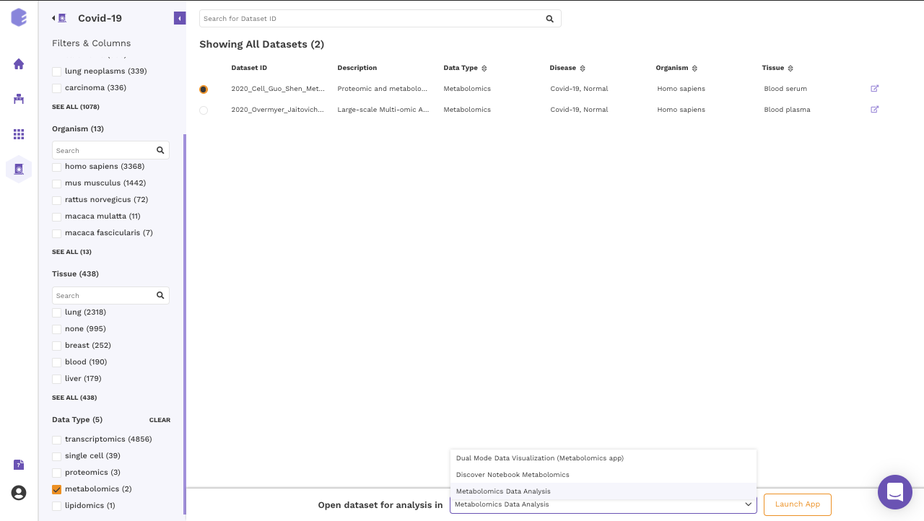

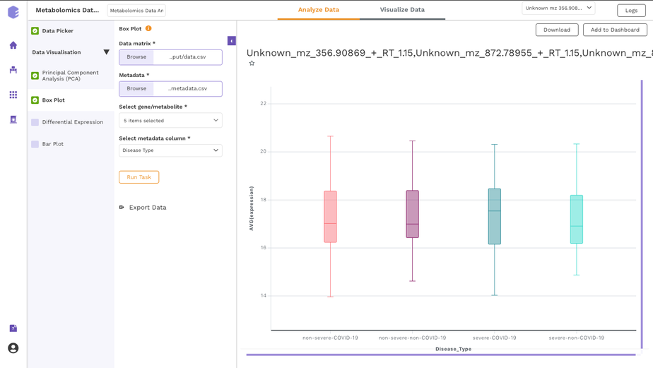


## 2.2 Accessing Discover programmatically
It is possible to interact with the Discover repositories programmatically by using **DiscoverPy**- a python package developed by us. DiscoverPy comes pre-installed in all Polly notebooks. As of now, it can be used only in a Polly environment.

### 2.2.1 Elastic search indices in Discover
   
According to the FAIR’s Findable principle, (Meta)data should be indexed in a searchable resource so that we can find a record with its unique identifier or any of its rich metadata. For that, we’ve used [Elasticsearch](https://aws.amazon.com/elasticsearch-service/) and put repositories data and metadata in Elasticsearch Indexes.

We’ve also provided APIs over HTTPS with authentication for accessing the data in a secured manner which aligns with the FAIR’s Accessible principle of (Meta)data should be retrievable by their unique identifier using a standardized communications protocol.

### 2.2.2 Discoverpy Usage

#### 2.2.2.1  Initialisation

- We need a discover object to interact with a data repository in Discover.

<pre><code>from discoverpy import Discover
discover = Discover() 
discover</code></pre>

- Each data repository on Polly has a unique ID that is used to refer to that repository. The following command list the available data repositories, their ID, and other information associated with them.

<pre><code>discover.get_repositories()</code></pre>

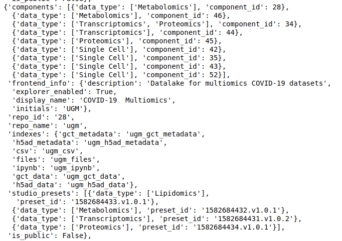 #replace

- Next, we need to set the context to a repository, so that all the subsequent queries will be run against that repository.
There is another parameter mode, that we can set for

single-cell repositories mode='single_cell', which will search across cells.

bulk data repositories mode='bulk', which will search across samples (default).

1. Set a repository for the discover object
You can use the id of a repository to set the discover object to point to that repository.

* For single cell repositories use `mode='single_cell'`.
* For bulk data repositories use `mode='bulk'` (default)

For instance, the GEO repository has repo_id 9.

<pre><code>discover.set_repo('9')</code></pre>
The single cell repository's repo_id is 17.

<pre><code>discover.set_repo("17", mode="single_cell")</code></pre>
After you’ve added the indices for a repository, you can view the discover object. It lists the various indices associated with the repository set.

<pre><code>discover</code></pre>

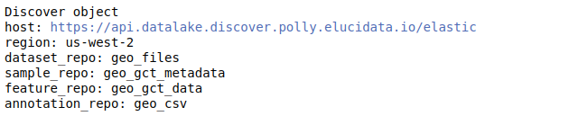

**Understanding the Discover object**
The discover object contains different slots, each containing different levels of curated information. While querying using the Discover object, we need to specify a slot explicitly - which denotes the level at which we want to query. Thus, it is essential to know what information each slot contains-

1. dataset_repo - This slot contains the study level metadata which consists of identifiers for diseases, cell lines, tissue, drugs, organism, and cell types. The identifier maps to concepts in biomedical ontologies and is consistent across datasets. Refer to Dataset level annotations for more information about the curation at the dataset level.

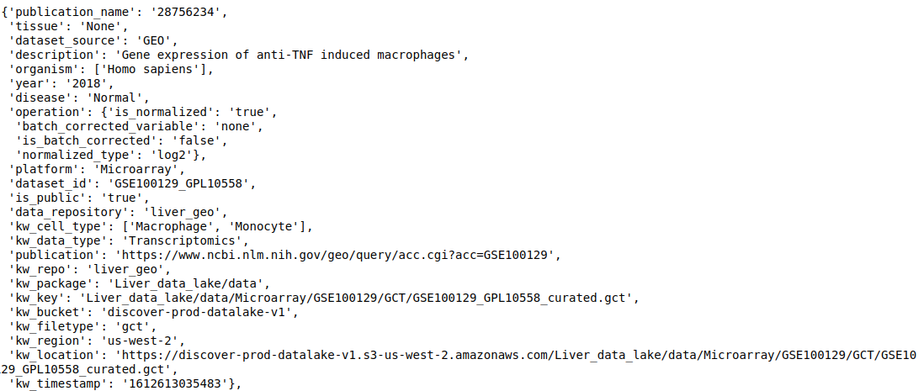

2. sample_repo - This slot contains sample level metadata such as genotype, cell lines, tissue, drugs, siRNA, etc., and is also tagged using ontologies. For multi-sample datasets, it also contains the variable which informs about whether the sample is a control sample or a perturbation sample in the context of the study.  With this, we should be able to run queries that find metastatic and primary tumors, finds samples treated with a particular drug, or more generally, look for a sample that has a specific phenotype. Refer to Sample level annotation for more information about the curation at the sample level.

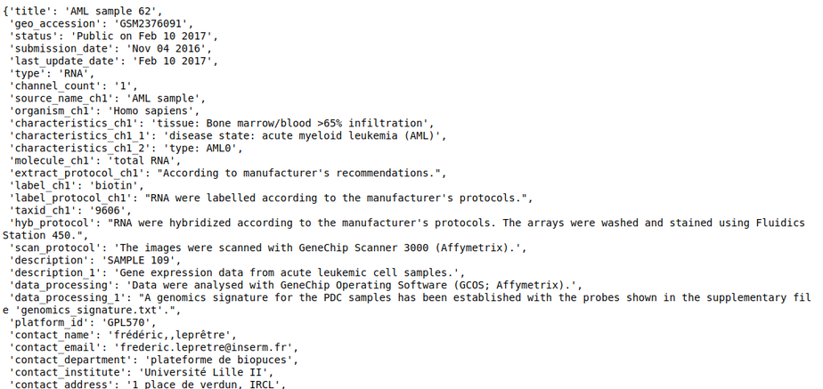

3. feature_repo - This is the slot containing matrix data of a dataset that contains the rows (feature identifiers) and the actual measurement value for those features for the samples in the dataset. The features could be anything depending on the type of study. For example, for transcriptomics datasets, the feature identifiers will be genes(HGNC symbols) and for proteomics datasets, they will be Proteins(referring back to UNIPROT).

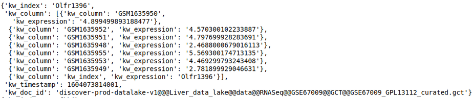

4. annotation_repo - With this slot, we can access various feature annotation databases to get information about a particular feature or a set of features.

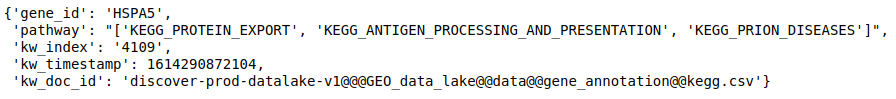

#### 2.2.2.2 Querying

As [our curation](https://github.com/ElucidataInc/polly-docs/blob/discover_doc_revamp/docs/Data%20Lake%20Revamp.md#12-what-do-we-mean-by-curation-of-data-in-polly) process stores metadata values under a controlled vocabulary, the queries in discoverpy follow FAIR's Interoperability guideline. This means that all the users' queries are searched against keywords in a search space that is limited to the vocabulary present in biological ontologies.

##### 2.2.2.2.1 Common methods for multiple indices.

There are methods available on all levels of repository indices. You just need to replace `<INDEX_LEVEL_NAME>` with one of `sample_repo` | `feature_repo` | `dataset_repo` | `annotation_repo`

* Get fields present in the index.
`discover.<INDEX_LEVEL_NAME>.get_all_fields()`
For example, to get the fields present for the datasets in this repository,

<pre><code>discover.dataset_repo.get_all_fields()</code></pre>

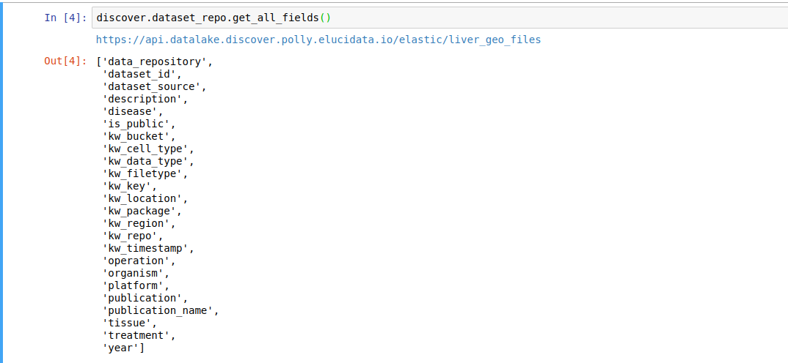

* Fetch the top `n` records from a repository.
`discover.<INDEX_LEVEL_NAME>.get_n_records()`

For example, to get the fields present for datasets in this repository,
<pre><code>discover.dataset_repo.get_all_fields()</code></pre>


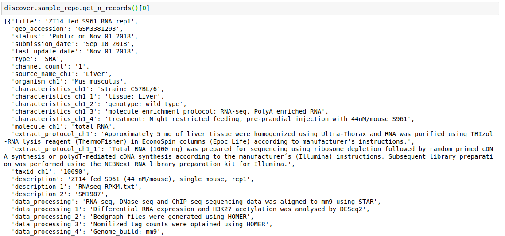

* Output the records as a dataframe - 
`discover.<INDEX_LEVEL_NAME>.get_n_records_as_df()[0]`

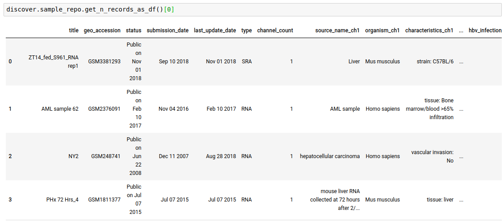

* Note: You would find there are many methods that have the *_as_df variant as well, which takes the same arguments and return the result in Dataframe.

* Instead of just `n` records, you can fetch all records as well by using 
  `discover.<INDEX_LEVEL_NAME>.get_all_records_as_df()`


##### 2.2.2.2.2 Querying at the Dataset Level


* Fetch dataset entries that match against the `value` for a `field`.
<pre><code>discover.dataset_repo.get_n_datasets_for_field(field, value, regexp, n=Discover.DEFAULT_PAGE_SIZE, cursor=None, sort_by=Discover.DEFAULT_SORT_ORDER)</code></pre>
Optionally a regular expression (`regexp`) can be provided instead of a `value`. 

For example, The following query lists all datasets in the repository, where ‘publication name’ fields has pubmed id ‘28756234’


<pre><code>discover.dataset_repo.get_n_datasets_for_field_as_df('publication_name', '28756234', regexp=False)[0]</code></pre>

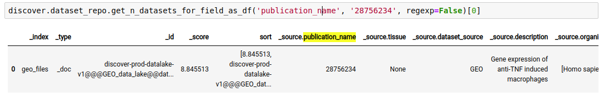

The following query lists all datasets in the repository where ‘tissue’ is ‘liver’

<pre><code>discover.dataset_repo.get_n_datasets_for_field_as_df('tissue', 'liver', regexp=False)[0]</code></pre>


Instead of just `n` datasets, you can fetch all datasets as well.

`discover.dataset_repo.get_all_datasets_for_field_as_df(field=None, value=None, regexp=False, sort_by=Discover.DEFAULT_SORT_ORDER)`

* Fetch dataset entries that satisfy the given match combinations.

<pre><code>discover.dataset_repo.get_n_datasets_for_field_combination(and_fields, or_fields, not_fields, n=Discover.DEFAULT_PAGE_SIZE, cursor=None, sort_by=Discover.DEFAULT_SORT_ORDER)</code></pre>

The following query fetches datasets where the platform is Microarray, tissue is stem cells, and the keyword ‘knockdown’ is NOT present in the description of the study.

<pre><code>discover.dataset_repo.get_n_datasets_for_field_combination_as_df(and_fields={"platform":"Microarray", "tissue":"stem cells"}, not_fields={"description":"knockdown"})[0]</code></pre>

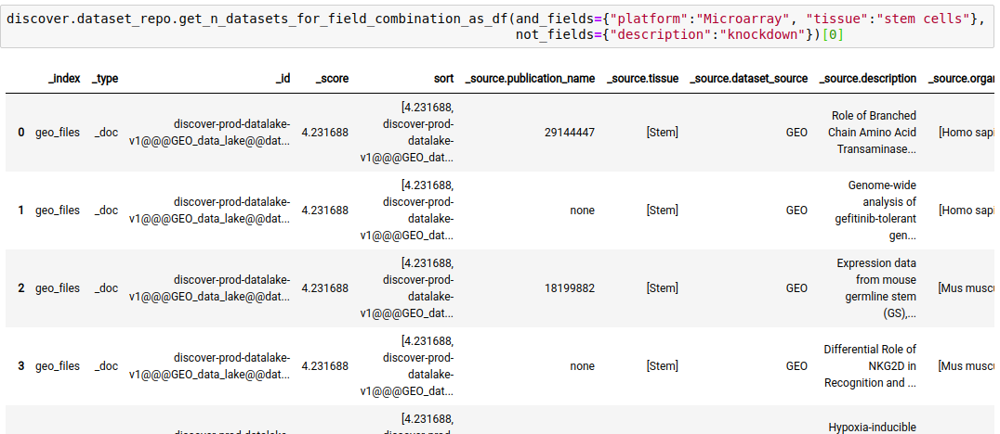

Instead of just `n` datasets, you can fetch all datasets as well.

<pre><code>discover.dataset_repo.get_all_datasets_for_field_combination_as_df(and_fields={"platform":"Microarray", "tissue":"stem cells"},not_fields={"description":"knockdown"})</code></pre>

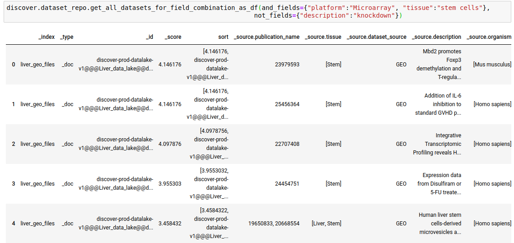

##### 2.2.2.2.3 Querying at the feature level

* Fetch feature values matching against the `feature_name` term. The `n` here decides the number of datasets that will be searched.

<pre><code>discover.feature_repo.get_n_feature_match_values(feature_name, n=Discover.DEFAULT_PAGE_SIZE, cursor=None, sort_by=Discover.DEFAULT_SORT_ORDER)</code></pre>

The following query fetches the expression level of the gene `OLfr1396` in the various samples of the repository

<pre><code>discover.feature_repo.get_n_feature_match_values_as_df("Olfr1396")[0]</code></pre>

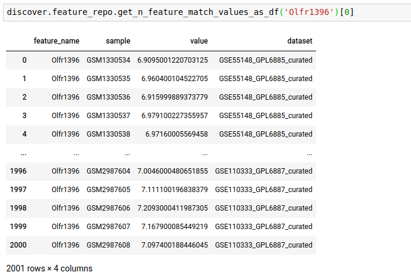

Instead of just `n` feature values, you can fetch all as well.

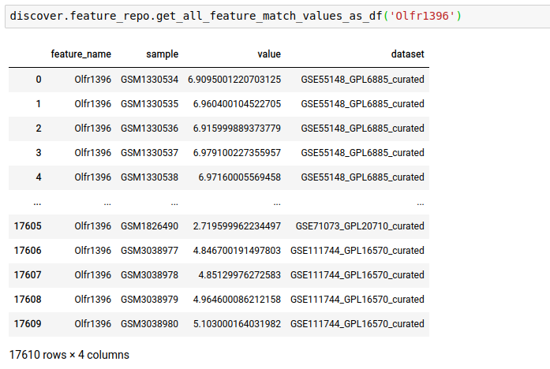


* Fetch feature values matching against the `feature_name` term, in single-cell datasets. The `n` here decides the number of datasets that will be searched. This is for the case where the mode was set to single cell. It outputs the average expression of the gene in the pool of cells corresponding to each unique cell type in the repository, per dataset.

<pre><code> discover.feature_repo.get_n_sc_feature_match_values(feature_name, n=Discover.DEFAULT_PAGE_SIZE, cursor=None, sort_by=Discover.DEFAULT_SORT_ORDER)</code></pre>

<pre><code>discover.feature_repo.get_all_sc_feature_match_values_as_df("NTM")[0]</code></pre>

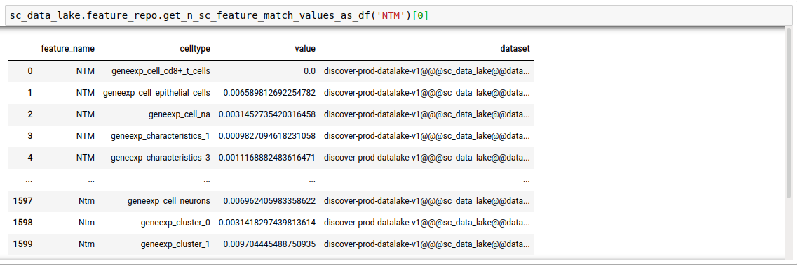


Instead of just `n` feature values, you can fetch all as well.

`discover.feature_repo.get_all_sc_feature_match_values_as_df(feature_name, sort_by=Discover.DEFAULT_SORT_ORDER)`

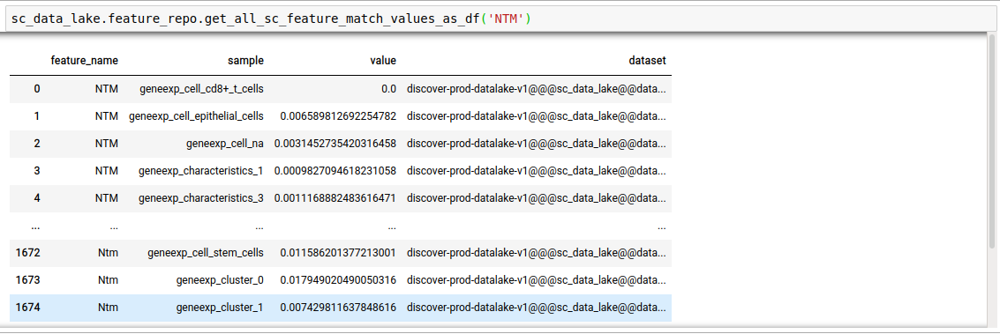


##### 2.2.2.2.4 Querying at the sample level

* Fetch sample entries that match against the `value` for a `field`.

<pre><code>discover.sample_repo.get_n_samples_for_field(field, value, regexp, n=Discover.DEFAULT_PAGE_SIZE, cursor=None, sort_by=Discover.DEFAULT_SORT_ORDER)</code></pre>

The following example fetches the samples whose source is “stem cells”.

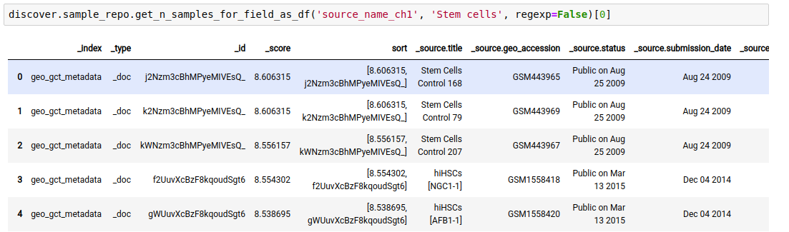

* Dataframe output variant - `get_n_samples_for_field_as_df`

Instead of just `n` feature values, you can fetch all as well.

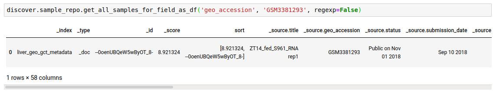


* Fetch sample entries that match against the `search_term` in any of the given fields. This is useful if you do not know the field to query on beforehand or want to search across all fields, or a list of fields.


<pre><code>discover.sample_repo.get_n_samples_for_fields(search_term, fields=[], n=Discover.DEFAULT_PAGE_SIZE, cursor=None, sort_by=Discover.DEFAULT_SORT_ORDER)</code></pre>

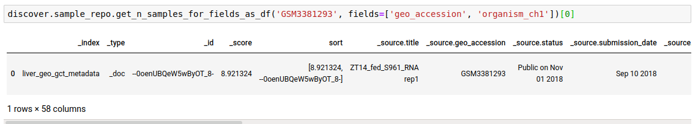

* Dataframe output variant - `get_n_samples_for_fields_as_df`

Instead of just `n` sample matches, you can fetch all as well.

<pre><code>discover.sample_repo.get_all_samples_for_fields_as_df(search_term, fields=[], sort_by=Discover.DEFAULT_SORT_ORDER)</code></pre>

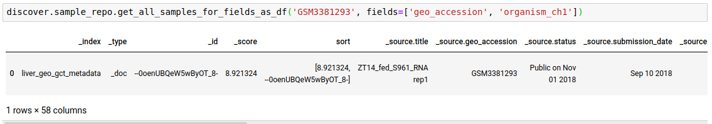

* Fetch sample entries that satisfy the given field combinations.

<pre><code>discover.sample_repo.get_n_samples_for_field_combinations(and_fields={}, or_fields={}, not_fields={}, n=Discover.DEFAULT_PAGE_SIZE, cursor=None, sort_by=Discover.DEFAULT_SORT_ORDER)</code></pre>

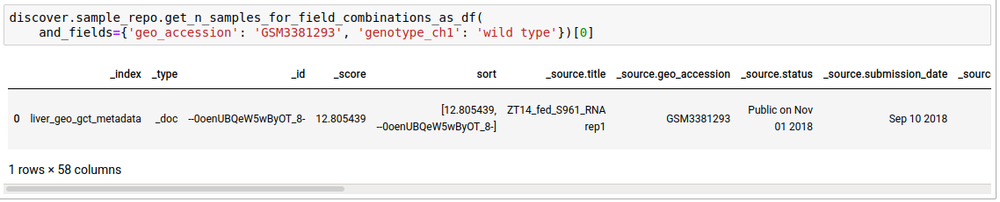

* Dataframe output variant - `get_n_samples_for_field_combinations_as_df`

Instead of just `n` sample matches, you can fetch all as well.

<pre><code>discover.sample_repo.get_all_samples_for_field_combinations_as_df(and_fields={}, or_fields={}, not_fields={}, sort_by=Discover.DEFAULT_SORT_ORDER)</code></pre>

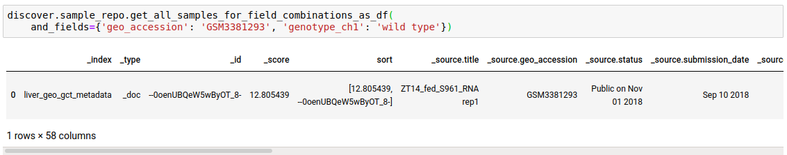

##### 2.2.2.2.5 Access annotation repositories
The various gene annotation databases can also be accessed through discoverpy. These can be used to get information about a particular gene or a set of genes.

* Get all annotation databases

<pre><code>discover.annotation_repo.get_annotation_databases()</code></pre>

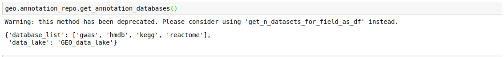

* Get annotations for a list of genes from a particular database. Getting Reactome pathways for the genes.

<pre><code>discover.annotation_repo.get_feature_annotation(data_lake, _docid, list_of_genes, n=10000)</code></pre>

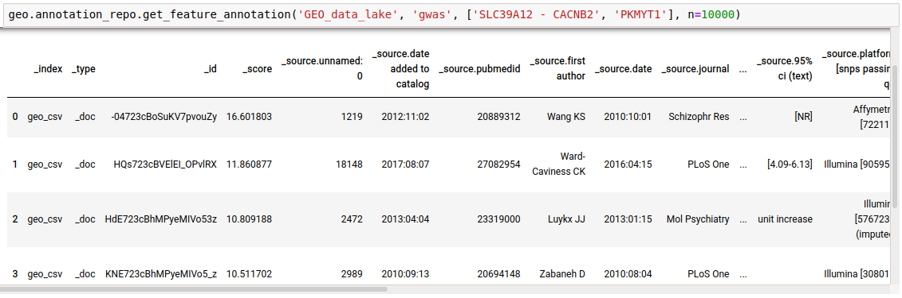


#### 2.2.2.3 Downloading a dataset
Discoverpy can be used to download a dataset from a repository. This can be done by using the “key” of the dataset in the repository. 

<pre><code>query_list = discover.dataset_repo.get_n_datasets_for_field('publication_name', '28756234', regexp=False)[0]
# Get key of the first file returned by the query
file_key = query_list[0]["_source"]["kw_key"]</code></pre>

```
'GEO_data_lake/data/Microarray/GSE100129/GCT/GSE100129_GPL10558_curated.gct'
```

<pre><code>discover.get_file(key, repo_id="9", local_fp="downloaded_file.gct")</code></pre>

This will download the file to the local environment.
