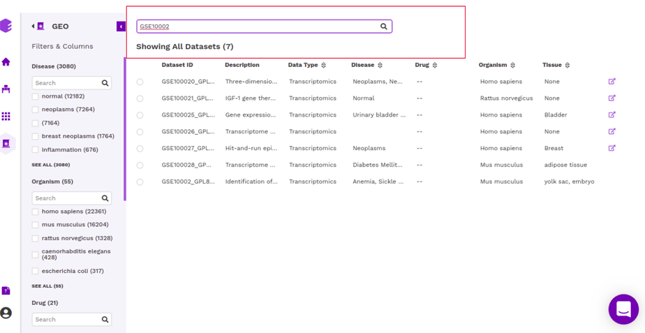
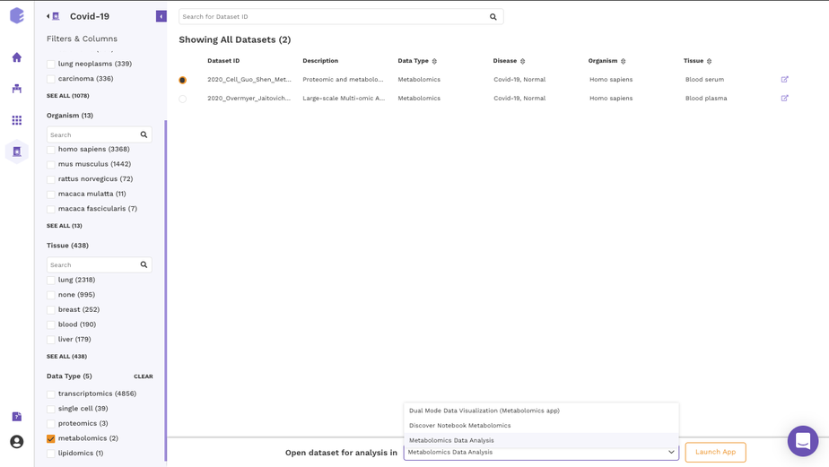
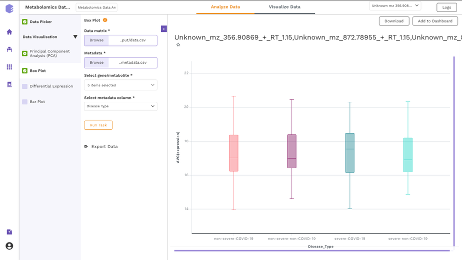

#### 2.1.1 Filtering interface

For all data repositories, we provide a dataset filtering interface that is built around F.A.I.R guidelines. It gives a listing of datasets along with their metadata fields obtained from [dataset level curation](https://github.com/ElucidataInc/polly-docs/blob/discover_doc_revamp/docs/Data%20Lake%20Revamp.md#12-what-do-we-mean-by-curation-of-data-in-polly). This curation makes the dataset findable using a controlled vocabulary.

* Apart from this, the filtering interface- 
* provides standardized metadata fields to search for datasets (Findability)
* provides access to datasets using their unique identifiers (Accessibility)
* uses a controlled vocabulary (obtained from biological ontologies) for the values stored in the metadata fields (Interoperability)
* provides a link to the source of the dataset (Reusability)

##### 2.1.1.1 Filters and Columns

The filtering interface provides various fields(depending on the data repository) that you can use to filter the datasets within the selected repository. These fields are obtained from the dataset level curation of the datasets. All these fields in the repository store values using a controlled biological vocabulary inline with the interoperability principle of the FAIR guidelines. Some of the common fields that are present in every repository are-

* Disease: This field will give you a list of all the diseased type datasets present in the repository. You can choose to work on any of the disease datasets listed or the ‘normal’ datasets. In order to do the selection, mark the checkboxes present besides the disease of your interest.

* Organism: This field will give you a list of the organisms associated with the datasets of the repository. You can mark a selection to filter the datasets of only the desired organism.

* Tissue: This field will give you the distribution of tissue across the repository. Click on Load More to look at the entire list, or use the search option to find the tissue type you are looking for. Select the tissue type required to filter the datasets specific to it.

* Data Type: This field will give you the different types of omics datasets present in the repository. Choose the data type for your study by selecting the checkbox beside it.

When the selections are marked, you can find the filtered datasets on the right panel.

**Note:**

*    You can select multiple entries at the same time.

*    To clear your filters at any point in time, click on the clear option present beside all the parameters.

##### 2.1.1.2 Dataset Selection and Search

The right panel displays the dataset present in the repository. It displays these fields about the datasets among others(depending on the repository)-

*    Dataset ID: Unique identifier associated with the dataset.

*    Description: It encompasses the title of the paper.

*    Organism: Organism associated with the dataset

*    Datatype: Datatype of the dataset e.g. Transcriptomic, Metabolomics, Single Cell etc

*    Disease: Disease studied with the selected dataset

*    Tissue: Type of tissue the dataset is from

*    Publication : Provides the link to the publication

It is also possible to search for datasets by entering the complete or partial dataset ID in the search box above this panel. This search runs across the unique dataset IDs in the repository.

Once you have narrowed down to a relevant omics datasets, you can mark a selection on the checkbox present beside the desired dataset and start analyzing the dataset through the various applications available on Polly.

#### 2.1.2 GUI based applications

You can analyze the selected dataset on the fly using various applications on Polly. They enable you to perform various statistical analyses, displaying intuitive visualizations, and allowing you to create a hitlist of molecules while analyzing multiple datasets simultaneously.

In order to select the tool of your analysis, click on *Select the Application* option at the bottom of the screen after selection of any dataset from the list and choose the analysis platform of your interest and click on open.

Select the workspace where you would like to store the analysis and click on *Launch* to open the selected application/notebook.

  

Data Lake Applications are built on top of data lakes to query and explore relevant datasets. We have both proprietary applications used to visualize and analyze specific data types as well as popular open source applications. 

##### 2.1.2.1 Proprietary applications

*   **[Polly Discover Application:](https://docs.elucidata.io/Apps/Polly%20Discover%20Application.html)**

    It is a platform for visualization, analytics, and exploration for bulk transcriptomics data curated from GEO. It offers users an interactive dashboard for analysis and visualization of transcriptomics data. Currently, the platform handles gene expression microarray and RNA-seq data and supports three species human, mouse, and rat.  
     

*   **[Single Cell Visualization:](https://docs.elucidata.io/Apps/Single%20Cell%20Visualization.html)**

    It is a comprehensive visualization platform for single-cell transcriptomics data. The app helps visualise cells and the association of different genes with the metadata.  
     

*   **[GTEx Application](https://docs.elucidata.io/Apps/GTEX%20Discover.html)**

    GTEx Application is is a platform for visualization, analytics, and exploration of transcriptomics data from GTEx.  
     

*   **[Dual Mode Data Visualization(Metabolomics App):](https://docs.elucidata.io/Apps/Metabolomic%20Data/Dual%20Mode%20Visualization.html)**

    This app allows you to perform downstream analysis on untargeted unlabeled metabolomics data along with insightful visualizations. It provides a variety of normalization methods, scaling options, and data visualization functionalities, thereby allowing an efficient analysis of the data to get actionable insights.  
     

You can read about these applications in the [Apps Section](https://docs.elucidata.io/Apps/) of the documentation. 

##### 2.1.2.2 Open source applications

*   **[Cellxgene:](https://chanzuckerberg.github.io/cellxgene/posts/annotations)**

    It is an interactive data explorer for single-cell transcriptomics datasets.  
     
 
#### 2.1.3 Polly Discover Notebook

It is possible to analyze and visualise a dataset in a [Polly Notebook](https://docs.elucidata.io/Scaling%20compute/Polly%20Notebooks.html) for custom visualizations and analysis. This can be done by selecting the Notebook option in the application launch menu from the filtering screen. We have various types of notebook environments for different data types in Discover. 

| Polly Notebook| Docker      | Machine Configuration   |
|---------------|-----------|-------|
| Discover Notebook Single-cell  | Single Cell Downstream   | Memory-optimized 32GB, Polly 2x-large |
| Discover Notebook Transcriptomics  | RNA-Seq Downstream     | RNA-Seq Downstream  |
| Discover Notebook Proteomics   | RNA-Seq Downstream   | Polly medium 4GB  |
| Discover Notebook Metabolomics| Metabolomics | Polly medium 4GB |
    

#### 2.1.4 Studio Presets
It is also possible to import datasets from a Discover repository into a studio preset for analysis and reporting. You can analyze the selected dataset on the fly using various applications on Polly including Studio Presets. In order to select the Preset for your analysis, click on the Select the Application option at the bottom of the screen after selection of any dataset from the list and choose the analysis platform of your interest and click on Launch App.

It allows you to perform downstream analysis on the omics data hosted on any of the data lakes on Polly. The preset provides a variety of tools to visualize the data, as well as allows you to perform statistical analyses, displaying intuitive visualizations, and allowing you to create a shareable dashboard while analyzing the datasets. Read more about Polly Data Studio here.

