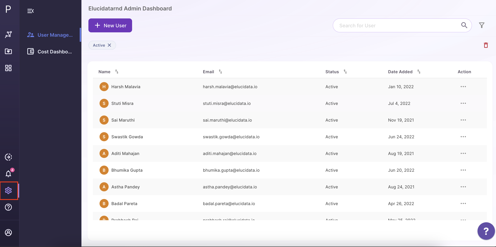
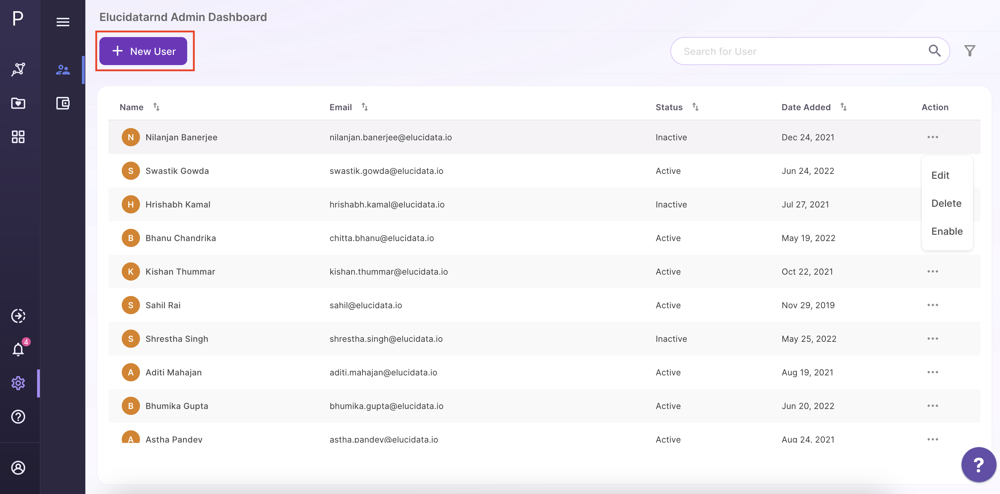
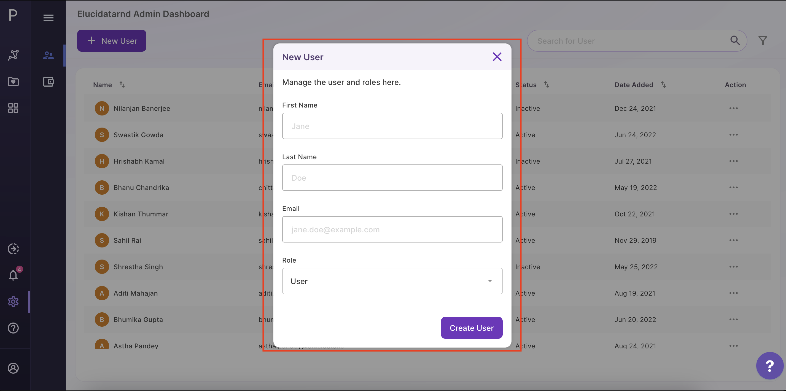
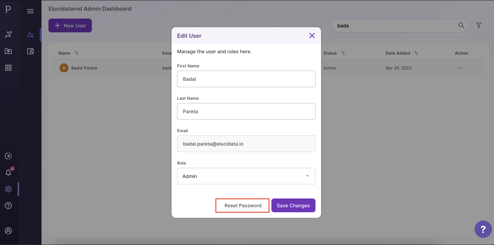
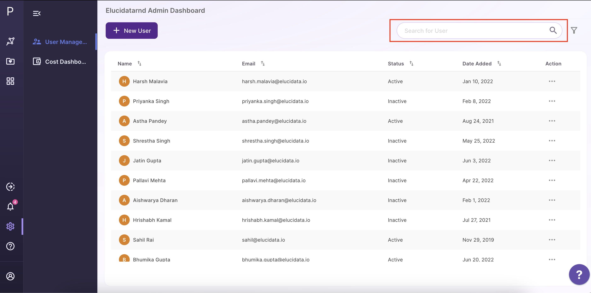
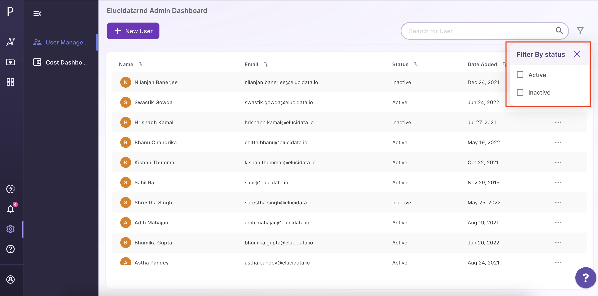
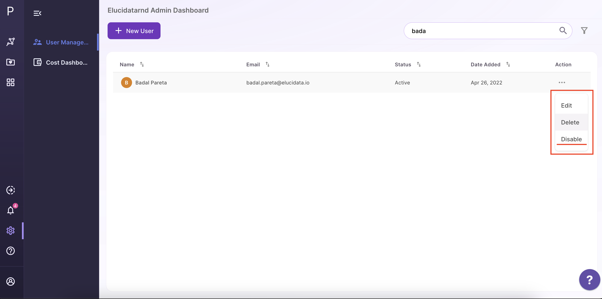
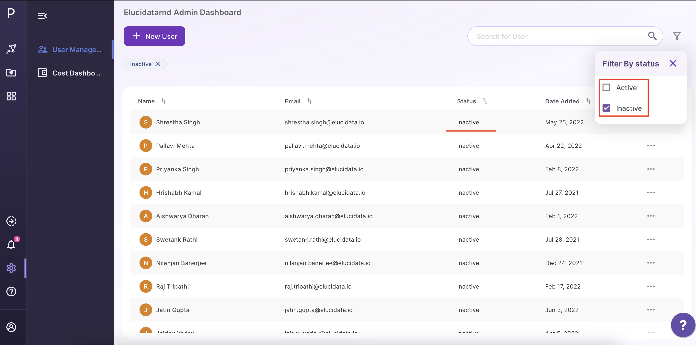
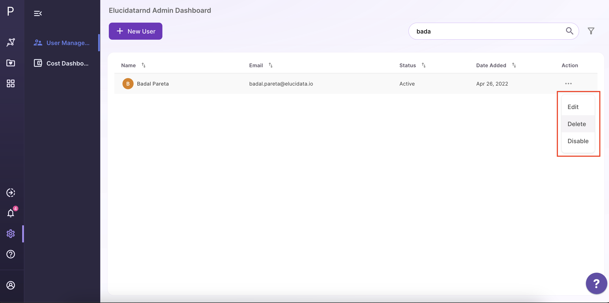
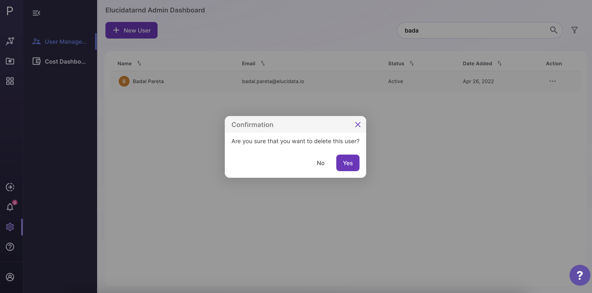

# Admin Dashboard

The Admin Dashboard allows you to create and manage accounts for your group. To access the admin dashboard click on the icon highlighted as shown below. 

 
**Figure 1.** Accessing the admin dashboard
 

**Note:**

*   The admin dashboard is only accessible to users who have been provided the *Admin* user role. If no one in your group is able to access the admin dashboard, reach out to our team at [polly@elucidata.io](mailto:polly@elucidata.io).

## Create New User

To create a new user click on the *Create New User* button highlighted as shown below.

 
**Figure 2.** Create new user

A modal window will open up in the middle. For each new account you will have to provide the first name, last name, email id and role; *User* or *Admin*. Assign *Admin* to those users who should have access to the admin dashboard and therefore the ability to create or manage users for your group.  

 
**Figure 3.** Details required for a new user
 

**Note:**

*   There is a limit to how many users can be added to a group as stipulated by your license agreement. Exceeding this will display an error. To extend the limit, reach out to our team at [polly@elucidata.io](mailto:polly@elucidata.io).

*   Only active user accounts are counted as part of this limit. Active and inactive user accounts are explained [here](#disable-user).

*   While the first name, last name and role can be modified in the future, the email id once assigned cannot be modified. In case there is an error with the email id, delete the user following the steps mentioned [here](#delete-user) and create a new user with the correct details.

## Reset Password

Whenever a new account is created, a temporary password is sent to the associated email address. This temporary password is valid for **30 days**. In case a user does not log in during that time, they will require a fresh password that can be generated using the reset password option.

Click on *Reset Password* in the modal window that opens up on the middle. A success message should be displayed beside the button.

 
**Figure 4.** Reset password for a user
 

## Search User

To search users use the search bar highlighted as shown below. Search works on both the name and email id stored.

 
**Figure 5.** Search user
 

## Filter User

To filter users click on the *Filter Users* icon. Currently, you can filter users by their account status; *Active* or *Inactive*. By default all accounts created are active. An account will only show up as inactive if disabled by an admin following the steps mentioned [here](#disable-user).

 
**Figure 6.** Filter user
 

## Disable User

Disabling a user will not allow the user to log in to their account or access their data. A disabled account is not deleted and can still be enabled later. To disable a user click on the meatball menu for the relevant user and then click on *Disable*.

 
**Figure 7.** Disable user
 

The admin dashboard will update to show the account status as *Inactive*.

 
**Figure 8.** Updated admin dashboard

To enable an account click on the meatball menu for the relevant user and then click on *Enable*.

 
**Figure 9.** Enable user
 

**Note:**

*   As mentioned above, a disbaled user account is not counted as part of the group account limit.

## Delete User

Apart from disabling an account, you also have the option to delete it. In case you want to delete an account click on the meatball menu for the relevant user and then click on *Delete*.

 
**Figure 10.** Edit user
 

This will open a pop up window for confirmation. Clicking on *Yes* will delete the account and the associated data.

 
**Figure 11.** Confirmation for deleting user
 

The admin dashboard will update and you will no longer see the account in the list.

**Note:**

*   You cannot recover a deleted account and the associated data by yourself. In a situation where an account needs to be recovered, reach out to our team at [polly@elucidata.io](mailto:polly@elucidata.io).
