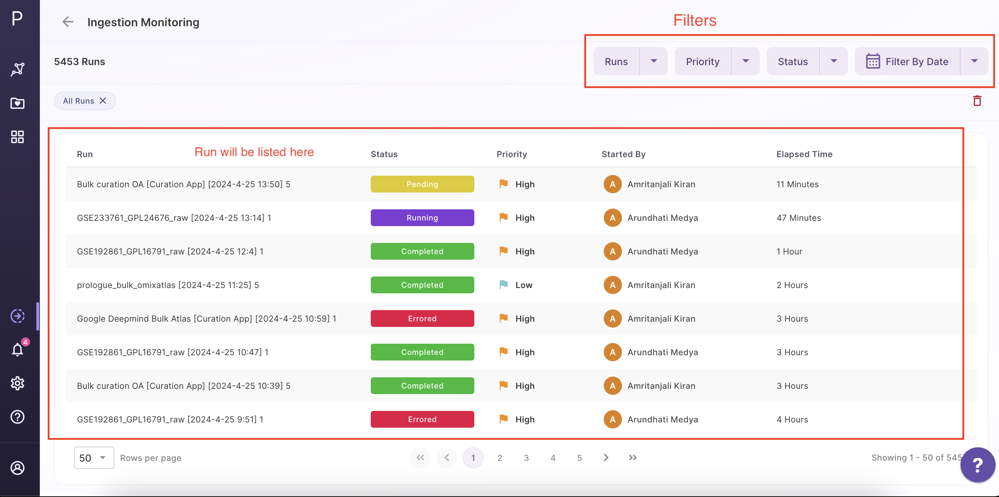
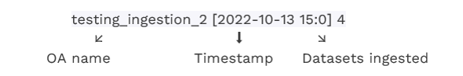
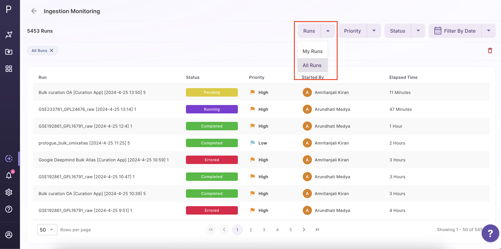
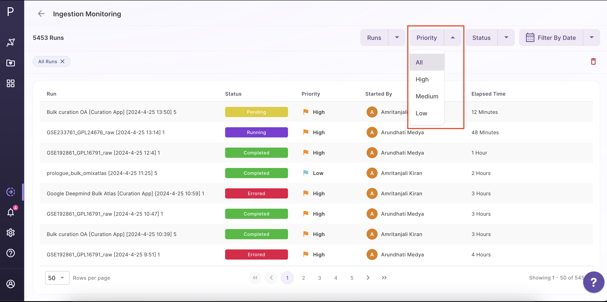
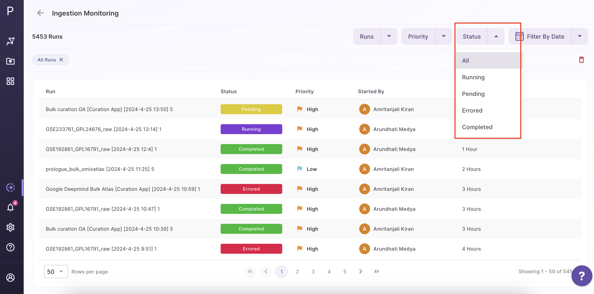
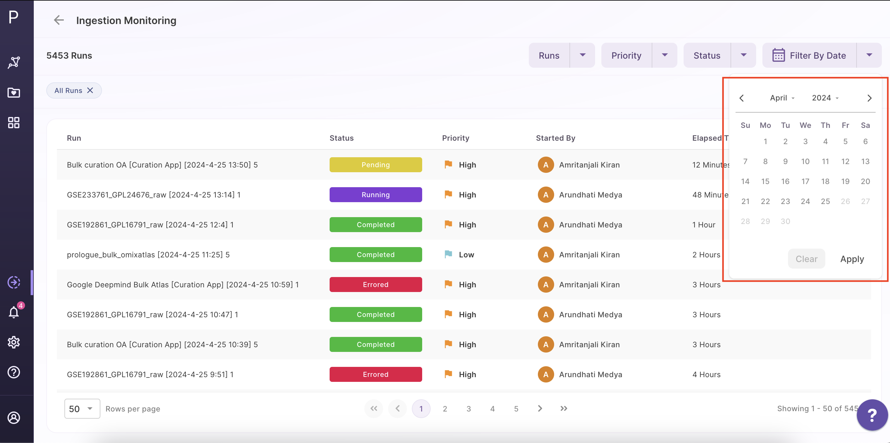
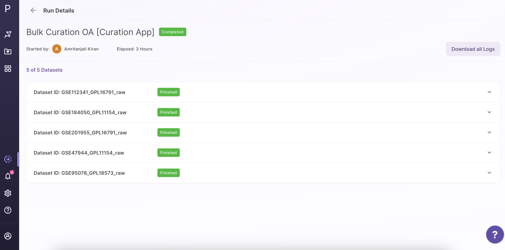
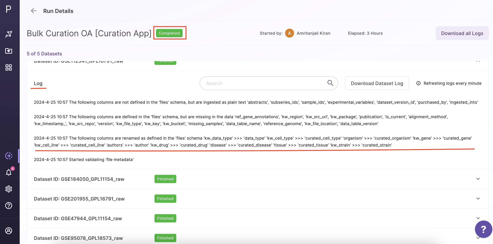

## What is a Monitoring Dashboard?

Polly's Monitoring Dashboard will allow users to track and monitor all ingestions and runs made to the Omix Atlases mapped to your Org. This tool allows you to keep track of all your ingestion runs, view logs in the event of a failure, and categorize your runs.

 
**Figure 1.** Dashboard
 

All of your ingestions, whether they are running, completed or errored, are displayed when you first access the dashboard.

### Ingestion runs:

Each run displayed on the dashboard will include information such as,

1. Run name - OA to which ingestion was performed, timestamp of when the run began, and number of datasets ingested, in the order respectively

For eg:

2. Status - whether run is pending, in progress, completed or errored.
3. Priority - The urgency with which an ingestion run is introduced depends on its priority.
4. User name - this essentially refers to the users who started the ingestion run.
5. Duration - Displays the amount of time that has passed since the run was initiated.
6. Actions - The action button will lead you to the details page

### Filters:

To select and categorize your runs, utilize these five filters available.

1. It has two options - My Runs/All Runs
<ul>
 <li>**My runs** - is a filter that allows all ingestion runs in the user's pipeline to be displayed.
 <li>**All runs** - view all ingestion runs performed by the organization's employees on the OAs to which the user has access
    - The level of access will determine the visibility of the OAs ingestions
</ul></li>

 
**Figure 2.** Runs Filter

2. The Priority of the Ingestion Runs are categorized as **All, High, Medium,** and **Low** in the second filter. The urgency with which an ingestion run will be consumed depends on its priority. It will be easier to prepare for potential delays if you are aware of the ingestion run's priority.

 
**Figure 3.** Priority Filter

3. The third filter will classify the results according to status:

- **All** - shows all the jobs that are in progress, pending, errored and completed.
- **Running** - indicates that one or more jobs have begun running and that the run is literally in progress. Some tasks may have also been completed.
- **Pending** - This status indicates that the run is still awaiting ingestion to begin (only been registered in-queue)
- **Errored** - This state denotes that at least one or more ingestion run jobs failed before they could complete; the dataset has otherwise been processed, and nothing is ongoing.
- **Completed** - This is the optimal status, which means that all tasks in the ingestion run were successfully completed.

 
**Figure 4.** Status Filter

5. The last filter is to use the calendar to list the runs according to when they were triggered.

 
**Figure .5** Date Filter

### View the Details page:

 
**Figure 6.** View Details

The top section shows the run name, the number of datasets being added to the OA, who started the run, and the amount of time that has passed ( since the run started )

### To check the logs:

Click on the log tab

 
**Figure 7.** Logs Tab

There are three items under the logs tab: a search option, a button to download all logs, and a part where logs are presented.

- **Search option** - Users can look for a certain dataset or sample using the search feature in the logs.
- **Download dataset log button** - This will be enabled only when the run is completed. The entire detailed logs will be accessible for download for improved accessibility and usability.once the run is finished so that users can inspect, explore, and determine the source of any errors.
- **Main section of logs** - The logs will be updated here once each minute. The user will have access to a thorough record that will allow them to track and keep tabs on the progress of their processes.
