#Project Management Dashboard

##What is the project management dashboard?

The project management dashboard allows upload, management, and collaboration of data, analysis, Polly notebooks and reports. This can be accessed by clicking on the *Manage Data* card.

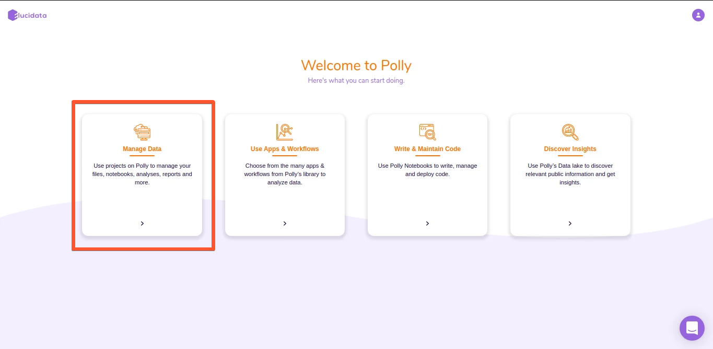 <!-- 
**Figure 1.** Demo Data for PollyTM FirstView
 -->

##Creating a project

You can create a new project on Polly as described here:

*   Click on *Create* on the right side

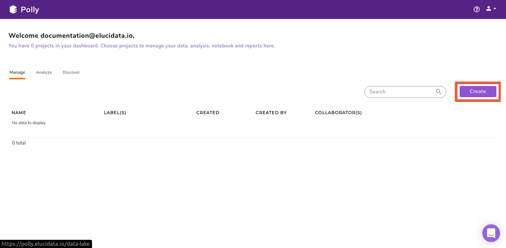 <!-- 
**Figure 1.** Demo Data for PollyTM FirstView
 -->

*   A create project interface opens up. Using this interface, you can name your project, add labels to help identify this project in the future as well as add a detailed description.

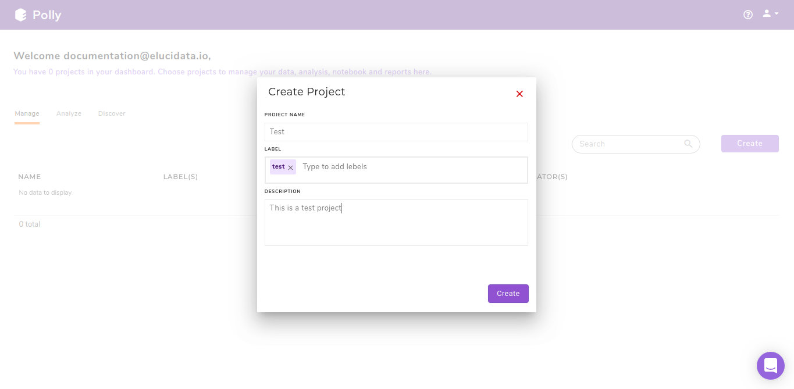 <!-- 
**Figure 1.** Demo Data for PollyTM FirstView
 -->

The project management dashboard will update to show the new project.

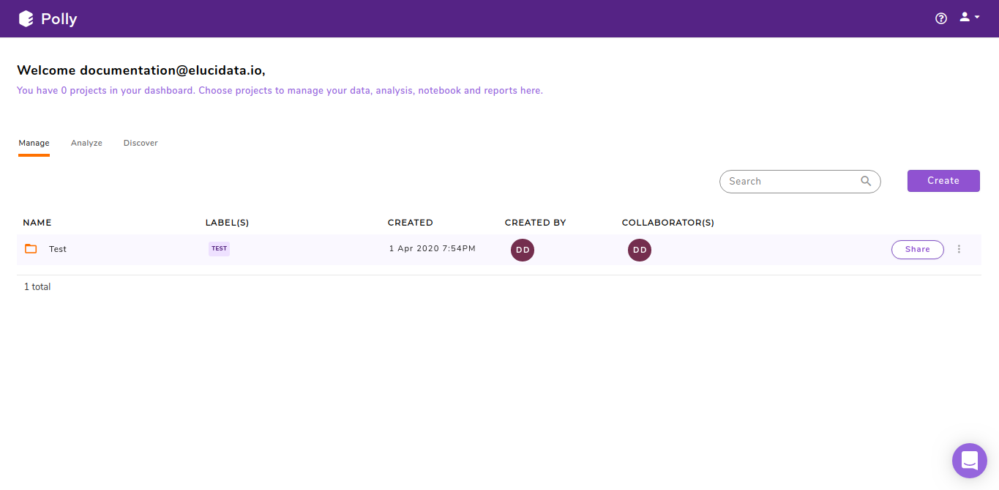 <!-- 
**Figure 1.** Demo Data for PollyTM FirstView
 -->

##Content within a project

A project contains all your [data](https://docs.elucidata.io/Getting%20Started/Project%20Management%20Dashboard.html#adding-files-to-your-workspace), [analysis](https://docs.elucidata.io/Apps/Introduction.html), [notebooks](https://docs.elucidata.io/Scaling%20compute/Polly%20Notebooks.html), and [reports](https://docs.elucidata.io/Apps/Introduction.html#reports). They can be accessed through the top panel.

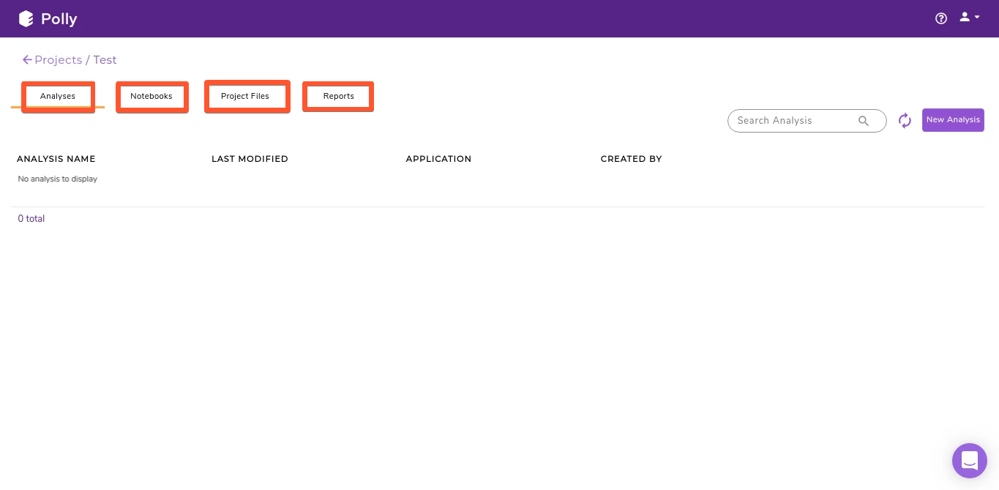 <!-- 
**Figure 1.** Demo Data for PollyTM FirstView
 -->

##Adding files to your workspace

*   Using GUI

New files can be added within a project by clicking on *Upload Files*. This will open up the upload interface which will allow you to upload files from your local storage as well as use our available integrations for different cloud storage platforms such as Dropbox, Google Drive and Box.

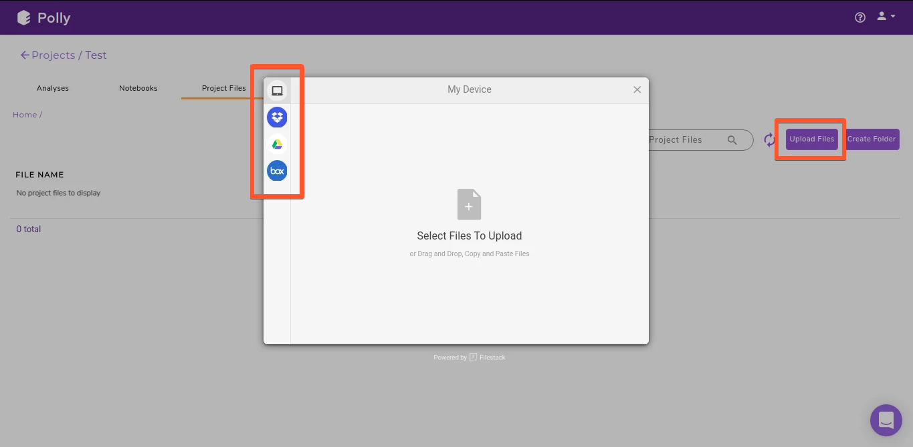 <!-- 
**Figure 1.** Demo Data for PollyTM FirstView
 -->

*   Using CLI

You can use PollyCLI as well to import your data directly within Polly. This is a more convenient option for uploading large data (more than a few GBs). The steps for the same are detailed [here](https://docs.elucidata.io/Scaling%20compute/Polly%20CLI.html).

##Creating a new folder

The project management dashboard allows you to store and manage your data in folders and sub-folders. To create a folder, click on *Create Folder*. Enter the name of the folder you want to create and click on *Create Folder*.

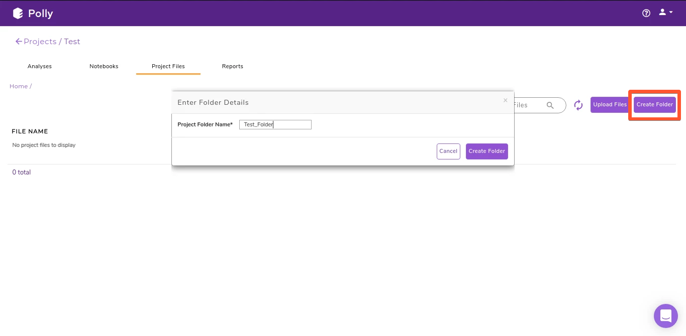 <!-- 
**Figure 1.** Demo Data for PollyTM FirstView
 -->

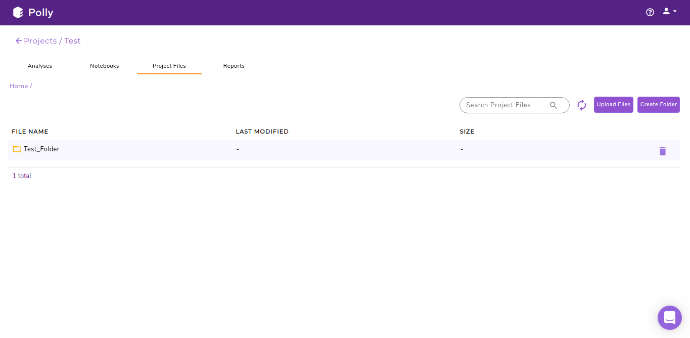 <!-- 
**Figure 1.** Demo Data for PollyTM FirstView
 -->

##Navigating through a folder

The highlighted section in the image below shows the path of the directory you are in. You can click on the name of any folder within the path to select the folder you want to browse to.

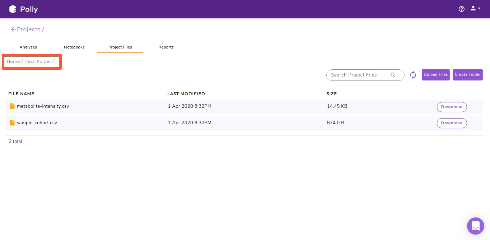 <!-- 
**Figure 1.** Demo Data for PollyTM FirstView
 -->

##Editing your project

The menu beside the project name shows the menu items to edit your project details.

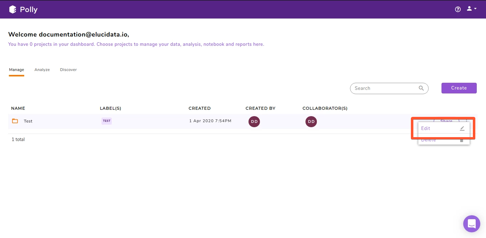 <!-- 
**Figure 1.** Demo Data for PollyTM FirstView
 -->

Select *Edit* to rename and/or change the description of the project and click on Update. 

##Sharing your project

The menu beside the project name has the option to share your project. Select *Share* to share your workspace.

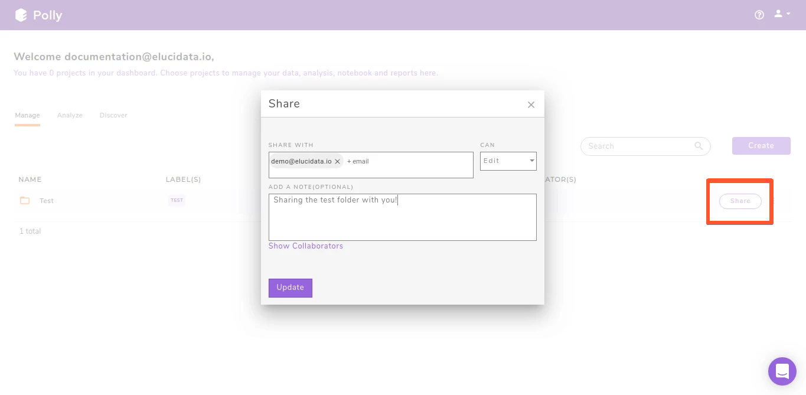 <!-- 
**Figure 1.** Demo Data for PollyTM FirstView
 -->

You can add the email of the Polly user account you want to share the project with under Share With input box. There are two types of project permission you can give to your users:

*   **Manage:** This permission allows the collaborator to add and delete files, analysis, code, and reports within the project. They can restore any analysis within the workspace.

*   **Edit:** This permission allows the user to only add new files, analysis, code and reports within the workspace. The cannot delete anything from within the shared workspace. They can also restore any analysis within the workspace.

On selecting the correct permission, click Update to add the user to the list of collaborators.

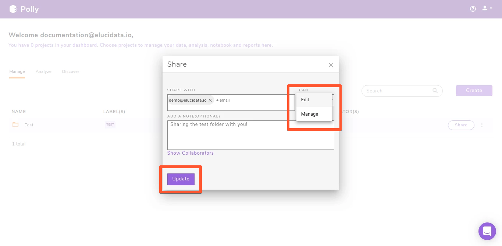 <!-- 
**Figure 1.** Demo Data for PollyTM FirstView
 -->

Each collaborator is represented with a user icon besides the project name. You can list all collaborators for a project by clicking on *Show Collaborators* in the *Share* interface.

##Changing share permission for a user

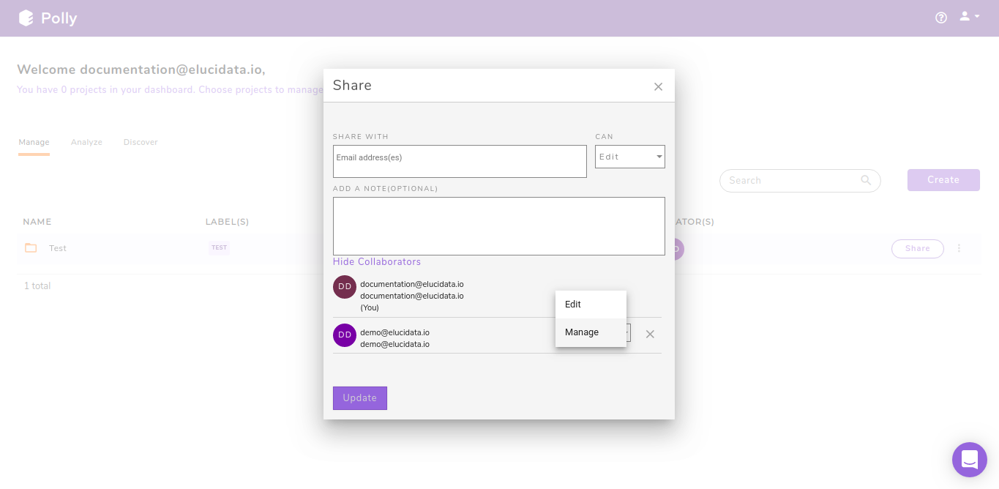 <!-- 
**Figure 1.** Demo Data for PollyTM FirstView
 -->

Clicking on *Show Collaborators* opens up a list of all collaborators on the project. To change permissions for any collaborator use the drop down beside their name. To revoke any collaborator’s access, click on the cross icon beside the drop down.

##Deleting items within a project

All the different sections within a project, *Analyses*, *Notebooks*, *Project Files* and *Reports* have a delete icon towards the right of each file as highlighted above.

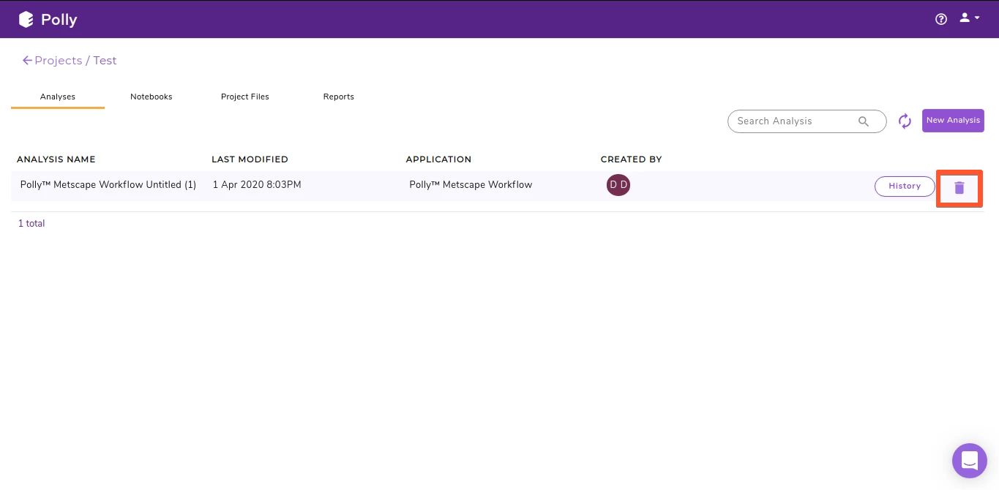 <!-- 
**Figure 1.** Demo Data for PollyTM FirstView
 -->

##Accessing and Restoring an analysis within a project

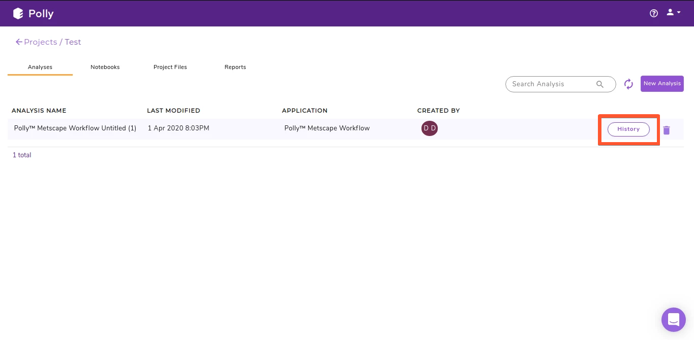 <!-- 
**Figure 1.** Demo Data for PollyTM FirstView
 -->

All the analyses performed within this project are available as a list in the *Analyses* section. Click on *History* to access the parameters and input files for the analysis. Clicking on *Restore Analysis* will restore the analysis.

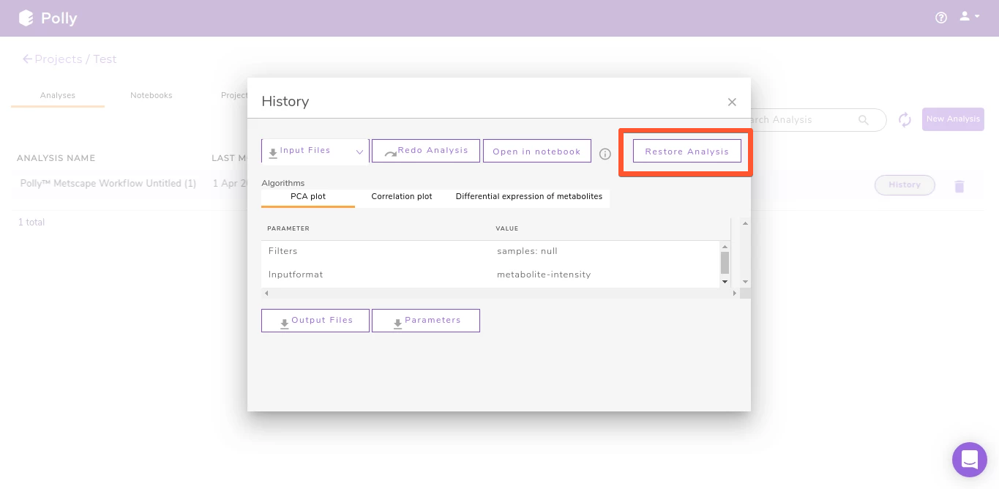 <!-- 
**Figure 1.** Demo Data for PollyTM FirstView
 -->

##Deleting a project

The menu beside the project name shows the menu items to delete your project.

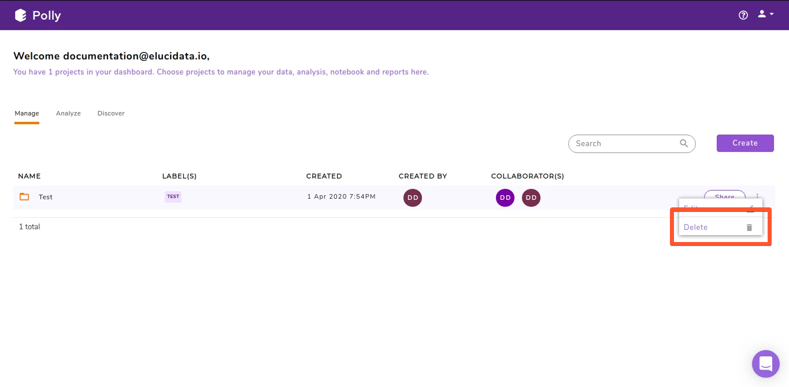 <!-- 
**Figure 1.** Demo Data for PollyTM FirstView
 -->

##Logging out of Polly

To logout of Polly, navigate to the user profile section on the top right and click on *Logout*.

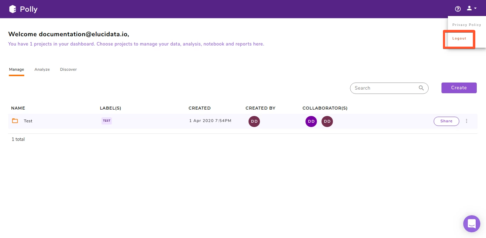 <!-- 
**Figure 1.** Demo Data for PollyTM FirstView
 -->