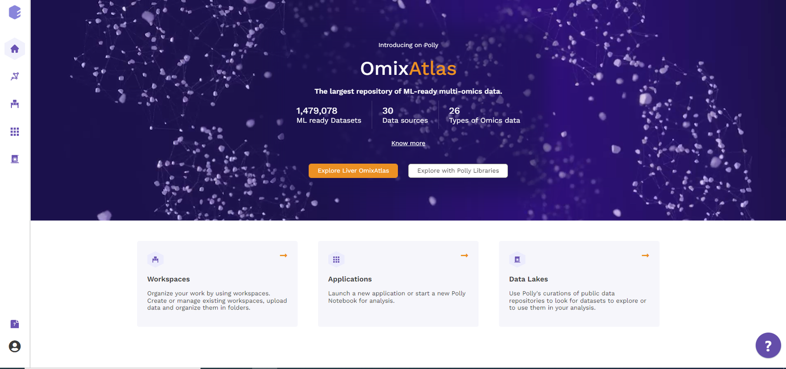
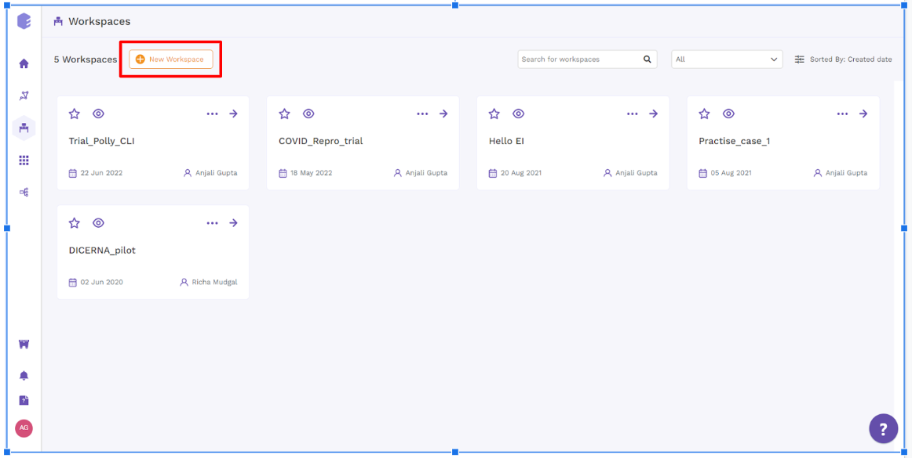
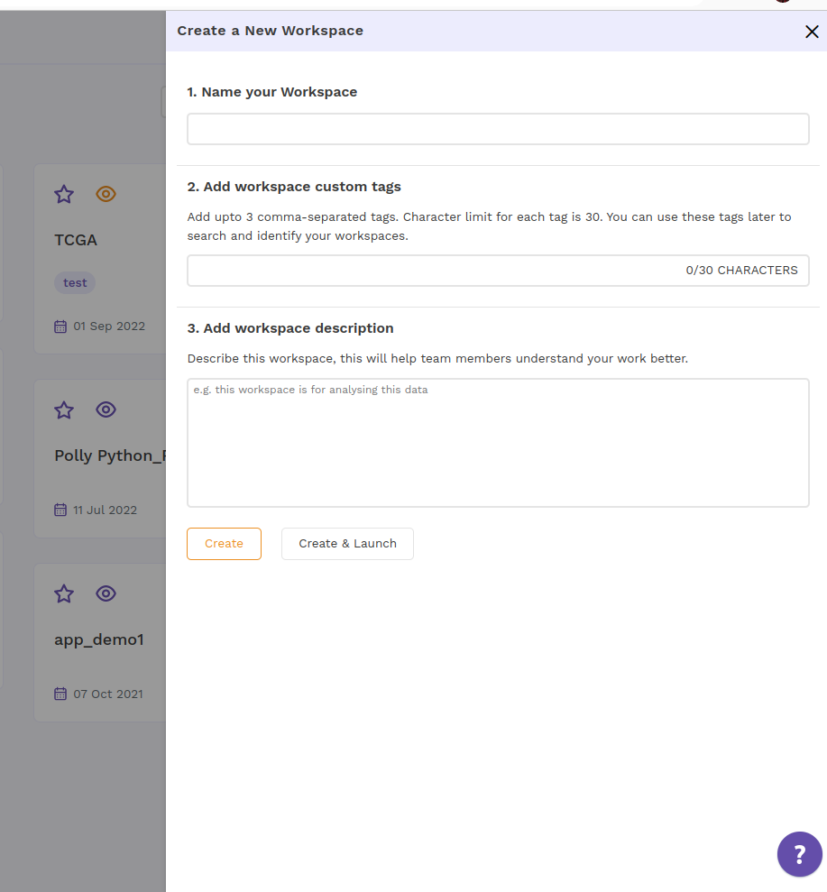
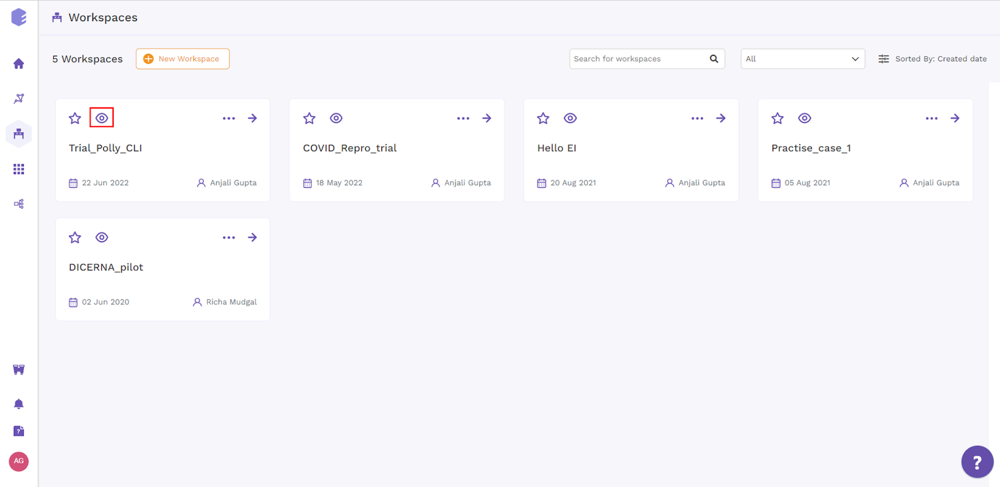
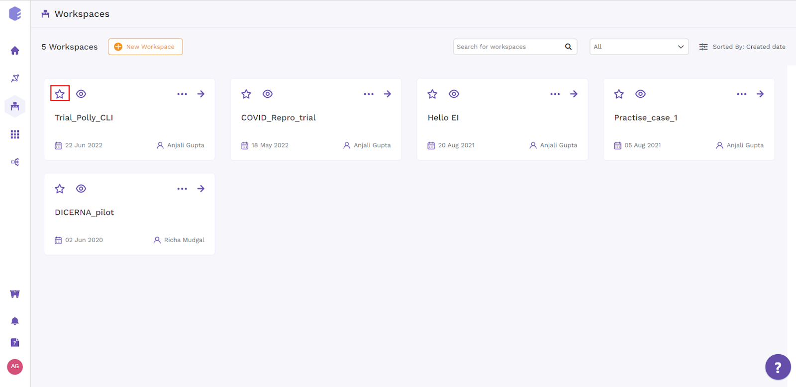
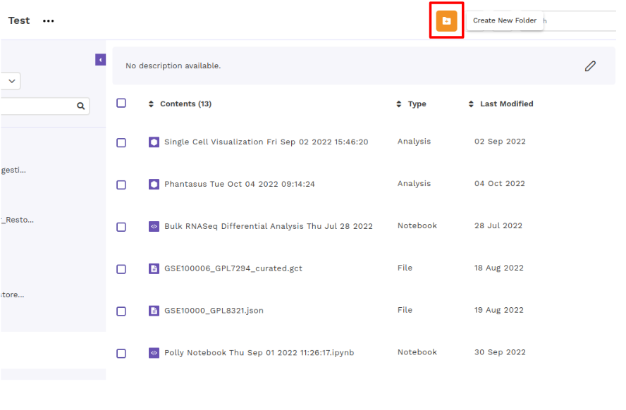
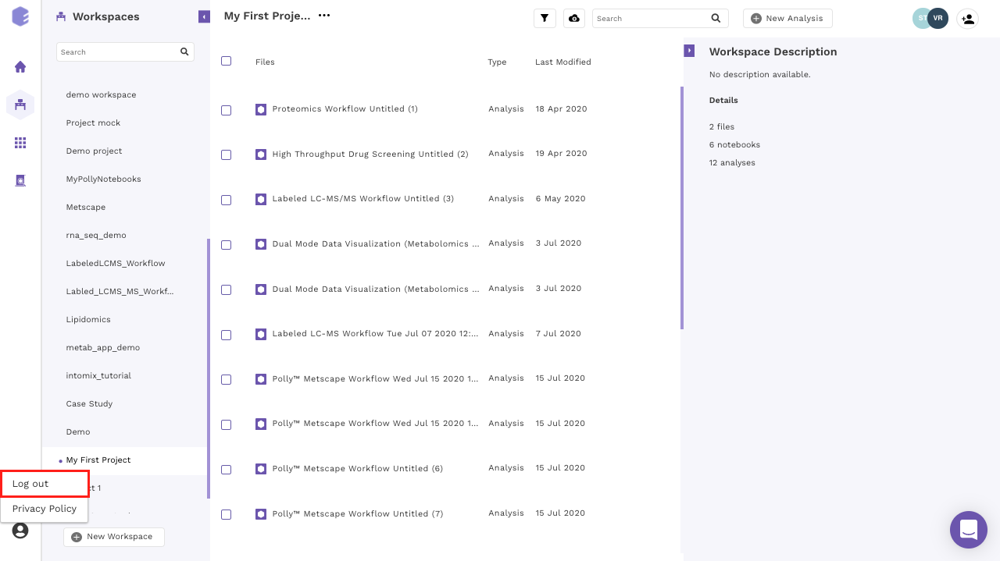
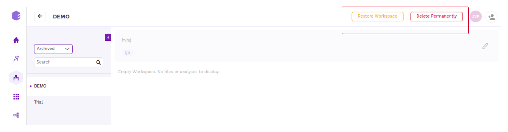
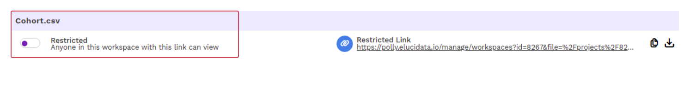

##What are workspaces?

Polly workspaces allow you to reduce clutter and organize your data in a folder system of choice. This can be accessed by clicking on the *Workspaces* card.

 
**Figure 1.** Polly Homepage

There are 3 panels on the workspace interface.

*    The left panel allows you to create a new workspace and access all your workspaces.

*    The middle panel shows you all the content within the selected workspace.

*    The panel on the right shows you the details around the content within the workspace.

 
**Figure 2.** Workspace Panels

##Creating a workspace

You can create a new workspace on Polly by clicking on *New Workspace* on the left panel.

 
**Figure 3.** Creating New Workspace

Enter the *Name of the workspace* and *description* (if any) and click on *save*. The new workspace will be created. You can find the newly created workspace with the list of all your workspaces on the left panel.

 
**Figure 4.** Workspace Description

The information about the contents of the workspace can be seen on the right panel.

 
**Figure 5.** Workspace Information

While the description of workspace and other information can be accessed through the *Info* option

 
**Figure 6.** Workspace Info option

##Content within a workspace

A workspace contains all your data, [analyses](https://docs.elucidata.io/Apps/Introduction.html),[notebooks](https://docs.elucidata.io/Scaling%20compute/Polly%20Notebooks.html), and [reports](https://docs.elucidata.io/Apps/Introduction.html#reports). They can be accessed through the middle panel.

 
**Figure 7.** Workspace Contents

##Adding files and notebooks to your workspace

*    Using GUI

To add files to your workspaces, click on the *cloud upload icon* present above the middle panel. You can choose the *Upload Files* or *Upload a Notebook* option from within the menu in order to upload the data files and notebooks respectively.

**Note:**

*    If your file size is greater than **100 MB**, use the Polly CLI option to upload to the workspace.

 
**Figure 8.** File Addition

*    Using CLI

You can use PollyCLI as well to import your data directly within Polly. This is a more convenient option for uploading large data (more than **100 MB** in size). The steps for the same are detailed [here]( https://docs.elucidata.io/Scaling%20compute/Polly%20CLI.html).

##Filtering the content

In order to reduce the clutter, workspaces allow you to filter the content you want to display within the middle panel. Click on *Filter icon* above the middle panel where you can select/deselect the file type you would want to show in the workspace. Once the selection is done click on *Apply* to confirm your selections.

 
**Figure 9.** Content Filtering

##Creating a New folder

Polly workspace allows you to organize and manage your data in folders and subfolders. To create a folder, click on the *cloud upload icon* and select *Create a New Folder* from the dropdown menu.

 
**Figure 10.**  Create Folder

Enter the name of the folder you want to create and click on *Create Folder*.

 
**Figure 11.** Add Folder Name

You can click on the same icon again to upload files within the created folder.

**Note:** 

*    Only the data files can be organized within a folder while the uploaded notebooks and analyses are present separately within the selected workspace.

##Navigating through a folder

Double click on the folder name to look at its contents.

 
**Figure 12.** Folder Navigation

The purple section in the middle panel shows the path of the directory you are in. You can click on the name of any folder within the path to select the folder you want to browse to.

 
**Figure 13.** Folder Navigation Path

##Editing your workspace

The menu beside the workspace name shows the menu items to edit your workspace details.

 
**Figure 14.** Workspace Edition

Select *Edit Details* within the menu. Rename the workspace and/or change the description of the workspace and click on *Update*. Click *Cancel* to close the tab without saving any changes.

 
**Figure 15.** Workspace Edit Update

##Sharing your workspace

The menu beside the workspace name shows the menu items to share your workspace. Select *Share* within the menu to share your workspace.

 
**Figure 16.** Workspace Sharing

The same action can be achieved by clicking on *Add Collaborator icon* placed at the top right corner.

 
**Figure 17.** Workspace Sharing

You can add the email of the Polly user you want to share the workspace with under *Add Collaborator*.

There are 2 types of workspace permission you can give to your users.

*    **Admin**: This permission allows the user to rename, add and delete files, analysis, code, and reports within the workspace. They can share the workspace and restore any analysis within it.

*    **Writer**: This permission allows the user to only add new files, analysis, code, and reports within the workspace. **They cannot delete anything from within the shared workspace**. They can also restore any analysis within the workspace but does not have the permission to share the workspace with others.

On selecting the desired permission, click *Add* to add the user to the list of collaborators. Once all the users are added, click on *Done*. You can check all collaborators for a workspace on the top panel at the right. Each collaborator is represented with a user icon.

 
**Figure 18.** Add Collaborators

##Changing share permission for a user

You can change the access permission for a user at any point in time. Click on the user icons at the top right. A window with the list of collaborators will appear. From the dropdown, select the permission you would want to give to the user and click the tick next to it. Click on *Done* once completed.

 
**Figure 19.** Changing share permission

##Removing a collaborator

You can choose to remove a collaborator as well. Click on the cross icon present across the name of the user. Click on *Yes* to permanently remove the user or *No* to disregard the changes.

 
**Figure 20.** Removing a collaborator

##Deleting a workspace

Open the menu beside the workspace name. Select *Delete* within the menu to delete your workspace. Once a workspace is deleted, all its contents are deleted as well for all the collaborators.

 
**Figure 21.** Deleting a workspace

##Deleting items within a workspace

Deleting Multiple Files: Select the files that you want to delete through the checkbox. The selection menu will appear on the top right. Click on *Delete icon*.

 
**Figure 22.** Deleting Multiple Files

Confirm by clicking inside the checkbox and then click on *Delete* to delete your selected files.

 
**Figure 23.** Deletion Permission

Deleting a single file: If you need to delete a single file, an alternate option can also be used. Click on the kebab menu present at the right end and choose the *Delete* option.

 
**Figure 24.** Deleting a single file

##Renaming a file within workspace

Click across the file you want to rename on the kebab menu. Select the *Rename* option.

 
**Figure 25.** Renaming Workspace

Provide the new name to the file and click on *Rename* to confirm your changes.

 
**Figure 26.** Confirm Renaming

##Accessing and Downloading a file within a workspace

*    Using GUI

To access and download files from your workspaces, Click on the file to look at the file details on the right panel. You can look at the versions of the file along with general details like the file size and modifications date.

**Note:**  

*    If your file size is greater than **100 MB**, use the Polly CLI option to access and download it.

You can download the file by choosing the *Download* option provided at the bottom of the panel.

 
**Figure 27.** Accessing and Downloading a file

*    Using CLI

You can use PollyCLI as well to import your data directly within Polly. This is a more convenient option for accessing large data (more than **100 MB** in size). The steps for the same are detailed [here]( https://docs.elucidata.io/Scaling%20compute/Polly%20CLI.html).

##Accessing and Restoring an analysis within a workspace

Click on the analysis to look at the file details on the right panel. You can look at your *saved states* as versions of your analysis along with input details. 

 
**Figure 28.** Accessing and Restoring the saved states

Choose the version through the checkbox and click on the *Restore icon* to restore the saved state.

 
**Figure 29.** Accessing and Restoring the analysis

You can also choose to look at the state history by clicking on the *History icon*. It gives a detailed description of the parameters and the input files used to save the selected state. Restore after reassuration. 

 
**Figure 30.** Accessing and Restoring the analysis

For some applications, you can select the algorithm to look at the parameters used for the selected analysis. Click on the *History icon* and then *Retore* the selected algorithm.

 
**Figure 31.** History icon

 
**Figure 32.** Restoring algorithm

##Accessing and Restoring a Pollyglot notebook within a workspace

Select the Polly Notebook you want to launch. You can look at the notebook details on the right panel. If you are running the notebook for the first time, the option *Edit and Launch* would appear as a default selection to launch the selected notebook. You are required to select an environment and a machine to run the given notebook, once these selections are done you can launch the notebook.

 
**Figure 33.** Accessing and Restoring a Notebook

Select the desired *Docker Environment* from the drop-down menu.

 
**Figure 34.** Docker Environment Selection

as well as the *Machine Type* required to run the job. Once the selections are done, click on *Launch*.

 
**Figure 35.** Machine Type Selection

For an older notebook: You have two options, you can either launch the notebook directly by the *Launch* button or you can choose to edit it first before launching through the *Edit and Launch* button.

**Note:** 

*    Under the edit option, you can only change the machine type. The docker environment would remain the same as the one selected when you run the notebook for the first time.

 
**Figure 36.** Launch for old notebooks

##Starting a New Analysis

Click on the *New Analysis* option provided at the top of the right panel. You will be redirected to the Application interface where you can select an application to launch.

 
**Figure 37.** Starting a New Analysis

##Accessing Documentation

Click on the “?” icon present at the bottom left corner to access documentation.

 
**Figure 38.** Accessing Documentation

##Logging out of Polly

Click on the user icon at the bottom left corner. Select the *Log Out* option for logging out of Polly.

 
**Figure 39.** Logging out of Polly

