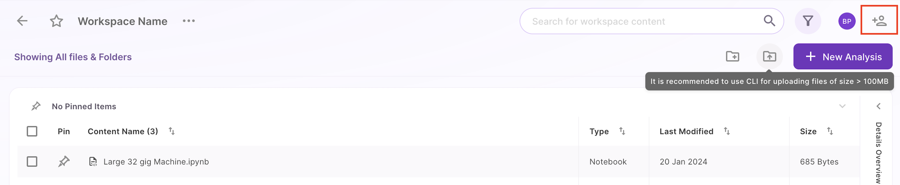
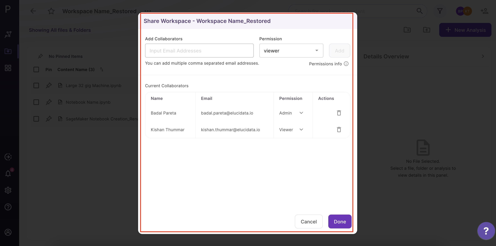
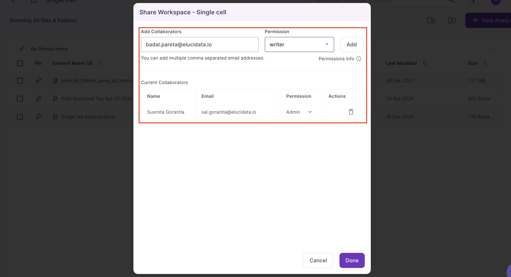
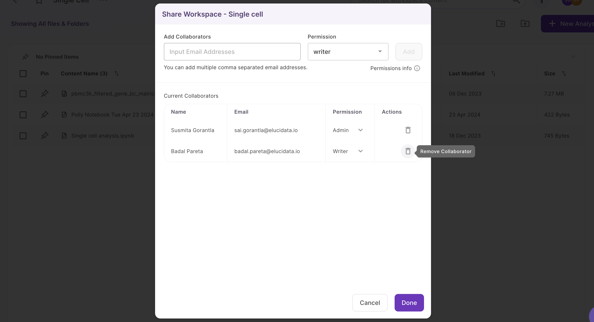
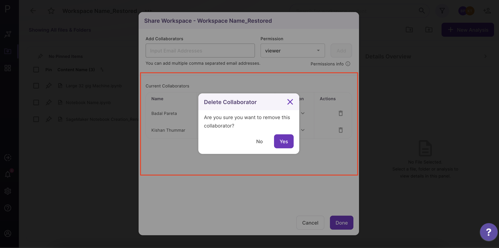

##Sharing your workspace

The menu beside the workspace name shows the menu items to share your workspace. Select *Share* within the menu to share your workspace.

 
**Figure 16.** Workspace Sharing

The same action can be achieved by clicking on *Add Collaborator icon* placed at the top right corner.

 
**Figure 17.** Workspace Sharing

You can add the email of the Polly user you want to share the workspace with under *Add Collaborator*.

There are 2 types of workspace permission you can give to your users.

*    **Admin**: This permission allows the user to rename, add and delete files, analysis, code, and reports within the workspace. They can share the workspace and restore any analysis within it.

*    **Writer**: This permission allows the user to only add new files, analysis, code, and reports within the workspace. **They cannot delete anything from within the shared workspace**. They can also restore any analysis within the workspace but does not have the permission to share the workspace with others.

*  **Viewer**: This permission allows the user to only view the files, analysis, code, and reports within the workspace.

On selecting the desired permission, click *Add* to add the user to the list of collaborators. Once all the users are added, click on *Done*. You can check all collaborators for a workspace on the top panel at the right. Each collaborator is represented with a user icon.

 
**Figure 18.** Add Collaborators

##Changing share permission for a user

You can change the access permission for a user at any point in time. Click on the user icons at the top right. A window with the list of collaborators will appear. From the dropdown, select the permission you would want to give to the user and click the tick next to it. Click on *Done* once completed.

##Removing a collaborator

You can choose to remove a collaborator as well. Click on the cross icon present across the name of the user. Click on *Done* to permanently remove the user or *No* to disregard the changes.

 
**Figure 20.** Removing a collaborator

##Deleting a workspace

Open the menu beside the workspace name. Select *Delete* within the menu to delete your workspace. Once a workspace is deleted, all its contents are deleted as well for all the collaborators.

 
**Figure 21.** Deleting a workspace

