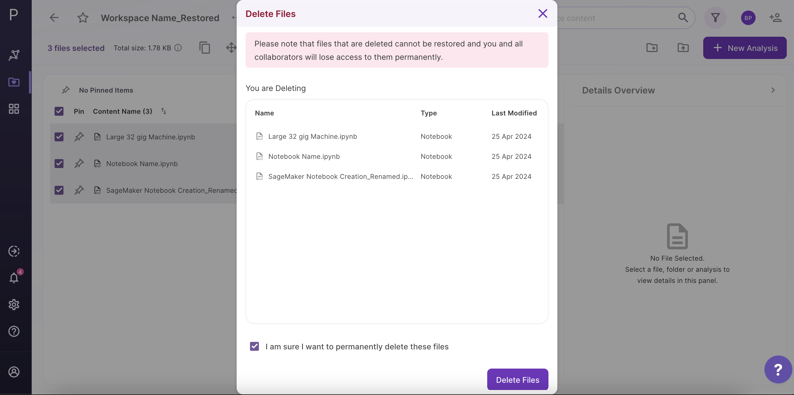
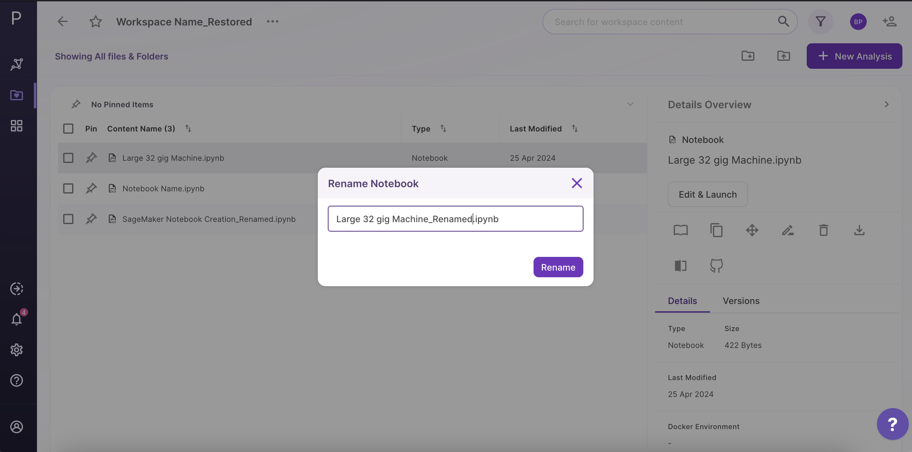

#Adding files and notebooks to your workspace

###Using GUI

To add files to your workspaces, click on the *upload icon* present at the left panel. 

**Note:**

*    If your file size is greater than **100 MB**, use the Polly CLI option to upload to the workspace.

 
**Figure 8.** File Addition

###Using CLI

You can use PollyCLI as well to import your data directly within Polly. This is a more convenient option for uploading large data (more than **100 MB** in size). The steps for the same are detailed [here]( https://docs.elucidata.io/Scaling%20compute/Polly%20CLI.html).

##Deleting items within a workspace

Deleting Multiple Files: Select the files that you want to delete through the checkbox. Click on *Delete icon* present on the top of the panel.

 
**Figure 22.** Deleting Multiple Files

Confirm by clicking inside the checkbox and then click on *Delete* to delete your selected files.

 
**Figure 23.** Deletion Permission

Deleting a single file: If you need to delete a single file, an alternate option can also be used. Click on the *Delete* option present on the right panel.

 
**Figure 24.** Deleting a single file

##Renaming a file within workspace

Select the *Rename* icon present on the right panel.

 
**Figure 25.** Renaming Workspace

Provide the new name to the file and click on *Rename* to confirm your changes.

 
**Figure 26.** Confirm Renaming

##Accessing and Downloading a file within a workspace

*    Using GUI

To access and download files from your workspaces, Click on the file to look at the file details on the right panel. You can look at the versions of the file along with general details like the file size and modifications date.

**Note:**  

*    If your file size is greater than **100 MB**, use the Polly CLI option to access and download it.

You can download the file by choosing the *Download* option provided at the right of the panel.

 
**Figure 27.** Accessing and Downloading a file

*    Using CLI

You can use PollyCLI as well to import your data directly within Polly. This is a more convenient option for accessing large data (more than **100 MB** in size). The steps for the same are detailed [here]( https://docs.elucidata.io/Scaling%20compute/Polly%20CLI.html).

##Accessing and Restoring an analysis within a workspace

Click on the analysis to look at the file details on the right panel. You can look at your *saved states* as versions of your analysis along with input details. 

 
**Figure 28.** Accessing and Restoring the saved states

Choose the version through the checkbox and click on the *Restore icon* to restore the saved state.

##Accessing and Restoring a Pollyglot notebook within a workspace

Select the Polly Notebook you want to launch. You can look at the notebook details on the right panel. If you are running the notebook for the first time, the option *Edit and Launch* would appear as a default selection to launch the selected notebook. You are required to select an environment and a machine to run the given notebook, once these selections are done you can launch the notebook.

 
**Figure 29.** Accessing and Restoring a Notebook

Select the desired *Docker Environment* from the drop-down menu.

 
**Figure 30.** Docker Environment Selection

as well as the *Machine Type* required to run the job. Once the selections are done, click on *Launch*.

 
**Figure 31.** Machine Type Selection

For an older notebook: You have two options, you can either launch the notebook directly by the *Launch* button or you can choose to edit it first before launching through the *Edit and Launch* button.

**Note:** 

*    Under the edit option, you can only change the machine type. The docker environment would remain the same as the one selected when you run the notebook for the first time.

 
**Figure 32.** Launch for old notebooks

##Starting a New Analysis

Click on the *New Analysis* option provided at the top of the right panel. You will be redirected to the Application interface where you can select an application to launch.

 
**Figure 33.** Starting a New Analysis

