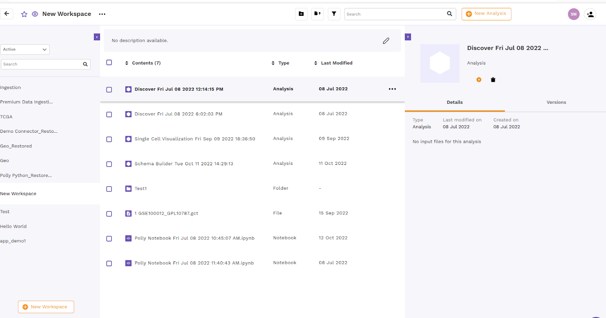
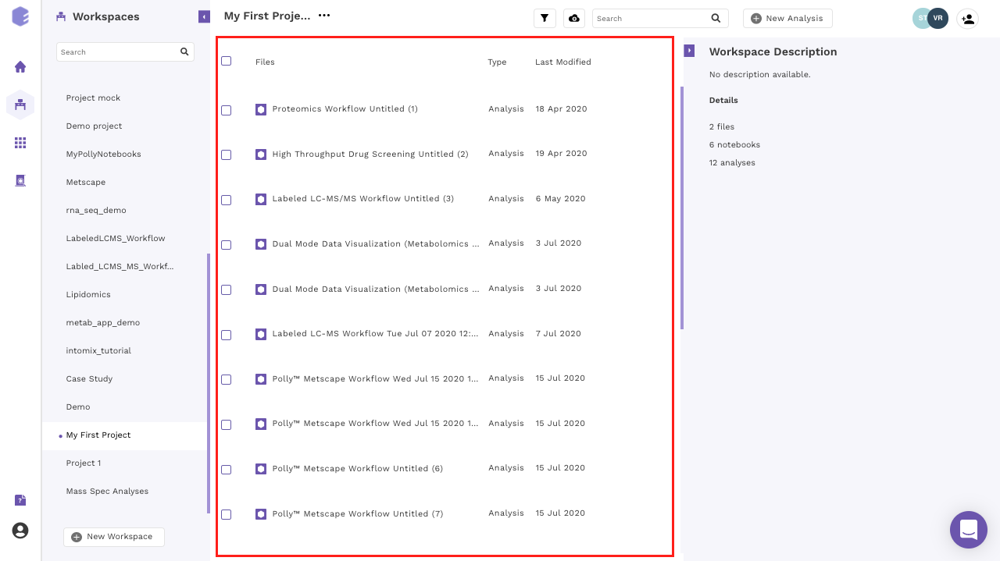

##What are workspaces?

Polly workspaces allow you to reduce clutter and organize your data in a folder system of choice. This can be accessed by clicking on the *Workspaces* card.

 
**Figure 1.** Polly Homepage

There are 3 panels on the workspace interface.

*    The left panel allows you to create a new workspace and access all your workspaces.

*    The middle panel shows you all the content within the selected workspace.

*    The panel on the right shows you the details around the content within the workspace.

 
**Figure 2.** Workspace Panels

##Creating a workspace

You can create a new workspace on Polly by clicking on *New Workspace* on the left panel.

 
**Figure 3.** Creating New Workspace

Enter the *Name of the workspace* and *description* (if any) and click on *save*. The new workspace will be created. You can find the newly created workspace with the list of all your workspaces on the left panel.

 
**Figure 4.** Workspace Description

The information about the contents of the workspace can be seen on the right panel.

 
**Figure 5.** Workspace Information

While the description of workspace and other information can be accessed through the *Info* option

 
**Figure 6.** Workspace Info option

##Content within a workspace

A workspace contains all your data, [analyses](https://docs.elucidata.io/Apps/Introduction.html),[notebooks](https://docs.elucidata.io/Scaling%20compute/Polly%20Notebooks.html), and [reports](https://docs.elucidata.io/Apps/Introduction.html#reports). They can be accessed through the middle panel.

 
**Figure 7.** Workspace Contents

##Filtering the content

In order to reduce the clutter, workspaces allow you to filter the content you want to display within the middle panel. Click on *Filter icon* above the middle panel where you can select/deselect the file type you would want to show in the workspace. Once the selection is done click on *Apply* to confirm your selections.

 
**Figure 9.** Content Filtering

##Creating a New folder

Polly workspace allows you to organize and manage your data in folders and subfolders. To create a folder, click on the *cloud upload icon* and select *Create a New Folder* from the dropdown menu.

 
**Figure 10.**  Create Folder

Enter the name of the folder you want to create and click on *Create Folder*.

 
**Figure 11.** Add Folder Name

You can click on the same icon again to upload files within the created folder.

**Note:** 

*    Only the data files can be organized within a folder while the uploaded notebooks and analyses are present separately within the selected workspace.

##Navigating through a folder

Double click on the folder name to look at its contents.

 
**Figure 12.** Folder Navigation

The purple section in the middle panel shows the path of the directory you are in. You can click on the name of any folder within the path to select the folder you want to browse to.

 
**Figure 13.** Folder Navigation Path

##Editing your workspace

The menu beside the workspace name shows the menu items to edit your workspace details.

 
**Figure 14.** Workspace Edition

Select *Edit Details* within the menu. Rename the workspace and/or change the description of the workspace and click on *Update*. Click *Cancel* to close the tab without saving any changes.

 
**Figure 15.** Workspace Edit Update

##Logging out of Polly

Click on the user icon at the bottom left corner. Select the *Log Out* option for logging out of Polly.

 
**Figure 39.** Logging out of Polly

