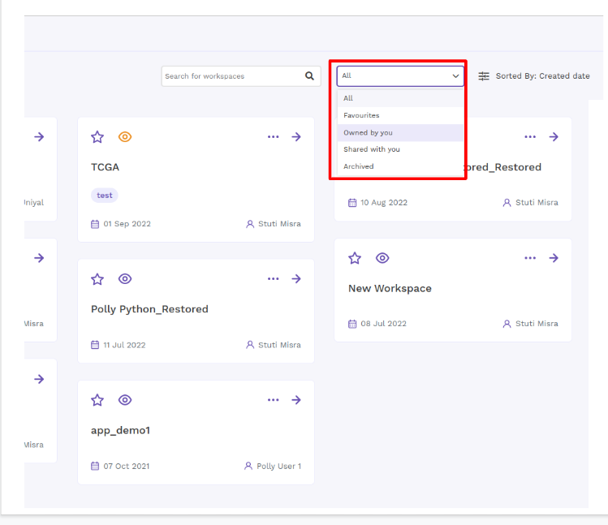
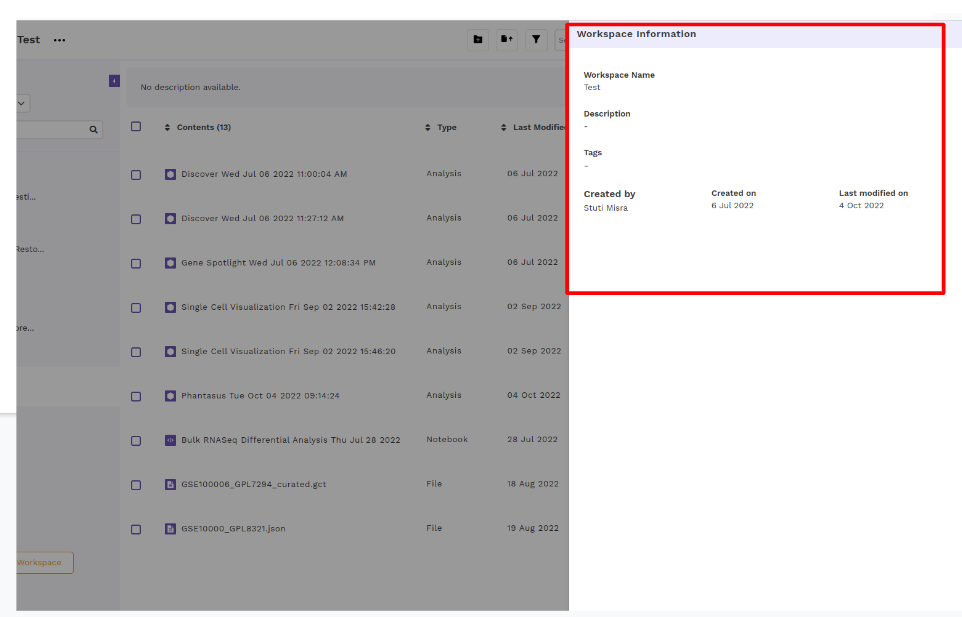
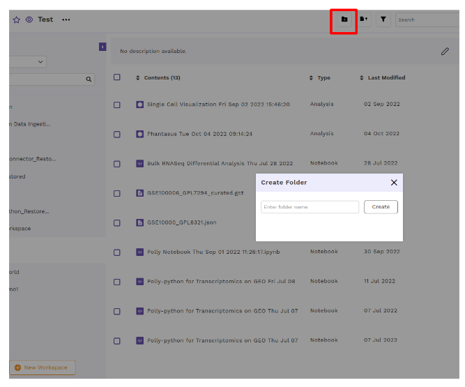
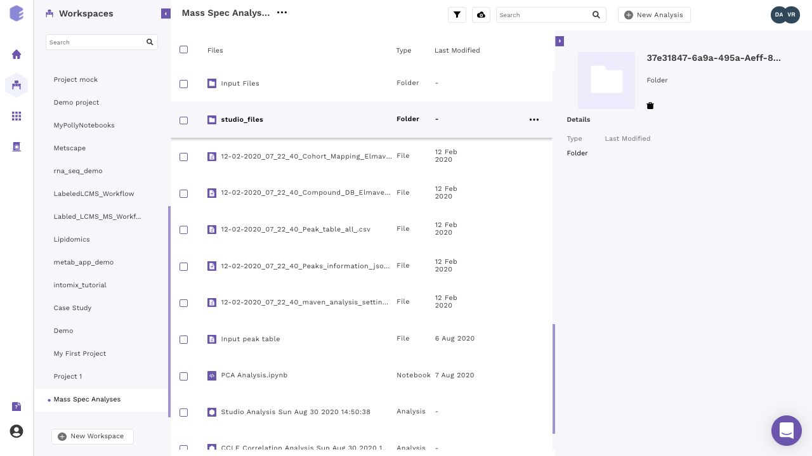
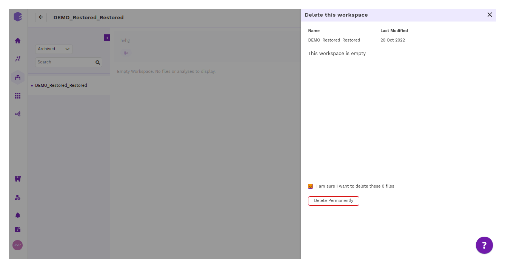

## What are workspaces?

Polly workspaces allow you to reduce clutter and organize your data in a folder system of choice. This can be accessed by clicking on the *Workspaces* card.

 
**Figure 1.** Polly Homepage

To access workspaces, 

1. Click on the workspace card:
Click on the side bar to view workspaces: Workspace card view:

 
**Figure 2.** Workspace Cardview

2. There are 3 panels on the workspace interface.

    *    The left panel allows you to create a new workspace and access all your workspaces.

    *    The middle panel shows you all the content within the selected workspace.

    *    The panel on the right shows you the details around the content within the workspace.

 
**Figure 3.** Workspace Panel View

## Creating a workspace

You can create a new workspace on Polly by clicking on *New Workspace* on the left panel of workspace interface or on the workspace card view page

 
**Figure 4.** Creating a New Workspace

Enter the Name of the workspace, custom tags and description (if any) and click on save. Users can add tags while creating a new workspace. These tags can be used later to search and identify workspaces.

The new workspace will be created. You can find the newly created workspace with the list of all your workspaces on the left panel.

 
**Figure 5.** Add Name, Tags, Description of a Workspace

## Watching a Workspace

Users can watch a particular workspace by clicking on the ‘eye’ icon. This feature allows the user to monitor changes made in the workspace.

 
**Figure 6.** Watching a workspace

## Mark a Workspace as Favorite

Users can mark a particular workspace as their favorite by clicking on the ‘star’ icon. This feature makes it easier for the user to filter frequently used workspaces.

 
**Figure 7.** Mark a workspace as favorite

## Filtering Workspaces

Users can filter workspace cards of choice using options like:

 
**Figure 8.** Filter Workspace cards

The information about the contents of the workspace can be seen on the right panel.

 
**Figure 9.** Workspace Right Panel.

## Workspace information

The description of workspace and other information can be accessed through the Info option by clicking on the workspace menu.

 

 
**Figure 10.** Workspace Information

## Content within a workspace

A workspace contains all your data, [analyses](https://docs.elucidata.io/Apps/Introduction.html),[notebooks](https://docs.elucidata.io/Scaling%20compute/Polly%20Notebooks.html), and [reports](https://docs.elucidata.io/Apps/Introduction.html#reports). They can be accessed through the middle panel.

 
**Figure 11.** Workspace Contents

## Filtering the content

In order to reduce the clutter, workspaces allow you to filter the content you want to display within the middle panel. Click on *Filter icon* above the middle panel where you can select/deselect the file type you would want to show in the workspace. Once the selection is done click on *Apply* to confirm your selections.

 
**Figure 12.** Content Filtering

## Creating a New folder

Polly workspace allows you to organize and manage your data in folders and subfolders. To create a folder, click on the *cloud upload icon* and select *Create a New Folder* from the dropdown menu.

 
**Figure 13.**  Create Folder

Enter the name of the folder you want to create and click on *Create Folder*.

 
**Figure 14.** Add Folder Name

You can click on the same icon again to upload files within the created folder.

**Note:** 

*    Data files and notebooks can be organized within a folder while analyses are stored outside a folder in the selected workspace. In case of notebook uploads, the notebook are always uploaded in the root directory of the workspace (outside a folder). However, once uploaded, it can be moved to a folder if required.

## Navigating through a folder

Double click on the folder name to look at its contents.

 
**Figure 15.** Folder Navigation

The purple section in the middle panel shows the path of the directory you are in. You can click on the name of any folder within the path to select the folder you want to browse to.

 
**Figure 16.** Folder Navigation Path

## Editing your workspace

The menu beside the workspace name shows the menu items to edit your workspace details.

 
**Figure 17.** Workspace Edit option

Select *Edit Details* within the menu. Rename the workspace and/or change the description of the workspace and click on *Update*. Click *Cancel* to close the tab without saving any changes.

 
**Figure 18.** Workspace Edit Update

Users can edit name, add tags and description to a workspace.

## Logging out of Polly

Click on the user icon at the bottom left corner. Select the Log Out option for logging out of Polly.

 
**Figure 19.** Logging out of Polly

## Archival of Workspace

Having unused Workspaces result in unnecessary clutter, inefficiency in looking up things and excess storage costs. Users can hence “**Archive**”  Workspace/s from the list of Workspaces they’ve been working on or no longer need.

The “Archive” Option appears in the Kebab Menu beside Workspace Name

 
**Figure 20.** Archiving a Workspace

- The archived workspaces are not deleted permanently. They can either be restored or deleted permanently at any point in time.
- The archived workspaces do not appear on the ‘Search’ results page.
- It will consist of all files & folders from the Active Workspace.The users can view the list of ‘Active’ and ‘Archived’ Workspaces and can also switch between them.

## Switching Between Active And Archived Workspaces

The drop-down allows users to view, filter and switch between their Active and Archived Workspaces at any point in time.

## Restoring Archived Workspaces

  
**Figure 21.** Restoring archived Workspaces

- Users can restore their Workspaces using the ‘Restore Workspace’ option.
- All docs/files/folders associated with the Workspace will be restored to an Active State.
- It will also restore access to all existing collaborators.
- Once a Workspace is restored, it is renamed to “OriginalWorkspaceName_Restored” to avoid confusion in case another Workspace with a similar name exists.

## Deleting a Workspace Permanently

- The users can delete a workspace permanently from their Archived section only.

      
**Figure 22.** Permanently deleting workspace

## Preview File And URL

For previewable file types (For example, csv files, notebooks, images, text files) - when a user clicks on a Workspace content to view details, there is an icon to preview and copy the URL of the workspace.

This option enables the user to share any file/folder/notebook without having to share the whole of the workspace.

  
**Figure 23.** File Preview option

The URL by default has restricted access, i.e the file can be viewed only by users who a part of the workspace and have the link.

The user also has the option to make the file link global i.e anyone with the link on Polly can view the file.

  
**Figure 24.** Changing the URL access to restricted/global

### Video

