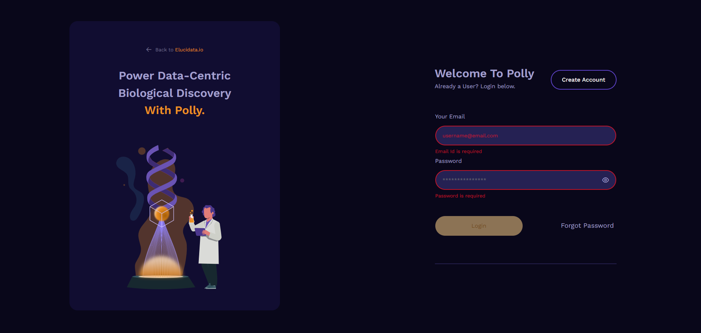
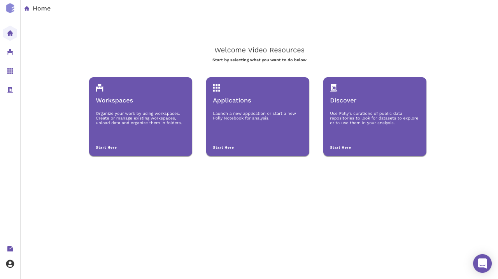
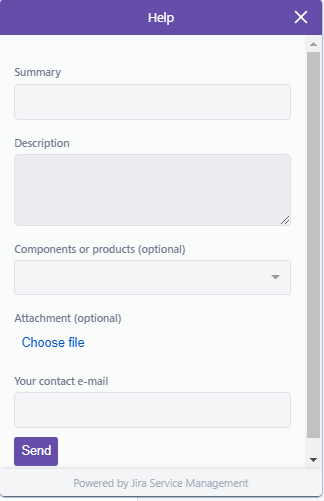

###   **Sign up for the platform**

To sign in to the Polly platform, you must have an account. Account credentials can be generated for both temporary, limited access as well as enterprise accounts. Reach out to our team at [polly@elucidata.io](mailto:polly@elucidata.io) for your login credentials.

**Note:**

*    We recommend using Google Chrome for an optimized experience.
    

###   **Login to the platform**

You can sign in Polly with the provided credentials: Username and Password, connected to your account, and then click *Sign in*. When logging in for the first time, you will be prompted to reset your password. If you do not sign out when you leave Polly, you will be automatically authenticated for your next visit.

*   **Login through [Polly CLI](https://docs.elucidata.io/Scaling%20compute/Polly%20CLI.html)**

    To be able to start using the features of Polly CLI, the first step is to log in to Polly using the Terminal / Command Prompt. Use the following command to log in.

    <pre><code>polly login</code></pre>

    Polly Username and Password need to be put in when prompted.

 <!-- 
**Figure 5.** Sample metadata mapping file
 -->

Once logged in, you do not get automatically logged out and will have to log out manually with the command to log out.

## Navigating through the platform

The Polly Landing page provides access to 3 distinct interconnected modules on Polly.

 <!-- 
**Figure 5.** Sample metadata mapping file
 -->

*   [Manage Data](https://docs.elucidata.io/Getting%20Started/Workspaces.html)

    Find comprehensive information about your workspaces, including files, notebooks, apps, analyses, and reports. This page also includes information about the creation date, workspace owner, and collaborators.

 <!-- 
**Figure 5.** Sample metadata mapping file
 -->

*   [Use Apps](https://docs.elucidata.io/Apps/Introduction.html)

    Polly enables coding in a range of computational environments with configurable machine sizes and dockerized environments. 

 <!-- 
**Figure 5.** Sample metadata mapping file
 -->

## Getting help on the platform

We firmly believe that our greatest achievement is to enable customers and their success on the platform. The customer success team can be reached anytime on [polly@elucidata.io](mailto:polly@elucidata.io) for queries on the product, data analysis and feature requests. We also offer a detailed on-boarding plan to get your team up and running on Polly as well as library of resources, videos and publications.

## Live Chat

Our platform uses Intercom as a standard messenger launcher. A text bubble pops up, inquiring if you need help. Polly embeds this support to establish a dedicated customer success manager. Technical support is available from 9 AM to 8 PM EST and CET.

 <!-- 
**Figure 5.** Sample metadata mapping file
 -->

## Email

You can always email the team at [polly@elucidata.io](mailto:polly@elucidata.io) for further support, to send feedback, or to suggest features.
