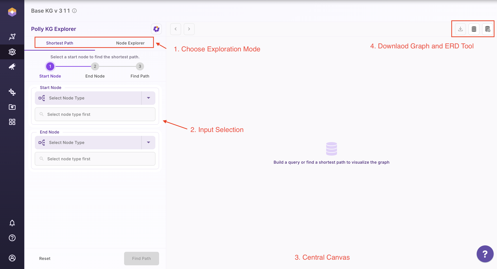
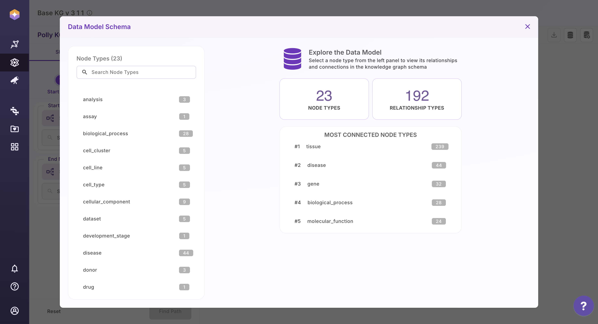
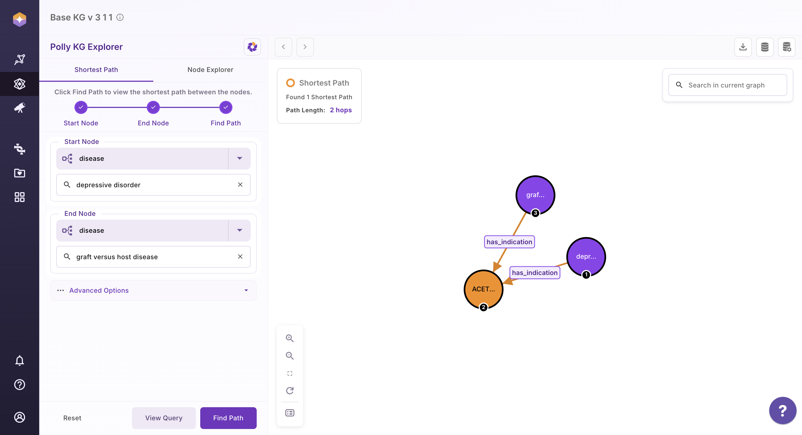
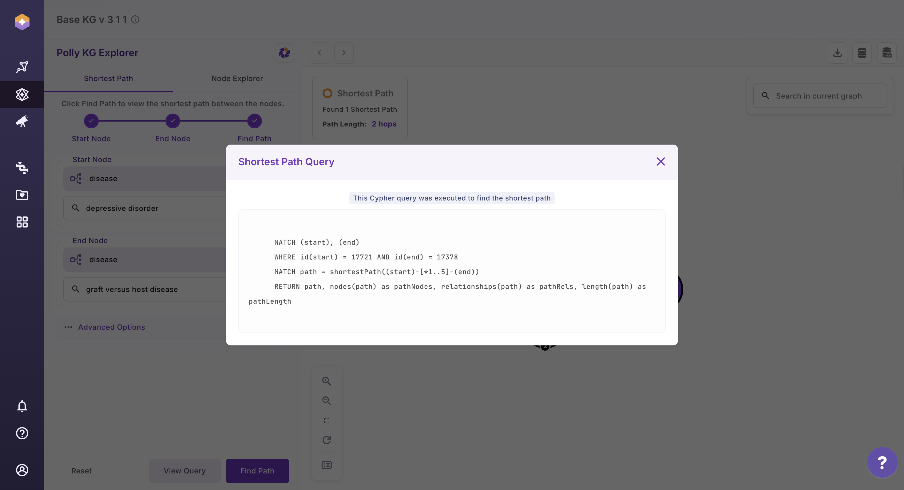
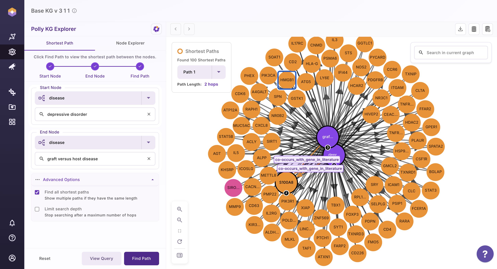
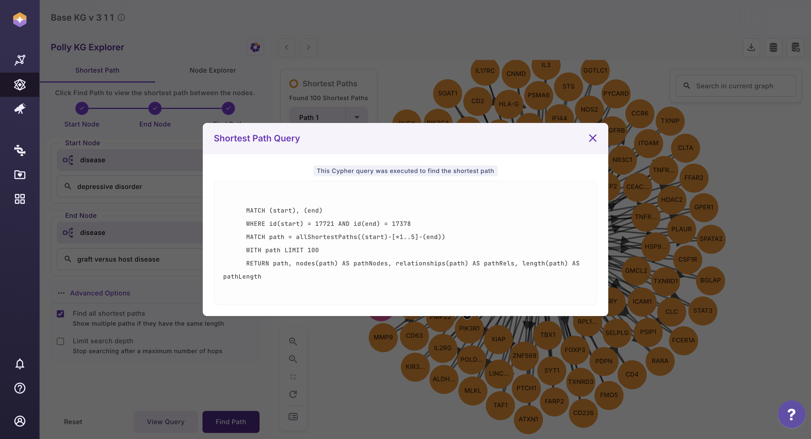
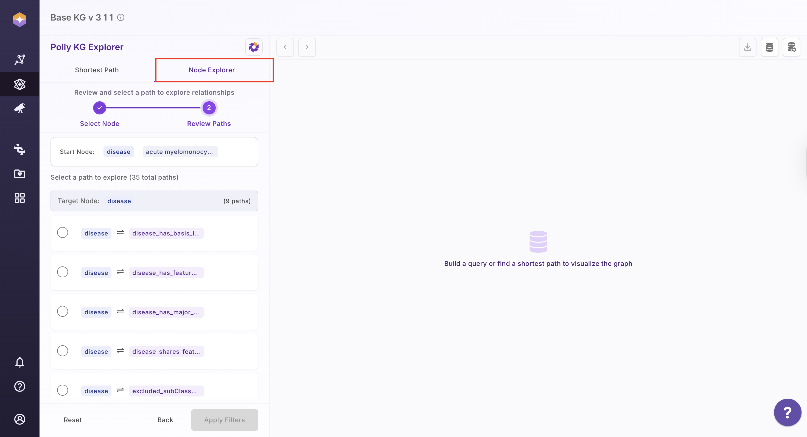
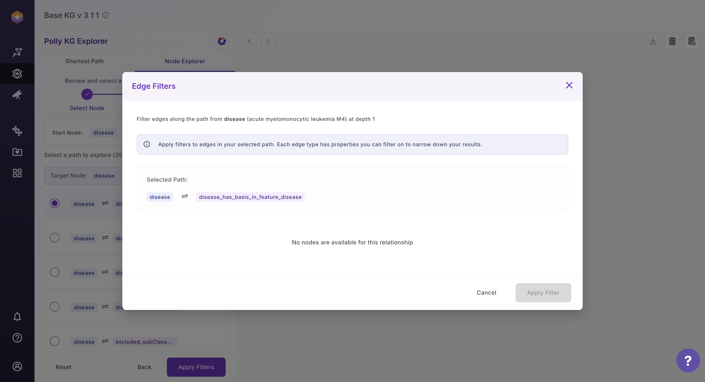

# About the Application

## Polly KG Explorer

**Polly KG Explorer** is an interactive tool and a part of the Polly KG ecosystem on Polly. It is designed to help researchers explore and analyze the Polly Knowledge Base, which consists of harmonized biomedical data. It enables users to uncover relationships between biological entities and generate data-driven hypotheses.

## Layout of Polly KG Explorer

The Polly KG Explorer interface is organized into distinct regions, each serving a specific functional role in the exploration workflow.

| S. No. | Region            | Purpose                                                                 |
|------:|-------------------|-------------------------------------------------------------------------|
| 1     | Top Left Tabs     | Select the exploration mode: **Shortest Path** or **Node Explorer**     |
| 2     | Left Panel        | Configure inputs such as node type and associations, and access CTAs    |
| 3     | Centre Canvas     | Display graph results and interactive visualizations                    |
| 4     | Top Right Buttons | Access download options and the Knowledge Graph schema tools            |

**Table 1. Components of Polly KG Explorer**

 
 Layout of Polly KG Explorer

### 1. View Schema

Select the database icon in the top-right corner to open the schema view.

 
 View Schema

The schema panel displays:

- All available **node types** along with the count of their incoming and outgoing relationships
  
- The different **relationship types** present in the Knowledge Graph
  
- The **properties and data types** associated with each relationship

This view provides a clear understanding of the Knowledge Graph structure, helping users navigate data confidently and explore relationships more effectively.

### 2. Shortest Path

The Shortest Path feature helps you identify the most direct connection between two entities in the Knowledge Graph. In graph theory, a shortest path represents the route between two nodes that minimizes the total distance (or number of connecting steps).

Within the Polly KG Explorer, this feature is powered by Neo4j’s native shortest path algorithms.

**Key Distinction:**

- `shortestPath(...)` → returns one shortest path
  
- `allShortestPaths(...)` → returns all paths tied for minimum hop length

Detailed technical documentation for these methods is available in the Neo4j Cypher manual:  
https://neo4j.com/docs/cypher-manual/current/patterns/shortest-paths/

#### How to Use Shortest Path
- Open the **Shortest Path** tab
- Select the start node type from the dropdown
- Enter the search term for the start node
- Select the end node type from the dropdown
- Enter the search term for the end node
- Click **Find Path** to generate the result

Once the graph is rendered, you can:

- Click **View Query** to see the Cypher query used
  
- Use the **Reset** button to clear selections and start a new search

An example output graph is shown below for reference.

 
 Shortest Path

 
 Cypher Query used to calculate Shortest Path for the selected nodes

To discover all possible shortest connections between two nodes:

- Click on **Advanced Options**
  
- Click on **Find all Shortest Path**, or
  
- Limit the search depth (maximum of 10 hops)
  
- Click **Find Path**

Once the graph is rendered, users can:

- Click **View Query** to verify the Cypher query used
  
- Use the **Reset** button to clear previous selections and start a new search

Shown below is an example graph with all shortest paths.

 
 All Shortest Path

The All Shortest path query that was executed - 

 
  Cypher Query used for All Shortest Path Calculation

### 3. Node Explorer

The Node Explorer allows you to visualize a selected node and interactively expand its immediate neighbors. You can also apply filters based on properties stored on relationships to refine what is displayed in the graph.

#### 3.1 How to Use Node Explorer
- Click on the **Node Explorer** tab
- Select the node type from the dropdown
- Choose the target node and the relationship (edge) you want to explore
  - Only first-degree (immediate) neighbors are displayed

This makes it easy to quickly examine direct connections and gain focused insights without navigating the entire graph.

 
  Node Explorer

- Select the association that you are interested in
- A modal opens, allowing users to apply filters based on edge properties
- After filtering, the next screen displays all filtered values, where users can:
  - Deselect values
  - Select only the specific values of interest
  - Apply all filtered values
- On the final screen, users can view the Cypher query executed in the backend to fetch the results

**Note:**  
The number of edges fetched for a given node term is determined by the underlying schema. As a result, some associations may not have a target node available and may not be displayed in the UI.

 

#### 3.2 Expand Network

You can dynamically grow the graph by expanding connections from any visible node.

- Click on any node within the subgraph
- A side panel opens on the right, displaying the node’s first-degree neighbors
  
- Choose how you want to refine the expansion:
  
  - Click **Filter & Expand** to apply filters based on relationship (edge) properties
    
  - Click **View Nodes** to search and expand using specific terms
 
- Apply your selections by selecting or deselecting values and clicking **Apply**
- Use the **Previous** button to remove the most recent node expansion
- Use the **Next** button to redo the most recent expansion

