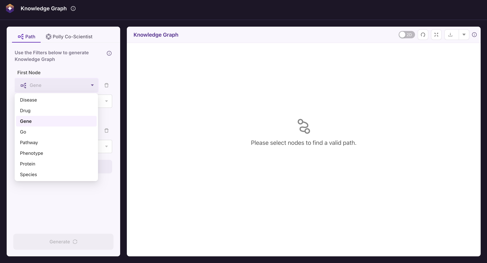

# About the Application

## Navigating the Interface

### Interface Overview

The Polly KG Explorer interface is designed for intuitive navigation and knowledge graph exploration. It consists of three main sections:

- **Node Selection Panel**: Allows users to define search criteria by selecting entity categories and values. It also provides an option to download node and edge information for the filtered data.
- **Knowledge Graph Visualization Area**: Displays the generated knowledge graph based on the selected filters, allowing users to explore relationships between entities.
- **Controls & Settings**: Provides tools to customize the visualization and adjust display preferences for a more tailored user experience.

 
 Screenshot showing 1. Node selection Panel, 2. Knowledge-graph Visualisation Area, and 3. Controls and Settings.

 **Note:** The Download icon in the Node selection panel exports the node and edges information. The download icon in the Controls and Settings in the knowledge graph visualisation area exports the generated knowledge graph as PNG, CSV and JSON. 

---

## Using the Application

### Selecting Nodes & Generating a Knowledge Graph

1. In the Node selection area, users must select at least two nodes by choosing a category (e.g., Genes, Proteins, Diseases) and specifying values.
2. Additional nodes can be added if needed. Users can search up to 3 nodes.

 
 Use the dropdown to select the needed node types.

 
 Type in the required node value and select from the dropdown. For example, in the above screenshot, ALPK1 gene is being searched and selected from the list.

3. Click “Generate” to create or update the knowledge graph in the knowledge graph Visualization Area.

 
 On clicking the “Generate” button the knowledge graph showing the interactions between the selected nodes is rendered.

---

## Navigating & Interacting with the Knowledge Graph

### Exploring the Generated Graph

#### Node Details

- Each node displays a name with a six-character limit. The full name and corresponding source-based ID are visible on hover.  
- Node colors indicate their respective categories, which can be referenced in the graph legend.  
- Searched nodes appear visibly larger than other nodes for easy identification.  
- The graph displays both:
    - **Direct interactions** between searched nodes
    - **1-hop neighbor interactions** for each node
- Nodes can be selected and repositioned to adjust spacing and explore relationships more effectively.

 
 The node details - node name (ID) will be shown on hover over the respective node.  The node colour is based on the node category. The colour code for node is reflected in the categories legend on the top left corner.

#### Edge Details

- Hover over any edge to view the edge label and score, indicating the type of relationship.

 
 The edge details are shown hovering over the edges.

#### Knowledge Graph Navigation

- **Zoom & Reset**: Use the zoom controls or mouse scroll to zoom in/out. Click Reset View to restore the default position.  
- **Graph Legend**: The legend displays the different node categories present in the knowledge graph displayed.  
- **2D/3D Toggle**: Click Toggle View to switch between 2D and 3D visualizations.  
- **Saving the Graph**: The generated knowledge graph can be exported using the download button.  
- The graph title displays the searched node names, separated by a hyphen ("-").

 
 On the right side, The navigation tools has 1 - to toggle between 2D and 3D,  2 - reset the graph post zoom operations, 3 - full screen view, 4 - Export graph in CSV or JSON

**Things to Know When Exploring the Knowledge Graph Generated**

- All paths between the searched nodes are shown with a hop of 1.  
- The immediate first neighbours of the searched nodes are also shown.

---

### Downloading & Exporting Data

#### Downloading Knowledge Graph Data
- Click the **Download** button in the node selection area to export the knowledge graph data as a CSV file.  
- The CSV file contains information on the selected nodes and their relationships (edges) within the knowledge graph.  

**Note**: The data related to the knowledge graph generated would be downloaded.

#### Exporting the Graph Image
- To save a static image of the graph, click the **Download** button in the top right corner of the knowledge graph visualisation area. This downloads the graph as a **PNG** image.

**KG Data and Supported Resources**

- As per this version of the application, **PollyKG (v1.0.0)** is being supported.  
- Please note that the Polly KG can be updated irrespective of the application update.  

