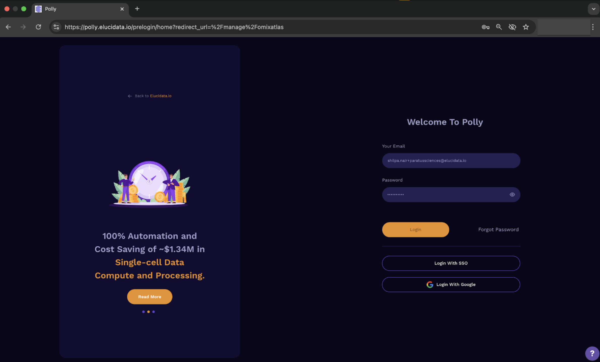
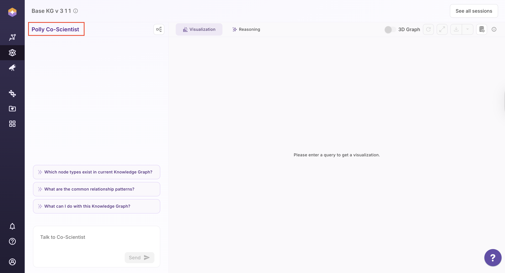
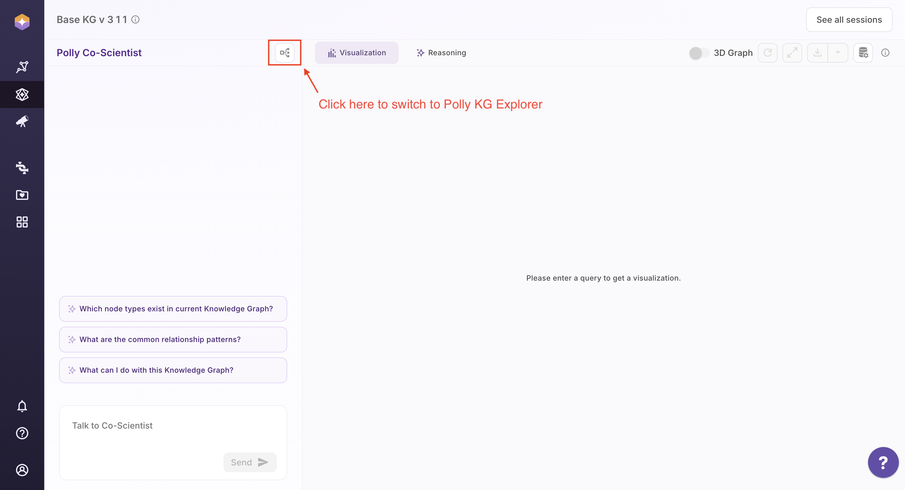
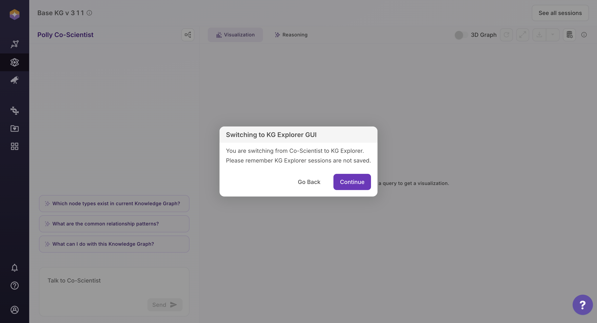
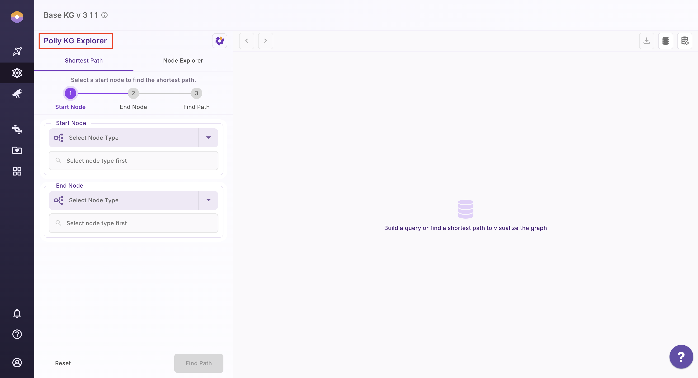

# Getting Started

## Accessing the Application on Polly

### Prerequisites

To access the **Polly KG Explorer** application hosted on the Polly Platform, users must have an **Polly account**. The following are required:

- Login credentials provided by the Solution Manager.
- Active Polly credentials for authentication.

**Note:**  
If the required credentials are not available, or you are unable to log in or access features, please contact the designated Point of Contact (POC) from Elucidata or email **[polly.support@elucidata.io](mailto:polly.support@elucidata.io)**.

## Steps to Access the Application

- **Step 1:**  Login to Polly : Visit Polly’s [login page](https://polly.elucidata.io/) and enter Polly credentials and click **“Login”**.
  
 
 Polly Login

- **Step 2:**  Go to Knowledge Graph: Click on the **"Knowledge Graph"** tab in the left sidebar.
 
 
 Knowledge Graph Tab

- **Step 3:** Knowledge Graph Application: The application will open in the same tab automatically.

- **Step 4:** Polly Co-Scientist: The initial tab will have **Polly Co-Scientist** on left and Polly KG explorer tool in the right.

 
 Polly Co-Scientist Interface

- **Step 5:** Open Polly KG Explorer: Click the **interactive Polly KG Explorer** panel on the right. When prompted to switch to the KG Explorer GUI, click Continue. The full KG Explorer interface will open in the same tab.

 
 Polly KG Explorer Interactive Icon

 
 Switching to Polly KG Explorer View from Polly Co-Scientist View 

 
 Polly KG Explorer Interface

