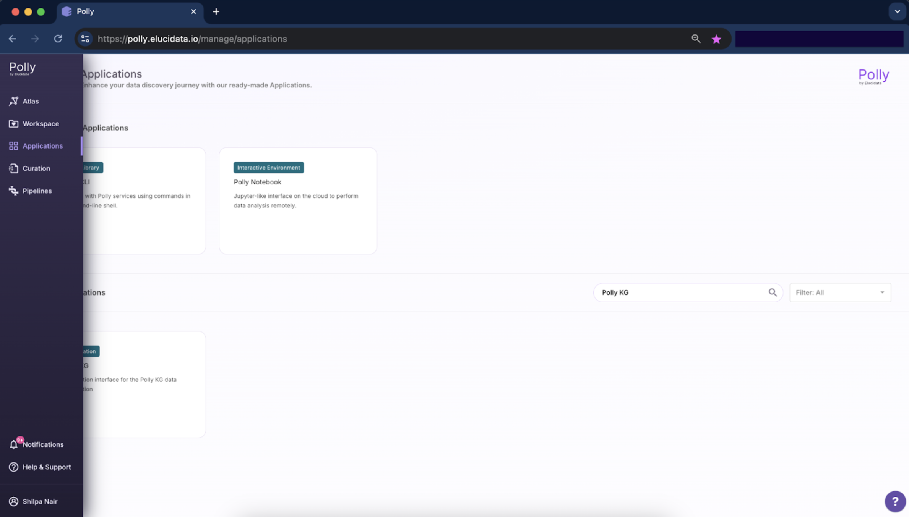
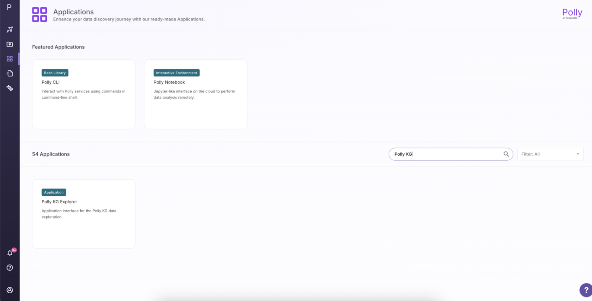

# Getting Started

## Accessing the Application on Polly

### Prerequisites

To access the **Polly KG Explorer** application hosted on the Polly Platform, users must have an **Polly account**. The following are required:

- Login credentials provided by the Solution Manager.
- Active Polly credentials for authentication.

**Note:**  
If the required credentials are not available, or you are unable to log in or access features, please contact the designated Point of Contact (POC) from Elucidata or email **[polly.support@elucidata.io](mailto:polly.support@elucidata.io)**.

## Steps to Access the Application

- **Step 1:**  Login to Polly : Visit Polly’s [login page](https://polly.elucidata.io/) and enter Polly credentials and click **“Login”**.
  
 
 Polly Login

- **Step 2:**  Go to Applications: Click on the **"Applications"** tab in the left sidebar.
 
 
 Applications Tab

- **Step 3:** Search for Polly KG: Use the search bar to find the **"Polly KG"** tile in Applications. 

- **Step 4:** Launch the Application: Click the **Polly KG Explorer** application tile. The application will open in a new tab.  