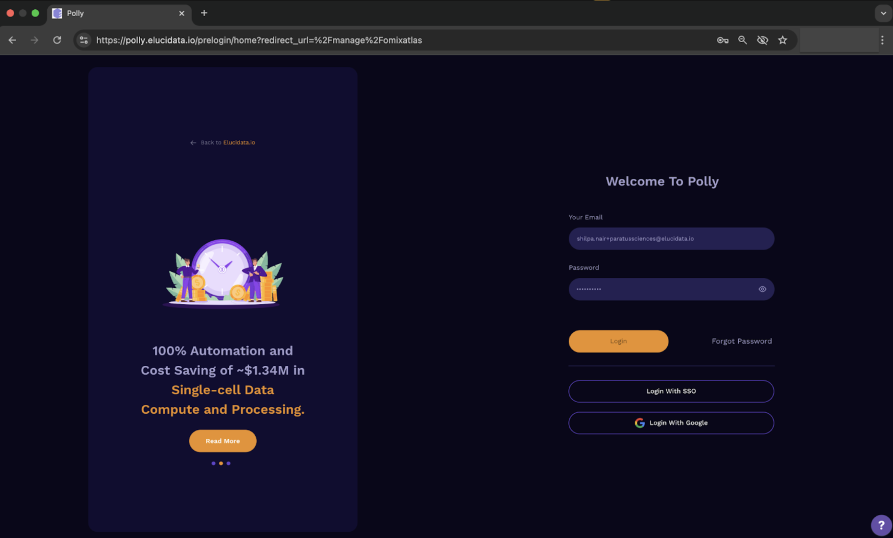
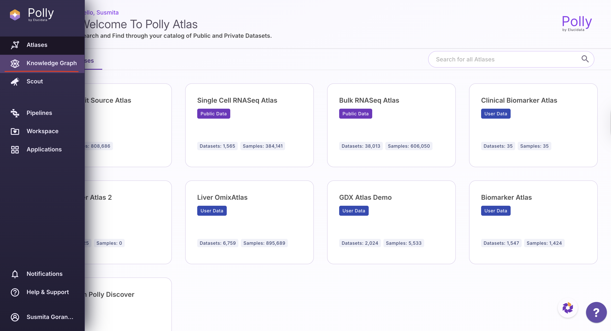
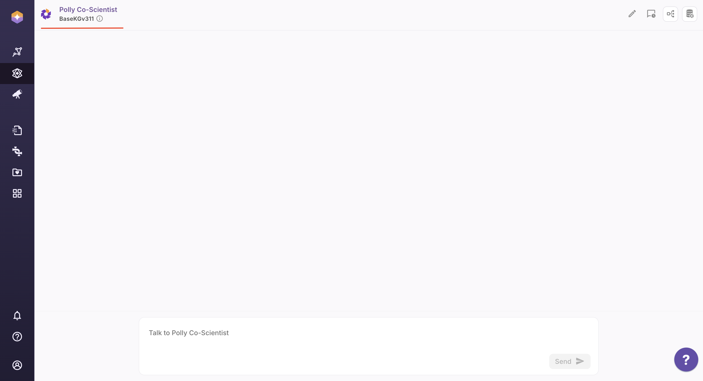
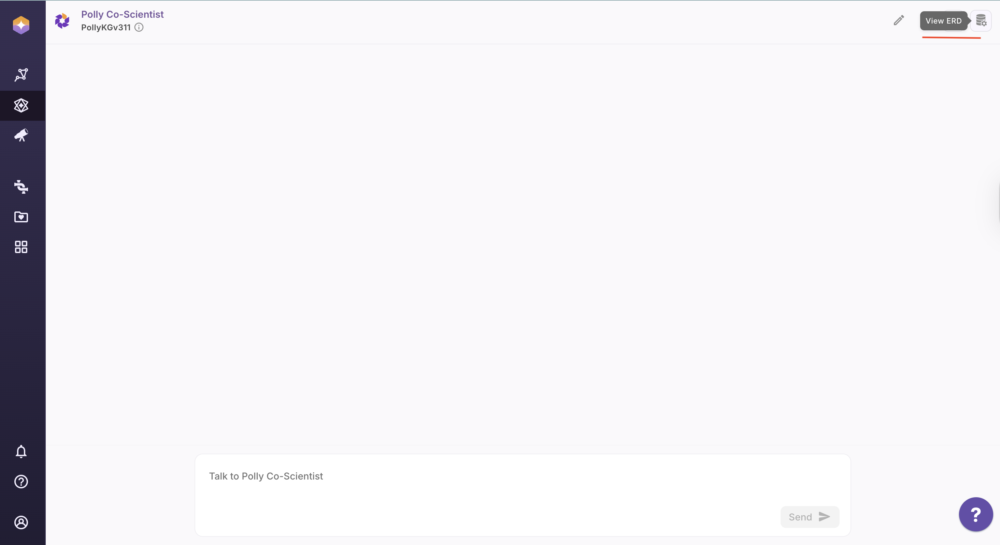

# Getting Started

## Accessing the Application on Polly

### Prerequisites

To access the **Polly KG** application hosted on the Polly Platform, users must have an **Polly account**. The following are required:

- Login credentials provided by the Solution Manager.
- Active Polly credentials for authentication.

**Note:**  
If the required credentials are not available, or you are unable to log in or access features, please contact the designated Point of Contact (POC) from Elucidata or email **[polly.support@elucidata.io](mailto:polly.support@elucidata.io)**.

## Steps to Access the Application

- **Step 1:**  Login to Polly : Visit Polly’s [login page](https://polly.elucidata.io/) and enter Polly credentials and click **“Login”**.
  
 
 Polly Login

- **Step 2:**  Go to Knowledge Graph: Click on the **"Knowledge Graph"** tab in the left sidebar.
 
 
 Knowledge Graph Tab

- **Step 3:** Polly Co-Scientist: This opens the default Polly Co-Scientist tab. Users can use it to interact with Polly’s Knowledge Graph using natural language queries (NLQ).

 
 Polly Co-Scientist Interface

- **Step 4:** View Entity Relationship Diagram: Click the ERD icon located on the far-right panel to open the interactive Entity Relationship Diagram within the Co-Scientist tab. 

 
 ERD Diagram Icon

