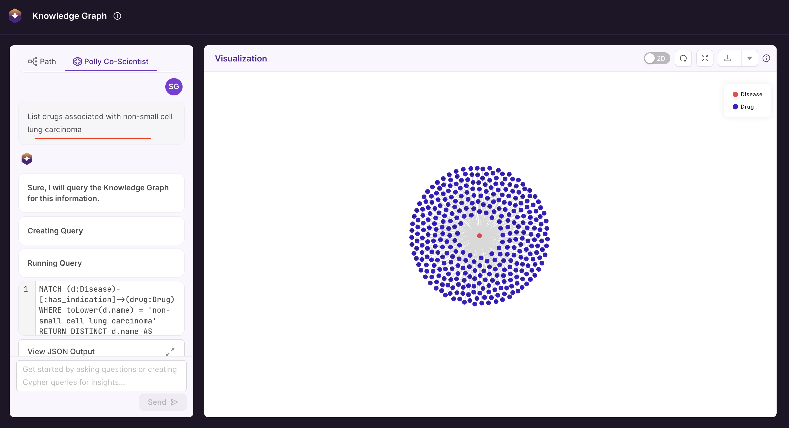
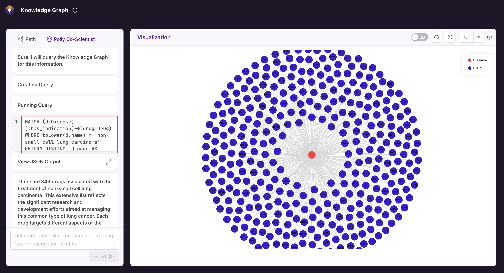
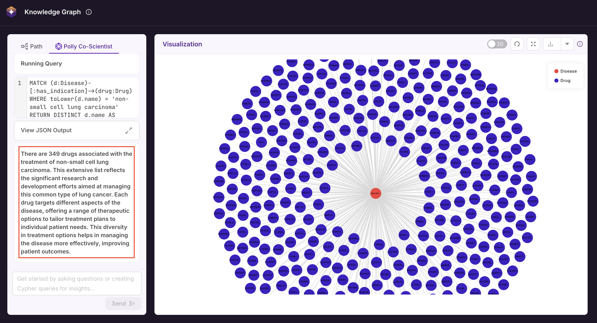
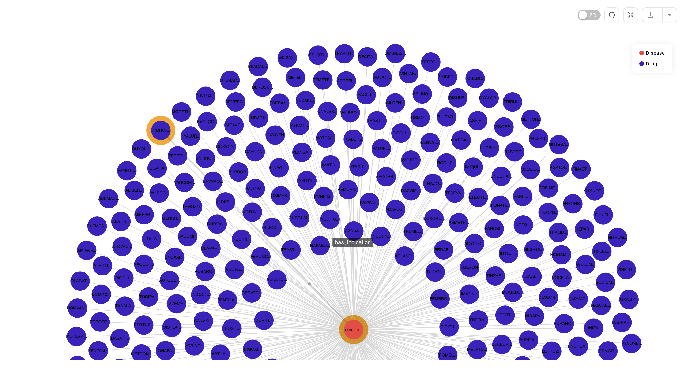

# Polly Co-Scientist

**Polly Co-Scientist** is an AI-powered research assistant developed to help scientists transform complex biomedical data into actionable scientific insights with ease. It transforms natural language queries into Cypher commands to interact with Polly's Knowledge Graph, allowing users to explore relationships, simulate biological reasoning, and generate hypotheses, without **writing a single line of code.**


## Key Capabilities

- **Ease of Use**: Designed with a user-friendly interface that simplifies KG exploration. 
- **Natural Language Interface**: Query the Knowledge Graph using simple English, no need to learn Cypher or write Python code.  
- **Automated Query Conversion**: Intelligently translates natural language input into Cypher queries and executes them on the Knowledge Graph.  
- **Dual Output**: View results in both text (summary and Cypher) and graphical (node-edge) formats. 


---


## How to Query the Knowledge Graph with Natural Language

Polly Co-Scientist enables you to interact with the biomedical Knowledge Graph using simple, natural language — no technical expertise required.

You can choose from two options:

- **Use Predefined Templates**: Select from templatized queries available directly within the Polly Co-Scientist interface to quickly explore common biomedical relationships.
- **Run Custom Queries**: Type your own questions in plain English to retrieve insights tailored to your specific research needs.


### Running Custom Queries on the Knowledge Graph Using Natural Language

#### Step 1: Type Your Query in English
Use the chat interface to enter your research question in natural language.

**Example**:  
`List drugs associated with non-small cell lung carcinoma`

 <center> Query Example</center>


#### Step 2: Review the Auto-Generated Cypher Query
Polly Co-Scientist automatically translates your natural language input into a Cypher query and JSON output. Both are displayed for reference and executed without requiring manual input.

**Example**:
```cypher
MATCH (d:Disease)-[:has_indication]->(drug:Drug) WHERE toLower(d.name) = 'non-small cell lung carcinoma' RETURN DISTINCT d.name AS Disease, drug.pref_name AS Drug
```

 <center> Cypher Query</center>


#### Step 3: View the Results

The output is generated in 2 parts:

- **Text Output:**
A simple readable summary of the query results is displayed.

  Example:
  `There are 349 drugs associated with the treatment of non-small cell lung carcinoma. This extensive list reflects the significant research and development efforts aimed at managing this common type of lung cancer. Each drug targets different aspects of the disease, offering a range of therapeutic options to tailor treatment plans to individual patient needs. This diversity in treatment options helps in managing the disease more effectively, improving patient outcomes.`


- **Graph Output:**
A visual representation of the results is displayed on the Knowledge Graph viewer.

 <center> Output of the Query</center>

User can click the zoom icon on the right to expand the Knowledge Graph view for easier exploration and full-screen display.

 <center> Entire Knowledge Graph Window</center>


