# Polly Co-Scientist

**Polly Co-Scientist** is an AI-powered research assistant developed to help scientists transform complex biomedical data into actionable scientific insights with ease. It transforms natural language queries into Cypher commands to interact with Polly's Knowledge Graph, allowing users to explore relationships, simulate biological reasoning, and generate hypotheses, without **writing a single line of code.**
By abstracting away query syntax and graph complexity, Co-Scientist allows scientists to focus on scientific reasoning rather than technical execution.  

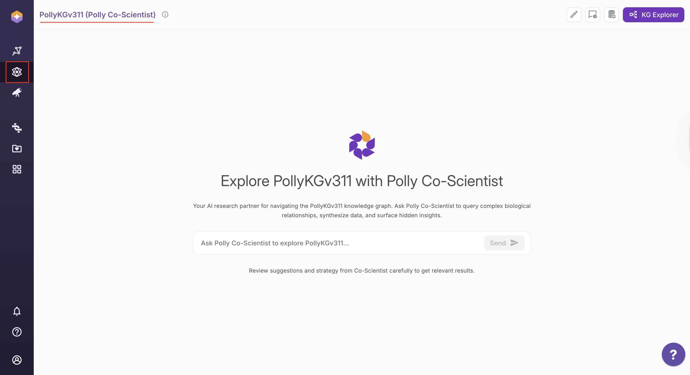 
 Polly Co-Scientist Interface

## Working Flow of Polly Co-Scientist

Co-Scientist now collaborates with you to construct queries instead of executing them immediately. Each request follows a structured, five-step workflow designed to ensure accurate intent interpretation and precise Knowledge Graph execution:

- **Intent Parsing**: Automatically extracts key entities, relationships, and filtering criteria from natural language input.

- **Strategic Mapping**: Aligns extracted terms with your Knowledge Graph schema to ensure logical and biologically valid query paths.

- **Output Optimization**: Selects the most appropriate result format—table, sub-graph, or chart—based on the query intent.

- **Cypher Synthesis**: Generates an optimized Cypher query reflecting the approved strategy.

- **User Confirmation (Human-in-the-Loop)**: Presents the complete reasoning and execution plan for review before execution. Users can approve or modify any step, with instant recalibration applied.

- **Execution & Results:** Once confirmed, the query is executed and the results are presented in both textual and visual formats for easy interpretation and exploration.

## Core Enhancements & Optimizations

- **Advanced Relationship Mapping**: Improved recognition of multi-hop relationships, allowing you to discover deep connections between entities.
  
- **Radical Transparency**: You’ll now see a much more detailed breakdown of the internal logic for every step the AI takes.
  
- **Enhanced Consistency**: A set process ensures that the same query yields the same high-quality output every time, regardless of the session.
  
- **Expanded Toolset**: Co-Scientist is now equipped with specialized tools to:
  
    - Extract specific nodes/edges and their counts from the Knowledge Graph (KG).
    
    - Run exploratory queries to understand data distribution.
    
    - Write more efficient, high-performance Cypher queries.

---

## How to Query the Knowledge Graph with Natural Language

Polly Co-Scientist enables you to interact with the biomedical Knowledge Graph using simple, natural language — no technical expertise required. You can run your custom queries. Type your own questions in plain English to retrieve insights tailored to your specific research needs.

### Running Custom Queries on the Knowledge Graph Using Natural Language

#### Step 1: Type Your Query in English
Use the chat interface to enter your research question in natural language.

**Example**:  
`What are the approved drugs for COPD?`

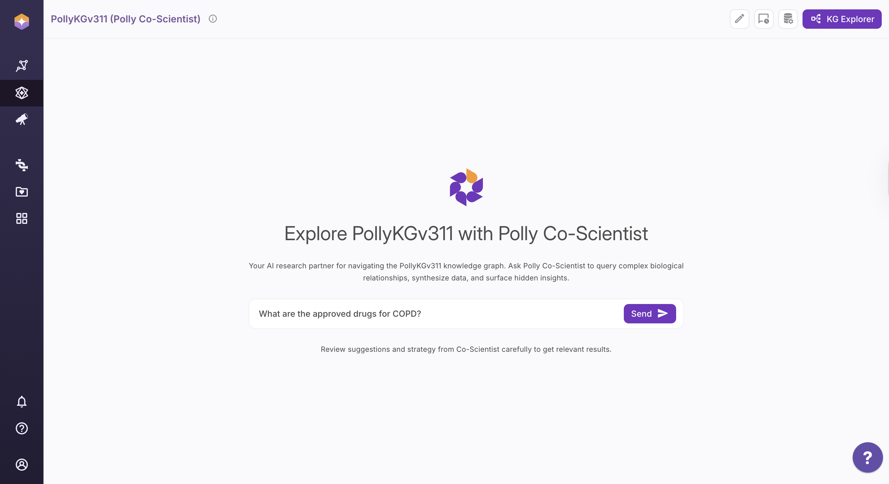 
 Query

#### Step 2: Review the Interpreted Query Strategy
Co-Scientist analyzes your question and presents a structured interpretation, including:
- Identified research intent

- Suggested entity types and relationship paths

- Related or alternative entities to refine scope

- Recommendations to improve query precision

- If conflicting terms are detected, Co-Scientist prompts you to clarify before proceeding.

You can review, accept, remove, or refine these suggestions before proceeding.

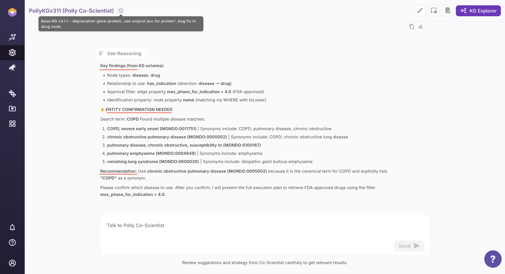 
 Query Strategy

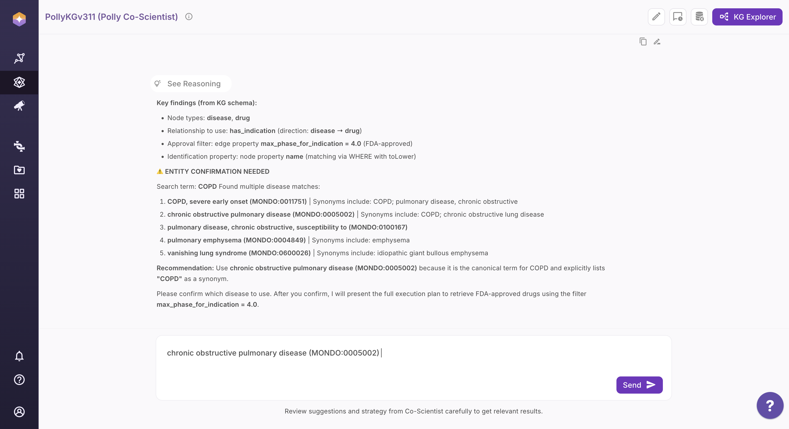 

#### Step 3: Inspect the Execution Plan and Generated Cypher Query
After confirmation, Co-Scientist generates and displays the complete execution plan along with the exact Cypher query derived from the approved strategy. This ensures full visibility into how your question will be executed on the Knowledge Graph.

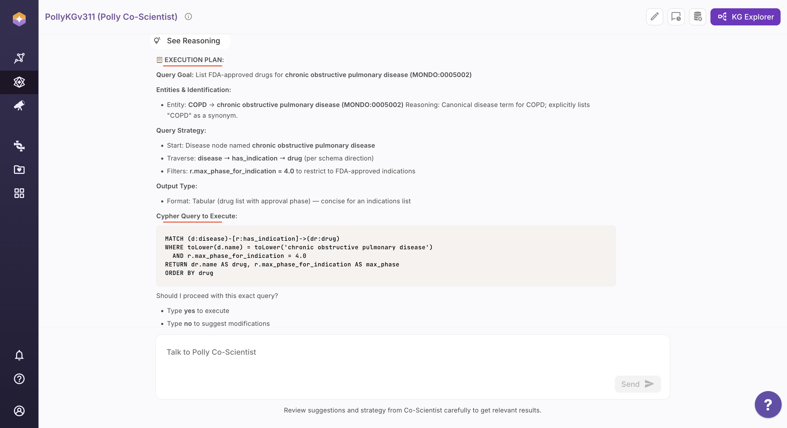 
 Execution Plan and Cypher Query

#### Step 4: Confirm or Refine (Human-in-the-Loop)
Before execution, Co-Scientist presents its full reasoning and query logic. You can approve the plan as-is or modify any step.
Any change triggers instant recalibration of the execution plan and Cypher query.

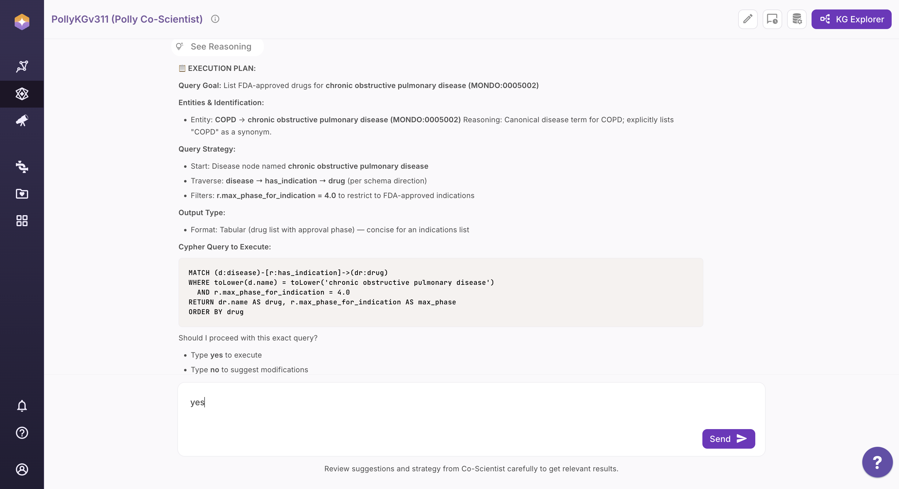 

#### Step 5: View the Results
Once executed, results are presented in the most appropriate format based on the query intent:

**Text Output**:
A concise, human-readable summary of the results.

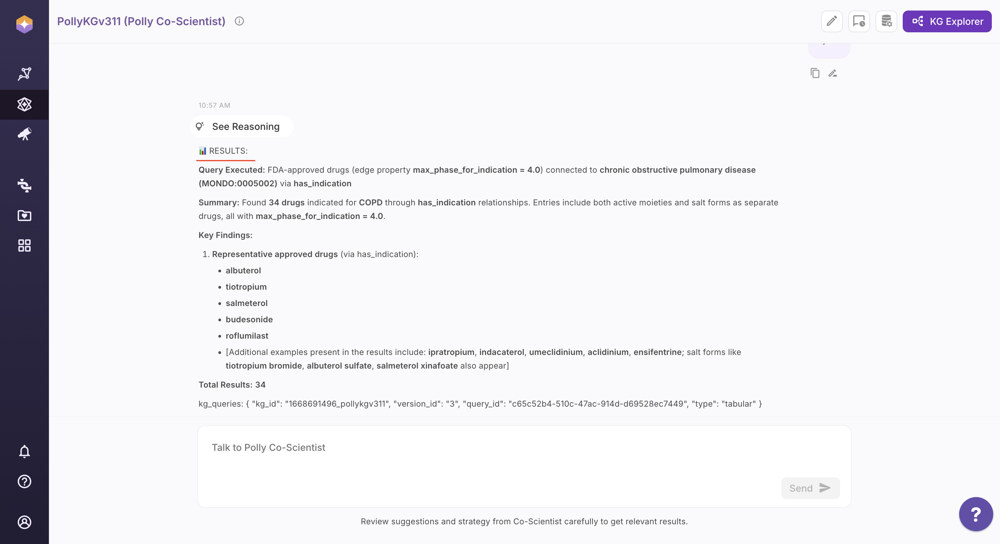 
 Result

**Visual Output**:
An interactive visualization (table, sub-graph, or chart) rendered in the Knowledge Graph viewer for exploration and analysis.

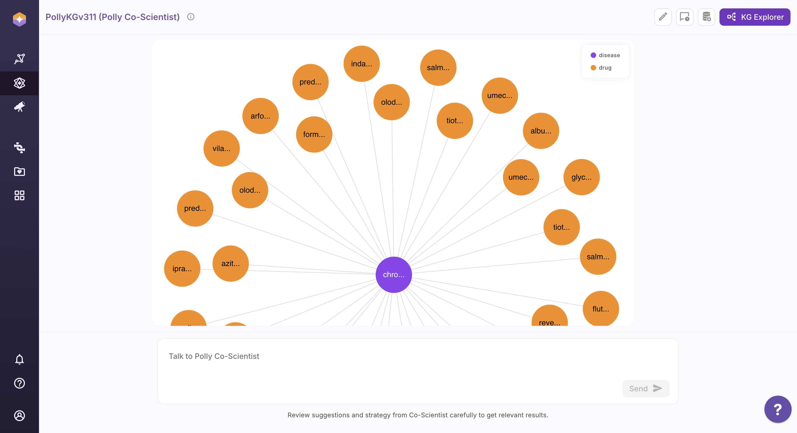 
 Graph View

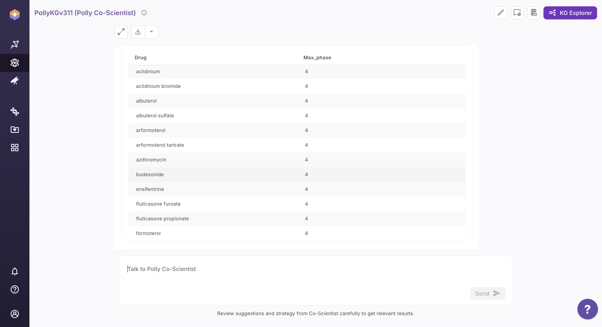 
 Table view

## Exploring the Entity Relationship Diagram (ERD)

Follow the steps below to access and interact with the ERD:

Click the **View ERD icon** located on the far right of the interface. The Entity Relationship Diagram (ERD) will open in the main canvas.

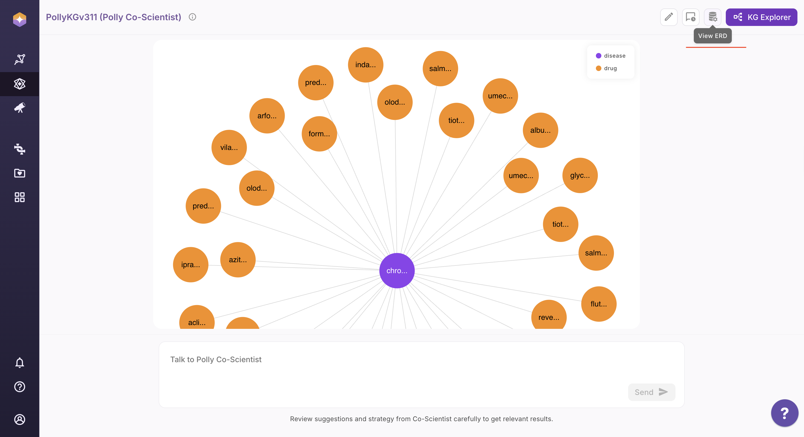 
 View ERD icon

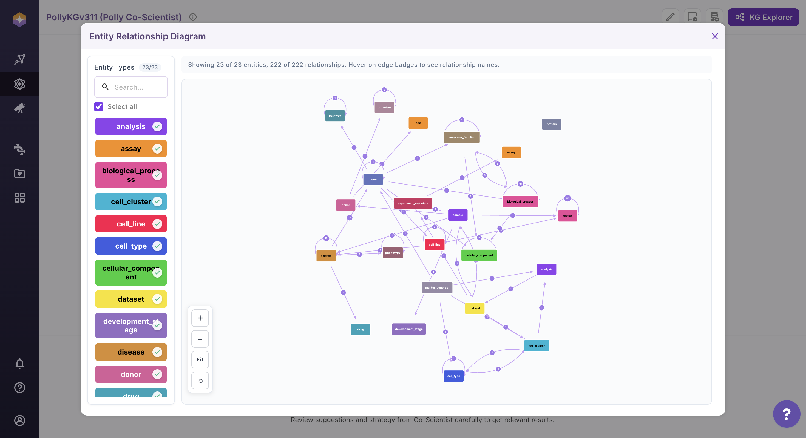 
 ERD complete view

Use the entity panel on the left to control visibility:

     - Select or deselect entities to dynamically update the ERD view. The diagram refreshes automatically based on your selection.
     
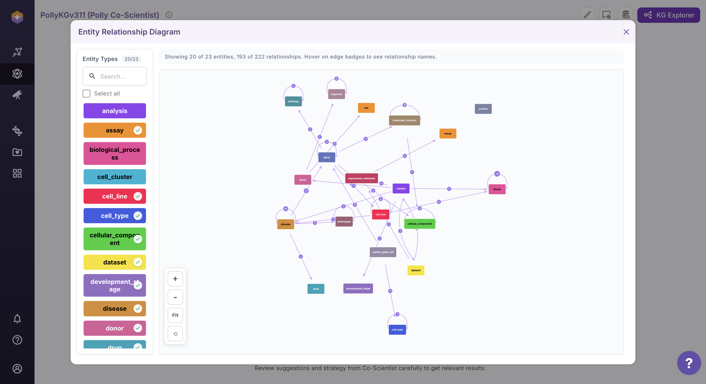 
 Deselected Entities
  

Customize the diagram layout for better readability:

    - Drag and reposition entities directly on the canvas. Adjust their placement to create a clearer and more structured view.

  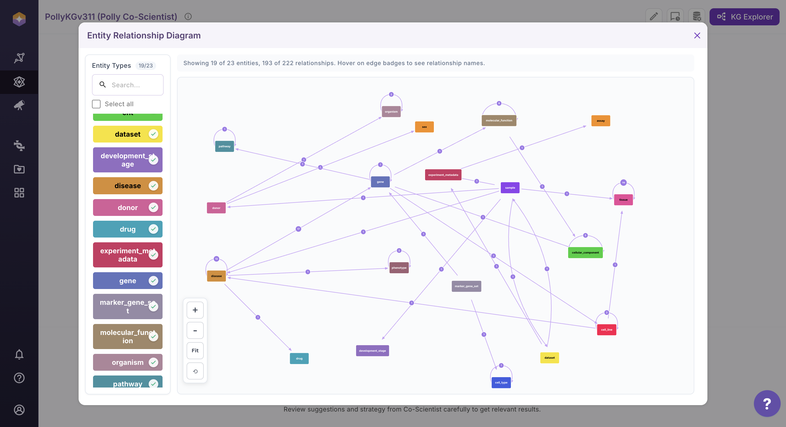 
 Drag and View
  

Use the zoom controls present on the bottom left to adjust the diagram scale. Click + to zoom in. Click – to zoom out. Click Fit to reset and automatically adjust the diagram to its original view.

 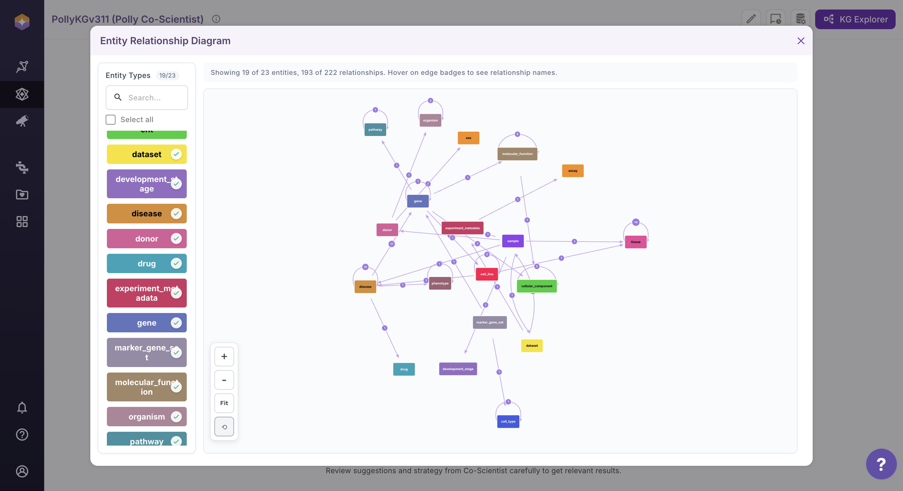 
 Zoom Controls

Click on any entity (node) within the diagram to view its detailed node properties.

 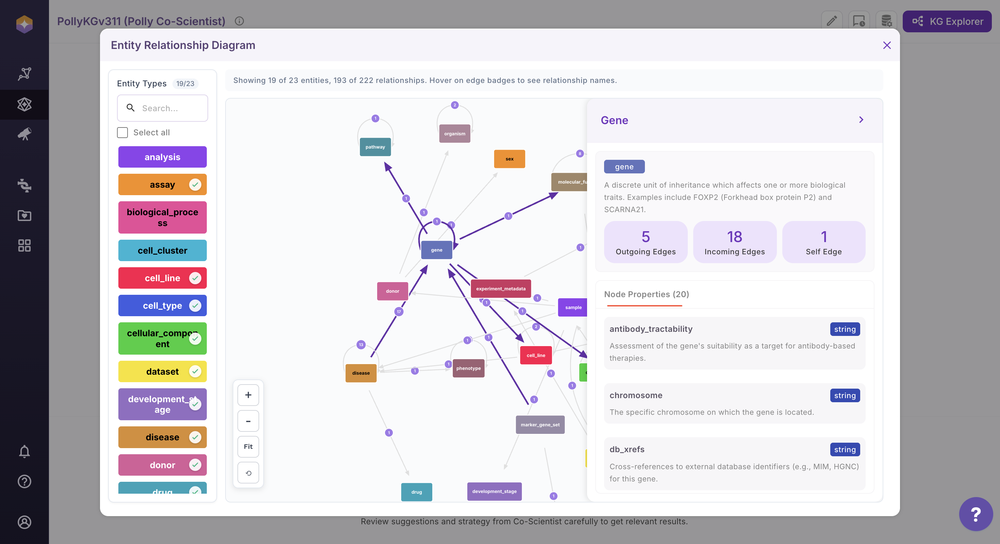 
 Node Properties

Click on the relationship count associated with an entity to view all connected relationships. Select a specific relationship from the list to inspect its detailed edge properties.

 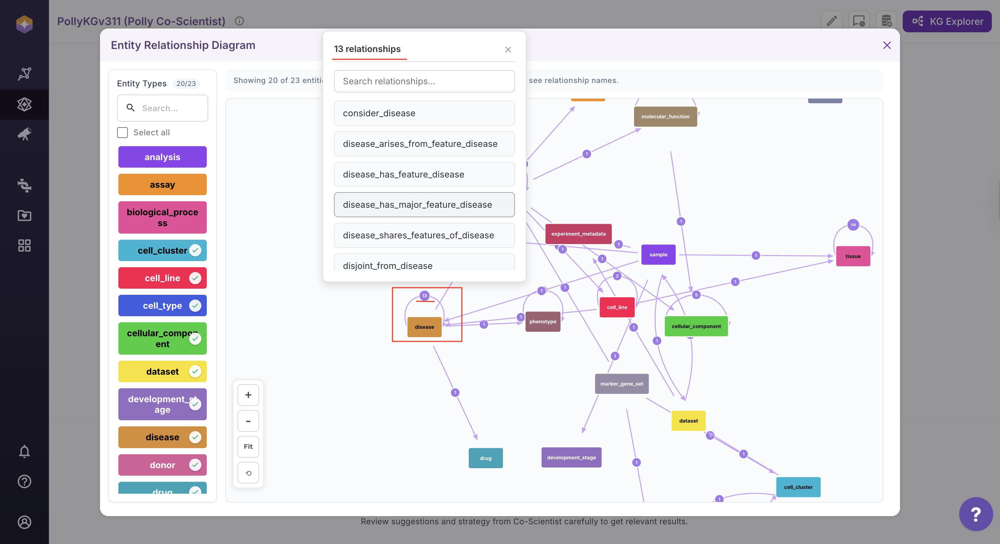 

 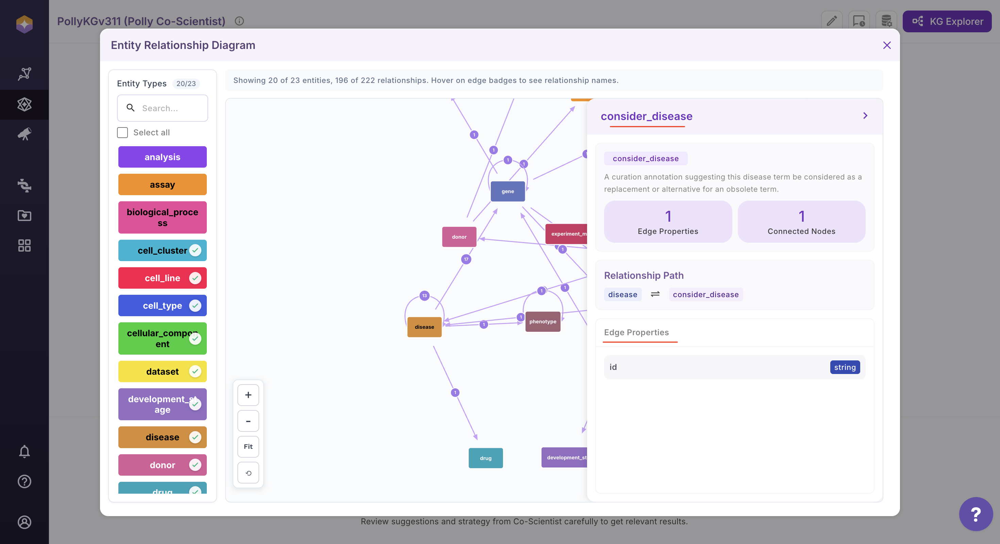 
 Edge Properties

 This interactive ERD view enables structured exploration of entities, relationships, and their associated properties within the system.

